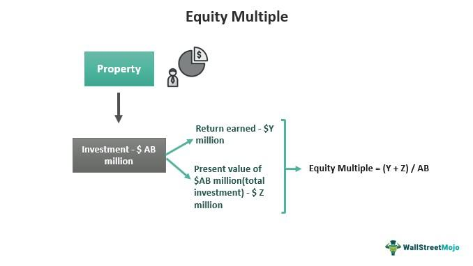

Welcome to our comprehensive review of EquityMultiple, a leading platform in real estate crowdfunding and algorithmic trading. In today's fast-paced financial world, platforms like EquityMultiple are transforming how individuals invest in real estate, offering innovative solutions that merge traditional property investments with cutting-edge technology.

As we explore this topic, our goal is to provide a thorough understanding of EquityMultiple, its services, and its performance. We will also examine how it integrates modern investment strategies, such as algorithmic trading, to enhance investor experiences and returns. Whether you're an experienced investor familiar with real estate markets or a newcomer interested in crowdfunding solutions, this review is designed to offer valuable insights and guidance.

Real estate investment has historically been a domain reserved for institutional investors and high-net-worth individuals. However, with the rise of platforms like EquityMultiple, the barriers to entry are lower, allowing a diverse range of investors to participate in high-quality real estate projects. By leveraging technology and data-driven strategies, EquityMultiple compares favorably with traditional investment avenues, making it a compelling choice in a competitive market.

Through this review, we will provide you with key information to help you understand what makes EquityMultiple a standout option in the crowded space of real estate investment. Whether it's the platform's comprehensive offerings, its use of algorithmic trading, or its ability to democratize access to real estate opportunities, there's plenty to uncover about how EquityMultiple is shaping the future of real estate investment.

## Table of Contents

## What is EquityMultiple?

EquityMultiple is a prominent real estate investment platform, offering individuals the opportunity to engage in commercial real estate projects managed by professionals. Established in 2015, EquityMultiple has quickly positioned itself as a significant player in the real estate investment space by granting access to deals typically reserved for institutional investors. The platform’s investment strategy is both diversified and robust, focusing on a mix of equity, preferred equity, and debt investments. This approach provides investors with a portfolio that can effectively balance risk and return across different segments of the real estate market.

The company's credibility is further supported by its backing from Mission Capital Advisors, which brings a vast reservoir of real estate expertise and industry connections, enhancing EquityMultiple's ability to source high-quality investment opportunities. Mission Capital Advisors is known for its advisory and asset management services, which infuse EquityMultiple with strategic insights vital for navigating the real estate landscape effectively.

Beyond its core operations, EquityMultiple is at the forefront of embracing financial technology advancements, venturing into areas like [algorithmic trading](/wiki/algorithmic-trading) to potentially elevate investor returns. By integrating innovative fintech solutions, EquityMultiple aims to refine its investment processes, leveraging data analytics and automation to inform and optimize decision-making. This reflects a commitment to continuous improvement and adaptation in a competitive investment arena, aligning with the evolving needs of modern investors seeking tech-savvy and data-driven investment platforms.

## EquityMultiple’s Approach to Real Estate Crowdfunding

EquityMultiple allows investors to collectively engage in high-quality real estate projects through a structured crowdfunding platform. This approach provides an opportunity for individuals who might not have the capital or resources to engage in direct real estate investment, as the platform's entry requirements are notably lower than those of traditional real estate investments. EquityMultiple's model opens up the real estate market to a broader spectrum of investors.

The platform subjects each potential investment to a stringent underwriting process. This rigorous vetting ensures that only those projects which have been thoroughly evaluated and identified as potentially profitable are made available. This serves to lower risk and increase the likelihood of positive returns for participating investors.

Within EquityMultiple's offerings, investors can choose from a variety of investment formats, including equity investments, preferred equity, and senior debt. This diversity allows investors to tailor their portfolios according to their preferences for risk and return, and to align with their broader investment strategies.

To nurture transparency and trust, EquityMultiple offers investors access to detailed performance metrics and regular updates. This commitment to communication ensures that investors remain informed about their investments' status and helps them make decisions grounded in real-time information. By upholding transparency and focusing on investor education, EquityMultiple enhances investor engagement and confidence.

## The Role of Algo Trading in Real Estate Investment

Algorithmic trading, or algo trading, is a process where computer algorithms automatically execute trades based on predefined criteria. This technique has revolutionized various sectors of the financial markets by enhancing precision, speed, and scalability of trades, minimizing human error, and optimizing decision-making with data-driven insights.

In the context of real estate investing, algo trading can be effectively applied to market analysis to identify trends and patterns that might not be immediately evident to human analysts. Algorithms can analyze large volumes of data to forecast future property values and market cycles, significantly aiding in property valuation. This allows investors to make more informed decisions based on comprehensive quantitative data.

EquityMultiple is pioneering the integration of big data analytics and [machine learning](/wiki/machine-learning) into its investment processes, setting a new standard in real estate crowdfunding. By implementing advanced algorithms, EquityMultiple is able to refine their investment criteria, analyzing variables such as market performance indicators, demographic trends, and economic data. This tech-forward approach aims to optimize investment outcomes by improving accuracy and timing of investments, ultimately enhancing investor returns. 

Machine learning, a subset of [artificial intelligence](/wiki/ai-artificial-intelligence), plays a crucial role in this approach. Models can be trained on historical data to predict future outcomes, adjusting strategies dynamically as new data becomes available. For instance, regression models can be used to estimate property prices, while classification algorithms might help assess risk levels associated with different investments. The incorporation of such techniques not only boosts the potential returns on investments but also distinguishes EquityMultiple from more traditional platforms that may not yet utilize these technological advancements.

By leveraging algorithmic trading strategies and machine learning, EquityMultiple offers a tech-driven investment experience that appeals to modern investors. This forward-thinking approach goes beyond traditional methodologies, bringing additional precision and analytical capability to the asset selection and management processes. Such innovation could significantly enhance the potential success rate of real estate projects, offering investors an edge in the competitive market landscape.

## Pros and Cons of Investing with EquityMultiple

### Pros and Cons of Investing with EquityMultiple

Investing with EquityMultiple offers a unique set of advantages that cater to both novice and experienced investors. One of the main benefits is the access to institutional-quality real estate deals. These are typically beyond the reach of individual investors, yet EquityMultiple bridges this gap by aggregating individual capital to invest in high-caliber projects. This democratisation of access allows investors to participate in deals that traditionally require significant capital outlay and industry connections.

Furthermore, the platform provides a diverse array of investment opportunities, including equity, preferred equity, and debt investments. This diversification is crucial as it enables investors to spread their risk across different asset types and capital structures, which can enhance the stability of returns over time. By allowing investments in multiple facets of real estate, EquityMultiple caters to various risk appetites and return expectations.

Another notable advantage is the low minimum investment requirement compared to direct real estate purchases. Traditionally, real estate investing involves significant financial commitment, often making it prohibitive for many potential investors. EquityMultiple lowers this barrier, thereby making real estate investment more accessible to a wider audience.

EquityMultiple leverages cutting-edge technologies such as algorithmic trading to potentially enhance investment outcomes. By integrating big data analytics and machine learning, the platform aims to optimize investment decisions, potentially leading to superior returns compared to traditional real estate investing strategies.

Despite these advantages, investing with EquityMultiple also comes with certain drawbacks. Real estate investments inherently [carry](/wiki/carry-trading) risks and are not guaranteed liquid assets. Investments are typically held for several years, and exiting early may not be possible without incurring losses or fees. This illiquidity needs to be factored into an investor's decision, particularly for those who may need quick access to their capital.

Platform fees also need consideration, as they can impact net returns. These fees are necessary to sustain platform operations and provide services, but prospective investors should evaluate them against the potential benefits and returns of their investments.

Lastly, like all investments, real estate is subject to market [volatility](/wiki/volatility-trading-strategies) and economic fluctuations. Changes in interest rates, economic downturns, or shifts in real estate markets might lead to variations in property values and rental incomes, affecting the overall returns.

In summary, while EquityMultiple presents an attractive opportunity for accessing high-quality real estate deals and diversified investment types with a low financial entry point, potential investors should remain aware of the inherent risks, fees, and market volatility associated with real estate investments.

## How to Get Started with EquityMultiple

To begin your investment journey with EquityMultiple, the process is designed to be simple and intuitive. Initially, interested investors are required to create an account on the EquityMultiple platform. This involves providing basic personal information and verifying your identity, which is a standard procedure to comply with financial regulations.

After successfully creating an account, the next step involves completing a risk assessment questionnaire. This questionnaire helps EquityMultiple understand your risk tolerance, investment goals, and financial background. It assists the platform in recommending investment opportunities that align with your financial profile.

Once your profile is set up, you gain access to a plethora of investment opportunities. The platform provides advanced filtering options allowing you to sort these opportunities based on various criteria such as asset type, geographic location, and risk level. This feature ensures that you can easily find investments that match your preferences and goals.

EquityMultiple supports informed decision-making by offering detailed offering documents and a comprehensive suite of educational resources. These resources include articles, webinars, and tutorials designed to enhance your understanding of real estate investment strategies and the specific details of each offering.

After selecting an investment opportunity, the execution process is both streamlined and entirely digital. This means you can complete the investment from anywhere without the need for physical paperwork. The platform guides you through each step, from confirming your interest, reviewing and signing documents, to finalizing the investment transaction.

Overall, EquityMultiple provides a user-friendly onboarding experience, combining ease of access with robust resources to support your journey into real estate investment.

## Conclusion: Is EquityMultiple Right for You?

EquityMultiple’s unique combination of real estate crowdfunding and algorithmic trading presents a promising opportunity for investors. By integrating traditional real estate investment strategies with innovative fintech solutions, the platform positions itself as an attractive choice for those looking to diversify their investment portfolios beyond conventional stocks.

Investors considering EquityMultiple should evaluate their personal risk tolerance and investment goals, as these factors will significantly influence the suitability of this platform for their portfolios. The platform offers a variety of real estate investment options, including equity investments, preferred equity, and debt, which can cater to different risk appetites and return expectations. However, it is important to note that real estate investments inherently carry risks and potential illiquidity, which should be assessed in relation to one's financial objectives.

The integration of algorithmic trading within EquityMultiple’s investment strategy is one of its most appealing features. This approach utilizes big data analytics and machine learning to enhance decision-making processes, potentially offering optimized returns through data-driven insights. This tech-forward strategy sets EquityMultiple apart from more traditional real estate crowdfunding platforms, aligning with modern investment approaches that leverage technology for efficiency and accuracy.

Nevertheless, potential investors should also consider the platform's fee structure, as fees may impact net returns. It is vital to review and understand these costs in the context of the returns you expect from your investments.

In conclusion, EquityMultiple could serve as a valuable addition to an investor's portfolio, especially for those interested in capitalizing on the long-term growth potential of real estate. The platform's access to institutional-quality real estate projects, coupled with its innovative use of algorithmic trading, offers a compelling blend of opportunities and technologies suited for investors willing to accept the associated risks.

## References & Further Reading

[1]: Bergstra, J., Bardenet, R., Bengio, Y., & Kégl, B. (2011). ["Algorithms for Hyper-Parameter Optimization."](https://papers.nips.cc/paper/4443-algorithms-for-hyper-parameter-optimization) Advances in Neural Information Processing Systems 24.

[2]: ["Advances in Financial Machine Learning"](https://www.amazon.com/Advances-Financial-Machine-Learning-Marcos/dp/1119482089) by Marcos Lopez de Prado

[3]: ["Evidence-Based Technical Analysis: Applying the Scientific Method and Statistical Inference to Trading Signals"](https://www.amazon.com/Evidence-Based-Technical-Analysis-Scientific-Statistical/dp/0470008741) by David Aronson

[4]: ["Machine Learning for Algorithmic Trading"](https://github.com/stefan-jansen/machine-learning-for-trading) by Stefan Jansen

[5]: ["Quantitative Trading: How to Build Your Own Algorithmic Trading Business"](https://www.amazon.com/Quantitative-Trading-Build-Algorithmic-Business/dp/1119800064) by Ernest P. Chan