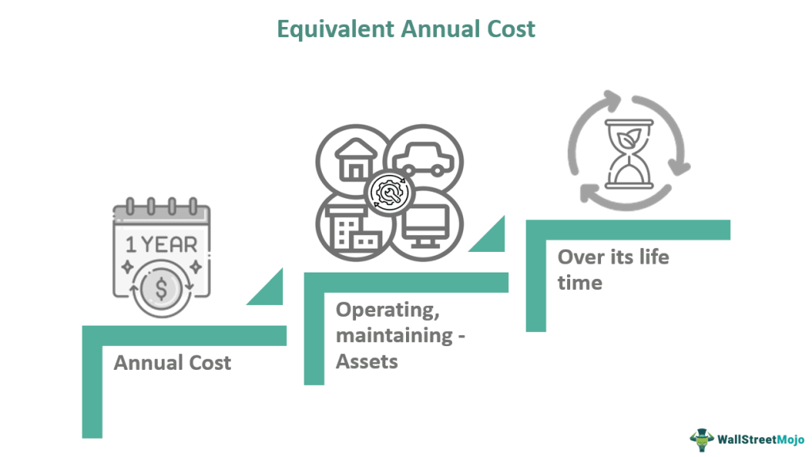

In finance and investment analysis, metrics such as the Equivalent Annual Cost (EAC) are essential in evaluating the feasibility and cost-effectiveness of projects. EAC is particularly significant in capital budgeting, where it aids companies in comparing projects that have different lifespans and investment scales. By transforming total project costs over a lifespan into an equivalent annual figure, EAC provides a uniform basis for comparison, allowing for a more standardized approach to evaluating long-term investments or equipment purchases.

The applications of EAC extend beyond traditional capital budgeting. In environments where algorithmic trading strategies and technology-driven investments play a pivotal role, understanding EAC can greatly influence decision-making. Algorithmic trading, for instance, requires substantial technology investments, and employing EAC can help determine the most financially viable algorithms or systems over time. Hence, EAC becomes integral to optimizing resource allocation and enhancing strategic investment decisions in these high-tech domains.



This article focuses on the intricacies involved in EAC calculation, emphasizes its role in capital budgeting, and explores its implications in automated trading systems. By examining how this metric can simplify complex financial decisions through an annualized cost perspective, we aim to demonstrate its value and relevance in both traditional and tech-driven investment landscapes.

## Table of Contents

## What is the Equivalent Annual Cost (EAC)?

Equivalent Annual Cost (EAC) is a financial metric that facilitates the comparison of asset or project costs on an annualized basis. It converts the total cost incurred throughout the lifespan of a project or asset into an equivalent annual amount. This conversion provides a standardized measure to evaluate and compare various investment options, especially those with different lifespans or cost profiles.

The EAC is integral to long-term investment analysis and decision-making. By presenting costs on an annual level, it simplifies comparison between assets with varying durations. For instance, when evaluating whether to purchase new equipment or continue using existing machinery, EAC helps in determining which option is more cost-effective over time. This standardization is particularly valuable in capital budgeting, where decisions often involve choosing between multiple alternatives with diverse timelines and financial implications.

In practice, the formula for calculating EAC typically involves determining the present value (PV) of all expected costs over the project's lifespan and then converting this value into an annuity using an appropriate annuity factor. The formula can be represented as:

$$
EAC = \frac{PV}{\text{Annuity Factor}}
$$

Where the present value reflects all cash flows associated with the asset, discounted back to the present using a suitable discount rate. The annuity [factor](/wiki/factor-investing), often derived from financial annuity tables or calculated using:

$$
\text{Annuity Factor} = \frac{1 - (1 + r)^{-n}}{r}
$$

Here, $r$ is the discount rate, and $n$ represents the number of periods. Calculating the EAC thus requires accurate estimation of both the discount rate and the cash flows expected over the asset's life. Utilizing EAC provides a clearer picture of the annual financial burden an investment imposes, allowing businesses to make informed and strategic investment decisions.

## Understanding the Formula for EAC Calculation

The Equivalent Annual Cost (EAC) provides a sound methodology for evaluating the financial feasibility of investments by transforming the associated cash flows over the project's lifespan into a uniform annual cost. This requires a detailed understanding of the Present Value (PV) of cash flows and the appropriate annuity factor.

### Formula and Calculation

The formula for calculating EAC is as follows:
$$

\text{EAC} = \frac{\text{PV}}{\text{Annuity Factor}} 
$$

Where PV represents the present value of the project's cash flows, and the annuity factor is based on the project's lifespan and the discount rate used to calculate the present value.

### Calculating Present Value

To determine PV, future cash flows are discounted to their present value using a specified discount rate. This rate reflects the time value of money, ensuring that future cash amounts are equated to their present worth. The formula for PV is:
$$

\text{PV} = \sum_{t=1}^{n} \frac{C_t}{(1 + r)^t} 
$$
Where $C_t$ is the cash flow at time $t$, $r$ is the discount rate, and $n$ is the total number of periods.

### Annuity Factor

The annuity factor translates the present value into an equivalent annual figure, with the consideration of consistent annual payments over the asset's life. It is given by:
$$

\text{Annuity Factor} = \frac{1 - (1 + r)^{-n}}{r} 
$$

This formula assumes that each annual payment is equivalent over the lifespan of the asset, making it easier to compare projects with varying timelines.

### Python Implementation

Below is an example of Python code to calculate EAC:

```python
def calculate_pv(cash_flows, discount_rate):
    pv = sum(cf / (1 + discount_rate) ** t for t, cf in enumerate(cash_flows, start=1))
    return pv

def calculate_annuity_factor(discount_rate, periods):
    annuity_factor = (1 - (1 + discount_rate) ** -periods) / discount_rate
    return annuity_factor

def calculate_eac(cash_flows, discount_rate, periods):
    pv = calculate_pv(cash_flows, discount_rate)
    annuity_factor = calculate_annuity_factor(discount_rate, periods)
    eac = pv / annuity_factor
    return eac

# Example Inputs
cash_flows = [1000, 2000, 3000]  # Example future cash flows
discount_rate = 0.05  # 5% discount rate
periods = 3  # Number of periods

eac = calculate_eac(cash_flows, discount_rate, periods)
print(f"Equivalent Annual Cost (EAC): {eac:.2f}")
```

By accurately assessing the present value and annuity factor, this method allows for informed decisions in selecting the most financially viable projects.

## Practical Applications of EAC in Capital Budgeting

Equivalent Annual Cost (EAC) is a pivotal financial metric deployed in capital budgeting to evaluate and compare various investment opportunities by translating their costs into an equivalent annual cost. This facilitates a straightforward comparison of projects, especially when they differ in terms of lifespan and cost structure.

One practical application of EAC in capital budgeting involves decisions related to equipment acquisition. Companies often face the choice of purchasing new machinery or maintaining existing equipment. By calculating the EAC for each option, firms can determine which choice offers better cost efficiency on an annualized basis. For new equipment, EAC encompasses the purchase price, installation, and operating costs over its useful life. For existing machinery, it includes ongoing maintenance, repair, and operational costs. The alternative with the lower EAC is typically considered more financially prudent.

For instance, consider two options: purchasing a new piece of machinery at $100,000 with an expected life of 5 years and annual operating costs of $10,000, compared to retaining existing machinery with yearly maintenance costs of $25,000 for the next 3 years. The EAC calculation would allow decision-makers to assess which option maximizes cost efficiency. The formula generally used is:

$$

EAC = \frac{\text{Present Value of Costs}}{\text{Annuity Factor}} 
$$

The annuity factor is determined based on the cost of capital and the project's time horizon. Strategic decision-making is thus supported by EAC, as it clarifies the long-term financial implications of choosing one investment path over another, ensuring that resources are allocated efficiently. This metric not only aids in the evaluation of tangible assets like equipment but also plays a role in larger-scale decisions such as infrastructure investments or IT system upgrades. By focusing on the annualized cost, businesses can align their investment strategies with financial efficiency, ensuring every dollar spent contributes effectively to their growth and development.

## Algorithmic Trading and Capital Budgeting: A Synergistic Approach

Algorithmic trading and capital budgeting both emphasize the importance of technology and cost-efficiency in making financial decisions. The integration of these elements showcases how methods like the Equivalent Annual Cost (EAC) can enhance decision-making processes in investment strategies. EAC is especially beneficial in [algorithmic trading](/wiki/algorithmic-trading), where technology investments must be evaluated for their financial viability over time. By translating costs into a comparable annual figure, EAC supports informed decisions regarding which algorithms or trading systems offer the most return on investment.

Algorithmic trading systems require significant technological infrastructure, often involving considerable capital expenditure for hardware, software, and data acquisition. Understanding the financial impact of these investments over time is crucial. EAC provides a framework for transforming total costs into an annualized figure, making it easier to compare and evaluate different systems or algorithms. This approach facilitates the determination of which strategies yield the best cost efficiency, balancing expenses with potential profits.

By adopting EAC in automated trading systems, firms can optimize resource allocation. The ability to standardize and compare the costs associated with different technologies allows firms to allocate funds more strategically, ensuring investments are directed toward the most promising opportunities. EAC aids in highlighting the long-term cost implications of a technological choice, supporting an optimized resource allocation that is aligned with strategic objectives.

Furthermore, using EAC in capital budgeting within algorithmic trading environments enhances decision-making efficacy. It equips firms with a comprehensive understanding of the economic implications of their technological investments. This approach allows them to make decisions based not just on immediate costs but on sustained financial performance metrics. As companies continue to navigate the complex landscape of technology-driven investments, the application of EAC in both algorithmic trading and capital budgeting remains a valuable tool for achieving financial efficiency and strategic success.

## Case Study: Illustrating EAC with Real-world Scenarios

In evaluating two hypothetical machinery investments using the Equivalent Annual Cost (EAC), let's consider two machines—Machine A and Machine B. Machine A costs $100,000 with a lifespan of five years and an annual maintenance cost of $10,000. Machine B costs $150,000 with an eight-year lifespan and an annual maintenance cost of $8,000. The discount rate for both investments is 10%.

To begin, calculate the Present Value (PV) of total costs for each machine over their respective lifespans. This includes the initial purchase price and annual maintenance costs.

For Machine A:

1. Calculate the PV of maintenance costs over five years using the formula:
$$
   PV = \sum_{t=1}^{n} \frac{C}{(1 + r)^t}

$$
   Where $C$ is the maintenance cost, $r$ is the discount rate, and $n$ is the lifespan.   
$$
   PV_{maintenance\_A} = \frac{10,000}{(1+0.10)^1} + \frac{10,000}{(1+0.10)^2} + \frac{10,000}{(1+0.10)^3} + \frac{10,000}{(1+0.10)^4} + \frac{10,000}{(1+0.10)^5}

$$

2. Calculate the total PV for Machine A by adding the purchase cost:
$$
   PV_{total\_A} = 100,000 + PV_{maintenance\_A}

$$

3. Compute EAC using the formula:
$$
   EAC = \frac{PV_{total\_A}}{AF}

$$
   Where $AF$ is the annuity factor:
$$
   AF = \frac{1 - (1 + r)^{-n}}{r}

$$

For Machine B, follow the same steps:

1. Calculate the PV of maintenance costs over eight years:
$$
   PV_{maintenance\_B} = \frac{8,000}{(1+0.10)^1} + \cdots + \frac{8,000}{(1+0.10)^8}

$$

2. Calculate the total PV for Machine B:
$$
   PV_{total\_B} = 150,000 + PV_{maintenance\_B}

$$

3. Compute EAC for Machine B:
$$
   EAC = \frac{PV_{total\_B}}{AF}

$$

The machine with the lower EAC represents the more cost-effective investment option over its lifespan, providing an objective basis for comparison.

In real-world scenarios, the EAC approach is widely applicable across various industries. In manufacturing, companies may use EAC to decide on equipment purchases, balancing initial costs against long-term operating expenses. Similarly, in IT, EAC can guide decisions about investing in new technologies or upgrading software systems, accounting for both acquisition costs and ongoing maintenance.

These examples demonstrate the robustness of EAC in facilitating strategic financial decisions, helping organizations align long-term investments with financial goals effectively.

## Limitations and Considerations of Using EAC

The Equivalent Annual Cost (EAC) is an influential metric for comparing the long-term cost efficiency of various investments, but it does have certain limitations and considerations that must be acknowledged. EAC primarily assumes that costs remain constant throughout the lifespan of the asset or project. In reality, costs can fluctuate due to factors like maintenance needs, technological advancements, or external economic conditions. Consequently, relying on the EAC without accounting for potential cost variations can lead to inaccurate assessments.

Another significant consideration is EAC's omission of inflation. Inflation can erode purchasing power and influence future cash flows substantially. By not adjusting for inflation, EAC calculations may overstate or understate the real cost of future expenses, thus skewing the cost-effectiveness of an investment when viewed in real terms. It's essential for decision-makers to complement EAC with inflation-adjusted analysis to ensure more robust investment evaluations.

The accuracy of the EAC relies heavily on the correct determination of discount rates. Discount rates are used to calculate the present value of future cash flows, a critical component in the EAC formula: 

$$
EAC = \frac{PV}{\text{Annuity Factor}}
$$

where $PV$ represents the present value of all cash flows. Selecting an inappropriate discount rate can lead to misrepresentative EAC values. A rate that is too high might undervalue future costs while one that is too low could lead to overvaluation, both of which can affect decision-making adversely.

Moreover, EAC concentrates solely on cost aspects and often disregards potential revenues or intangible benefits that might arise from the investment. This cost-centric view may not be holistic as it could overlook advantages such as strategic positioning, brand value enhancement, or employee satisfaction, which are not directly measurable in financial terms but significantly impact long-term investment success.

In summary, while the EAC is a robust tool for evaluating cost efficiency, it is crucial to use it alongside other financial metrics and qualitative analyses to capture a comprehensive view of the investment's overall potential. Decision-makers should carefully assess the assumptions underlying EAC calculations and consider the broader financial and strategic context to enhance decision-making accuracy.

## Conclusion

The Equivalent Annual Cost (EAC) is crucial for evaluating the financial viability of long-term investments. It plays a significant role in capital budgeting and algorithmic trading by offering an annualized cost metric that simplifies complex financial decisions. This standardization is valuable to businesses seeking to implement cost-effective strategies, as it allows for straightforward comparisons across diverse investment opportunities and durations.

By converting the overall cost of an investment into a consistent annual figure, EAC enables decision-makers to gauge and compare the ongoing financial implications of different investment options. This approach is particularly important in capital budgeting, where the objective is to identify the investments that yield the most efficient use of resources over time, aligning expenditures with expected returns.

In the context of algorithmic trading, EAC proves beneficial by informing decisions around technological investments, which are heavily data-driven and cost-intensive. Applying EAC helps identify the most financially viable systems or algorithms, ensuring that resource allocation is optimized and decision-making processes are enhanced. This is essential in maintaining competitiveness in rapidly evolving financial landscapes.

As the financial environment continually advances with technological innovations and shifting economic conditions, incorporating EAC into decision-making frameworks remains indispensable. It offers clarity and consistency in evaluating long-term investments, supporting strategic growth and enhancing investment success. Organizations that adeptly utilize EAC are well-positioned to adjust to market changes and capitalize on emerging opportunities.

## References & Further Reading

[1]: Brealey, R. A., Myers, S. C., & Allen, F. (2011). "Principles of Corporate Finance." McGraw-Hill Education.

[2]: Damodaran, A. (2015). ["Strategic Risk Taking: A Framework for Risk Management."](https://books.google.com/books/about/Strategic_Risk_Taking.html?id=JJUkCHhuYO8C) Pearson Education.

[3]: Bodie, Z., Kane, A., & Marcus, A. J. (2014). "Investments." McGraw-Hill/Irwin.

[4]: Hull, J. C. (2018). "Options, Futures, and Other Derivatives." Pearson.

[5]: DeFusco, R. A., McLeavey, D. W., Pinto, J. E., & Runkle, D. E. (2015). "Quantitative Investment Analysis." Wiley.