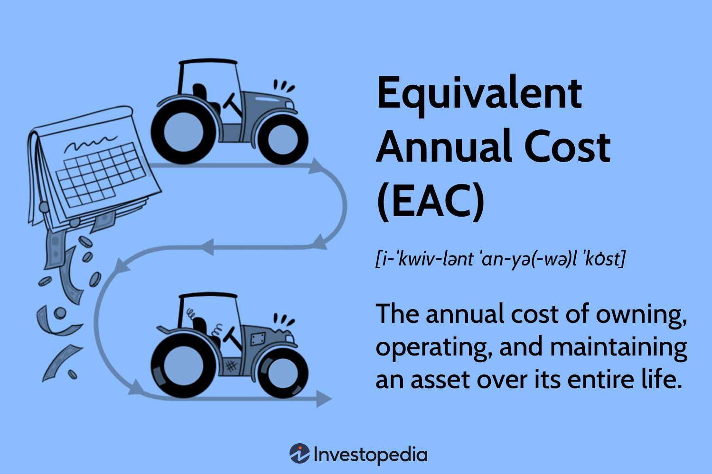

## Table of Contents

## What is Equivalent Annual Cost (EAC)?

Equivalent Annual Cost (EAC) is a way to compare the cost of different projects or investments that last for different amounts of time. It helps you figure out how much something will cost you each year, making it easier to compare options. To find the EAC, you first need to know the total cost of the project, including buying it, running it, and any other costs. Then, you use a formula that takes into account how long the project will last and the cost of money over time, called the discount rate.

Once you have the total cost, you spread it out evenly over the years the project will be used. This gives you a single number, the EAC, which you can use to compare different projects. For example, if you are choosing between two machines that cost different amounts and last for different times, the EAC can help you see which one is cheaper to use each year. This is really helpful for making smart choices about where to spend money.

## Why is EAC important in financial decision-making?

EAC is important in financial decision-making because it helps you compare the cost of different projects or investments that last for different lengths of time. When you're trying to decide between options, like buying one machine that lasts 5 years versus another that lasts 10 years, EAC makes it easier to see which one is cheaper to use each year. This way, you can make a smarter choice about where to spend your money, focusing on what will cost you less over time.

Using EAC also helps you think about the future costs of your choices. It takes into account not just the initial price of something, but also how much it will cost to run and maintain it over its entire life. By spreading these costs evenly over the years, EAC gives you a clear picture of the ongoing financial impact of your decision. This can help you avoid surprises and plan better for the long term.

## How do you calculate the Equivalent Annual Cost?

To calculate the Equivalent Annual Cost (EAC), you first need to figure out the total cost of the project or investment. This includes the initial cost to buy it, plus any costs for running and maintaining it over its life. Once you have the total cost, you need to know how long the project will last and the discount rate, which is like the cost of money over time. The discount rate helps you understand how much money today is worth in the future.

Next, you use a formula to spread the total cost evenly over the years the project will be used. The formula takes the total cost and divides it by what's called the present value annuity factor. This factor depends on the life of the project and the discount rate. You can find this factor in financial tables or calculate it using a financial calculator or software. The result is the EAC, which tells you how much the project will cost you each year, making it easier to compare different options.

## Can you provide a simple example of EAC calculation?

Let's say you're choosing between two machines for your business. Machine A costs $10,000 and lasts 5 years, while Machine B costs $15,000 but lasts 10 years. You also need to consider the cost of running each machine. Machine A costs $1,000 a year to run, and Machine B costs $800 a year. Let's use a discount rate of 5% to calculate the EAC.

For Machine A, first, find the total cost. That's the initial cost of $10,000 plus the running cost for 5 years, which is $5,000 (5 years x $1,000 per year). So, the total cost is $15,000. Now, you need to divide this by the present value annuity factor for 5 years at a 5% discount rate, which is about 4.33. So, the EAC for Machine A is $15,000 / 4.33 = about $3,464 per year.

For Machine B, the total cost is the initial cost of $15,000 plus the running cost for 10 years, which is $8,000 (10 years x $800 per year). So, the total cost is $23,000. Divide this by the present value annuity factor for 10 years at a 5% discount rate, which is about 7.72. So, the EAC for Machine B is $23,000 / 7.72 = about $2,979 per year. Comparing the two, Machine B has a lower EAC, so it's cheaper to use each year even though it costs more upfront.

## What are the key components needed to compute EAC?

To compute the Equivalent Annual Cost (EAC), you need to know a few key things. First, you need the total cost of the project or investment. This includes the initial cost to buy it, plus any costs to run and maintain it over its life. For example, if you're buying a machine, you'd add up the price of the machine and the cost of running it each year for as long as it lasts.

Second, you need to know how long the project or investment will last. This is important because it helps you spread the total cost evenly over the years. If a machine lasts 5 years, you'll divide the total cost by 5 to find the EAC. Finally, you need to know the discount rate, which is the cost of money over time. This rate helps you figure out how much money today is worth in the future. With these three pieces of information, you can calculate the EAC and compare different options easily.

## How does EAC help in comparing different investment options?

EAC helps you compare different investment options by turning the total cost of each option into a yearly cost. This makes it easier to see which option is cheaper to use each year, even if they cost different amounts upfront and last for different lengths of time. For example, if you're choosing between two machines that cost different amounts and last for different times, EAC can show you which machine will be less expensive to use every year. This way, you can make a better decision about where to spend your money.

Using EAC also helps you think about all the costs of your choices, not just the price tag. It takes into account how much it will cost to run and maintain something over its whole life. By spreading these costs evenly over the years, EAC gives you a clear picture of what you'll be spending each year. This helps you avoid surprises and plan better for the future, making it easier to pick the best investment for your needs.

## What are the limitations of using EAC in financial analysis?

Using EAC in financial analysis has some limitations. One big problem is that it assumes all costs are known and stay the same over time. But in real life, costs can change a lot because of things like inflation, new technology, or unexpected repairs. This means the EAC you calculate might not be accurate if these costs go up or down more than you expected.

Another limitation is that EAC doesn't think about the value of flexibility. Sometimes, you might want to choose an investment that lets you change your plans more easily. For example, if a machine breaks down, you might want one that's easier to fix or replace. EAC doesn't take this into account because it focuses only on the cost spread out over time, not on how easy or hard it is to deal with changes.

Lastly, EAC depends a lot on the discount rate you use. If you get the discount rate wrong, your EAC calculation will be off too. Different people might use different discount rates based on how much risk they think there is or how much they value money now versus later. This can make it hard to compare EACs if everyone is using a different rate.

## How does the choice of discount rate affect EAC?

The choice of discount rate has a big impact on the Equivalent Annual Cost (EAC) because it affects how much future costs are worth today. If you use a higher discount rate, it means you think money now is worth a lot more than money in the future. This makes the present value of future costs smaller, so the EAC will be lower. On the other hand, if you use a lower discount rate, it means you think money now and money later are closer in value. This makes the present value of future costs higher, so the EAC will be higher too.

Choosing the right discount rate can be tricky because it depends on things like how risky the investment is and how much you value money now versus later. If you get the discount rate wrong, your EAC calculation will be off, and you might make a bad decision about which investment to choose. So, it's really important to think carefully about the discount rate and maybe even try different rates to see how it changes your EAC and helps you make a better choice.

## In what scenarios is EAC most useful?

EAC is most useful when you need to compare different investments or projects that last for different amounts of time. For example, if you're choosing between buying a machine that lasts 5 years and another that lasts 10 years, EAC can help you see which one will cost you less each year. This is really helpful for businesses that need to decide between options with different lifespans and costs, like choosing between different types of equipment or machinery.

EAC is also great for planning and budgeting over the long term. It takes into account not just the price of something, but also how much it will cost to run and maintain it over its whole life. By spreading these costs evenly over the years, EAC gives you a clear picture of what you'll be spending each year. This helps you avoid surprises and make better financial decisions, especially when you're looking at the ongoing costs of big investments.

## How does EAC differ from other cost comparison methods like Net Present Value (NPV)?

Equivalent Annual Cost (EAC) and Net Present Value (NPV) are both ways to help you decide between different investments, but they do it in different ways. EAC focuses on the yearly cost of an investment. It takes the total cost of a project, including buying it and running it, and spreads it out evenly over the years the project will last. This helps you see how much something will cost you each year, making it easier to compare investments that last for different amounts of time. For example, if you're choosing between two machines that cost different amounts and last different lengths of time, EAC can show you which one is cheaper to use every year.

NPV, on the other hand, looks at the total value of an investment over its whole life. It takes the money you'll get back from an investment and compares it to the money you put in, all adjusted for the time value of money. If the NPV is positive, it means the investment will make more money than it costs. NPV is great for seeing if an investment is worth it overall, but it doesn't tell you how much it will cost you each year like EAC does. So, while EAC is perfect for comparing the yearly cost of different options, NPV is better for understanding the total financial impact of an investment.

## What advanced considerations should be taken into account when using EAC for long-term projects?

When using EAC for long-term projects, you need to think about how costs might change over time. Things like inflation can make costs go up, and new technology might make things cheaper or change what you need. Also, unexpected things like repairs or changes in how much you use something can affect the costs. EAC assumes that all these costs stay the same, but in real life, they don't. So, you might need to guess what these changes will be and update your EAC calculation to make it more accurate.

Another thing to consider is the risk of the project. Long-term projects can be more risky because so many things can change over time. The discount rate you use in EAC can help you think about this risk, but you need to choose it carefully. A higher discount rate means you think the project is more risky, so you value money now more than money later. This can make the EAC lower, but if you get the discount rate wrong, your EAC won't be right. So, it's important to think about how risky the project is and maybe even try different discount rates to see how it changes your EAC.

## How can EAC be integrated into broader financial models and software?

EAC can be integrated into broader financial models and software by using it as a key metric for comparing different investment options. In a financial model, you can set up a section where you input the initial costs, running costs, the lifespan of the project, and the discount rate. The software then calculates the EAC for each investment option and displays it in a way that makes it easy to compare. This helps you see which option is cheaper to use each year, even if they cost different amounts upfront and last for different lengths of time. Many financial software programs, like Excel or specialized financial planning tools, have built-in functions or templates that can do this calculation for you, making it easier to include EAC in your overall financial analysis.

When using EAC in broader financial models, it's important to make sure it works well with other parts of the model. For example, you might want to link the EAC calculation to other sections that look at the total value of an investment over its whole life, like NPV. This way, you can see both the yearly cost and the overall financial impact of your choices. Also, you can set up the model to let you change the discount rate easily, so you can see how different levels of risk or different ways of valuing money now versus later can affect your EAC. By doing this, you can make your financial model more flexible and helpful for making smart decisions about long-term investments.

## What is the Equivalent Annual Cost (EAC)?

Equivalent Annual Cost (EAC) is a financial metric that facilitates the comparison of asset or project costs on an annualized basis. It converts the total cost incurred throughout the lifespan of a project or asset into an equivalent annual amount. This conversion provides a standardized measure to evaluate and compare various investment options, especially those with different lifespans or cost profiles.

The EAC is integral to long-term investment analysis and decision-making. By presenting costs on an annual level, it simplifies comparison between assets with varying durations. For instance, when evaluating whether to purchase new equipment or continue using existing machinery, EAC helps in determining which option is more cost-effective over time. This standardization is particularly valuable in capital budgeting, where decisions often involve choosing between multiple alternatives with diverse timelines and financial implications.

In practice, the formula for calculating EAC typically involves determining the present value (PV) of all expected costs over the project's lifespan and then converting this value into an annuity using an appropriate annuity factor. The formula can be represented as:

$$
EAC = \frac{PV}{\text{Annuity Factor}}
$$

Where the present value reflects all cash flows associated with the asset, discounted back to the present using a suitable discount rate. The annuity [factor](/wiki/factor-investing), often derived from financial annuity tables or calculated using:

$$
\text{Annuity Factor} = \frac{1 - (1 + r)^{-n}}{r}
$$

Here, $r$ is the discount rate, and $n$ represents the number of periods. Calculating the EAC thus requires accurate estimation of both the discount rate and the cash flows expected over the asset's life. Utilizing EAC provides a clearer picture of the annual financial burden an investment imposes, allowing businesses to make informed and strategic investment decisions.

## What are the practical applications of EAC in capital budgeting?

Equivalent Annual Cost (EAC) is a pivotal financial metric deployed in capital budgeting to evaluate and compare various investment opportunities by translating their costs into an equivalent annual cost. This facilitates a straightforward comparison of projects, especially when they differ in terms of lifespan and cost structure.

One practical application of EAC in capital budgeting involves decisions related to equipment acquisition. Companies often face the choice of purchasing new machinery or maintaining existing equipment. By calculating the EAC for each option, firms can determine which choice offers better cost efficiency on an annualized basis. For new equipment, EAC encompasses the purchase price, installation, and operating costs over its useful life. For existing machinery, it includes ongoing maintenance, repair, and operational costs. The alternative with the lower EAC is typically considered more financially prudent.

For instance, consider two options: purchasing a new piece of machinery at $100,000 with an expected life of 5 years and annual operating costs of $10,000, compared to retaining existing machinery with yearly maintenance costs of $25,000 for the next 3 years. The EAC calculation would allow decision-makers to assess which option maximizes cost efficiency. The formula generally used is:

$$

EAC = \frac{\text{Present Value of Costs}}{\text{Annuity Factor}} 
$$

The annuity factor is determined based on the cost of capital and the project's time horizon. Strategic decision-making is thus supported by EAC, as it clarifies the long-term financial implications of choosing one investment path over another, ensuring that resources are allocated efficiently. This metric not only aids in the evaluation of tangible assets like equipment but also plays a role in larger-scale decisions such as infrastructure investments or IT system upgrades. By focusing on the annualized cost, businesses can align their investment strategies with financial efficiency, ensuring every dollar spent contributes effectively to their growth and development.

## Question: Can you illustrate EAC with real-world scenarios through a case study?

In evaluating two hypothetical machinery investments using the Equivalent Annual Cost (EAC), let's consider two machines—Machine A and Machine B. Machine A costs $100,000 with a lifespan of five years and an annual maintenance cost of $10,000. Machine B costs $150,000 with an eight-year lifespan and an annual maintenance cost of $8,000. The discount rate for both investments is 10%.

To begin, calculate the Present Value (PV) of total costs for each machine over their respective lifespans. This includes the initial purchase price and annual maintenance costs.

For Machine A:

1. Calculate the PV of maintenance costs over five years using the formula:
$$
   PV = \sum_{t=1}^{n} \frac{C}{(1 + r)^t}

$$
   Where $C$ is the maintenance cost, $r$ is the discount rate, and $n$ is the lifespan.   
$$
   PV_{maintenance\_A} = \frac{10,000}{(1+0.10)^1} + \frac{10,000}{(1+0.10)^2} + \frac{10,000}{(1+0.10)^3} + \frac{10,000}{(1+0.10)^4} + \frac{10,000}{(1+0.10)^5}

$$

2. Calculate the total PV for Machine A by adding the purchase cost:
$$
   PV_{total\_A} = 100,000 + PV_{maintenance\_A}

$$

3. Compute EAC using the formula:
$$
   EAC = \frac{PV_{total\_A}}{AF}

$$
   Where $AF$ is the annuity factor:
$$
   AF = \frac{1 - (1 + r)^{-n}}{r}

$$

For Machine B, follow the same steps:

1. Calculate the PV of maintenance costs over eight years:
$$
   PV_{maintenance\_B} = \frac{8,000}{(1+0.10)^1} + \cdots + \frac{8,000}{(1+0.10)^8}

$$

2. Calculate the total PV for Machine B:
$$
   PV_{total\_B} = 150,000 + PV_{maintenance\_B}

$$

3. Compute EAC for Machine B:
$$
   EAC = \frac{PV_{total\_B}}{AF}

$$

The machine with the lower EAC represents the more cost-effective investment option over its lifespan, providing an objective basis for comparison.

In real-world scenarios, the EAC approach is widely applicable across various industries. In manufacturing, companies may use EAC to decide on equipment purchases, balancing initial costs against long-term operating expenses. Similarly, in IT, EAC can guide decisions about investing in new technologies or upgrading software systems, accounting for both acquisition costs and ongoing maintenance.

These examples demonstrate the robustness of EAC in facilitating strategic financial decisions, helping organizations align long-term investments with financial goals effectively.

## What are the limitations and considerations of using EAC?

The Equivalent Annual Cost (EAC) is an influential metric for comparing the long-term cost efficiency of various investments, but it does have certain limitations and considerations that must be acknowledged. EAC primarily assumes that costs remain constant throughout the lifespan of the asset or project. In reality, costs can fluctuate due to factors like maintenance needs, technological advancements, or external economic conditions. Consequently, relying on the EAC without accounting for potential cost variations can lead to inaccurate assessments.

Another significant consideration is EAC's omission of inflation. Inflation can erode purchasing power and influence future cash flows substantially. By not adjusting for inflation, EAC calculations may overstate or understate the real cost of future expenses, thus skewing the cost-effectiveness of an investment when viewed in real terms. It's essential for decision-makers to complement EAC with inflation-adjusted analysis to ensure more robust investment evaluations.

The accuracy of the EAC relies heavily on the correct determination of discount rates. Discount rates are used to calculate the present value of future cash flows, a critical component in the EAC formula: 

$$
EAC = \frac{PV}{\text{Annuity Factor}}
$$

where $PV$ represents the present value of all cash flows. Selecting an inappropriate discount rate can lead to misrepresentative EAC values. A rate that is too high might undervalue future costs while one that is too low could lead to overvaluation, both of which can affect decision-making adversely.

Moreover, EAC concentrates solely on cost aspects and often disregards potential revenues or intangible benefits that might arise from the investment. This cost-centric view may not be holistic as it could overlook advantages such as strategic positioning, brand value enhancement, or employee satisfaction, which are not directly measurable in financial terms but significantly impact long-term investment success.

In summary, while the EAC is a robust tool for evaluating cost efficiency, it is crucial to use it alongside other financial metrics and qualitative analyses to capture a comprehensive view of the investment's overall potential. Decision-makers should carefully assess the assumptions underlying EAC calculations and consider the broader financial and strategic context to enhance decision-making accuracy.

## References & Further Reading

[1]: Brealey, R. A., Myers, S. C., & Allen, F. (2011). "Principles of Corporate Finance." McGraw-Hill Education.

[2]: Damodaran, A. (2015). ["Strategic Risk Taking: A Framework for Risk Management."](https://books.google.com/books/about/Strategic_Risk_Taking.html?id=JJUkCHhuYO8C) Pearson Education.

[3]: Bodie, Z., Kane, A., & Marcus, A. J. (2014). "Investments." McGraw-Hill/Irwin.

[4]: Hull, J. C. (2018). "Options, Futures, and Other Derivatives." Pearson.

[5]: DeFusco, R. A., McLeavey, D. W., Pinto, J. E., & Runkle, D. E. (2015). "Quantitative Investment Analysis." Wiley.