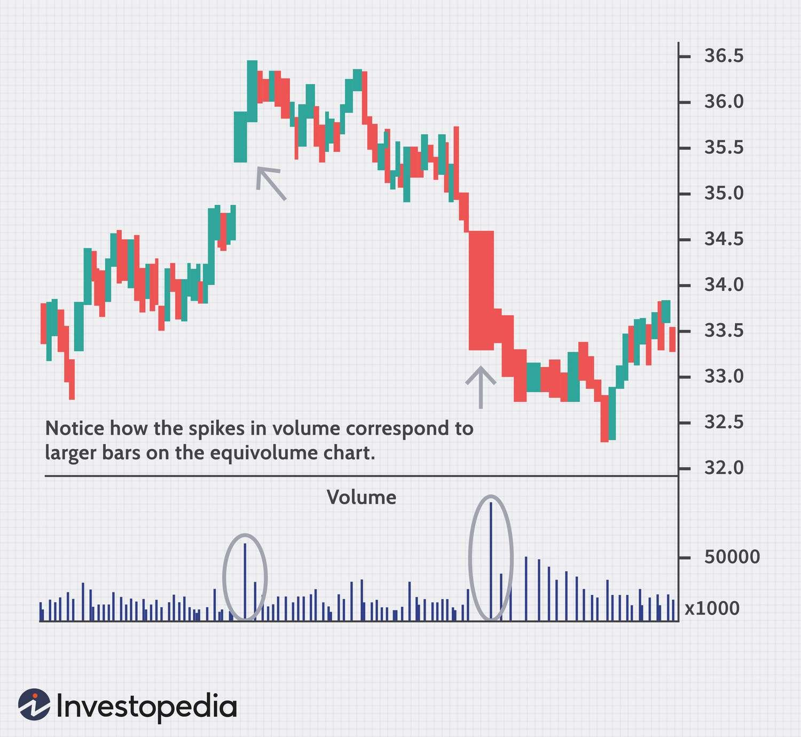

## Table of Contents

## What is an Equivolume Chart?

An Equivolume Chart is a type of financial chart that shows how much a stock or other financial thing is traded and how its price changes. It is different from normal charts because it uses boxes instead of lines. The height of each box shows how much the price changed, and the width shows how many shares were traded. This makes it easy to see when a lot of trading happens and when the price moves a lot.

These charts are helpful for people who want to understand the market better. By looking at the size of the boxes, you can see if the market is calm or if there is a lot of activity. Traders use these charts to find good times to buy or sell. Equivolume Charts can show important information that might be hard to see on other types of charts.

## How does an Equivolume Chart differ from traditional candlestick charts?

An Equivolume Chart and a traditional candlestick chart both show how the price of a stock changes over time, but they look different and show information in different ways. In a candlestick chart, each "candle" shows the opening, closing, highest, and lowest prices for a certain time period. The body of the candle is colored to show if the price went up or down, and the lines above and below the body, called wicks, show the high and low prices. On the other hand, an Equivolume Chart uses boxes instead of candles. The height of each box shows how much the price changed, and the width of the box shows how many shares were traded during that time.

The main difference between the two types of charts is how they show trading [volume](/wiki/volume-trading-strategy). In a candlestick chart, volume is usually shown separately, often as a bar graph below the price chart. This means you have to look at two different parts of the chart to understand both price and volume. But in an Equivolume Chart, the volume is part of the price box itself. This makes it easier to see at a glance when there is a lot of trading and how that relates to price changes. By combining price and volume into one visual element, Equivolume Charts can help traders spot important market movements more quickly.

## What are the key components of an Equivolume Chart?

An Equivolume Chart has two main parts: the height of the box and the width of the box. The height of the box shows how much the price of the stock changed during a certain time. If the box is tall, it means the price moved a lot. If the box is short, it means the price did not change much. The color of the box can tell you if the price went up or down. A green or white box means the price went up, and a red or black box means the price went down.

The width of the box shows how many shares of the stock were traded during that time. A wide box means a lot of shares were traded, which means there was a lot of activity in the market. A narrow box means fewer shares were traded, so there was less activity. By looking at both the height and the width of the boxes, you can see when there are big changes in the price and when a lot of trading is happening. This can help you understand what is going on in the market better.

## How is volume represented in an Equivolume Chart?

In an Equivolume Chart, volume is shown by how wide each box is. If a box is wide, it means a lot of shares were traded during that time. If a box is narrow, it means fewer shares were traded. This makes it easy to see at a glance how much trading is happening.

By looking at the width of the boxes, you can quickly tell if there is a lot of activity in the market or if it is quiet. This is different from other charts where volume might be shown in a separate bar graph. In an Equivolume Chart, the volume is right there with the price, so you can see how they relate to each other without looking at two different places on the chart.

## What are the advantages of using an Equivolume Chart for beginners?

Equivolume Charts are great for beginners because they make it easy to see both the price changes and the trading volume at the same time. Instead of having to look at two different graphs like in other types of charts, Equivolume Charts show everything in one place. The height of each box tells you how much the price changed, and the width shows how many shares were traded. This means you can quickly see if the price moved a lot and if a lot of people were buying and selling.

Another advantage is that Equivolume Charts use simple shapes, which are easier for beginners to understand. Each box is colored to show if the price went up or down, making it clear at a glance. This helps new traders spot important trends and patterns without getting confused by too many lines or complicated graphs. By using Equivolume Charts, beginners can learn to make better decisions about when to buy or sell stocks.

## How can an Equivolume Chart help in identifying market trends?

An Equivolume Chart helps in identifying market trends by showing how the price and trading volume change together. When you see tall and wide boxes, it means the price moved a lot and many shares were traded. This can show that a new trend is starting. For example, if you see a series of tall and wide green boxes, it might mean that the price is going up and more people are buying, which could be the start of an upward trend.

On the other hand, if you see a lot of tall and wide red boxes, it could mean the price is going down and more people are selling, which might be the start of a downward trend. By looking at the size and color of the boxes, you can see if the market is getting more active or if it is calming down. This can help you understand if a trend is strong or if it might be ending soon.

## What are the common patterns observed in Equivolume Charts?

Equivolume Charts show different patterns that can help traders see what the market might do next. One common pattern is a "volume spike," where you see a really wide box. This means a lot of shares were traded at once. If this happens with a tall box, it shows a big price move and lots of trading, which can mean the start of a new trend. For example, if you see a wide and tall green box, it might mean the price is going up and more people are buying, which could be the start of an upward trend.

Another pattern is a "volume trend," where you see boxes getting wider or narrower over time. If the boxes are getting wider and the price is going up, it can mean more people are buying and the upward trend is getting stronger. If the boxes are getting narrower and the price is going down, it might mean fewer people are trading and the downward trend is getting weaker. By watching these patterns, traders can decide when to buy or sell based on how strong the market trend looks.

A third pattern to look for is "volume divergence," where the price and volume do not match. For example, if the price is going up but the boxes are getting narrower, it might mean the upward trend is losing strength because fewer people are buying. On the other hand, if the price is going down but the boxes are getting wider, it might mean more people are selling and the downward trend is getting stronger. Seeing these patterns can help traders understand if a trend is likely to continue or if it might change direction soon.

## How does the interpretation of Equivolume Charts vary across different markets?

The way people read Equivolume Charts can be different depending on the market they are looking at. In the stock market, for example, a wide and tall box might mean a lot of people are buying or selling a stock, which can show a strong trend. But in the [forex](/wiki/forex-system) market, where currencies are traded, the same wide and tall box might show a big change in currency value because of news or events happening around the world. So, traders need to think about what is happening in that specific market when they look at the chart.

In the futures market, where people buy and sell contracts for things like oil or wheat, Equivolume Charts can help show how much the price might change because of supply and demand. A wide box might mean a lot of contracts are being traded, which can show that people are worried about future prices. Even though the basic idea of the chart is the same, the way people use it to make decisions can be different in each market. Traders need to know the special things about each market to use Equivolume Charts the right way.

## What are the limitations of Equivolume Charts?

Equivolume Charts can be hard to read for some people because they look different from the usual charts. They use boxes instead of lines or candles, and this can be confusing at first. Also, these charts might not work well for all kinds of markets. For example, in markets where there isn't a lot of trading, the boxes might be very narrow and hard to see. This can make it tough to understand what is happening in the market.

Another problem with Equivolume Charts is that they can make small changes in price look bigger than they really are. If a lot of shares are traded but the price only changes a little, the box will be wide but not very tall. This might make traders think something big is happening when it's not. Also, these charts can be hard to use on computers or phones because they need special software. This can make it hard for some people to use them easily.

## How can advanced traders use Equivolume Charts for more precise trading strategies?

Advanced traders can use Equivolume Charts to find good times to buy or sell by looking at how the price and trading volume work together. They can see when a lot of shares are being traded and the price is moving a lot, which might mean a new trend is starting. For example, if they see a tall and wide green box, it could mean the price is going up and more people are buying. This might be a good time to buy the stock. On the other hand, if they see a tall and wide red box, it could mean the price is going down and more people are selling. This might be a good time to sell the stock.

Traders can also use Equivolume Charts to spot patterns that might not be easy to see on other charts. They can look for volume spikes, where a really wide box shows a lot of shares were traded at once. This can help them decide if a trend is strong or if it might be ending soon. They can also watch for volume divergence, where the price and volume do not match. For example, if the price is going up but the boxes are getting narrower, it might mean the upward trend is losing strength. By understanding these patterns, advanced traders can make more precise decisions about when to buy or sell, helping them make better trades.

## What software tools are available for creating and analyzing Equivolume Charts?

There are several software tools that advanced traders can use to make and study Equivolume Charts. One popular tool is MetaTrader 4 (MT4), which lets you add Equivolume Charts with special add-ons. Another tool is TradingView, which is easy to use and has Equivolume Charts built right in. You can also use NinjaTrader, which is good for people who trade a lot and need powerful tools to help them.

These tools help traders by showing them how the price and trading volume work together. They can change the charts to see different time periods and look at different markets. By using these software tools, traders can spot important patterns and make better decisions about when to buy or sell stocks.

## How have Equivolume Charts evolved with the integration of new technologies and data analysis techniques?

Equivolume Charts have changed a lot because of new technology and better ways to look at data. Before, traders had to draw these charts by hand, which was hard and took a long time. Now, with computers and special software like MetaTrader 4 and TradingView, it's easy to make and study Equivolume Charts. These tools can show the charts in real time, so traders can see what's happening in the market right away. They can also change the charts to look at different time periods and markets, which helps them make better decisions about buying and selling.

New ways of analyzing data have also made Equivolume Charts more useful. Traders can now use algorithms and [machine learning](/wiki/machine-learning) to find patterns in the charts that they might not see by just looking at them. This can help them predict what the market might do next. Also, with the internet, traders can share their charts and ideas with others, which can help everyone learn more about the market. These new technologies and techniques have made Equivolume Charts a powerful tool for traders who want to understand the market better.

## References & Further Reading

[1]: Arms, R. W. (1996). ["Volume Cycles in the Stock Market: Equivolume Charting."](https://www.amazon.com/Cycles-Stock-Market-Equivolume-Charting/dp/1885439008) 

[2]: Maclean, L. C., & Thorp, E. O. (2011). ["The Kelly Capital Growth Investment Criterion: Theory and Practice."](https://www.amazon.com/KELLY-CAPITAL-GROWTH-INVESTMENT-CRITERION/dp/9814383139) World Scientific Publishing Company.

[3]: Murphy, J. J. (1999). ["Technical Analysis of the Financial Markets: A Comprehensive Guide to Trading Methods and Applications."](https://archive.org/details/technicalanalysi0000murp) New York Institute of Finance.

[4]: Pring, M. J. (2002). ["Technical Analysis Explained: The Successful Investor's Guide to Spotting Investment Trends and Turning Points."](https://www.amazon.com/Technical-Analysis-Explained-Fifth-Successful/dp/0071825177) McGraw-Hill Education.

[5]: Schmidt, C. (2007). ["Algorithmic Trading with Equivolume Charting."](https://blog.iese.edu/financeseminars/files/2012/02/cchv_13June2011.pdf) Social Science Research Network.