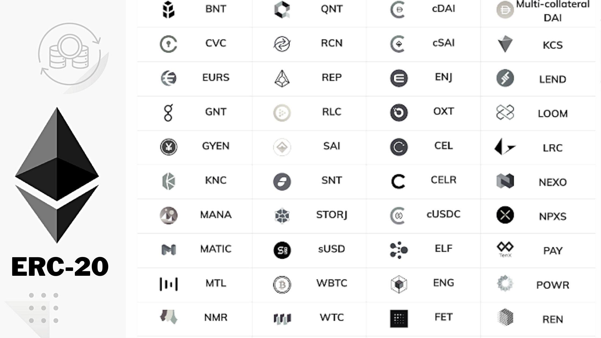

Cryptocurrency has significantly impacted global finance by introducing decentralized digital currencies that operate independently of traditional banking systems. Bitcoin, the first cryptocurrency, demonstrated the potential for a peer-to-peer transaction network without a central authority, leading to the creation of numerous other cryptocurrencies. These digital currencies facilitate cross-border transactions with reduced fees and increased speed, offering an alternative to conventional payment methods. The rise of cryptocurrencies has also challenged regulatory frameworks worldwide, prompting governments to evaluate their stance on digital currencies and their integration into existing financial systems.

Cryptocurrency tokens represent a subset of cryptocurrencies and play a critical role in the digital economy. Unlike coins such as Bitcoin and Ethereum, which function primarily as digital money, tokens are built on existing blockchain networks and serve multiple purposes. They can represent assets, grant access to services, or enable participation in decentralized projects. This versatility has amplified the relevance of tokens in developing decentralized finance (DeFi) applications, non-fungible tokens (NFTs), and other innovative blockchain-based services.

The Ethereum network has been instrumental in advancing token development. Launched in 2015, Ethereum is a decentralized platform that allows developers to deploy smart contracts and build decentralized applications (dApps). Its unique selling proposition is its Turing-complete programming language, which enables complex contract automation on the blockchain. Ethereum’s robust infrastructure and vibrant developer community have positioned it as a cornerstone of the blockchain ecosystem, significantly influencing token creation and distribution.

At the heart of Ethereum’s token ecosystem are ERC-20 tokens. The ERC-20 standard provides guidelines for creating tokens on the Ethereum blockchain, ensuring compatibility and interoperability between tokens and decentralized applications. This standard has become the most widely used token protocol, facilitating the rise of Initial Coin Offerings (ICOs) and promoting the growth of DeFi. ERC-20 tokens' significant presence in the Ethereum network illustrates their crucial role in evolving blockchain technologies.

Algorithmic trading represents a significant development within the cryptocurrency market. It involves using computer algorithms to execute trades based on pre-defined criteria, benefitting traders with improved speed, accuracy, and efficiency. This approach to trading has become increasingly popular as the cryptocurrency market evolves, offering strategies that can capitalize on market trends rapidly and minimize human error. As algorithmic trading continues to grow, its integration with cryptocurrencies, particularly ERC-20 tokens, presents new opportunities and challenges for traders and developers alike.

## Table of Contents

## Understanding ERC-20 Tokens

ERC-20 tokens are a prominent category of cryptocurrency tokens operating on the Ethereum blockchain. These tokens are fundamentally digital assets that can represent a wide variety of fungible goods, including currencies, stocks, and virtual services. The ERC-20 standard, which was proposed by Fabian Vogelsteller and Vitalik Buterin in November 2015, dictates a set of rules and standards that tokens on the Ethereum blockchain must adhere to, ensuring uniformity and compatibility across the Ethereum ecosystem.

### Characteristics of ERC-20 Tokens

ERC-20 tokens are defined by specific functions that facilitate their integration and interaction within smart contracts on the Ethereum platform. Some of the primary characteristics include:

1. **Balance Inquiry**: Functions like `balanceOf(address owner)` allow querying the token balance of any address.
2. **Transferability**: Functions such as `transfer(address to, uint256 value)` enable holders to transfer tokens to other addresses.
3. **Allowance and TransferFrom**: Allowances facilitate authorized transfers, akin to the delegation of spending rights; the `approve(address spender, uint256 value)` and `transferFrom(address from, address to, uint256 value)` functions manage these transactions.

### Historical Context

ERC-20 swiftly became the standard for creating tokens on the Ethereum blockchain due to its simplicity and flexibility. Before its introduction, there was no standardized protocol for token implementation, which led to interoperability issues. The uniformity provided by ERC-20 enabled a seamless integration of tokens with wallets and exchanges, thus driving its widespread adoption.

### Advantages for Developers and Users

ERC-20 offers several advantages:

- **Interoperability**: Tokens adhere to a common standard, facilitating seamless interaction with various platforms and services.
- **Ease of Use**: Developers can easily integrate ERC-20 tokens into their projects by adhering to the standardized functions.
- **Liquidity**: The widespread acceptance of ERC-20 tokens ensures that they are easily traded on numerous exchanges, enhancing liquidity.

### Notable ERC-20 Tokens

Several well-known cryptocurrencies are implemented as ERC-20 tokens, including:

- **Chainlink (LINK)**: Used for linking smart contracts with real-world data.
- **Uniswap (UNI)**: Facilitates decentralized trading platforms.
- **Tether (USDT)**: A stablecoin pegged to the value of the US dollar.

These tokens serve diverse applications, from decentralized finance (DeFi) to blockchain-based games.

### Challenges and Limitations

Despite their success, ERC-20 tokens face certain challenges:

- **Scalability**: The popularity of ERC-20 tokens contributes to network congestion and increased transaction fees on the Ethereum network.
- **Security Issues**: Vulnerabilities in smart contracts, such as the infamous DAO hack, highlight security risks.
- **Lack of Flexibility**: Compared to emerging standards like ERC-721 for non-fungible tokens, ERC-20 may not be optimal for all use cases, particularly those requiring unique asset identification.

Overall, ERC-20 tokens have revolutionized the way digital assets are created and traded within the Ethereum ecosystem, despite their ongoing challenges and evolving landscape.

## The Role of the Ethereum Network in Cryptocurrency Development

The Ethereum network, introduced in 2015 by programmer Vitalik Buterin, has significantly impacted [cryptocurrency](/wiki/cryptocurrency) development through its innovative functionalities. Unlike Bitcoin, which primarily serves as a digital currency, Ethereum was designed as a comprehensive platform for creating and executing decentralized applications (dApps) via a distributed ledger. Central to Ethereum's functionality is its Turing-complete programming language, which allows developers to write unique smart contracts and decentralized applications.

Smart contracts are autonomous programs stored on the Ethereum blockchain that execute predefined actions when specified conditions are met. These digital contracts eliminate intermediaries, thereby reducing costs and improving transaction reliability. This innovation has made Ethereum a preferred network for developing applications that require trustless execution and immutability.

Ethereum's infrastructure also supports a diverse ecosystem of decentralized applications. These dApps operate on the blockchain, providing various services from finance (such as decentralized finance or DeFi) to gaming and supply chain management. The versatility and robustness of Ethereum's platform have made it a cornerstone for developers looking to build impactful blockchain-based solutions.

However, Ethereum's widespread adoption has revealed notable scalability issues. The original proof-of-work consensus algorithm, while secure, limits the number of transactions the network can handle concurrently. This bottleneck has sometimes led to higher transaction fees and longer processing times. In response, the Ethereum community has been actively working on Ethereum 2.0, an upgrade aiming to transition to a proof-of-stake consensus mechanism. This update is designed to enhance scalability, security, and sustainability, primarily through the introduction of shard chains and the Beacon Chain.

Ethereum's influence extends beyond its network, significantly impacting the broader cryptocurrency ecosystem. It has not only popularized the concept of smart contracts but also spurred the development of numerous alternative platforms, each seeking to improve upon Ethereum's limitations or offer complementary features. Furthermore, Ethereum's leadership in fostering decentralized applications has driven the growth of new paradigms, such as DeFi and non-fungible tokens (NFTs), which are reshaping financial markets and the digital art community, respectively.

In summary, the Ethereum network's comprehensive capabilities, from facilitating smart contracts to supporting decentralized applications, have positioned it as a pivotal force in cryptocurrency development. While scalability challenges persist, ongoing innovations such as Ethereum 2.0 hold promise for overcoming these obstacles, ensuring that Ethereum continues to drive technological advancements in blockchain technology.

## ERC-20 Tokens in Algorithmic Trading

Algorithmic trading, also known as algo trading, refers to the use of computer algorithms to automate trading strategies. These algorithms execute trades based on pre-defined criteria, aiming to capitalize on market conditions much faster and more efficiently than human traders. Algorithms can employ a variety of strategies, including [trend following](/wiki/trend-following), [arbitrage](/wiki/arbitrage), [market making](/wiki/market-making), and mean reversion. The growing complexity of financial markets and the substantial data involved have made [algorithmic trading](/wiki/algorithmic-trading) an essential tool for investors seeking to maximize returns while minimizing risks.

ERC-20 tokens, as standardized tokens on the Ethereum blockchain, have gained prominence in algorithmic trading due to their interoperability and ease of integration into various trading platforms. The ERC-20 standard defines a common list of rules that all Ethereum tokens must follow, allowing developers to precisely predict interactions between tokens and applications, creating a more efficient trading ecosystem.

The benefits of using ERC-20 tokens in algorithmic trading strategies are manifold. Firstly, their widespread adoption within the Ethereum ecosystem ensures ample [liquidity](/wiki/liquidity-risk-premium) across markets, a critical [factor](/wiki/factor-investing) for effective algorithmic trading. Secondly, the transparency and immutability of blockchain transactions enhance the reliability of trading algorithms, as the data they rely on is trustworthy and verifiable. Additionally, the integration of smart contracts facilitates automated and conditional transactions directly on the blockchain, reducing the need for intermediaries and lowering the potential for human error.

Many algorithmic trading platforms support ERC-20 tokens due to their ubiquity on the Ethereum network. Platforms such as 3Commas, Automated Trading Desk, and AlgoTrader allow users to build, test, and execute trading strategies involving ERC-20 tokens. These platforms offer features like back-testing on historical data, strategy optimization, and execution in real-time markets, providing traders with a robust environment to harness the capabilities of algorithmic trading with ERC-20 tokens.

Automated market-making (AMM) strategies have also gained traction within ERC-20 tokens. In AMM, smart contracts are used to create pools of ERC-20 tokens, permitting users to trade against these pools rather than relying on traditional order [books](/wiki/algo-trading-books). This approach fosters constant liquidity and efficient price discovery. Platforms that implement AMM strategies, such as Uniswap and Balancer, utilize ERC-20 tokens extensively, allowing for seamless token swaps and liquidity provision without the need for centralized exchanges.

Despite the significant advantages, algorithmic trading with ERC-20 tokens is not without risks. The [volatility](/wiki/volatility-trading-strategies) of cryptocurrency markets can pose challenges for algorithmic strategies, potentially leading to substantial losses if the algorithms are not properly calibrated. Moreover, security considerations are critical, as vulnerabilities in smart contracts or trading platforms can be exploited, resulting in financial loss. Ensuring the security of smart contracts through rigorous audits and employing robust risk management protocols are essential practices in mitigating these risks.

In conclusion, the integration of ERC-20 tokens into algorithmic trading strategies presents numerous advantages, enhancing trading efficiency and liquidity. However, traders must exercise caution, accounting for market volatility and security vulnerabilities to fully leverage the potential of these digital assets within algorithmic contexts.

## The Future of ERC-20 Tokens and Algorithmic Trading

ERC-20 tokens are foundational to the Ethereum network, and their future on this platform is poised for further evolution. As Ethereum transitions towards Ethereum 2.0, improvements in scalability and efficiency are expected. This transition aims to resolve current transaction bottlenecks, potentially enhancing the usability of ERC-20 tokens. The introduction of sharding and the transition to a proof-of-stake consensus mechanism may significantly increase transaction throughput, reducing costs and delays, ultimately benefiting token interactions.

Algorithmic trading, the automation of trading decisions through mathematical models, is experiencing rapid growth and transformation within the cryptocurrency markets. Innovations such as [artificial intelligence](/wiki/ai-artificial-intelligence) and [machine learning](/wiki/machine-learning) are being integrated into trading algorithms to enhance decision-making processes. For example, neural networks are being designed to identify patterns and make predictions about market trends ([Schwab et al., 2020](https://arxiv.org/pdf/2006.13887.pdf)). As these algorithms become more sophisticated, they hold potential for developing advanced trading strategies involving ERC-20 tokens.

Regulatory landscapes are evolving worldwide, with increasing scrutiny on cryptocurrencies and tokens. As governments and financial authorities issue new regulations, the impact on ERC-20 tokens and algorithmic trading will be significant. Compliance with regulations, such as the EU's Markets in Crypto-Assets (MiCA) regulation, will be crucial for the continued use and integration of ERC-20 tokens in financial systems. These regulations may require enhanced transparency and security protocols, challenging developers to adapt swiftly.

Decentralized finance (DeFi) is fundamentally reshaping the financial industry by removing traditional intermediaries and allowing individuals to engage in peer-to-peer financial transactions. ERC-20 tokens are heavily utilized in DeFi platforms, enabling lending, borrowing, and liquidity provision. As DeFi innovations continue, the functionality and use cases of ERC-20 tokens are expected to expand. This evolution could lead to more complex algorithmic trading strategies that capitalize on the liquidity and unique features of DeFi platforms.

Experts are divided on the long-term viability of ERC-20 tokens in algorithmic trading. Some praise their adaptability and the proven utility within DeFi ecosystems, suggesting that enhancements in security and regulatory frameworks will secure their future. Others point to the technical limitations and challenges posed by emerging blockchain technologies such as Polkadot and Binance Smart Chain, which offer alternatives to Ethereum's ecosystem.

In summary, ERC-20 tokens are likely to remain integral to Ethereum's network and wider cryptocurrency markets. Their future viability will hinge on advancements in Ethereum's infrastructure, regulatory compliance, and the ongoing innovation within DeFi. As algorithmic trading and the broader crypto landscape evolve, ERC-20 tokens will undoubtedly play a critical role in shaping new financial paradigms.

## Conclusion

ERC-20 tokens hold a pivotal role in the cryptocurrency landscape. As a foundational element of the Ethereum network, they enable the creation of digital assets and facilitate seamless transactions across various decentralized applications. The ERC-20 standard provides a flexible and efficient protocol for building coins that support a diverse range of practical applications, enhancing both the development and user experience. These tokens have become synonymous with cryptocurrency innovation, offering developers straightforward integration practices while ensuring security and efficiency.

Incorporating ERC-20 tokens into algorithmic trading platforms amplifies numerous benefits, including liquidity, programmability, and interoperability. Their integration allows for sophisticated trading strategies that leverage the token's standard characteristics, enhancing automated decision-making with consistent and reliable performance. Algorithmic trading, powered by ERC-20 tokens, provides a dynamic approach to market engagement, optimizing trade execution through speed and precision.

The sustainability and continued growth of ERC-20 tokens are highly promising, driven by constant advancements within the Ethereum ecosystem. The ongoing evolution toward Ethereum 2.0 aims to address scalability issues, potentially increasing network efficiency and transaction throughput. This bodes well for ERC-20 tokens, ensuring they remain a scalable and robust tool for developers and traders alike.

Exploring further into the cryptocurrency market is encouraged, especially with the potential that ERC-20 tokens offer in innovative economic models like decentralized finance (DeFi). Cryptocurrency technology stands at the forefront of financial innovation, and engaging actively with its developments presents opportunities for both individual and institutional participants.

Individuals and developers are called to actively engage with the latest innovations and discussions in crypto technology. The field evolves rapidly, and staying informed about regulatory changes and technological advancements in areas like ERC-20 tokens and algorithmic trading is vital for anyone looking to leverage these powerful tools effectively. By participating in this ever-evolving conversation, stakeholders can contribute to and benefit from the ongoing transformation of the financial landscape.

## References & Further Reading

[1]: Ethereum Foundation. ["Ethereum Whitepaper."](https://ethereum.org/en/whitepaper/) An introduction to Ethereum, its rationale, and its architecture.

[2]: Vogelsteller, F., & Buterin, V. (2015). ["Ethereum Request for Comments 20 (ERC-20)."](https://ethereum.org/en/developers/docs/standards/tokens/erc-20/) A proposal standardizing token interaction on Ethereum.

[3]: Antonopoulos, A. M., & Wood, G. (2018). ["Mastering Ethereum: Building Smart Contracts and DApps."](https://www.amazon.com/Mastering-Ethereum-Building-Smart-Contracts/dp/1491971940) A comprehensive guide to understanding and building on the Ethereum platform.

[4]: Schwab, P., Vassilev, A., & Karlen, W. (2020). ["Artificial Neural Networks for Modeling Intraday Asset Price Movements."](https://ojs.aaai.org/index.php/AAAI/article/view/6014) arXiv.

[5]: Lopez de Prado, M. (2018). ["Advances in Financial Machine Learning."](https://www.amazon.com/Advances-Financial-Machine-Learning-Marcos/dp/1119482089) A detailed book on utilizing machine learning for developing systematic trading strategies.