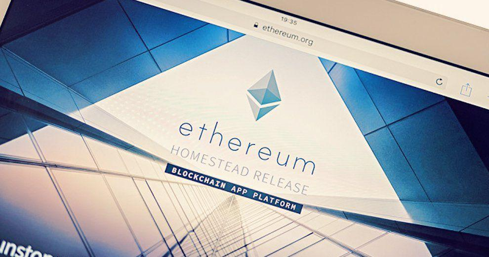

The ERC20 standard represents a pivotal protocol within the Ethereum blockchain ecosystem. This set of norms governs the creation and management of fungible tokens, facilitating seamless interaction and exchange across diverse applications built on the Ethereum network. Introduced in November 2015, ERC20 has become foundational to the proliferation of decentralized applications (dApps) and smart contracts, offering a standardized framework that ensures compatibility and interoperability. Its significance lies in enabling developers to create tokens that adhere to a consistent format, thereby streamlining the process of token exchange and integration within the broader blockchain infrastructure.

Cryptocurrency algorithmic trading, or algo trading, leverages computer programs to execute trades at speeds and frequencies impractical for human traders. By using pre-defined instructions, these algorithms analyze market data, evaluate trading opportunities, and execute orders with minimal human intervention. In modern finance, algo trading is instrumental in enhancing market efficiency and liquidity. It allows traders to capitalize on microsecond price fluctuations, ultimately smoothing the volatility that characterizes cryptocurrency markets.



The synergy between ERC20 tokens and algorithmic trading is anchored in their mutual capacity to revolutionize cryptocurrency markets. ERC20 tokens, with their uniform properties and blockchain-based transparency, offer a fertile ground for algorithmic strategies. This compatibility facilitates the integration of ERC20 tokens into trading algorithms, thus improving liquidity and enabling more sophisticated trading strategies. Additionally, the automated nature of smart contracts underpins these processes, further reducing latency and manual intervention in trading activities.

This article aims to explore the intricate relationship between ERC20 standards and algorithmic trading. It seeks to provide insights into how these two innovations interact, the benefits they confer when combined, and the challenges they present. Readers will gain an understanding of the role that ERC20 tokens play in the evolution of algorithmic trading, the advantages and potential hurdles in their integration, and future prospects for this dynamic intersection within the blockchain and financial sectors.

## Table of Contents

## Understanding ERC20 Standards

ERC20 tokens are a type of digital asset that adhere to a specific set of rules and standards on the Ethereum blockchain. Introduced in 2015, ERC20 stands for "Ethereum Request for Comment 20," which is part of the Ethereum Improvement Proposal system. This standard was created to ensure that new tokens function predictably and can be interacted with using known interfaces, promoting reliability and interoperability across different platforms and applications within the Ethereum ecosystem.

The ERC20 standard defines six mandatory functions and three optional ones that a smart contract must implement. The six essential functions are:

1. **totalSupply**: Returns the total token supply available.
2. **balanceOf**: Provides the token balance for a specific address.
3. **transfer**: Allows the transfer of a specified number of tokens to a particular address.
4. **transferFrom**: Enables tokens to be transferred from one address to another.
5. **approve**: Authorizes a spender to withdraw a certain number of tokens on behalf of an owner.
6. **allowance**: Returns the remaining number of tokens that a spender can withdraw from an owner’s account.

These functions ensure that any ERC20 token operates consistently, providing developers with a universal approach to token implementation and interaction. 

Interoperability is one of the primary roles of ERC20 tokens. They enable Ethereum-based applications, including decentralized exchanges (DEX) and wallets, to interact seamlessly with various tokens because they share a common interface. This feature significantly reduces the complexity for developers and users, facilitating interactions across a wide range of decentralized applications (dApps) without the need for custom integration solutions for each new token type.

ERC20 tokens offer several key benefits, notably developer ease and widespread adoption. The standardization provided by ERC20 simplifies the development process, as developers can rely on a known framework and set of rules to create and manage tokens. This reliability speeds up the development lifecycle, reducing time to market. Additionally, the widespread adoption of ERC20 tokens provides a high degree of market [liquidity](/wiki/liquidity-risk-premium) and accessibility, making them a popular choice for initial coin offerings (ICOs) and other blockchain-based fundraising activities.

Some of the most well-known cryptocurrencies utilizing the ERC20 standard include Chainlink (LINK), Tether (USDT), and USD Coin (USDC). These tokens illustrate the ERC20 standard's versatility and broad acceptance, demonstrating its capability to support various financial and utility applications on the Ethereum network.

## Basics of Cryptocurrency Algorithmic Trading

Algorithmic trading, often referred to as algo trading, is a method of executing orders using automated and pre-programmed trading instructions. These instructions facilitate the execution of trades at optimal times, aiming to leverage speed and computational efficiency beyond human capabilities. In the [cryptocurrency](/wiki/cryptocurrency) market, algo trading plays a significant role given the highly volatile and 24/7 nature of the space.

### Advantages of Algorithmic Trading

The primary benefits of [algorithmic trading](/wiki/algorithmic-trading) include speed, accuracy, and the capacity to handle extensive data sets. Algo trading is executed at a speed and frequency that is unattainable for human traders. This is particularly crucial in the fast-paced cryptocurrency market where price shifts occur rapidly. Algorithms minimize latency, executing trades in milliseconds, which is critical for capturing favorable pricing.

Accuracy is another significant advantage, as algorithms execute trades with precision according to predefined criteria, significantly reducing the margin for human error. Additionally, algo trading systems can analyze large volumes of data rapidly, offering insights that form the basis for actionable trading strategies.

### Algorithmic Trading Strategies

Several strategies are commonly employed in cryptocurrency algo trading:

1. **Market Making**: This involves placing both buy and sell orders for a digital asset to capture the bid-ask spread. This strategy provides liquidity to the market while aiming to profit from the spread.

2. **Arbitrage**: This strategy seeks to exploit price discrepancies of the same asset across different markets or trading platforms. Algorithms are particularly suited for this strategy due to their ability to rapidly execute trades across multiple exchanges.

3. **Trend Following**: This technique involves identifying and capitalizing on trends in asset prices. Algorithms monitor price movements and trade in accordance with upward or downward trends, often using indicators like moving averages.

4. **Statistical Arbitrage**: This strategy uses mathematical models to identify and trade on statistical mispricings between assets. It requires significant computational power and real-time data analysis to identify short-term imbalances.

### Importance of Data-Driven Decision-Making

Data is the cornerstone of effective algo trading. Algorithms rely on historical and real-time data to make informed decisions. By analyzing market trends, trading volumes, and other relevant metrics, algorithms can predict future movements with a certain degree of reliability. This data-driven approach enables traders to backtest and optimize strategies, adjusting them as market conditions evolve.

### Tools and Platforms

Several tools and platforms support cryptocurrency algorithmic trading:

- **Python Libraries**: Libraries such as NumPy, pandas, and Scikit-learn support data analysis and machine learning applications in developing and refining trading algorithms.

- **Trading Bots**: Automated software like 3Commas and HaasOnline offer user-friendly interfaces for setting up and executing trading algorithms without requiring extensive programming knowledge.

- **Exchanges APIs**: Exchanges like Binance and Coinbase provide APIs that allow traders to write custom scripts for trading, offering access to market data and ability to execute trades programmatically.

In conclusion, cryptocurrency algorithmic trading is defined by its ability to leverage technology for executing trades at speeds and efficiencies beyond human capability. The strategies used vary from simple [market making](/wiki/market-making) to complex statistical [arbitrage](/wiki/arbitrage), all requiring robust data-driven analysis empowered by advanced computing tools and platforms.

## The Intersection of ERC20 Tokens and Algo Trading

The standardization of ERC20 tokens is a pivotal element in integrating these digital assets into algorithmic trading systems. By establishing a uniform protocol for tokens on the Ethereum blockchain, the ERC20 standard offers a consistent interface for token interaction. This consistency greatly simplifies the development of algorithms designed to trade these assets, as developers do not need to tailor their systems for each token's unique properties. Instead, they can operate with a generalized framework, reducing complexity and deployment time.

Furthermore, ERC20 tokens can significantly enhance the liquidity of algorithmically traded portfolios. Increased liquidity is achieved through the ability of these tokens to be exchanged seamlessly across various decentralized exchanges (DEXs) and platforms that support the ERC20 standard. This broad market access ensures that trading algorithms can execute buy and sell orders efficiently, avoiding slippage and achieving optimal pricing for trades.

The integration of smart contracts within trading strategies involving ERC20 tokens allows for the automation of trading processes. Smart contracts enable the execution of pre-defined conditions, such as buy or sell triggers based on price movements or [volume](/wiki/volume-trading-strategy) changes. These contracts eliminate the need for manual intervention, increase execution speed, and reduce the risk of human error in trading activities. Here is a simple example of a Python code snippet that might represent a basic trading strategy leveraging the abilities of ERC20 smart contracts:

```python
from web3 import Web3

# Connect to Ethereum network
w3 = Web3(Web3.HTTPProvider('https://mainnet.infura.io/v3/YOUR_INFURA_PROJECT_ID'))

# Define the smart contract address and ABI
contract_address = '0xYourERC20TokenAddress'
abi = [...]  # Provide ERC20 contract ABI here

# Create contract instance
contract = w3.eth.contract(address=contract_address, abi=abi)

# Function to check balance and perform trading action
def check_and_trade(account, threshold):
    balance = contract.functions.balanceOf(account).call()
    if balance > threshold:
        # Execute trading logic or smart contract function
        print(f"Balance is above {threshold}, executing trade")

# Example usage
check_and_trade('0xYourAccountAddress', 1000)
```

Case studies of successful algorithmic trading using ERC20 tokens highlight various benefits. For instance, platforms like Uniswap have demonstrated how liquidity pools using ERC20 tokens can facilitate decentralized trading strategies. Such systems allow users to participate in liquidity provision, with algorithms automatically balancing token reserves to maintain consistent price ratios.

Despite these advantages, the integration of ERC20 tokens into algorithmic trading is not without challenges. One major limitation is the inherent [volatility](/wiki/volatility-trading-strategies) of the cryptocurrency market, which can lead to rapid changes in token value and liquidity, posing risks to algorithmic strategies. Additionally, while Ethereum's network provides a robust infrastructure, congestion and high gas fees can hinder real-time trading activities, affecting the performance of trading algorithms. Another potential challenge arises from security concerns associated with smart contract vulnerabilities, which may be exploited if not carefully audited.

To mitigate these challenges, robust risk management practices, including portfolio diversification and continuous monitoring of trading environments, are essential. Technological advancements, such as Layer 2 solutions and improved smart contract security measures, also offer pathways to overcoming current limitations, ensuring that the integration of ERC20 tokens and algorithmic trading continues to evolve and provide substantial benefits to the cryptocurrency trading ecosystem.

## Benefits of Combining ERC20 Standards with Algorithmic Trading

The integration of ERC20 standards with algorithmic trading offers a plethora of benefits, making trading more efficient and strategic. ERC20 standards, a set of protocols for smart contracts on the Ethereum blockchain, streamline algorithm development by ensuring a uniform set of rules for token transactions. This uniformity reduces the complexity encountered by developers when integrating various tokens into their trading algorithms, as they can rely on consistent behavior across ERC20 tokens. The standardized functions, such as `transfer`, `approve`, and `transferFrom`, simplify the development and execution of algorithms by abstracting token interactions.

Algorithmic trading performance is notably enhanced through the reduction of manual intervention. The automation offered by ERC20 tokens leads to faster trade execution, reduced error rates, and the ability to capitalize on fleeting market opportunities that are often missed with manual trading. Algorithms can execute trades based on pre-set criteria without waiting for human input, thereby improving speed and precision.

Moreover, ERC20 standards contribute to a decrease in transaction costs. By automating token transactions, algorithms reduce the need for intermediaries, limiting transaction fees that accumulate with each trade. Smart contracts facilitate peer-to-peer transactions, eradicating the need for third-party oversight and leveraging blockchain's immutable ledger for efficiency.

The risk management capabilities inherent in smart contracts further bolster ERC20 token algorithmic trading. These contracts enforce rules and execute predefined actions when certain conditions are met, minimizing the risk of human error and ensuring trade consistency. This deterministic nature allows for the implementation of strategies such as stop-loss orders directly into the smart contracts, enhancing risk mitigation tactics.

Market efficiency and transparency are significantly impacted by the synergy between ERC20 tokens and algorithmic trading. With all transactions recorded on the Ethereum blockchain, there is an immutable and transparent record available for audit at any time, fostering trust among market participants. The transparency reduces information asymmetry, contributing to fairer pricing and improved liquidity. These factors collectively attract more participants, which in turn enhances market depth and stability.

In conclusion, the combination of ERC20 standards with algorithmic trading leverages the strengths of both technologies, leading to streamlined processes, enhanced performance, reduced costs, superior risk management, and improved market transparency. These benefits underscore the transformative potential of integrating standardized blockchain protocols with advanced trading strategies.

## Challenges and Considerations

Integrating ERC20 tokens with algorithmic trading systems presents a range of challenges that both developers and traders must navigate. 

**Technical Challenges**: The integration of ERC20 tokens introduces complexities primarily due to their reliance on the Ethereum blockchain's smart contract framework. While the ERC20 token standard ensures uniformity, individual tokens often have unique implementations that can result in inconsistencies. These discrepancies demand careful coding and testing to prevent interruptions or errors in trading algorithms.

**Regulatory and Compliance Issues**: Automated trading involving ERC20 tokens faces significant regulatory scrutiny. Different jurisdictions impose varying levels of oversight, and failure to comply can result in legal repercussions. The uncertain and evolving regulatory landscape necessitates constant vigilance and adaptation by market participants. Notably, the decentralized nature of cryptocurrencies complicates traditional regulatory approaches, creating grey areas around jurisdiction and enforcement.

**Security Concerns**: Security vulnerabilities in smart contracts pose risks such as exploitation and unauthorized access. Even minimal errors in contract code can be exploited, potentially leading to significant financial losses. Market manipulation remains a threat as well, especially in less liquid markets where price fluctuations can be artificially induced. Smart contract audits and implementing rigorous security protocols are essential to mitigate these risks.

**Market Volatility**: The inherent volatility of cryptocurrency markets affects algorithmic trading strategies. Sudden price swings can lead to significant losses if algorithms are not designed to handle such dynamics. This high volatility necessitates the development of robust risk management systems within trading algorithms.

**Mitigation Strategies**: To address these challenges, diversification becomes crucial. By diversifying portfolios, traders can reduce the impact of adverse movements in any single token or market. Technological advancements, such as the integration of machine learning techniques, can enhance the adaptability and efficiency of trading algorithms. These technologies can analyze large datasets and detect patterns indicative of market movements, thus improving decision-making processes.

Overall, while the integration of ERC20 tokens into algorithmic trading systems offers numerous advantages, it requires careful handling of various challenges. Addressing technical, regulatory, security, and market volatility concerns is critical for achieving sustainable and profitable trading outcomes.

## Future Prospects and Innovations

Emerging trends in ERC20 token developments point towards several important changes that could significantly impact algorithmic trading (algo trading). Firstly, the proliferation of ERC20 tokens tailored for specific use cases in DeFi (Decentralized Finance) is opening new opportunities for traders to diversify their portfolios and enhance liquidity. Innovations such as the ERC20 Token Wrapper, which allows tokens to be used across various DeFi protocols, are ensuring that these assets remain integral to future trading strategies. Moreover, updates to the ERC20 standard itself, such as the incorporation of features for increased privacy and scalability, have the potential to alter the landscape of crypto-based algorithmic trading by introducing tokens that are more secure and efficient to trade.

The integration of [machine learning](/wiki/machine-learning) (ML) and Artificial Intelligence (AI) in algorithmic trading strategies involving ERC20 tokens is expected to advance the field significantly. These technologies offer enhanced predictive capabilities and the ability to process large volumes of data to identify trading opportunities that may not be apparent to human traders. For example, machine learning techniques can be employed to analyze historical price data of ERC20 tokens, identifying trends and patterns that inform trading decisions. In a basic Python ML model, one might employ libraries such as `pandas` and `scikit-learn` to preprocess data and implement predictive models, respectively. Here's a simplified example:

```python
import pandas as pd
from sklearn.model_selection import train_test_split
from sklearn.linear_model import LinearRegression

# Load dataset
data = pd.read_csv('erc20_prices.csv')

# Preprocess data
X = data[['feature1', 'feature2', 'feature3']]
y = data['price']

# Split data for training and testing
X_train, X_test, y_train, y_test = train_test_split(X, y, test_size=0.2, random_state=42)

# Train model
model = LinearRegression()
model.fit(X_train, y_train)

# Predict future prices
predictions = model.predict(X_test)
```

Regulatory changes loom as a significant [factor](/wiki/factor-investing) influencing both ERC20 tokens and cryptocurrency trading broadly. Governments and regulatory bodies worldwide are keenly interested in classifying and controlling the use of cryptocurrencies, including ERC20 tokens. Potential changes could mandate stricter compliance and reporting standards, which might affect how algorithmic trading strategies are developed and executed. This could include the introduction of Know Your Customer (KYC) and anti-money laundering (AML) regulations specific to crypto assets, influencing the design of future algo trading systems.

Decentralized finance innovations that incorporate ERC20 tokens, such as automated market makers (AMMs) and yield farming, are redefining the traditional concepts of asset trading and liquidity provision. By utilizing smart contracts, these mechanisms reduce the need for intermediaries, lowering transaction costs and increasing market participation. Algo traders benefit from these innovations by leveraging automated strategies to perform arbitrage, liquidity provision, and other advanced trading functions.

Predicting the future evolution of ERC20 standards and algo trading suggests a convergence towards more sophisticated and automated trading environments. Future developments might include more robust protocol standards that provide enhanced scalability and cross-chain operability, necessary for the increasing demands of algorithmic trading ecosystems. As DeFi continues to grow, it is feasible that new ERC20-based financial products will emerge, enabling traders to utilize advanced algorithmic strategies within decentralized environments. This could lead to the creation of fully automated, AI-driven trading ecosystems that operate continuously, requiring minimal human intervention.

In conclusion, the union of ERC20 tokens and algorithmic trading presents a fertile ground for innovation in the cryptocurrency space, driven by technological advancements and regulatory shifts. The continuous refinement of these standards and tools will likely lead to more efficient, secure, and transparent trading systems in the future.

## Conclusion

The exploration of ERC20 standards and algorithmic trading illuminates the dynamic potential each holds in the blockchain and cryptocurrency environment. ERC20 tokens have become a pivotal element in the Ethereum ecosystem by providing a standardized protocol that ensures interoperability, ease of development, and widespread adoption. When combined with the capabilities of algorithmic trading, ERC20 tokens significantly enhance trading efficiencies through speed, accuracy, and automated data processing.

The merging of ERC20 standards with algorithmic trading strategies presents substantial benefits. These include streamlined algorithm development and execution, improved trading performance due to diminished manual intervention, and decreased transaction costs facilitated by the efficient handling of ERC20 processes. Smart contracts further empower traders by providing robust risk management capabilities, leading to enhanced market transparency and efficiency.

However, the integration of these technologies is not without challenges. Technical complications, regulatory uncertainties, security vulnerabilities, and market volatility are considerable hurdles that necessitate careful consideration and strategic mitigation. As such, it is crucial for practitioners and enthusiasts to remain informed of industry trends and advancements.

Looking ahead, the evolution of blockchain technology and finance is likely to be shaped by further innovations intersecting with algorithmic strategies and ERC20 standards. Emerging trends in decentralized finance (DeFi), coupled with potential advancements in machine learning and AI, promise to propel the sophistication of trading algorithms. While regulatory frameworks may evolve, fostering an environment of compliance and security, the opportunities within this space are poised for substantial growth and transformation.

By embracing the convergence of ERC20 standards and algorithmic trading, market participants can unlock new efficiencies and innovations, further solidifying the integral role of blockchain technology in the future of finance.

## References & Further Reading

[1]: "ERC20 Token Standard." (2017). Ethereum.org. [Link](https://ethereum.org/en/developers/docs/standards/tokens/erc-20/)

[2]: Gjermundrød, H., Dionysiou, I., & Costa, R. (2021). ["A Survey on Smart Contract Development: Approaches and Tools"](https://www.sciencedirect.com/science/article/pii/S2666389920302439). IEEE Access.

[3]: Lopez de Prado, M. (2018). ["Advances in Financial Machine Learning."](https://www.amazon.com/Advances-Financial-Machine-Learning-Marcos/dp/1119482089) Wiley.

[4]: Jansen, S. (2020). ["Machine Learning for Algorithmic Trading."](https://github.com/stefan-jansen/machine-learning-for-trading) Packt Publishing.

[5]: Nakamoto, S. (2008). ["Bitcoin: A Peer-to-Peer Electronic Cash System."](https://nakamotoinstitute.org/library/bitcoin/) Bitcoin.org.

[6]: Chan, E. P. (2013). ["Algorithmic Trading: Winning Strategies and Their Rationale."](https://github.com/ftvision/quant_trading_echan_book) Wiley.

[7]: "Decentralized Finance (DeFi): Transforming trade finance in the world of digital currencies?" (2020). World Economic Forum. [Link](https://www.weforum.org/publications/decentralized-finance-defi-policy-maker-toolkit/)

[8]: Petropoulos, A., Drakos, K., & Papathanasiou, A. (2018). ["Cryptocurrency Trading: A Comprehensive Survey on Blockchain Trades and Exchanges."](https://aisel.aisnet.org/cgi/viewcontent.cgi?article=1040&context=amcis2018) Association for Information Systems.