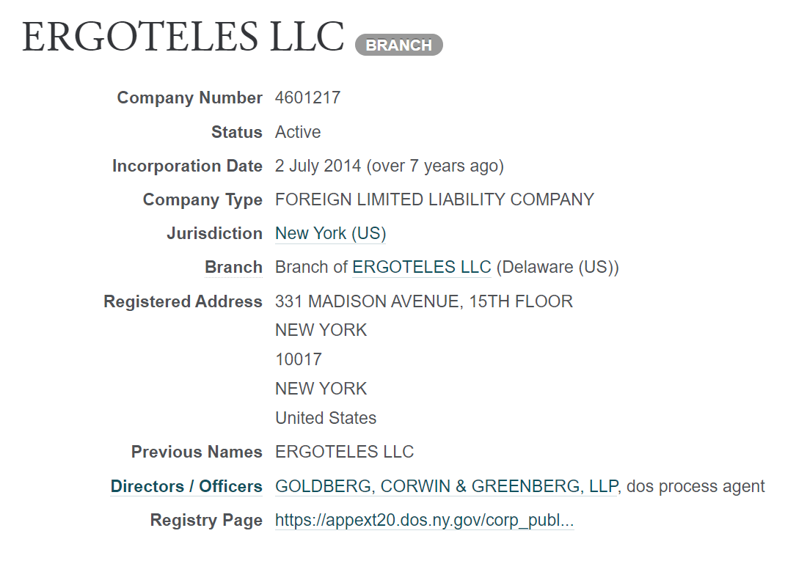

Ergoteles Capital is recognized as a leading firm in algorithmic trading, renowned for its innovative strategies and advanced technological infrastructure. The firm's approach to trading leverages cutting-edge technology, enabling it to execute trades with precision and speed, setting it apart in the highly competitive landscape of financial markets. Algorithmic trading, which is central to Ergoteles Capital's operations, involves the use of sophisticated computer algorithms to make trading decisions based on predefined criteria without human intervention. This methodology not only optimizes trading efficiency but also significantly enhances the firm's ability to capitalize on fleeting market opportunities.

Throughout this article, we aim to explore the unique attributes that contribute to Ergoteles Capital's status as a pioneering firm in algorithmic trading. We will discuss the history of the firm, charting its rise from a promising startup to a dominant force in the international financial arena. The article will also outline the various trading strategies employed by Ergoteles Capital, each tailored to navigate different market conditions effectively. Readers will gain an understanding of both the benefits and challenges inherent in algorithmic trading as it is practiced by the firm, offering a comprehensive view of its influence on financial market dynamics.



For those involved in the financial sector—whether as investors, traders, or curious observers—this article promises to deliver valuable insights. It aims to shed light on the sophisticated mechanisms Ergoteles Capital employs to maintain its competitive edge and the potential implications of its trading activities on market efficiency and liquidity. By the end of this article, readers will have a deeper appreciation of how Ergoteles Capital has harnessed technology to revolutionize trading practices and shape the future of finance.

## Table of Contents

## The History of Ergoteles Capital

Ergoteles Capital was founded with a visionary goal: to fundamentally alter the landscape of financial trading through the integration of technology and algorithmic strategies. The firm began as a nascent startup, comprising a small team of quantitative analysts and computer scientists who believed in the potential of algorithms to outperform traditional human-centric trading methods. 

The early years of Ergoteles Capital were devoted to the research and development of proprietary trading algorithms. These initial algorithms were designed to process vast datasets, perform complex calculations, and execute trades at speeds and efficiencies previously unimaginable. A key milestone in the company's evolution was the successful implementation of these early algorithms, which demonstrated their efficacy and reliability in real-world trading environments.

Over time, Ergoteles Capital expanded its operations and influence, becoming a formidable entity in the global financial markets. The firm's commitment to innovation and technological advancement has been a constant throughout its history. This dedication is evident in the significant investments made in technology infrastructure, data analysis tools, and an expert team capable of continually refining and enhancing its trading models.

Ergoteles Capital's growth trajectory can be seen as a series of adaptations to the ever-changing conditions of the financial markets. This adaptability has been critical to staying ahead in an industry characterized by rapid technological advancements and fluctuating market dynamics. By consistently leveraging cutting-edge technology, the firm has maintained its competitive edge, allowing it to capitalize on new opportunities and navigate challenges effectively.

Understanding the roots of Ergoteles Capital provides essential context for its current position within the trading ecosystem. The firm's history is not just a chronicle of growth but a testament to the transformative impact of technology in finance. This blend of innovation, strategic foresight, and adaptability continues to underpin Ergoteles Capital's strong presence and influential role in the markets today.

## How Algorithmic Trading Works at Ergoteles Capital

Algorithmic trading is a process where computer programs execute trades automatically once specific criteria or market conditions are met. At Ergoteles Capital, [algorithmic trading](/wiki/algorithmic-trading) is a cornerstone of its business model, facilitated by cutting-edge technology that ensures rapid and efficient execution.

### State-of-the-Art Technology

Ergoteles Capital leverages advanced computational technologies to maintain a competitive edge. The company employs high-performance computing (HPC) systems capable of processing large datasets at lightning speed. This infrastructure allows Ergoteles Capital to handle multiple transactions simultaneously, ensuring that they capitalize on fleeting market opportunities effectively.

### Real-Time Data Analysis

The algorithms at Ergoteles Capital are crafted to process vast quantities of market data, pinpointing trading opportunities in real time. This requires sophisticated data analytics tools that can dissect data streams to identify patterns, trends, and anomalies. The speed and accuracy of these algorithms are pivotal, given how competitive financial markets can be.

For instance, in a simplified Python example, the firm might use libraries such as NumPy and pandas to handle and analyze time-series data:

```python
import numpy as np
import pandas as pd

# Simulated market data
data = pd.DataFrame({
    'price': np.random.rand(1000),  # Simulated prices
})

# Example algorithm: Moving average crossover
data['short_mavg'] = data['price'].rolling(window=40).mean()
data['long_mavg'] = data['price'].rolling(window=100).mean()
data['signal'] = np.where(data['short_mavg'] > data['long_mavg'], 1, 0)
```

### Continuous Refinement

To stay ahead in the market, Ergoteles Capital engages in the ongoing refinement of its algorithms, which involves constant testing and optimization. Machine learning techniques may be applied to improve predictive accuracy, while [backtesting](/wiki/backtesting) on historical data helps to evaluate algorithm performance under different market conditions.

A simple [machine learning](/wiki/machine-learning) model, like a Random Forest classifier, could be employed to refine trading decisions:

```python
from sklearn.ensemble import RandomForestClassifier

# Features: short and long moving averages
X = data[['short_mavg', 'long_mavg']].dropna()
y = data['signal'].dropna()

# Train Random Forest
model = RandomForestClassifier()
model.fit(X, y)
```

### Technological Infrastructure

The technological framework supporting Ergoteles Capital's trading activities consists of several essential components. First, there is a robust data acquisition system that streams financial data from various sources. Next, a sophisticated data processing system ensures that incoming data is promptly cleaned and structured for analysis. An execution engine then uses the refined data to automatically initiate trades based on algorithm output.

Overall, Ergoteles Capital's prowess in algorithmic trading is rooted in its robust technological infrastructure and sophisticated analytical capabilities, ensuring it remains at the forefront of the financial trading industry.

## Key Strategies of Ergoteles Capital

Ergoteles Capital employs a range of sophisticated trading strategies, each tailored to capitalize on different market conditions. Among these, high-frequency trading ([HFT](/wiki/high-frequency-trading-strategies)) stands out as a crucial component of the firm's approach. HFT involves the use of powerful computer algorithms to conduct a large number of trades at extremely high speeds, often in fractions of a second. This strategy is driven by the necessity to capitalize on small price discrepancies that exist only momentarily in the market. The rapid execution of these trades is facilitated by cutting-edge technology that minimizes latency and maximizes processing speed.

Arbitrage is another key strategy utilized by Ergoteles Capital. This involves the simultaneous purchase and sale of the same asset in different markets to exploit price differences. For example, if a stock is undervalued in one market and overvalued in another, the firm may simultaneously buy and sell the stock to capture the difference as profit. This strategy requires the continuous monitoring of market prices and the ability to execute trades quickly and efficiently.

Market making is also an integral part of Ergoteles Capital's strategy portfolio. In this role, the firm provides [liquidity](/wiki/liquidity-risk-premium) to the market by continuously quoting buy and sell prices for a particular asset. By doing so, Ergoteles Capital facilitates smoother trading and earns profits from the spread between the bid and ask prices. This strategy not only enhances market liquidity but also stabilizes trading environments by providing consistent price options to buyers and sellers.

The successful execution of these trading strategies relies on a robust technological infrastructure and complex algorithms. These algorithms must process vast amounts of market data in real time and make rapid decisions based on pre-defined criteria. For instance, an algorithm might be programmed to trigger a trade if specific parameters, such as price shifts or [volume](/wiki/volume-trading-strategy) thresholds, are met.

Here is an example Python snippet illustrating a basic [arbitrage](/wiki/arbitrage) detection algorithm:

```python
def detect_arbitrage(prices_market1, prices_market2, threshold=0.01):
    arbitrage_opportunities = []
    for asset, price1 in prices_market1.items():
        price2 = prices_market2.get(asset)
        if price2:
            price_diff = abs(price1 - price2)
            if price_diff / ((price1 + price2) / 2) > threshold:
                arbitrage_opportunities.append(asset)
    return arbitrage_opportunities

# Example usage
market1_prices = {'AAPL': 150.0, 'GOOGL': 2750.0}
market2_prices = {'AAPL': 151.5, 'GOOGL': 2749.0}
print(detect_arbitrage(market1_prices, market2_prices))
```

The firm's capability to seamlessly switch between different strategies depending on market conditions is a key [factor](/wiki/factor-investing) in its resilience and adaptability. This flexibility ensures that Ergoteles Capital can effectively navigate volatile market environments, enhancing its ability to sustain profitability and maintain competitive advantage. The combination of these strategies has not only contributed to the firm's reputation but also its success as a leader in algorithmic trading.

## Impact on Financial Markets

Ergoteles Capital's activities notably influence the liquidity and efficiency of financial markets, driven by their extensive use of algorithmic trading. The firm's high trading volumes and rapid execution capabilities frequently lead to tighter spreads, a condition that indicates the difference between bid and ask prices is minimal. This generally results in improved market conditions, as it enhances price discovery and allows traders to execute large transactions with minimal impact on the market price.

The practice of algorithmic trading involves using complex mathematical models and automated systems to trade securities at high speed. Ergoteles Capital's algorithms are designed to process massive amounts of data in real time, identifying patterns and executing trades with precision and speed. This capability often provides significant liquidity to markets, allowing for more seamless transactions. Liquidity is a critical factor in financial markets as it ensures that buyers and sellers can transact without causing significant changes in the asset's price.

However, the extensive use of algorithmic trading by firms like Ergoteles Capital has occasionally raised concerns about potential market disruptions. High-frequency trading (HFT), a subset of algorithmic trading employed by the firm, can contribute to phenomena such as 'flash crashes', where rapid selling leads to a steep, albeit temporary, drop in asset prices. These events highlight the risk of potential instability that can arise from algorithmically-driven market activities.

Balancing technological advancements with ethical considerations and regulatory compliance is crucial to ensuring that algorithmic trading contributes positively to market dynamics. Regulatory bodies continuously assess the impact of HFT on market integrity and have implemented measures to mitigate risks, such as imposing circuit breakers or minimum resting times for orders. These regulations aim to prevent the exacerbation of market [volatility](/wiki/volatility-trading-strategies) and promote fair trading practices.

Thus, while Ergoteles Capital's algorithmic trading strategies can improve market liquidity and efficiency, they must be carefully managed to avoid adverse effects on market stability. The firm’s commitment to ethical trading practices and adherence to regulatory standards is paramount in maintaining the delicate balance between benefiting from technological innovations and preserving market order.

## The Future of Ergoteles Capital and Algorithmic Trading

Ergoteles Capital's trajectory is defined by its proactive approach to embracing emerging technologies such as [artificial intelligence](/wiki/ai-artificial-intelligence) (AI) and machine learning. These technologies are pivotal in enhancing the firm's algorithmic trading strategies, enabling more sophisticated analysis of market patterns and predictive modeling. By utilizing AI, Ergoteles Capital can parse complex datasets at unprecedented speeds, identifying profitable trading opportunities that were previously unattainable with traditional analytic methods.

The firm's adaptive strategies are vital as the global financial markets become increasingly dynamic. High volatility, geopolitical tensions, and economic shifts necessitate agile algorithmic models capable of rapid adaptation. Ergoteles Capital invests significantly in research and development to fine-tune its algorithms and maintain a competitive edge. This focus ensures resilience in the face of evolving market structures, providing stability and profitability regardless of external pressures.

Regulatory developments pose both challenges and opportunities for Ergoteles Capital. The introduction of regulations, such as the Markets in Financial Instruments Directive II (MiFID II) in Europe, requires algorithmic trading firms to adhere to strict guidelines regarding transparency, risk controls, and market behavior. Ergoteles Capital is committed to maintaining compliance with these regulations, leveraging its internal regulatory technology solutions to monitor adherence and modify strategies as necessary.

The finance industry's digital transformation broadens both prospects and hurdles. Technologies like distributed ledger technology (DLT) and quantum computing could redefine trading paradigms, with distributed ledgers offering more secure and transparent transactions, while quantum computing presents an avenue for exponential increases in data processing capabilities. Ergoteles Capital's ongoing exploration of these technologies ensures its readiness to integrate them into its trading framework, thereby securing its foothold in future markets.

Looking forward, trends such as decentralized finance (DeFi) and increased reliance on digital currencies hint at potential directions for Ergoteles Capital. The firm's current initiatives in blockchain research position it well to capitalize on these emerging financial instruments. By staying at the forefront of technological advancements and regulatory changes, Ergoteles Capital is poised to not only sustain its leadership in algorithmic trading but also to influence the future direction of the industry.

## Conclusion

Ergoteles Capital exemplifies the transformative impact of technology in financial markets. Leveraging state-of-the-art algorithms and strategic insights, the firm has established a notable presence in the competitive trading landscape. Through consistent refinement and adaptation of its trading strategies, Ergoteles Capital adeptly navigates the complexities and volatilities of global markets. This commitment to innovation and excellence is pivotal to its enduring success.

The journey of Ergoteles Capital offers valuable lessons for traders and financial organizations. By embracing technological advancements, the firm not only enhances its operational efficiency but also contributes to greater market liquidity and pricing efficiency. However, it also encounters challenges related to market dynamics and regulatory environments, emphasizing the importance of balancing technological progress with ethical considerations and compliance standards.

As algorithmic trading evolves, Ergoteles Capital is well-positioned to continue shaping the future of finance. With a forward-looking approach, the firm is poised to integrate emerging technologies, such as artificial intelligence and machine learning, further enhancing its competitive edge. This strategic foresight ensures that Ergoteles Capital remains at the forefront of financial innovation, leading the charge in the digital transformation of trading practices.

## References & Further Reading

[1]: Aldridge, I. (2013). ["High-Frequency Trading: A Practical Guide to Algorithmic Strategies and Trading Systems"](https://www.amazon.com/High-Frequency-Trading-Practical-Algorithmic-Strategies/dp/1118343506) (2nd ed.). Wiley.

[2]: Lopez de Prado, M. (2018). ["Advances in Financial Machine Learning"](https://www.amazon.com/Advances-Financial-Machine-Learning-Marcos/dp/1119482089). Wiley.

[3]: Chan, E. P. (2008). ["Quantitative Trading: How to Build Your Own Algorithmic Trading Business"](https://github.com/ftvision/quant_trading_echan_book). Wiley.

[4]: Jansen, S. (2020). ["Machine Learning for Algorithmic Trading"](https://github.com/stefan-jansen/machine-learning-for-trading). Packt Publishing.

[5]: Hull, J. C. (2021). ["Options, Futures, and Other Derivatives"](https://elibrary.pearson.de/book/99.150005/9781292410623) (10th ed.). Pearson Education.

[6]: Kissell, R. (2014). ["The Science of Algorithmic Trading and Portfolio Management"](https://www.sciencedirect.com/book/9780124016897/the-science-of-algorithmic-trading-and-portfolio-management). Academic Press.

[7]: Aronson, D. R. (2007). ["Evidence-Based Technical Analysis: Applying the Scientific Method and Statistical Inference to Trading Signals"](https://onlinelibrary.wiley.com/doi/book/10.1002/9781118268315). Wiley.

[8]: Narang, R. K. (2013). ["Inside the Black Box: A Simple Guide to Quantitative and High Frequency Trading"](https://onlinelibrary.wiley.com/doi/book/10.1002/9781118662717) (2nd ed.). Wiley.