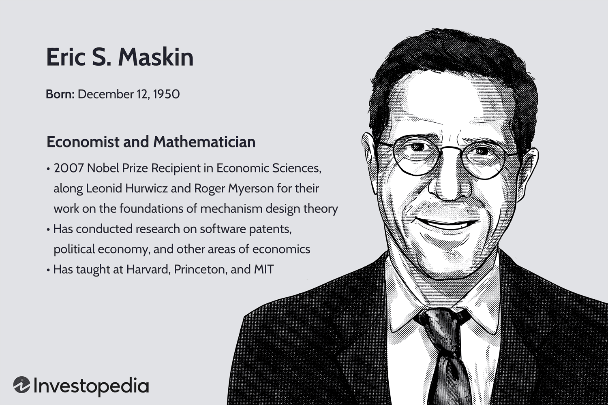

## Table of Contents

## Who is Eric S. Maskin?

Eric S. Maskin is an economist who won the Nobel Prize in Economics in 2007. He was born in New York City in 1950. Maskin is famous for his work on mechanism design theory. This theory helps understand how to design rules and systems so that people will act in ways that are good for everyone.

Maskin has worked at many important places. He taught at Harvard University for a long time and is now a professor at the Institute for Advanced Study in Princeton. He has written many books and papers on economics. His work has helped governments and businesses make better decisions.

## What is Eric S. Maskin's current position at Harvard University?

Eric S. Maskin is no longer at Harvard University. He used to teach there for many years but now he works somewhere else.

He is currently a professor at the Institute for Advanced Study in Princeton. This is where he spends his time teaching and doing research on economics.

## What is the field of study that Eric S. Maskin specializes in?

Eric S. Maskin specializes in the field of economics, particularly in mechanism design theory. This theory is all about creating rules and systems that make people act in ways that are good for everyone. It's like figuring out how to set up games where everyone wins if they follow the rules.

Maskin's work in mechanism design has helped many people, including governments and businesses, to make better decisions. By understanding how to design these systems, they can make sure that things like auctions and voting systems work fairly and efficiently. His research has had a big impact on how we think about economic systems and how they can be improved.

## What are some of the key contributions Eric S. Maskin has made to economics?

Eric S. Maskin has made big contributions to economics, especially in mechanism design theory. This is about making rules so that people will act in ways that help everyone. One of his important ideas is about how to make auctions work better. Auctions are like games where people bid on things, and Maskin showed how to set them up so they are fair and efficient. His work helps governments and companies sell things in a way that gets the best price and keeps things honest.

Another key contribution is in the area of voting systems. Maskin helped figure out how to design voting rules so that they give fair results. He showed that some voting methods can be better than others because they make sure everyone's voice is heard and the outcome is what most people want. This is important for democracies because it helps make sure elections are fair and reflect what people really think.

Maskin's work also touches on other areas like patent policy and how to encourage innovation. He has ideas on how to set up rules so that people will come up with new inventions and share them with others. His research shows how to balance giving inventors rewards for their work while still making sure new ideas are used to help everyone. Overall, Maskin's contributions have made economics better at solving real-world problems.

## What awards has Eric S. Maskin received during his career?

Eric S. Maskin has won many important awards during his career. The biggest one is the Nobel Prize in Economics, which he received in 2007. He shared this prize with Leonid Hurwicz and Roger Myerson for their work on mechanism design theory. This award is very special because it recognizes how their work has helped make economic systems better.

Besides the Nobel Prize, Maskin has received other honors too. He got the Erwin Plein Nemmers Prize in Economics in 2006. This prize is given to economists who have made big contributions to the field. He also won the Frontiers of Knowledge Award in Economics in 2014. This award celebrates his work on how to design rules that help people make good decisions.

These awards show how important Maskin's work is in economics. They recognize his efforts to make systems like auctions and voting fairer and more efficient. His contributions have helped many people and organizations around the world.

## Can you describe Eric S. Maskin's educational background?

Eric S. Maskin went to school in the United States. He started at Tenafly High School in New Jersey. After high school, he went to Harvard University. At Harvard, he studied economics and math. He did really well and got his Bachelor's degree in 1972. He liked learning so much that he stayed at Harvard to keep studying. He got his PhD in applied mathematics in 1976. His PhD work was about how to make economic systems better.

After finishing his PhD, Maskin kept learning and working in different places. He went to the University of Cambridge in England as a research fellow. There, he worked with other smart people to study economics. Later, he came back to the United States and worked at places like MIT and Harvard again. At these schools, he taught students and did more research. His education and work helped him become a famous economist.

## What are some of the notable publications by Eric S. Maskin?

Eric S. Maskin has written many important [books](/wiki/algo-trading-books) and papers. One of his well-known books is "Mechanism Design: How to Implement Social Goals." This book explains how to make rules and systems that help everyone. It's like a guide on how to set up games or auctions so they work fairly. Maskin also wrote a lot of research papers. One famous paper is "The Theory of Implementation in Nash Equilibrium." It talks about how to make sure people follow rules in a way that helps the group.

Another important publication by Maskin is "Auction Design for the Wireless Spectrum." This paper shows how to sell things like phone signals in a fair way. It's used by governments to make sure they get the best price when they sell these signals. Maskin also co-wrote a book called "The Arrow Impossibility Theorem." This book is about voting systems and how to make them fair. It helps people understand why some voting methods are better than others.

## How has Eric S. Maskin influenced the field of mechanism design?

Eric S. Maskin has made a big impact on mechanism design by helping to create rules and systems that make people act in ways that help everyone. His work on auctions is very important. He showed how to set up auctions so they are fair and get the best price. This helps governments and companies sell things in a way that everyone feels is honest. His ideas have been used in real life, like when governments sell phone signals. By making auctions better, Maskin has helped make economic systems more efficient and fair.

Maskin's work on voting systems is also very important. He helped figure out how to make voting rules fair so that everyone's voice is heard and the results are what most people want. This is crucial for democracies because it makes sure elections reflect what people really think. His research has shown that some voting methods are better than others. By studying how to design these systems, Maskin has helped improve how we vote and make decisions together. His contributions have made a big difference in how we think about and design economic and social systems.

## What are Eric S. Maskin's views on income inequality and economic policy?

Eric S. Maskin thinks that income inequality is a big problem. He believes that too much difference between what people earn can cause trouble in society. Maskin says that one way to fix this is by having better economic policies. He thinks that governments should make rules that help everyone, not just the rich. For example, he supports higher taxes on wealthy people to pay for things like schools and healthcare. This way, everyone can have a chance to do well, not just those who start with a lot of money.

Maskin also talks about how to encourage innovation while keeping income fair. He believes that patent laws, which give inventors special rights, should be set up carefully. If these laws are too strict, they can make it hard for new ideas to spread and help everyone. Maskin suggests that patents should be balanced so that inventors get rewarded, but their ideas can still be used to improve life for many people. By thinking about these things, Maskin wants to help create a world where everyone can benefit from economic growth and new ideas.

## What teaching roles has Eric S. Maskin held at Harvard?

Eric S. Maskin was a teacher at Harvard University for many years. He started working there in 1985 as an assistant professor. Over time, he moved up and became a full professor. At Harvard, he taught students about economics and how to design systems that help everyone. He was really good at explaining hard ideas in a way that students could understand.

Maskin also had other important roles at Harvard. He was the head of the economics department for a while. This meant he helped decide what classes were taught and who taught them. He also worked with other professors to make sure the economics program was the best it could be. Even though he is no longer at Harvard, the work he did there helped a lot of students and other teachers.

## How does Eric S. Maskin's work intersect with other disciplines?

Eric S. Maskin's work on mechanism design theory touches many other fields like math, computer science, and political science. In math, his work uses lots of numbers and equations to figure out how to make rules work best. This helps make sure that the systems he designs are fair and work well. In computer science, his ideas help create algorithms, which are like recipes for computers to follow. These algorithms can be used to make things like online auctions work better. In political science, Maskin's work on voting systems helps design rules so that elections are fair and reflect what people really want.

Maskin's research also connects with fields like law and public policy. In law, his ideas about patents help shape rules so that inventors get rewarded but their ideas can still help everyone. This balance is important for encouraging new inventions while making sure they benefit society. In public policy, Maskin's work helps governments make better decisions about things like selling phone signals or setting up fair auctions. By working with these other fields, Maskin's ideas help solve real-world problems in many different areas.

## What ongoing research projects is Eric S. Maskin currently involved in at Harvard?

Eric S. Maskin is not currently involved in any ongoing research projects at Harvard University because he is no longer working there. He used to teach and do research at Harvard for many years, but now he works at the Institute for Advanced Study in Princeton. At Harvard, he helped students learn about economics and worked on making economic systems better. His time at Harvard was important, but his current work is happening at a different place.

At the Institute for Advanced Study, Maskin is still working on important research projects. He is studying how to make rules and systems that help everyone, like better auctions and voting methods. His work there continues to help governments and businesses make fair decisions. Even though he is not at Harvard anymore, the ideas he developed there are still used and help many people around the world.

## References & Further Reading

[1]: Maskin, E. S. (1999). ["Nash Equilibrium and Welfare Optimality."](https://www.jstor.org/stable/2566947) The Review of Economic Studies, 66(1), 23-38.

[2]: Nisan, N., Roughgarden, T., Tardos, E., & Vazirani, V. V. (Eds.). (2007). ["Algorithmic Game Theory."](https://www.cambridge.org/core/books/algorithmic-game-theory/0092C07CA8B724E1B1BE2238DDD66B38) Cambridge University Press.

[3]: Milgrom, P. R. (2004). ["Putting Auction Theory to Work."](http://www.econ.ucla.edu/riley/271/Milgrom-Putting%20Auction%20Theory%20to%20Work.pdf) Cambridge University Press.

[4]: ["Algorithmic Trading and DMA: An Introduction to Direct Access Trading Strategies"](https://archive.org/details/algorithmictradi0000john) by Barry Johnson

[5]: Vickrey, W. (1961). ["Counterspeculation, Auctions, and Competitive Sealed Tenders."](https://onlinelibrary.wiley.com/doi/10.1111/j.1540-6261.1961.tb02789.x) The Journal of Finance, 16(1), 8-37.

[6]: Myerson, R. B. (1981). ["Optimal Auction Design."](https://www.cs.princeton.edu/courses/archive/spr09/cos444/papers/myerson81.pdf) Mathematics of Operations Research, 6(1), 58-73.