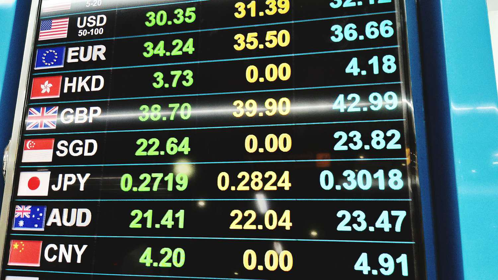

The world of trading has undergone a remarkable transformation with the advent of algorithmic trading platforms. These platforms have reshaped the trading environment by significantly enhancing efficiency and accessibility. Algorithmic trading, often referred to as 'algo' trading, leverages automated pre-programmed instructions to execute trades. This method of trading offers several advantages, notably speed, accuracy, and an unparalleled capability to process vast quantities of data. 

Algo trading platforms eliminate human emotion from trading decisions, ensuring a more objective approach that prioritizes logic and strategic analysis. This is particularly important in volatile markets where rapid, precise decisions can lead to improved profitability. Additionally, algorithmic trading enhances the ability to handle multiple markets and instruments simultaneously, catering to both hedge funds managing large portfolios and individual traders executing day trades.

This article will discuss the importance of trading platforms, the role of financial derivatives, and how algorithmic trading is shaping modern finance. We will explore the usefulness of these platforms, examine their key features, and identify some leading examples that are transforming how trades are executed today. As demonstrated by Eris Exchange, the integration of algorithmic trading within existing systems can simplify complex financial instruments, such as derivatives, making them more accessible to a broader range of users. This development not only democratizes trading but also empowers investors with better tools and insights for managing risk and optimizing returns.

## Table of Contents

## Understanding Trading Platforms

Trading platforms are indispensable tools in modern finance, providing traders with the necessary frameworks to access various markets and execute transactions with precision and speed. These platforms support a wide array of financial instruments, including but not limited to stocks, options, futures, and currencies. By offering diverse assets, they enable traders to develop comprehensive strategies tailored to meet specific financial goals.

A core characteristic of effective trading platforms is their user-friendly interfaces. These interfaces are designed to streamline the trading process, allowing users to manage their portfolios with ease, execute trades seamlessly, and analyze intricate market data. This accessibility ensures that both novice and experienced traders can efficiently navigate the platform's functionalities.

Innovative trading platforms often include sophisticated tools such as charting capabilities, analytical indicators, and real-time data feeds. These tools are crucial for analyzing market trends and making informed trading decisions. The integration of advanced technologies enhances the platform's efficacy, providing users with the ability to back-test trading strategies, set automated alerts, and customize dashboards to monitor specific market movements.

Prominent platforms like STRATX exemplify these capabilities by offering real-time insights and comprehensive reports that bolster decision-making for traders and investors. By presenting data in an easily digestible format, such platforms enhance the trader’s ability to make timely and informed decisions, ultimately contributing to strategic financial pursuits and risk management.

In summary, trading platforms have transformed the operational landscape of financial markets, equipping traders with essential tools and resources to compete effectively in a fast-paced environment. As technology continues to advance, these platforms are expected to evolve, further refining the ability of traders to engage with the market more efficiently and innovatively.

## An Overview of Financial Derivatives

Financial derivatives are sophisticated financial instruments whose values are inherently linked to underlying assets like stocks, bonds, commodities, or currencies. These derivatives are essential in the financial markets, playing a critical role in risk management, speculative strategies, and portfolio diversification.

Derivatives are primarily used for hedging risks by providing financial [agents](/wiki/agents) the means to mitigate potential losses due to unfavorable price movements. For instance, an investor holding a portfolio of stocks might use equity options to hedge against potential declines in stock prices. Through speculative activities, traders also leverage derivatives to capitalize on price movements, seeking profits from market fluctuations without needing to own the underlying asset. Additionally, derivatives enhance portfolio efficiency by enabling complex financial strategies that can improve returns or reduce risks.

Interest rate swaps and futures are particularly notable types of derivatives widely employed in managing risk. An [interest rate](/wiki/interest-rate-trading-strategies) swap allows two parties to exchange interest rate cash flows, typically swapping a fixed rate for a floating rate, helping manage exposure to fluctuations in interest rates. Futures contracts enable counterparties to lock in prices for commodities or financial instruments, thereby stabilizing expected costs and revenues.

Eris Exchange exemplifies the innovative application of derivatives by offering swap futures. These financial instruments merge the regulatory benefits of futures contracts with the bespoke flexibility characteristic of over-the-counter (OTC) derivatives. Swap futures allow for standardized contracts traded on regulated exchanges, providing greater transparency and reducing counterparty risk compared to traditional OTC swaps. This combination aids in making complex swap transactions more accessible and manageable for a broader audience, ultimately expanding the reach and functionality of financial derivatives within contemporary markets.

## The Rise of Algorithmic Trading

Algorithmic trading, commonly referred to as 'algo trading', utilizes sophisticated computer algorithms to execute trades at speeds and frequencies far beyond human capability. This trading technique has transformed the financial landscape by automating tasks that were traditionally manual, thereby enhancing the efficiency and precision of trading processes.

One of the primary advantages of [algorithmic trading](/wiki/algorithmic-trading) is its ability to eliminate emotional bias, which can often lead to suboptimal trading decisions. By automating the trading process, algorithms ensure that trades are based on predefined criteria and market signals, leading to more objective and consistent decision-making. This can be particularly beneficial in volatile markets where emotional reactions might lead to premature selling or buying.

The core of algo trading lies in its ability to process and analyze vast amounts of market data in real-time. Algorithms can be designed to identify market patterns, trends, and anomalies, and execute trades based on these insights. This real-time analysis allows traders to capitalize on market opportunities as they arise, without the lag time associated with manual analysis and execution. Furthermore, algorithmic trading facilitates the management of multiple markets and instruments simultaneously, optimizing portfolio diversification and exposure.

Platforms like Quantman and Zerodha Streak have made significant strides in demystifying algorithmic trading for a broader audience. These platforms provide user-friendly interfaces and tools that enable traders to develop and test trading strategies without requiring extensive programming skills. For example, Zerodha Streak offers a strategy development environment where users can create strategies using a straightforward drag-and-drop feature and backtest these strategies with historical data. Such features democratize access to algorithmic trading, allowing both novice and seasoned traders to leverage sophisticated trading techniques.

In essence, the rise of algorithmic trading signifies a pivotal shift in modern finance, integrating elements of computational power and data analysis to enhance trading efficacy. This evolution continues to shape the way traders interact with financial markets, offering potential pathways to increased profitability and informed decision-making.

## Key Features of Algorithmic Trading Platforms

A robust algorithmic trading platform is essential for traders aiming to harness the full potential of automated trading. One of the primary features of such a platform is a user-friendly interface. This ensures that traders, regardless of their level of experience, can navigate the platform with ease and efficiency.

Key among the essential components is a [backtesting](/wiki/backtesting) engine. This tool allows traders to test their strategies against historical market data. By simulating trades, traders can evaluate the effectiveness of their strategies before deploying them in live markets. A typical backtesting process involves running an algorithm with historical data to see how it would have performed, allowing traders to tweak and optimize their strategies accordingly.

Real-time data feeds are crucial as they enable timely decision-making. Immediate access to up-to-date market information ensures that traders can react swiftly to market changes, potentially capitalizing on opportunities as soon as they arise. This feature supports strategies that rely on quick execution and precise timing, such as high-frequency trading.

Tools for developing custom algorithms are also vital for traders seeking to tailor their strategies to specific market conditions or personal preferences. These tools often provide simplified scripting or visual programming options, enabling traders to create complex algorithms without deep coding expertise. For those who are more technically inclined, many platforms offer integration with popular programming languages like Python, R, or C++. This is particularly useful for developing sophisticated algorithms that require more customization.

Risk management tools are another critical feature. These tools help traders limit potential losses and manage their exposure to various financial instruments efficiently. Features such as stop-loss orders, position sizing, and automated risk assessments can safeguard a trader's capital against adverse market movements.

Advanced algorithmic trading platforms support multi-asset trading, allowing traders to diversify their portfolios across different asset classes, including stocks, options, futures, and cryptocurrencies. This flexibility is particularly advantageous for traders looking to spread risk and optimize returns across various markets.

Platforms like TradeStation and [Interactive Brokers](/wiki/interactive-brokers-api) exemplify robust support for coding one's algorithms. They offer extensive coding environments and resources, making them ideal for traders who wish to implement, test, and refine their proprietary trading strategies. These platforms not only provide script-writing capabilities but often include comprehensive educational materials and community forums, fostering a collaborative environment for algorithmic traders.

In essence, the key features of algorithmic trading platforms revolve around providing the necessary tools and interfaces to facilitate efficient, informed, and strategic trading across different financial markets.

## Key Players in the Market

The market is thriving with a diverse array of algorithmic trading platforms, each designed to meet specific trading requirements and preferences. Among the notable players, TradeStation and Interactive Brokers stand out as premier choices for traders who seek established platforms brimming with comprehensive features and a breadth of educational resources. These platforms provide a robust infrastructure for traders of varying expertise levels, facilitating access to a wide range of financial instruments and advanced analytical tools.

TradeStation is well-regarded for its extensive suite of analytical tools and ease of customization, offering traders the ability to develop and test trading strategies via EasyLanguage, its proprietary scripting language. This offers a significant advantage for those who wish to implement complex algorithmic strategies without necessitating deep programming expertise. Additionally, TradeStation provides a large library of educational resources and a supportive community, enhancing the overall trading experience.

Interactive Brokers, known for its competitive pricing and extensive market access, appeals to both retail and professional traders. It supports algorithmic trading through its API, allowing for customization and execution of sophisticated algorithms in multiple asset classes. Interactive Brokers' Trader Workstation (TWS) offers powerful charting tools and advanced order types that are integral for executing algorithm-driven trades efficiently. Furthermore, its educational offerings through the Traders' Academy help traders continually refine their skills.

In the domain of [cryptocurrency](/wiki/cryptocurrency) trading, platforms like Coinrule and Botsfolio are optimized for traders keen on capitalizing on the [volatility](/wiki/volatility-trading-strategies) and opportunities within digital currency markets. Coinrule serves as an intuitive platform allowing traders to create and automate their own trading strategies without the need for coding. Its focus on simplicity and accessibility makes it appealing for both novice and experienced traders aiming to harness algorithmic strategies for cryptocurrency markets.

Similarly, Botsfolio caters to traders interested in crypto trading by offering managed portfolios that automatically conduct trades based on the parameters set by users. This offers the convenience of algorithmic trading combined with expert insights, making it accessible to those who lack the time or expertise to trade actively.

STRATX by Motilal Oswal gains significance for traders involved in futures and options. This platform offers a versatile strategy marketplace that facilitates collaboration and the exchange of trading ideas, alongside real-time monitoring and analysis tools essential for these complex financial instruments. STRATX enhances decision-making by providing robust analytical capabilities and streamlined access to futures and options markets.

Each of these platforms brings unique features to the table, catering to a wide array of trading needs and preferences, making the selection of a suitable platform contingent on an individual trader's objectives and level of expertise.

## Conclusion

As financial markets continue to evolve, algorithmic trading emerges as a cornerstone of modern finance. The integration of sophisticated algorithms and advanced technology has fundamentally altered the trading landscape, providing tools that significantly enhance efficiency, speed, and access to vast amounts of market data and analytics. These advancements allow traders to execute trades with precision and minimal latency, capitalizing on fleeting market opportunities that manual trading might miss.

The proliferation of algorithmic trading platforms necessitates a careful selection process for traders, as choosing the right platform can profoundly impact trading outcomes. Traders must assess platforms based on their specific needs, considering factors such as ease of use, supported asset classes, and the availability of educational resources. Some platforms cater to specific markets or trading styles, making it crucial to align one's trading objectives with the platform's features.

Algorithmic trading empowers traders to make more strategic and informed decisions. By removing emotional biases and automating routine processes, algorithmic systems can optimize trading strategies and potentially increase profitability. As such, the adoption of algorithmic trading is not merely a matter of preference but a strategic advantage in navigating the complexities of contemporary financial markets. This approach offers a pathway to enhanced trading performance, positioning traders to thrive in an increasingly competitive environment.

## References & Further Reading

[1]: Bergstra, J., Bardenet, R., Bengio, Y., & Kégl, B. (2011). ["Algorithms for Hyper-Parameter Optimization."](https://core.ac.uk/download/pdf/46766638.pdf) Advances in Neural Information Processing Systems 24.

[2]: ["Advances in Financial Machine Learning"](https://www.amazon.com/Advances-Financial-Machine-Learning-Marcos/dp/1119482089) by Marcos Lopez de Prado

[3]: ["Evidence-Based Technical Analysis: Applying the Scientific Method and Statistical Inference to Trading Signals"](https://www.amazon.com/Evidence-Based-Technical-Analysis-Scientific-Statistical/dp/0470008741) by David Aronson

[4]: ["Machine Learning for Algorithmic Trading"](https://github.com/stefan-jansen/machine-learning-for-trading) by Stefan Jansen

[5]: ["Quantitative Trading: How to Build Your Own Algorithmic Trading Business"](https://www.amazon.com/Quantitative-Trading-Build-Algorithmic-Business/dp/1119800064) by Ernest P. Chan