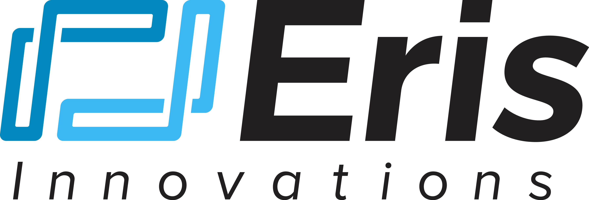

## Table of Contents

## What is Eris Exchange?

Eris Exchange is a company that helps people trade things called swaps. Swaps are special agreements between two parties to exchange cash flows or other financial things over time. Eris Exchange makes it easier for people to buy and sell these swaps by using a computer system. This system is called a swap execution facility, or SEF for short. It's like a marketplace where people can trade swaps safely and easily.

The company started in 2012 and is based in New York City. Eris Exchange is known for being one of the first to use blockchain technology in their trading system. Blockchain is a special way of keeping records that is very safe and hard to change. By using blockchain, Eris Exchange can make sure that all the trades are recorded correctly and can't be messed with. This helps people trust the system more and makes trading smoother.

## When was Eris Exchange founded?

Eris Exchange was founded in 2012. It is a company that helps people trade swaps, which are special agreements to exchange financial things over time.

The company is based in New York City. Eris Exchange was one of the first to use blockchain technology in their trading system. Blockchain helps keep records safe and makes trading easier and more trustworthy.

## What types of products does Eris Exchange offer?

Eris Exchange offers a special kind of financial product called [interest rate](/wiki/interest-rate-trading-strategies) swaps. These are agreements between two parties to exchange one stream of interest payments for another, based on a specified amount of money. For example, one party might pay a fixed interest rate while the other pays a floating rate that changes over time. Eris Exchange makes it easy for people to trade these swaps using their computer system, which is called a swap execution facility (SEF).

The company also uses blockchain technology to make sure that all the trades are recorded correctly and safely. This helps people trust the system more because the records are hard to change or mess with. By offering these products and using advanced technology, Eris Exchange helps make the trading of interest rate swaps smoother and more reliable for everyone involved.

## How does Eris Exchange ensure the security of its platform?

Eris Exchange uses blockchain technology to keep its platform safe. Blockchain is like a special notebook where all the trades are written down in a way that's very hard to change or mess with. This means that once a trade is recorded, it stays the same and can be trusted. By using blockchain, Eris Exchange makes sure that all the information about swaps is kept secure and everyone can see it's correct.

The company also follows strict rules and regulations to protect its users. They have to meet standards set by financial watchdogs, which means they have to be careful and honest in how they run their platform. This helps to build trust because people know that Eris Exchange is being watched and has to follow the rules. Together, blockchain and these regulations help make sure that trading on Eris Exchange is safe and reliable.

## What are the fees associated with trading on Eris Exchange?

Trading on Eris Exchange comes with different fees depending on what you're doing. When you want to trade a swap, you might have to pay a fee for using the platform. This fee can be a small percentage of the trade's value, and it helps Eris Exchange keep the platform running smoothly. There might also be fees for things like clearing and settling trades, which means making sure everything is done correctly and safely.

The exact fees can change based on the type of swap you're trading and how much you're trading. It's a good idea to check with Eris Exchange directly to find out the exact costs for your trades. They might have special deals or discounts sometimes, so it's worth asking about those too. Overall, understanding the fees will help you plan your trading better and know what to expect.

## Can you explain how to open an account on Eris Exchange?

To open an account on Eris Exchange, you first need to visit their website and look for the section where you can sign up or register. Once you find it, you'll need to fill out a form with your personal information like your name, email address, and maybe some contact details. Make sure all the information you provide is correct because they will use it to verify your identity. After you submit the form, you might need to wait for a bit while Eris Exchange checks your information to make sure you're who you say you are.

Once your identity is verified, you'll be able to log into your new account. You might need to set up a password and maybe answer some security questions to keep your account safe. After that, you can start exploring the platform and learning how to trade swaps. If you have any questions or need help, Eris Exchange usually has customer support that you can contact. They can guide you through the next steps and help you get started with trading.

## What are the key features that distinguish Eris Exchange from other exchanges?

Eris Exchange stands out from other exchanges because it focuses on trading interest rate swaps using a special technology called blockchain. Blockchain makes the trading process very safe and transparent. It records all trades in a way that is hard to change or mess with, which means people can trust that their trades are recorded correctly. This use of blockchain is one of the first in the financial trading world, making Eris Exchange a pioneer in using this technology to make trading more reliable.

Another key feature of Eris Exchange is its role as a swap execution facility (SEF). This means it provides a marketplace where people can easily and safely trade swaps. The platform follows strict rules and regulations set by financial watchdogs, which helps build trust with users. By combining advanced technology with a secure and regulated environment, Eris Exchange offers a unique and trustworthy place for people to trade interest rate swaps.

## How does Eris Exchange handle regulatory compliance?

Eris Exchange makes sure it follows all the rules set by financial watchdogs. These rules are there to keep trading safe and fair for everyone. Eris Exchange has to meet strict standards, which means they have to be careful and honest in how they run their platform. They do this by checking all the trades and making sure everything is done the right way. This helps build trust because people know that Eris Exchange is being watched and has to follow the rules.

The company also uses a special computer system called a swap execution facility (SEF) to help with regulatory compliance. This system makes it easier for Eris Exchange to keep track of all the trades and make sure they are following the rules. By using this technology, Eris Exchange can quickly spot any problems and fix them before they become big issues. This way, they can keep the platform safe and reliable for everyone who uses it.

## What kind of customer support does Eris Exchange provide?

Eris Exchange offers helpful customer support for people who use their platform. If you have any questions or run into problems while trading, you can reach out to their support team. They can help you with things like setting up your account, understanding how to trade swaps, and figuring out any fees you might have to pay. You can contact them through email or phone, and they usually try to get back to you quickly to help solve your issues.

Their customer support team is made up of people who know a lot about trading and the rules that Eris Exchange has to follow. This means they can give you good advice and make sure you understand everything about using the platform. Whether you're new to trading or have been doing it for a while, the support team at Eris Exchange is there to help you have a smooth and safe trading experience.

## What are the trading volumes and liquidity like on Eris Exchange?

Eris Exchange has good trading volumes and [liquidity](/wiki/liquidity-risk-premium) for interest rate swaps. Liquidity means how easily you can buy or sell something without affecting its price too much. On Eris Exchange, there are usually enough people trading that you can find someone to trade with pretty quickly. This makes it easier for people to trade their swaps without waiting a long time or worrying about the price changing a lot.

The trading volumes on Eris Exchange can change from day to day, but overall, they are pretty strong. This means a lot of swaps are being traded, which is a good sign for people who want to use the platform. High trading volumes and good liquidity help make trading smoother and more reliable for everyone who uses Eris Exchange.

## How does Eris Exchange integrate with other financial systems or platforms?

Eris Exchange works well with other financial systems and platforms. It uses special computer systems to connect with other trading platforms and banks. This makes it easy for people to move their trades from one place to another without any problems. By working together with these other systems, Eris Exchange helps people trade swaps more smoothly and quickly.

The company also uses something called an API, which stands for Application Programming Interface. This is like a special tool that lets other systems talk to Eris Exchange's system. With the API, other financial platforms can send and receive information about trades easily. This helps everyone stay connected and makes trading more efficient and reliable.

## What future developments or expansions are planned for Eris Exchange?

Eris Exchange is always looking to grow and improve. They want to add more types of swaps that people can trade on their platform. This means people will have more choices and can find the right swaps for their needs. They are also thinking about expanding to other countries, so more people around the world can use their services. This could help them reach a bigger audience and make trading even easier for everyone.

Another big plan for Eris Exchange is to keep using new technology to make their platform better. They want to keep using blockchain to make trading safer and more transparent. They are also looking at other new technologies that could help them work faster and more efficiently. By staying up-to-date with the latest tech, Eris Exchange hopes to keep being a leader in the world of swap trading.

## References & Further Reading

[1]: Bergstra, J., Bardenet, R., Bengio, Y., & Kégl, B. (2011). ["Algorithms for Hyper-Parameter Optimization."](https://core.ac.uk/download/pdf/46766638.pdf) Advances in Neural Information Processing Systems 24.

[2]: ["Advances in Financial Machine Learning"](https://www.amazon.com/Advances-Financial-Machine-Learning-Marcos/dp/1119482089) by Marcos Lopez de Prado

[3]: ["Evidence-Based Technical Analysis: Applying the Scientific Method and Statistical Inference to Trading Signals"](https://www.amazon.com/Evidence-Based-Technical-Analysis-Scientific-Statistical/dp/0470008741) by David Aronson

[4]: ["Machine Learning for Algorithmic Trading"](https://github.com/stefan-jansen/machine-learning-for-trading) by Stefan Jansen

[5]: ["Quantitative Trading: How to Build Your Own Algorithmic Trading Business"](https://www.amazon.com/Quantitative-Trading-Build-Algorithmic-Business/dp/1119800064) by Ernest P. Chan