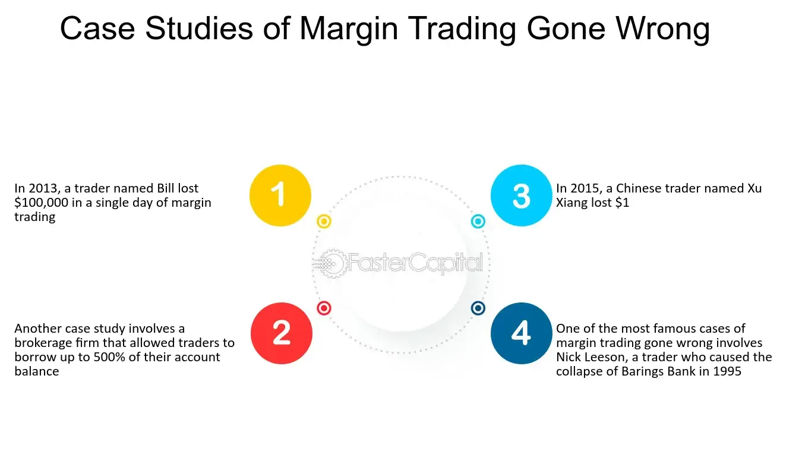

## Table of Contents

## What is an erroneous trade?

An erroneous trade is a mistake that happens when buying or selling something, like stocks or other financial products. It happens when there's a big difference between what someone thought they were trading at and what actually happened. This can be because of a mistake in entering the price, a problem with the computer system, or even a misunderstanding of the market.

When an erroneous trade happens, it can cause problems for everyone involved. The person who made the mistake might lose money, and it can also affect the prices of the stocks or other products being traded. To fix this, the people in charge of the market, like stock exchange officials, might cancel the trade or change the price to make things fair again. This helps keep the market running smoothly and protects everyone from big losses because of mistakes.

## How do erroneous trades occur?

Erroneous trades happen when there's a mistake in buying or selling stocks or other financial things. This can happen if someone types in the wrong price by accident. For example, they might mean to buy a stock at $10 but accidentally type in $100. It can also happen if there's a problem with the computer system that's used for trading. Sometimes, the system might show the wrong price or not work properly, leading to a trade that wasn't supposed to happen.

Another way erroneous trades can occur is if someone doesn't understand the market well. They might think a stock is worth more or less than it really is and make a trade based on that wrong information. Also, during times when the market is very busy or moving quickly, it's easy to make mistakes. People might rush and not double-check their trades, leading to errors. All these reasons can cause trades that need to be fixed to keep the market fair for everyone.

## What are the immediate effects of an erroneous trade on a trader?

When a trader makes an erroneous trade, they might lose money right away. If they accidentally bought something at a much higher price than they meant to, they would have to pay more than they planned. This can be a big problem, especially if they don't have enough money to cover the cost. Also, if they sold something at a much lower price by mistake, they would get less money than they should have, which can hurt their finances.

Besides losing money, an erroneous trade can also cause a lot of stress and confusion for the trader. They might feel worried and unsure about what to do next. They could spend time trying to fix the mistake, which takes away from their time to make other trades. If the mistake is big enough, it might even affect their reputation in the trading community, making it harder for them to do business in the future.

## Can you explain the basic mechanisms for correcting an erroneous trade?

When a trader makes an erroneous trade, the first step to fix it is usually to tell the people in charge of the market, like the stock exchange officials. They have rules to help decide if a trade was a mistake. If it was, they might cancel the trade completely. This means it's like the trade never happened, and the trader doesn't have to pay or get the money from the mistaken trade. Another way to fix it is by changing the price of the trade to what it should have been. This way, the trader only has to pay or get the right amount of money.

Sometimes, fixing an erroneous trade needs to happen quickly. If the market is moving fast, the officials might need to act right away to stop the mistake from causing bigger problems. They look at things like how big the difference was between the mistaken price and the real price, and how much the trade could affect the market. Once they decide what to do, they let everyone know so the market can keep working fairly. This helps make sure that one mistake doesn't hurt a lot of people or mess up the prices of stocks and other things being traded.

## What are the regulatory frameworks governing erroneous trades?

Different countries have rules to deal with erroneous trades and keep the market fair. In the United States, the Financial Industry Regulatory Authority (FINRA) and the Securities and Exchange Commission (SEC) have rules about how to handle mistakes in trading. They say that if a trade is clearly wrong, it can be canceled or the price can be changed. This helps stop big losses and keeps the market running smoothly. Other places, like the European Union, have their own rules too, but the main idea is the same: to fix mistakes quickly and fairly.

These rules usually say what counts as an erroneous trade. For example, if the price of a trade is very different from what it should be, it might be seen as a mistake. The rules also explain how fast the officials need to act to fix the problem. This is important because if they wait too long, the mistake could cause more trouble for everyone in the market. By having clear rules, regulators can make sure that mistakes are dealt with in a way that's fair for all traders and keeps the market stable.

## How do financial institutions manage the risk of erroneous trades?

Financial institutions use different ways to manage the risk of erroneous trades. They often use special computer systems that check trades before they happen. These systems look for prices that seem very wrong and can stop trades that might be mistakes. They also train their traders to be careful and double-check their trades. This helps make sure that traders understand the market well and don't make big mistakes.

Another way financial institutions manage this risk is by having rules and plans for what to do if a mistake happens. They work with the people in charge of the market, like stock exchange officials, to fix any erroneous trades quickly. This means they might cancel the trade or change the price to what it should have been. By having these plans ready, financial institutions can keep the market fair and protect themselves and their traders from big losses.

## What are some historical examples of significant erroneous trades?

One famous example of an erroneous trade happened in 2012. A trader at Knight Capital Group made a mistake that caused the company to lose about $440 million in just 45 minutes. The trader accidentally used old software that sent out a lot of wrong buy and sell orders. This mistake made the stock prices go up and down quickly, and it almost made Knight Capital go bankrupt. They had to get help from other companies to stay in business.

Another big erroneous trade happened in 2010 and is known as the "Flash Crash." On May 6, 2010, the stock market dropped a lot in just a few minutes. This was partly because of a big sell order that was entered by mistake. The order was for a huge amount of a stock, and it caused other computers to start selling too. This made the prices of many stocks drop very quickly. The market got back to normal soon after, but it showed how one big mistake can cause a lot of trouble for everyone.

## How do erroneous trades impact market stability?

Erroneous trades can shake up the market and make it less stable. When someone makes a big mistake, like buying or selling something at the wrong price, it can cause the prices of stocks to go up and down quickly. This sudden change can scare other people in the market, making them sell their stocks too. If a lot of people start selling at the same time, it can lead to a big drop in the market, like what happened during the Flash Crash in 2010. This kind of chaos can make it hard for the market to work smoothly and can hurt a lot of people's investments.

To keep the market stable, the people in charge, like stock exchange officials, have rules to fix these mistakes quickly. They might cancel the trade or change the price to what it should have been. By doing this, they can stop one mistake from causing bigger problems. But even with these rules, it's important for everyone in the market to be careful and use good systems to check their trades. This helps keep the market calm and makes sure that one person's mistake doesn't mess things up for everyone else.

## What technological solutions exist to prevent erroneous trades?

Financial institutions use special computer programs to stop erroneous trades before they happen. These programs watch trades very closely and can spot when someone tries to buy or sell something at a price that's way off. If the program sees a big mistake, it can stop the trade from going through. This helps keep the market safe and stops traders from losing a lot of money because of simple errors. Some programs also use smart math to guess if a trade might be a mistake based on how the market is acting at that moment.

Another way technology helps is by making sure traders double-check their work. Some systems won't let a trade go through until the trader confirms it twice. This gives them a chance to catch any mistakes before they become a big problem. Also, some trading platforms have rules that make traders wait a little bit before their trade is final. This short wait can be enough time for them to realize if they made a mistake and fix it before it's too late. By using these technological solutions, financial institutions can keep the market running smoothly and protect everyone from the effects of erroneous trades.

## How do different exchanges handle erroneous trades differently?

Different stock exchanges around the world have their own rules for dealing with erroneous trades. In the United States, the New York Stock Exchange (NYSE) and the NASDAQ have rules that say if a trade is clearly a mistake, it can be canceled or the price can be changed. They look at how big the price difference was and how much the trade could affect the market. If the mistake is big enough, they act quickly to fix it and keep the market stable. In Europe, exchanges like the London Stock Exchange (LSE) have similar rules but might use different ways to decide if a trade was a mistake. They also focus on fixing the problem fast to protect traders and keep the market fair.

In Asia, exchanges like the Tokyo Stock Exchange (TSE) and the Hong Kong Stock Exchange (HKEX) also have rules to handle erroneous trades. They might have different ideas about what counts as a big mistake and how quickly they need to act. For example, the TSE might look at the time of day the trade happened and how it affected other trades. The HKEX might focus more on the size of the trade and how it could change the market's prices. Even though the details are different, all these exchanges want to fix mistakes quickly and keep the market working well for everyone.

## What are the long-term implications of frequent erroneous trades on market trust?

When erroneous trades happen a lot, people might start to trust the market less. If traders see big mistakes happening all the time, they might worry that their own trades could be messed up too. This can make them feel unsafe and unsure about putting their money into the market. Over time, if the market keeps having problems with erroneous trades, fewer people might want to trade. This can make the market less busy and harder for it to grow.

To fix this, the people in charge of the market need to show that they can handle these mistakes well. They need to have good rules and quick ways to fix errors when they happen. If they can do this, traders might start to feel safer and trust the market more. It's important for everyone to work together to stop erroneous trades from happening and to make sure the market stays a good place for people to trade.

## Can you discuss advanced case studies where erroneous trades led to systemic changes in trading policies?

One big example of erroneous trades leading to changes in trading rules happened in 2010 during the Flash Crash. A trader made a huge mistake by selling a lot of a stock at the wrong time, which made the whole market drop quickly. This scared a lot of people and showed that one big mistake could mess up the whole market. After this happened, the people in charge of the market, like the SEC in the U.S., made new rules to stop these kinds of mistakes. They started using special computer systems to watch trades more closely and stop big errors before they could cause trouble. This helped make the market safer and more stable.

Another example is the Knight Capital Group incident in 2012. A trader at Knight Capital accidentally used old software, which sent out a lot of wrong trades and cost the company $440 million in just 45 minutes. This mistake almost made the company go bankrupt and showed how important it is to have good checks in place. After this happened, financial institutions started to use better technology to check trades before they happen. They also made sure traders had to double-check their work and sometimes wait a bit before their trades went through. These changes helped stop big mistakes and made the market a safer place for everyone.

## References & Further Reading

[1]: Jones, C. M. (2013). ["What Do We Know About High-Frequency Trading?"](https://www.wsj.com/public/resources/documents/HFT0324.pdf) Columbia Business School Research Paper No. 13-11.

[2]: Aldridge, I. (2013). ["High-Frequency Trading: A Practical Guide to Algorithmic Strategies and Trading Systems"](https://www.amazon.com/High-Frequency-Trading-Practical-Algorithmic-Strategies/dp/1118343506) (2nd ed.). Wiley.

[3]: Easley, D., López de Prado, M. M., & O’Hara, M. (2012). ["The Volume Clock: Insights into the High-Frequency Paradigm."](https://www.semanticscholar.org/paper/Flow-Toxicity-and-Liquidity-in-a-High-Frequency-Easley-Prado/9369430bd005d194f9332ae7cbd5a57ace5e9ab3) The Journal of Portfolio Management.

[4]: Lewis, M. (2014). ["Flash Boys: A Wall Street Revolt."](https://en.wikipedia.org/wiki/Flash_Boys) W.W. Norton & Company.

[5]: U.S. Securities and Exchange Commission (2010). ["Findings Regarding the Market Events of May 6, 2010."](https://www.sec.gov/news/studies/2010/marketevents-report.pdf) Report of the Staffs of the CFTC and SEC to the Joint Advisory Committee on Emerging Regulatory Issues.