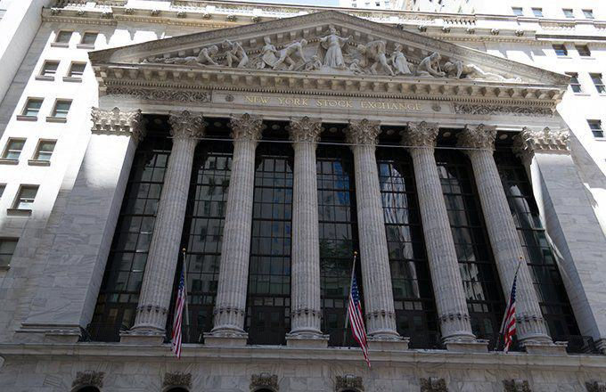

In the fast-paced world of trading, errors can occur due to a variety of factors, from human mistakes to technical glitches. Algorithmic trading, which relies on computer programs to execute orders at high speeds and volumes, has become a dominant force in global markets. However, this automation brings its own set of challenges, particularly in the area of erroneous trades. These are trades that deviate significantly from the intended execution price, often resulting from misconfigured algorithms or technical malfunctions.

Understanding and addressing the roots of these errors is essential. Erroneous trades can influence market stability, leading to distorted prices and financial losses, not only for individuals but also for entire trading systems. With algorithmic trading accounting for a substantial share of total market volume, the ability to quickly identify and rectify errors is crucial for maintaining market integrity.



Historically, the financial markets have seen numerous instances where erroneous trades led to significant disruptions. These cases highlight the importance of vigilant oversight and robust error-handling mechanisms. In response, both regulators and industry participants have developed strategies to prevent and mitigate the impact of trading errors. Modern safeguards, such as circuit breakers and real-time monitoring systems, have been implemented to minimize the risks associated with automated trading.

Join us as we explore this complex landscape, investigating the causes of erroneous trades and examining strategies to reduce their occurrence. This exploration will provide valuable insights into safeguarding the markets as algorithmic trading continues to evolve. The necessity for effective risk management and collaboration between traders, tech developers, and regulators is more critical than ever to ensure the smooth functioning of the financial system.

## Table of Contents

## What Are Erroneous Trades?

An erroneous trade is a transaction that significantly deviates from the current prevailing market price, typically resulting from errors in order execution. These errors can arise from various sources, including human mistakes, algorithmic faults, or system malfunctions. Human error might occur due to incorrect data entry or misjudgment when placing an order. Algorithmic mistakes are usually due to flaws in the logic or parameters set within the trading algorithms. System malfunctions often involve technical glitches that disrupt normal trading operations, potentially leading to incorrect transactions.

Exchanges play a crucial role in maintaining market integrity by identifying and rectifying these erroneous trades. They often reverse or "break" such transactions to ensure that security prices on the market accurately reflect their true value. This process is vital for preventing the cascade of incorrect pricing across interconnected trading systems and maintaining investor confidence.

To tackle the challenge of erroneous trades, exchanges have developed specific criteria and processes for their identification and rectification. These criteria often include deviations beyond a certain threshold from the current market price, which serve as a signal for potential erroneous activity. Additionally, exchanges employ sophisticated systems to continuously monitor trading activities and flag suspicious transactions in real-time. Through these mechanisms, erroneous trades can be promptly addressed, mitigating their potential adverse effects on market stability.

## Causes of Erroneous Trades in Algo Trading

Algorithmic trading relies on complex systems and automated processes, which are designed to execute trades with high speed and precision. However, these systems are also susceptible to errors. Common causes of erroneous trades in [algorithmic trading](/wiki/algorithmic-trading) include software bugs, incorrect input data, and poorly coded algorithms. Each of these factors can lead to significant trading errors with far-reaching consequences.

Software bugs are perhaps the most prevalent source of errors. These bugs may arise from flaws in the code or unforeseen interactions within the software, resulting in unintended trading actions. For instance, a programming error may cause an algorithm to place orders in a loop, generating excessive buy or sell orders. This type of error can quickly escalate, affecting the entire market by distorting supply and demand dynamics.

Incorrect input data is another critical [factor](/wiki/factor-investing). Algorithmic systems rely on accurate data to make trading decisions. When data is incorrect, whether due to erroneous data feeds or faulty data integration, the algorithms may react unpredictably. For example, if a stock price feed is delayed or incorrect, an algorithm might execute trades at unfavorable prices, assuming the data reflects current market conditions.

Poorly coded algorithms are susceptible to executing unintended strategies and behaviors. Inadequate testing and oversight during the development phase can lead to critical flaws in the algorithm's logic. A poorly designed algorithm might, for example, misinterpret signals, leading to trades based on false trends or nonexistent market signals. This can precipitate a cascade of erroneous transactions as the algorithm continuously acts on flawed assumptions.

Automation in algorithmic trading enhances the speed and frequency of transactions, significantly increasing the potential for errors to multiply across markets. Unlike human traders who can pause and rethink their strategies, algorithms can execute numerous trades within milliseconds. This rapid execution can exacerbate the impact of any single error, creating major disruptions across trading platforms before corrective measures can be implemented.

Understanding these root causes of erroneous trades is crucial for improving trading systems and minimizing market disruption. Addressing software bugs involves rigorous testing protocols and regular software updates to catch and rectify errors early. Ensuring the integrity of input data requires establishing robust data validation mechanisms to identify and correct inaccuracies before they impact trade execution. Furthermore, efforts to design algorithms with meticulous coding and extensive simulation testing can significantly reduce errors in automated trading systems.

By recognizing the primary causes of erroneous trades in algorithmic systems, firms and regulators can develop more effective safeguards to prevent disruptions and maintain the integrity of financial markets.

## Consequences of Erroneous Trades

Erroneous trades can result in significant financial ramifications and market disturbances if not swiftly identified and rectified. These trades often distort market prices, causing automated systems to execute a sequence of trades based on incorrect data, which can amplify the initial error and propagate it throughout the market. Such events can not only lead to substantial monetary losses but also affect the integrity and perceived fairness of financial markets.

The financial impact is twofold: primary loss occurs from the incorrect trades themselves, and secondary losses arise from the spread of misinformation and subsequent trades based on flawed data. An erroneous trade might trigger stop-loss orders or cause other algorithms to react, which can exacerbate the situation. For example, in high-frequency trading, where decisions are made in milliseconds, an incorrect trade price can quickly ripple across various markets, impacting a large number of trades.

Moreover, firms responsible for substantial trading errors face financial penalties and reputational damage. Being implicated in an erroneous trading incident can undermine a firm's credibility and trust with clients, partners, and regulators. This loss of trust can translate into a long-term financial detriment, as clients might opt for competitors perceived as more reliable and robust in their trading operations.

To combat these risks, market regulators have put in place measures such as circuit breakers and trade cancellation processes. Circuit breakers are mechanisms that temporarily halt trading on an exchange to prevent panic-selling and provide a cooling-off period for market participants. These systems are designed to prevent market crashes by creating a pause in trading when prices move too sharply. For instance, a circuit breaker might be triggered if a major stock index drops by a predetermined percentage, such as 7%, over a short period.

In addition, trade cancellation processes allow exchanges to nullify trades that are clearly erroneous after they have been executed. This involves assessing whether a trade significantly deviated from the market price within a certain time frame. If a trade is deemed erroneous, the exchange can reverse it to protect the market from the distortions such trades would cause.

Thus, it is clear that erroneous trades present not only immediate financial risks but also long-term implications for market integrity and firm reputation. The enhanced framework of preventative measures and regulatory controls is crucial in mitigating these risks and ensuring stable and efficient market operations.

## Real-World Examples of Erroneous Trades

The phenomenon of erroneous trades has been highlighted by several high-profile incidents in financial markets, most notably the 2010 Flash Crash. On May 6, 2010, major U.S. stock indices, such as the Dow Jones Industrial Average, experienced a rapid and severe downturn, dropping about 1,000 points in just minutes before rebounding almost as quickly. This extraordinary event was partly attributed to erroneous trades caused by an automated sell algorithm by a large trading firm. The incident exposed critical vulnerabilities in market structures and highlighted the potential for [volatility](/wiki/volatility-trading-strategies) introduced by automated systems. According to the joint report by the SEC and the CFTC, the Flash Crash revealed weaknesses in market resilience, exacerbated by the fragmentation of modern trading platforms and the speed of high-frequency trading algorithms.

In another instance, a significant error occurred in 2023 on the New York Stock Exchange (NYSE), where a manual input mistake led to substantial market disruption. The error resulted in thousands of trades being executed at prices far from actual market values, triggering a wave of cancellations across the exchange. This incident demonstrated not only the importance of human oversight in trading operations but also the need for stringent quality checks and error-prevention mechanisms in exchange systems. The subsequent trade cancellations underscored the necessity for robust market controls to prevent similar occurrences in the future.

These cases serve as stark reminders of the market impacts that erroneous trades can have, emphasizing the critical need for strong regulatory frameworks and effective risk management practices. Systems must be in place to not only detect but quickly rectify such errors to maintain market integrity. The lessons learned from these real-world examples continue to inform the development of preventative measures and underscore the importance of collaboration between regulators, exchanges, and trading firms to safeguard against future incidents.

## Preventative Measures and Risk Controls

Regulators and firms have instituted several safeguards to address the challenges posed by erroneous trades in algorithmic trading. One primary measure is the implementation of pre-trade risk checks. These checks are designed to evaluate the potential impact of a trade before execution, ensuring that it adheres to predefined risk parameters. For example, firms may set thresholds for maximum order size or value, preventing trades that exceed these limits from proceeding.

Order limits are another crucial component of risk control. By setting a maximum allowable size for any individual order, firms can mitigate the potential impact of erroneous trades on the market. This control helps in maintaining orderliness in trading activities and reduces the possibility of market disruption.

Real-time monitoring plays a vital role in identifying and addressing erroneous trades immediately as they occur. Advanced monitoring systems can flag unusual trading patterns or anomalies, allowing firms to react swiftly and prevent further spread of the error. This immediate feedback loop is critical in high-frequency trading environments where transactions occur at the millisecond level.

Technological advancements in Order Management Systems (OMS) have provided integrated solutions to detect and prevent erroneous trades. Modern OMS platforms are equipped with sophisticated algorithms that analyze trading data and identify potential errors before they affect the market. These systems also allow for automated adjustments or cancellations of suspicious orders, further enhancing trade accuracy.

Establishing comprehensive risk management frameworks is vital for managing the complexities of algorithmic trading. These frameworks involve a combination of quantitative and qualitative approaches to assess and mitigate risks. Quantitative methods may include statistical analysis and predictive modeling to forecast potential trading risks, while qualitative approaches focus on human oversight and decision-making processes.

Continuous monitoring and periodic audits of trading systems ensure that risk controls remain effective and responsive to evolving market conditions. Regular updates to trading algorithms and risk management protocols are necessary to adapt to changes in market dynamics and regulatory requirements.

Overall, the implementation of these preventative measures and risk controls is crucial in minimizing the risks associated with erroneous trades. By leveraging technology and establishing robust risk management strategies, regulators and firms can enhance market stability and protect investor interests.

## The Future of Algo Trading and Error Mitigation

As technology progresses, the future landscape of algorithmic trading presents an intricate challenge: the need to balance continuous innovation with rigorous risk controls. This balance is essential to maintain safe and efficient financial markets. Algorithmic trading systems are increasingly complex, employing [machine learning](/wiki/machine-learning) algorithms and [artificial intelligence](/wiki/ai-artificial-intelligence) to execute trades at speeds far beyond human capability. While this advancement brings opportunities for higher efficiency and profit, it also introduces vulnerabilities to errors or unintended market impacts.

Collaboration between technology developers, traders, and regulators will play a pivotal role in developing more resilient trading systems. Developers must focus on creating algorithms and trading systems that account for potential errors, incorporating thorough testing and validation processes. Traders, on the other hand, should engage in ongoing education to understand the functionalities and limitations of these advanced systems. Meanwhile, regulators need to establish adaptive frameworks that can keep pace with rapid technological changes, ensuring that regulations promote both innovation and market stability.

To minimize trading errors, a strong emphasis on education and adaptation to new technologies is critical. This includes regular training sessions for trading professionals on the latest technological tools and developments in the market. New educational programs aimed at expanding the understanding of machine learning and data analysis techniques will equip traders and developers with the skills needed to anticipate and prevent potential errors.

The implementation of cutting-edge technologies such as distributed ledger systems and blockchain could enhance transparency and traceability in trade execution, further reducing the likelihood of erroneous trades. Additionally, incorporating advanced real-time analytics and monitoring tools can help detect anomalies before they result in significant market disruptions.

In Python, for example, data analysis libraries such as pandas can be employed to monitor trading patterns and detect deviations from expected behavior:

```python
import pandas as pd

# Example: Analyzing trade data
data = pd.read_csv('trade_data.csv')
# Assuming the CSV file contains trade times and prices
data['price_change'] = data['price'].pct_change()

# Set a threshold for what is considered an erroneous price change
error_threshold = 0.05  # 5% change

# Identify potential erroneous trades
erroneous_trades = data[abs(data['price_change']) > error_threshold]

print(erroneous_trades)
```

This Python code snippet illustrates a basic method to analyze trading data and identify potentially erroneous trades based on price fluctuations. Such tools are instrumental in preemptively minimizing errors by alerting traders to unusual activities that might necessitate further investigation.

Ultimately, the future of algorithmic trading will depend on the industry's ability to foster an environment where innovation is seamlessly integrated with robust risk management. Continuous advancements in technology, coupled with strategic collaboration across the industry, will ensure the development of safer, more efficient trading ecosystems.

## Conclusion

Erroneous trades continue to pose significant challenges within algorithmic trading. These unintended transactions, often arising from a combination of human errors and technical glitches, can disrupt markets and lead to substantial financial losses. However, ongoing advancements in technology and the implementation of proactive measures offer promising avenues to mitigate their impact.

A comprehensive understanding of the complexities associated with trade errors is essential for maintaining market integrity. This necessitates a focus on identifying the root causes of errors and implementing effective risk management strategies. Exchanges and trading firms are increasingly adopting sophisticated tools and algorithms designed to detect anomalies in real-time, enabling swift corrective actions before market stability is compromised.

As automated trading systems become more prevalent, continuous vigilance is necessary. Collaborations between technology developers, traders, and regulators are crucial to developing resilient trading infrastructures capable of safeguarding against erroneous trades. These partnerships drive the creation of robust systems that not only prevent errors from occurring but also minimize their repercussions when they do arise.

The future of trading hinges on the balance between innovation and risk management. By investing in cutting-edge technologies and fostering an environment of cooperation, stakeholders can ensure that financial markets operate smoothly and efficiently, minimizing the potential disruptions caused by erroneous trades.

## References & Further Reading

[1]: Jones, C. M. (2013). ["What Do We Know About High-Frequency Trading?"](https://www.wsj.com/public/resources/documents/HFT0324.pdf) Columbia Business School Research Paper No. 13-11.

[2]: Aldridge, I. (2013). ["High-Frequency Trading: A Practical Guide to Algorithmic Strategies and Trading Systems"](https://www.amazon.com/High-Frequency-Trading-Practical-Algorithmic-Strategies/dp/1118343506) (2nd ed.). Wiley.

[3]: Easley, D., López de Prado, M. M., & O’Hara, M. (2012). ["The Volume Clock: Insights into the High-Frequency Paradigm."](https://www.semanticscholar.org/paper/Flow-Toxicity-and-Liquidity-in-a-High-Frequency-Easley-Prado/9369430bd005d194f9332ae7cbd5a57ace5e9ab3) The Journal of Portfolio Management.

[4]: Lewis, M. (2014). ["Flash Boys: A Wall Street Revolt."](https://en.wikipedia.org/wiki/Flash_Boys) W.W. Norton & Company.

[5]: U.S. Securities and Exchange Commission (2010). ["Findings Regarding the Market Events of May 6, 2010."](https://www.sec.gov/news/studies/2010/marketevents-report.pdf) Report of the Staffs of the CFTC and SEC to the Joint Advisory Committee on Emerging Regulatory Issues.