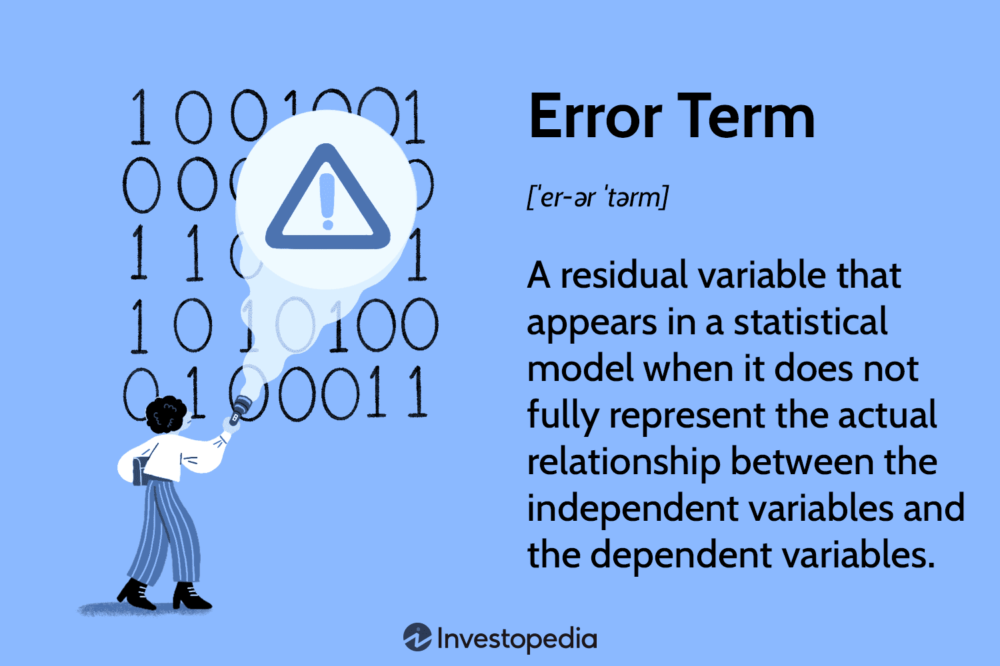

## Table of Contents

## What is an error term in statistics?

In statistics, an error term is a part of a model that represents the difference between the actual observed values and the values predicted by the model. Think of it as the leftover part that the model can't explain. For example, if you're trying to predict how much ice cream people will buy based on the temperature, the error term would include all the other factors that affect ice cream sales, like people's mood or special sales at the store.

Error terms are important because they help us understand how well our model works. If the error terms are small, it means our model is doing a good job at predicting the outcomes. But if the error terms are large, it means there are important factors we're missing in our model. By studying the error terms, statisticians can try to improve their models to make better predictions in the future.

## Why is the error term important in statistical models?

The error term is really important in statistical models because it shows us how well our model is doing. When we make a model to predict something, like how much ice cream people will buy, we can't predict everything perfectly. The error term is like the leftover part that our model can't explain. It includes all the little things we didn't think of, like maybe it was someone's birthday and they bought extra ice cream. By looking at the error term, we can see if our model is close to the real world or if we're missing something big.

Understanding the error term also helps us make our models better. If the error term is small, it means our model is doing a good job and most things are explained. But if the error term is big, it tells us there are important things we're not including in our model. For example, if we see that ice cream sales are way off on certain days, we might realize we need to add more factors, like holidays or special events, to our model. So, the error term is like a guide that helps us keep improving our predictions.

## How does the error term relate to the concept of residuals?

The error term and residuals are closely related in [statistics](/wiki/bayesian-statistics). The error term is part of a model that represents the difference between the actual observed values and the values predicted by the model. It's like the leftover part that the model can't explain. Residuals, on the other hand, are the actual differences between the observed values and the predicted values for each data point in your dataset. So, while the error term is a theoretical concept within the model, residuals are the real numbers you calculate after fitting the model to your data.

Think of it this way: the error term is what you expect to see if your model is correct, and residuals are what you actually see after using your model. For example, if you predict how much ice cream people will buy based on temperature, the error term is the general idea of all the other factors affecting sales. The residuals are the specific amounts by which your predictions are off for each day you have data. By studying the residuals, you can get a better sense of how well your model is working and where it might need improvement.

## What are the common sources of error in statistical data?

Errors in statistical data can come from many places. One big source is measurement error, which happens when the tools or methods we use to collect data aren't perfect. For example, if we're measuring people's heights with a tape measure that's a bit stretched out, our numbers might be off. Another source is sampling error, which occurs when we only study a part of a group instead of everyone in it. If we survey a small group of people to guess what everyone thinks, our guess might be wrong because the small group might not be exactly like the whole group.

Another common source of error is human error. This happens when people make mistakes while collecting or entering data. For instance, someone might write down the wrong number or mix up data from different people. There's also non-sampling error, which includes all other mistakes that aren't from sampling, like errors in how we design our study or how we ask questions in a survey. These errors can make our data less accurate and can affect the conclusions we draw from it.

Lastly, there's bias, which is a bit different from other errors but still important. Bias happens when our data or our methods favor certain outcomes over others, even if we don't mean for it to happen. For example, if we only survey people who are easy to reach, like those with phones, we might miss out on what others think. Bias can make our results misleading and can be hard to spot because it's often built into how we collect and analyze our data.

## Can you explain the difference between random error and systematic error?

Random error is like little mistakes that happen by chance and can go in any direction. Imagine you're trying to hit a bullseye with darts. Sometimes your dart might land a bit to the left, other times a bit to the right, and sometimes too high or too low. These errors don't have a pattern; they just happen randomly. In statistics, random errors can come from things like slight differences in how people answer a survey or small changes in the environment. They tend to cancel each other out over many measurements, so they don't usually throw off your results too much.

Systematic error, on the other hand, is more like a consistent mistake that keeps happening in the same way. Using the dart example again, if every time you throw, your dart always lands to the left of the bullseye, that's a systematic error. It's not random; it's a pattern. In statistics, systematic errors can come from things like a biased survey question that always pushes people to answer a certain way, or a measuring tool that's always off by the same amount. Unlike random errors, systematic errors don't cancel out, so they can really mess up your results if you don't catch them.

## How do you calculate the error term in a simple linear regression model?

In a simple linear regression model, the error term is the difference between the actual value of the thing you're trying to predict and the value your model predicts. Let's say you're trying to predict how many ice creams will be sold based on the temperature. You have a formula that looks something like this: Ice Cream Sales = a + b * Temperature. Here, 'a' is where the line starts on the graph, and 'b' is how steep the line is. When you plug in a temperature, you get a predicted number of ice creams sold. The error term is what's left over when you subtract this predicted number from the actual number of ice creams sold on that day.

For example, if the actual number of ice creams sold on a day when the temperature was 75 degrees was 100, but your model predicted 90 ice creams, the error term for that day would be 100 - 90 = 10. This error term tells you that your model was off by 10 ice creams on that day. You calculate the error term for every data point in your dataset. By looking at all these error terms, you can see how well your model is doing overall and where it might need some tweaking to make better predictions.

## What methods can be used to minimize the error term in statistical models?

To minimize the error term in statistical models, one of the best things you can do is make sure you're using the right data and enough of it. If you're trying to predict something, like how many ice creams will be sold, you need to collect data about all the things that might affect sales, like temperature, time of day, and maybe even holidays. The more data you have, the better your model can understand the patterns and make good predictions. Also, make sure your data is accurate and free from mistakes. If your data has a lot of errors or if you're missing important information, your model will have a harder time making good predictions.

Another way to reduce the error term is by choosing the right kind of model and tweaking it to fit your data better. Sometimes, a simple model might not be enough to explain everything, so you might need to use a more complex one that can handle more factors. You can also try different methods to see which one works best for your data. For example, you might try different ways to fit the line in a linear regression model to see which one gives you the smallest errors. By testing and adjusting your model, you can find the best way to predict your data and make the error term as small as possible.

## How does the error term affect the accuracy of predictions in regression analysis?

The error term in regression analysis is like the leftover part that your model can't explain. It shows the difference between what you actually see in your data and what your model predicts. If the error term is small, it means your model is doing a good job at predicting things. But if the error term is big, it means there are things your model isn't taking into account, which makes your predictions less accurate. So, the size of the error term is a big clue about how well your model is working.

To make your predictions more accurate, you need to pay attention to the error term. If you see that your error term is big, you might need to add more information to your model or try a different kind of model. For example, if you're trying to predict how many ice creams will be sold and your model keeps missing the mark, you might need to consider things like holidays or special events. By understanding and working to reduce the error term, you can make your regression model better at predicting what will happen in the future.

## What is the role of the error term in hypothesis testing?

In hypothesis testing, the error term helps us figure out if the differences we see in our data are real or just due to random chance. When we test a hypothesis, we're trying to see if something we think might be true actually is true. For example, we might want to know if a new medicine works better than an old one. We collect data and use a model to predict what would happen if our hypothesis was true. The error term is the part of our data that our model can't explain, and it shows us how much our predictions might be off just because of random errors.

By looking at the error term, we can decide if the differences we see are big enough to be meaningful, or if they could just be due to random chance. If the error term is small, it means our predictions are pretty close to what we actually see, so we can be more confident that our hypothesis is right. But if the error term is big, it means there's a lot of randomness in our data, and we might need to be more careful before saying our hypothesis is true. So, the error term helps us make better decisions in hypothesis testing by showing us how much we can trust our results.

## How can one assess the normality of the error term in regression analysis?

To check if the error term in a regression model is normal, you can use something called a normal probability plot or a Q-Q plot. This is a graph that compares your error terms to what you'd expect if they were perfectly normal. If the points on the plot follow a straight line, it means your error terms are likely to be normal. If the points are all over the place or don't follow the line well, it means your error terms might not be normal.

Another way to assess normality is by using a histogram of the residuals. A histogram is like a bar chart that shows how often different values of the error term show up in your data. If the histogram looks like a bell shape, with most of the values in the middle and fewer on the sides, that's a sign that your error terms are normal. If it looks different, like it's skewed to one side or has more than one peak, then your error terms might not be normal. By using these methods, you can get a good idea of whether your error terms are normal or not, which is important for making sure your regression model is working well.

## What advanced techniques exist for modeling the error term in time series analysis?

In time series analysis, one advanced technique for modeling the error term is using autoregressive integrated moving average (ARIMA) models. ARIMA models are really good at understanding patterns in data over time. They can break down the error term into parts that depend on past errors (the moving average part) and parts that depend on past values of the thing you're trying to predict (the autoregressive part). By doing this, ARIMA models can make better predictions and help you see if there are any patterns in the errors that you can use to improve your model. This is especially helpful when the errors in your data are not just random but have some kind of structure or pattern over time.

Another technique is using generalized autoregressive conditional heteroskedasticity (GARCH) models. GARCH models are useful when the size of the errors in your data changes over time. For example, if the errors get bigger or smaller in a way that you can predict, a GARCH model can help you understand and model that. By modeling how the size of the errors changes, GARCH models can make your predictions more accurate, especially in things like financial data where the ups and downs can be really important. Both ARIMA and GARCH models help you get a better handle on the error term in time series analysis, making your predictions more reliable and useful.

## How do heteroscedasticity and autocorrelation impact the error term, and how can these issues be addressed?

Heteroscedasticity and autocorrelation are two things that can mess up the error term in your statistical models. Heteroscedasticity happens when the size of the errors in your data changes a lot depending on the values of your variables. Imagine you're trying to guess how much people will spend on groceries. If the errors are small when people spend a little but huge when they spend a lot, that's heteroscedasticity. It can make your model less accurate because it's harder to predict things when the errors are all over the place. Autocorrelation, on the other hand, happens when the errors in your data are not random but follow a pattern over time. For example, if the error today is similar to the error yesterday, that's autocorrelation. This can also throw off your model because it means the errors are not just random noise but have some kind of order to them.

To deal with heteroscedasticity, you can use something called robust standard errors. These are special kinds of standard errors that can handle the changing size of the errors better. Another way is to change your model to make the errors more even, like by taking the log of your variables or using a different kind of model that can handle changing errors. For autocorrelation, you can use models like ARIMA that are made to understand patterns in the errors over time. These models can break down the errors into parts that depend on past errors and past values, helping you make better predictions. By understanding and addressing heteroscedasticity and autocorrelation, you can make your statistical models work better and give you more accurate results.

## What is an Error Term?

An error term is a critical component in statistical and mathematical models, representing the discrepancy between observed values and those predicted by the model. This residual variable is signified in equations by symbols such as $\varepsilon$ or $u$. In essence, error terms account for the variation in the dependent variable that is not explained by the independent variables included in the model.

Consider the simple linear regression model expressed as:

$$
Y = \alpha X + \beta + \varepsilon
$$

Here, $Y$ represents the dependent variable, $X$ is the independent variable, $\alpha$ is the coefficient of $X$, $\beta$ is the y-intercept, and $\varepsilon$ is the error term. The error term $\varepsilon$ embodies the part of $Y$ that cannot be captured by the deterministic term $\alpha X + \beta$. Therefore, it reflects all factors affecting $Y$ that are not explicitly modeled, including measurement errors, omitted variables, or inherent randomness in data.

Understanding error terms is vital for assessing the proficiency and validity of a model. The magnitude of an error term provides insight into the model's accuracy; smaller error terms suggest a model with higher predictive power, whereas larger ones may indicate potential improvements or adjustments needed in the model. Analysts often study the distribution and variance of error terms to ensure that the model assumptions, such as normality and homoscedasticity (equal variance), hold true. Any significant deviation can impact the credibility of statistical inferences drawn from the model.

Crucially, acknowledging and addressing error terms in model evaluation aids in developing more reliable and robust predictions, particularly in fields where decision-making relies heavily on statistical accuracy and reliability.

## How can one statistically calculate error terms?

Error terms are essential components of regression models, representing the degree of uncertainty and deviations between observed and predicted outcomes. In statistical regression, the goal is to model the relationship between dependent and independent variables accurately. However, not all variability in the data can be explained solely by the linear components of the model, leading to the introduction of an error term.

To calculate error terms, one typically begins with the regression equation: 

$$
Y = \alpha X + \beta \rho + \epsilon
$$

where:
- $Y$ is the dependent variable,
- $\alpha$ and $\beta$ are coefficients that represent the relationship strength between the dependent and independent variables,
- $X$ and $\rho$ are independent variables, 
- $\epsilon$ is the error term.

The error term $\epsilon$ in this equation accounts for the discrepancy between the observed values and those predicted by the model. It encapsulates all other factors impacting the dependent variable that are not included among the independent variables. 

The computation of the error term specifically involves examining the residuals, which are essentially the differences between observed values and those predicted by the regression function. If a data point $(X_i, Y_i)$ is considered, the residual $e_i$ can be expressed as:

$$
e_i = Y_i - (\alpha X_i + \beta \rho_i)
$$

A perfect model fit implies that all residuals equal zero, indicating that observed values fall precisely on the regression line. However, in practice, such precision is rare, and the presence of non-zero error terms suggests variance that the model does not account for. The error terms allow us to quantify this variance.

From a statistical perspective, evaluating these error terms involves analyzing their distribution and properties. Ideally, residuals should be randomly distributed with a mean of zero and constant variance (homoscedasticity). Deviations from these properties indicate potential problems like model misspecification or heteroscedasticity, affecting the model's reliability.

In Python, one might use libraries such as NumPy and scikit-learn to perform regression analysis and calculate error terms. Here is a simple illustration using linear regression:

```python
import numpy as np
from sklearn.linear_model import LinearRegression

# Sample data
X = np.array([[1], [2], [3], [4], [5]])
Y = np.array([2, 4, 6, 8, 10])

# Fit the linear regression model
model = LinearRegression().fit(X, Y)

# Predict the outcomes
predictions = model.predict(X)

# Calculate residuals (error terms)
residuals = Y - predictions
print("Residuals (Error Terms):", residuals)
```

This script fits a linear regression model to sample data and computes the residuals, offering a straightforward example of how error terms might be calculated and analyzed within a regression context.

## What are the techniques to address error term challenges?

To address challenges posed by error terms in statistical models used in [algorithmic trading](/wiki/algorithmic-trading), several techniques can be employed. These methods not only aim to improve model precision but also tackle common issues such as multicollinearity, overfitting, and the impact of outliers.

Regularization methods like Lasso (Least Absolute Shrinkage and Selection Operator) and Ridge regression are powerful tools for managing error term challenges. Both techniques are designed to handle multicollinearity by adding a penalty term to the regression equation, which helps to constrain and simplify the model. 

The Lasso regression introduces an L1 penalty, which can shrink some coefficients to zero, effectively performing variable selection. The optimization problem for Lasso is expressed as:

$$
\min \left(\sum_{i=1}^{n} \left(y_i - \sum_{j=1}^{p} \beta_j x_{ij}\right)^2 + \lambda \sum_{j=1}^{p} |\beta_j|\right)
$$

In contrast, Ridge regression applies an L2 penalty that penalizes the square of the coefficients, thus preventing any coefficient from having too high a value. This is formulated as:

$$
\min \left(\sum_{i=1}^{n} \left(y_i - \sum_{j=1}^{p} \beta_j x_{ij}\right)^2 + \lambda \sum_{j=1}^{p} \beta_j^2\right)
$$

In practice, these methods can be implemented using the `scikit-learn` library in Python as follows:

```python
from sklearn.linear_model import Lasso, Ridge

# Example data: X (features) and y (target)
X = [[1, 2], [2, 3], [3, 4], [4, 5]]
y = [2, 3, 4, 5]

# Lasso regression
lasso_model = Lasso(alpha=1.0)
lasso_model.fit(X, y)
lasso_coefficients = lasso_model.coef_

# Ridge regression
ridge_model = Ridge(alpha=1.0)
ridge_model.fit(X, y)
ridge_coefficients = ridge_model.coef_
```

Cross-validation is another critical technique to ensure that a model's performance is not an artifact of overfitting to the training data. It involves partitioning the dataset into subsets, training the model on some subsets (training set), and validating it on the remaining subsets (validation set). This process is repeated numerous times to give a robust estimate of model error. Cross-validation can be performed using:

```python
from sklearn.model_selection import cross_val_score
from sklearn.linear_model import LinearRegression

# Performing cross-validation
model = LinearRegression()
cv_scores = cross_val_score(model, X, y, cv=5)
average_cv_score = cv_scores.mean()
```

To mitigate the impact of outliers and skewed distributions on error terms, robust estimators and ensemble methods are essential. Robust estimators, such as the Huber and Theil-Sen estimator, reduce sensitivity to outliers by adjusting the loss function. Ensemble methods combine predictions from multiple models to improve generalization. Techniques such as bagging and boosting fall under this category and can help stabilize error terms across model predictions.

By integrating these techniques, algorithmic trading models can become more resilient to common data challenges, leading to more reliable and effective trading strategies.

## References & Further Reading

[1]: Bishop, C. M. (2006). ["Pattern Recognition and Machine Learning."](https://www.cs.uoi.gr/~arly/courses/ml/tmp/Bishop_book.pdf) Springer.

[2]: James, G., Witten, D., Hastie, T., & Tibshirani, R. (2013). ["An Introduction to Statistical Learning with Applications in R."](https://link.springer.com/book/10.1007/978-1-0716-1418-1) Springer.

[3]: Wooldridge, J. M. (2015). ["Introductory Econometrics: A Modern Approach."](https://books.google.com/books/about/Introductory_Econometrics_A_Modern_Appro.html?id=wUF4BwAAQBAJ) Cengage Learning.

[4]: ["Advances in Financial Machine Learning"](https://www.amazon.com/Advances-Financial-Machine-Learning-Marcos/dp/1119482089) by Marcos Lopez de Prado.

[5]: ["Quantitative Trading: How to Build Your Own Algorithmic Trading Business"](https://www.amazon.com/Quantitative-Trading-Build-Algorithmic-Business/dp/1119800064) by Ernest P. Chan.

[6]: ["The Econometrics of Financial Markets"](https://www.jstor.org/stable/j.ctt7skm5) by John Y. Campbell, Andrew W. Lo, and A. Craig MacKinlay.

[7]: Pedregosa, F., Varoquaux, G., Gramfort, A., Michel, V., Thirion, B., Grisel, O., ... & Duchesnay, É. (2011). ["Scikit-learn: Machine Learning in Python."](https://arxiv.org/abs/1201.0490) Journal of Machine Learning Research, 12, 2825-2830.