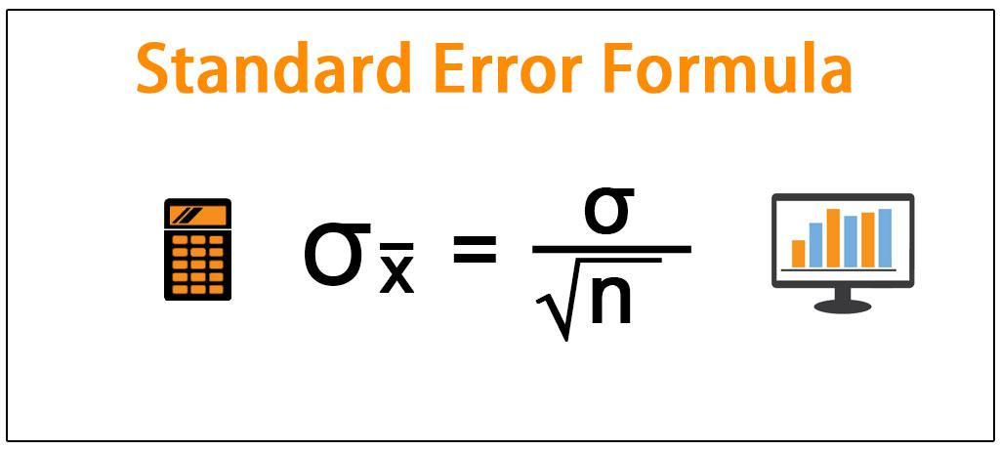

Understanding error terms is crucial in statistical modeling, particularly in the field of algorithmic trading. These error terms, often symbolized by ε or u, represent the discrepancies between observed values and those predicted by a statistical or mathematical model. In algorithmic trading, models are used to predict future market behaviors or to identify trading opportunities, and the accuracy of these predictions is significantly influenced by how well the model has accounted for potential error terms.

This article aims to demystify the concept of error terms and their importance in statistical calculations and algorithmic trading applications. We will discuss the definition of error terms and their role in evaluating the accuracy and reliability of models, especially within trading systems. Understanding how error terms interact with predictive modeling and trading strategies is essential for anyone looking to enhance their algorithmic trading techniques with robust statistical insights.



The analysis will cover how error terms appear in regression models, which are widely used to establish relationships between variables in trading algorithms. For instance, in a simple linear regression model represented as Y = αX + βρ + ε, the ε denotes the error term capturing the deviation from the model-predicted outcomes. Accurately calculating and interpreting these terms can aid in determining if a model fits the data accurately, highlighting areas where it might be overfitting or underfitting the observed data.

Furthermore, we will provide practical examples to illustrate how error terms are applied in trading strategies like statistical arbitrage and mean reversion. These strategies heavily rely on exploiting discrepancies indicated by error terms to achieve financial gains. The goal is to provide a foundational understanding for traders aiming to leverage error terms for optimized risk management, enhanced trade execution, and refined predictive modeling within algorithmic trading.

## Table of Contents

## What is an Error Term?

An error term is a critical component in statistical and mathematical models, representing the discrepancy between observed values and those predicted by the model. This residual variable is signified in equations by symbols such as $\varepsilon$ or $u$. In essence, error terms account for the variation in the dependent variable that is not explained by the independent variables included in the model.

Consider the simple linear regression model expressed as:

$$
Y = \alpha X + \beta + \varepsilon
$$

Here, $Y$ represents the dependent variable, $X$ is the independent variable, $\alpha$ is the coefficient of $X$, $\beta$ is the y-intercept, and $\varepsilon$ is the error term. The error term $\varepsilon$ embodies the part of $Y$ that cannot be captured by the deterministic term $\alpha X + \beta$. Therefore, it reflects all factors affecting $Y$ that are not explicitly modeled, including measurement errors, omitted variables, or inherent randomness in data.

Understanding error terms is vital for assessing the proficiency and validity of a model. The magnitude of an error term provides insight into the model's accuracy; smaller error terms suggest a model with higher predictive power, whereas larger ones may indicate potential improvements or adjustments needed in the model. Analysts often study the distribution and variance of error terms to ensure that the model assumptions, such as normality and homoscedasticity (equal variance), hold true. Any significant deviation can impact the credibility of statistical inferences drawn from the model.

Crucially, acknowledging and addressing error terms in model evaluation aids in developing more reliable and robust predictions, particularly in fields where decision-making relies heavily on statistical accuracy and reliability.

## Statistical Calculation of Error Terms

Error terms are essential components of regression models, representing the degree of uncertainty and deviations between observed and predicted outcomes. In statistical regression, the goal is to model the relationship between dependent and independent variables accurately. However, not all variability in the data can be explained solely by the linear components of the model, leading to the introduction of an error term.

To calculate error terms, one typically begins with the regression equation: 

$$
Y = \alpha X + \beta \rho + \epsilon
$$

where:
- $Y$ is the dependent variable,
- $\alpha$ and $\beta$ are coefficients that represent the relationship strength between the dependent and independent variables,
- $X$ and $\rho$ are independent variables, 
- $\epsilon$ is the error term.

The error term $\epsilon$ in this equation accounts for the discrepancy between the observed values and those predicted by the model. It encapsulates all other factors impacting the dependent variable that are not included among the independent variables. 

The computation of the error term specifically involves examining the residuals, which are essentially the differences between observed values and those predicted by the regression function. If a data point $(X_i, Y_i)$ is considered, the residual $e_i$ can be expressed as:

$$
e_i = Y_i - (\alpha X_i + \beta \rho_i)
$$

A perfect model fit implies that all residuals equal zero, indicating that observed values fall precisely on the regression line. However, in practice, such precision is rare, and the presence of non-zero error terms suggests variance that the model does not account for. The error terms allow us to quantify this variance.

From a statistical perspective, evaluating these error terms involves analyzing their distribution and properties. Ideally, residuals should be randomly distributed with a mean of zero and constant variance (homoscedasticity). Deviations from these properties indicate potential problems like model misspecification or heteroscedasticity, affecting the model's reliability.

In Python, one might use libraries such as NumPy and scikit-learn to perform regression analysis and calculate error terms. Here is a simple illustration using linear regression:

```python
import numpy as np
from sklearn.linear_model import LinearRegression

# Sample data
X = np.array([[1], [2], [3], [4], [5]])
Y = np.array([2, 4, 6, 8, 10])

# Fit the linear regression model
model = LinearRegression().fit(X, Y)

# Predict the outcomes
predictions = model.predict(X)

# Calculate residuals (error terms)
residuals = Y - predictions
print("Residuals (Error Terms):", residuals)
```

This script fits a linear regression model to sample data and computes the residuals, offering a straightforward example of how error terms might be calculated and analyzed within a regression context.

## Role of Error Terms in Algorithmic Trading

In [algorithmic trading](/wiki/algorithmic-trading), error terms significantly contribute to the validation and refinement of predictive models and trading strategies. These terms serve as indicators of a model's precision and can highlight issues such as overfitting or underfitting. Overfitting occurs when a model is excessively complex and captures noise in the data rather than the underlying trend. Error terms can reveal this by showing large discrepancies when the model is applied to new or out-of-sample data. Conversely, underfitting signifies a model that is too simplistic, failing to capture the data's complexity, which also becomes evident through high error terms.

The variability expressed by error terms is crucial for risk management. In trading, understanding and modeling this variability helps traders estimate the potential risk and expected return of their strategies. For example, large error terms may indicate high uncertainty, prompting traders to adjust their risk exposure or alter their trading strategy to account for unexpected price movements.

Backtesting, a fundamental step in developing algorithmic trading strategies, greatly benefits from the analysis of error terms. By evaluating a model's historical predictions against actual market outcomes, traders can use error terms to assess performance accuracy. A consistent pattern of large error terms during [backtesting](/wiki/backtesting) might suggest that the model needs adjustments, such as parameter fine-tuning or the inclusion of additional explanatory variables, to improve its predictive capability.

In practical terms, a small error term indicates a high level of precision in prediction, meaning the model closely forecasts real market behaviors. Therefore, managing and minimizing error terms enhances the execution of trades, as strategies become more reliable and align more accurately with anticipated market movements.

Mathematically, models in algorithmic trading often rely on linear regression, represented by the formula $Y = \alpha X + \beta + \epsilon$, where $\epsilon$ is the error term. The goal is to minimize these error terms across different market conditions to ensure robust trading models that can withstand market [volatility](/wiki/volatility-trading-strategies) and yield consistent performance. Leveraging statistical methods, such as mean squared error (MSE) and other metrics, helps in quantitatively assessing and optimizing these models, thus enhancing their utility in live trading environments.

## Examples of Error Term Application in Trading Strategies

Error terms are integral to various trading strategies, particularly in statistical [arbitrage](/wiki/arbitrage) and mean reversion. These strategies rely on error term analysis to exploit market inefficiencies and predict price movements.

In [statistical arbitrage](/wiki/statistical-arbitrage), error terms are used to identify and capitalize on pricing inefficiencies between related financial instruments. By constructing a model that predicts the expected prices of assets based on historical data, traders use error terms to determine deviations from predicted prices. When the observed price deviates significantly from the predicted price, it indicates a potential arbitrage opportunity. The formula $Y = \alpha X + \beta\rho + \epsilon$ can be utilized, where $\epsilon$ represents the error term. By monitoring the magnitude and direction of $\epsilon$, traders can make informed decisions to buy undervalued assets or sell overvalued ones, thereby profiting from the market's temporary inefficiencies.

Mean reversion strategies rely on the principle that asset prices will revert to a historical mean over time. Error term variability indicates the degree of price deviation from this mean. For instance, if a stock's price significantly deviates from its long-term average, represented by a large error term, a mean reversion strategy would predict that the price will eventually return to the average. The challenge lies in accurately capturing and interpreting the error terms to predict the reversion timing. Traders use statistical techniques to gauge the persistence of $\epsilon$ and determine optimal entry and [exit](/wiki/exit-strategy) points for trades.

Analyzing historical price data using regression models allows traders to predict future market movements. Error terms in these models indicate the uncertainty or inaccuracy of price predictions. A smaller error term suggests a model with high predictive accuracy, while larger error terms signal potential model improvements. Python, commonly used in trading algorithm development, provides libraries such as NumPy and Pandas for handling data regression. For example:

```python
import numpy as np
import pandas as pd
from sklearn.linear_model import LinearRegression

# Sample data
data = {'Price': [100, 101, 102, 98, 105], 'Time': [1, 2, 3, 4, 5]}
df = pd.DataFrame(data)

# Regression model
X = df[['Time']]
y = df['Price']
model = LinearRegression().fit(X, y)

# Predict and calculate error terms
predictions = model.predict(X)
error_terms = y - predictions

print("Error Terms:", error_terms)
```

In this code, the error terms are calculated by subtracting the predicted prices from the actual prices. Analyzing these terms helps traders refine their predictive models, improving accuracy and effectiveness in live trading scenarios.

In summary, error terms provide valuable insights into the efficacy of trading strategies. They enable traders to adjust their models, manage risk, and develop strategies that can better anticipate market movements.

## Techniques to Address Error Term Challenges

To address challenges posed by error terms in statistical models used in algorithmic trading, several techniques can be employed. These methods not only aim to improve model precision but also tackle common issues such as multicollinearity, overfitting, and the impact of outliers.

Regularization methods like Lasso (Least Absolute Shrinkage and Selection Operator) and Ridge regression are powerful tools for managing error term challenges. Both techniques are designed to handle multicollinearity by adding a penalty term to the regression equation, which helps to constrain and simplify the model. 

The Lasso regression introduces an L1 penalty, which can shrink some coefficients to zero, effectively performing variable selection. The optimization problem for Lasso is expressed as:

$$
\min \left(\sum_{i=1}^{n} \left(y_i - \sum_{j=1}^{p} \beta_j x_{ij}\right)^2 + \lambda \sum_{j=1}^{p} |\beta_j|\right)
$$

In contrast, Ridge regression applies an L2 penalty that penalizes the square of the coefficients, thus preventing any coefficient from having too high a value. This is formulated as:

$$
\min \left(\sum_{i=1}^{n} \left(y_i - \sum_{j=1}^{p} \beta_j x_{ij}\right)^2 + \lambda \sum_{j=1}^{p} \beta_j^2\right)
$$

In practice, these methods can be implemented using the `scikit-learn` library in Python as follows:

```python
from sklearn.linear_model import Lasso, Ridge

# Example data: X (features) and y (target)
X = [[1, 2], [2, 3], [3, 4], [4, 5]]
y = [2, 3, 4, 5]

# Lasso regression
lasso_model = Lasso(alpha=1.0)
lasso_model.fit(X, y)
lasso_coefficients = lasso_model.coef_

# Ridge regression
ridge_model = Ridge(alpha=1.0)
ridge_model.fit(X, y)
ridge_coefficients = ridge_model.coef_
```

Cross-validation is another critical technique to ensure that a model's performance is not an artifact of overfitting to the training data. It involves partitioning the dataset into subsets, training the model on some subsets (training set), and validating it on the remaining subsets (validation set). This process is repeated numerous times to give a robust estimate of model error. Cross-validation can be performed using:

```python
from sklearn.model_selection import cross_val_score
from sklearn.linear_model import LinearRegression

# Performing cross-validation
model = LinearRegression()
cv_scores = cross_val_score(model, X, y, cv=5)
average_cv_score = cv_scores.mean()
```

To mitigate the impact of outliers and skewed distributions on error terms, robust estimators and ensemble methods are essential. Robust estimators, such as the Huber and Theil-Sen estimator, reduce sensitivity to outliers by adjusting the loss function. Ensemble methods combine predictions from multiple models to improve generalization. Techniques such as bagging and boosting fall under this category and can help stabilize error terms across model predictions.

By integrating these techniques, algorithmic trading models can become more resilient to common data challenges, leading to more reliable and effective trading strategies.

## Conclusion

Error terms are crucial in refining the accuracy of algorithmic trading strategies. They provide insight into the uncertainties and discrepancies between predicted and actual outcomes, enabling traders to adjust their models with greater precision. By understanding these error terms, traders can better manage risk and enhance their predictions, ensuring that their strategies are not overfitted or underfitted to market data.

Advanced statistical techniques are instrumental in addressing challenges posed by error terms. Techniques such as regularization methods, including Lasso and Ridge regression, help prevent multicollinearity and improve model precision by penalizing larger coefficients that may contribute to overfitting. Additionally, cross-validation techniques can confirm the robustness of a model's performance, ensuring that error term reliability is maintained across different data samples.

Robust estimators and ensemble methods are also valuable in tackling outliers or skewed data distributions, which can introduce significant error terms if not properly accounted for. By employing these methods, traders can reduce the impact of such anomalies, thereby leading to more reliable and consistent trading strategies.

In conclusion, a comprehensive understanding of error terms and their implications, coupled with the application of advanced statistical methods, is essential for developing efficient and robust algorithmic trading models. These practices not only enhance the accuracy of predictions but also empower traders to execute more informed and strategic decisions in the market.

## References & Further Reading

[1]: Bishop, C. M. (2006). ["Pattern Recognition and Machine Learning."](https://www.cs.uoi.gr/~arly/courses/ml/tmp/Bishop_book.pdf) Springer.

[2]: James, G., Witten, D., Hastie, T., & Tibshirani, R. (2013). ["An Introduction to Statistical Learning with Applications in R."](https://link.springer.com/book/10.1007/978-1-0716-1418-1) Springer.

[3]: Wooldridge, J. M. (2015). ["Introductory Econometrics: A Modern Approach."](https://books.google.com/books/about/Introductory_Econometrics_A_Modern_Appro.html?id=wUF4BwAAQBAJ) Cengage Learning.

[4]: ["Advances in Financial Machine Learning"](https://www.amazon.com/Advances-Financial-Machine-Learning-Marcos/dp/1119482089) by Marcos Lopez de Prado.

[5]: ["Quantitative Trading: How to Build Your Own Algorithmic Trading Business"](https://www.amazon.com/Quantitative-Trading-Build-Algorithmic-Business/dp/1119800064) by Ernest P. Chan.

[6]: ["The Econometrics of Financial Markets"](https://www.jstor.org/stable/j.ctt7skm5) by John Y. Campbell, Andrew W. Lo, and A. Craig MacKinlay.

[7]: Pedregosa, F., Varoquaux, G., Gramfort, A., Michel, V., Thirion, B., Grisel, O., ... & Duchesnay, É. (2011). ["Scikit-learn: Machine Learning in Python."](https://arxiv.org/abs/1201.0490) Journal of Machine Learning Research, 12, 2825-2830.