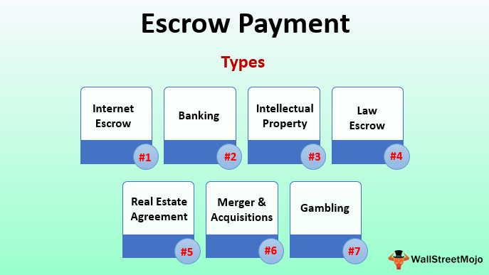

Understanding financial transactions can often be complex, especially when significant sums are involved. Here, the concept of escrow agreements becomes pivotal. An escrow agreement is a crucial tool that provides security and ensures compliance with the terms of various deals, acting as a safeguard for both parties involved in a transaction. Escrow agreements are particularly beneficial when trust is a concern or when the transaction involves significant amounts of money or assets. 

The digital age has introduced new dimensions to escrow, making it increasingly relevant in areas such as real estate, online transactions, and trading. Real estate transactions, for instance, often utilize escrow to protect both the buyer and seller until the terms of the sale are satisfied. Similarly, in the rapidly evolving landscape of online transactions, escrow services are invaluable in protecting buyers and sellers from potential fraud. Furthermore, the rise of algorithmic trading has highlighted the need for robust escrow mechanisms to ensure secure and efficient fund transfers.

This article examines the different types of escrow agreements and explores their growing significance in algorithmic trading, where the necessity to manage risk and ensure seamless transactions is paramount. The role of escrow in these various settings underscores its importance as a foundational element in modern financial ecosystems.

## Table of Contents

## What is an Escrow Agreement?

An escrow agreement is a legal arrangement in which a third party, known as the escrow agent, holds an asset or funds on behalf of two other parties involved in a transaction until the fulfillment of predefined conditions laid out in the contract. This mechanism ensures that the asset or funds are only transferred to the rightful party once all conditions stipulated in the agreement are satisfied, providing a vital layer of security and trust in financial transactions.

The involvement of an independent escrow agent is crucial in this setup, as it guarantees that all parties' contractual obligations are adhered to. The escrow agent acts as a neutral intermediary, ensuring that neither party has an unfair advantage over the other. By doing so, it mitigates the risks associated with direct transactions between parties who may not fully trust each other, thus offering a safety net that underpins the integrity of the transaction process.

Escrow agreements are widely utilized across various fields due to their versatility and reliability. In real estate, for example, an escrow agreement might be used to hold a buyer's funds until all conditions of the property sale are met, such as inspections and title searches. This ensures that the buyer's investment is protected until the property is fully ready for transfer. Similarly, in business mergers and acquisitions, an escrow arrangement may be employed to hold a portion of the purchase price until the completion of a due diligence process. This ensures that the buying party is protected against any undisclosed liabilities or risks that may arise during the due diligence period.

## How Escrow Agreements Work

An escrow agreement operates as a protective mechanism wherein a neutral third party—known as the escrow agent—holds and regulates the payment of funds or assets for the involved parties until predefined conditions are met. This financial arrangement begins when a depositor places funds or other assets in custody with the escrow agent. The agent acts according to the terms specified in the contract, ensuring that all conditions are satisfied before the assets are transferred to the intended beneficiary.

The process enhances the security of transactions by ensuring that both parties fulfill their obligations. For instance, in a real estate transaction, the buyer deposits the purchase funds with the escrow agent, who then verifies that the seller has met all contractual terms, such as providing title clearance. Only when these conditions are satisfied does the escrow agent disburse the funds to the seller, completing the transaction.

In broader applications, escrow agreements serve to manage and mitigate risks. They establish a trust framework where the parties can confidently fulfill their contractual duties. By doing so, these agreements play a pivotal role in maintaining the integrity and reliability of the transaction process. This structured approach is integral in protecting the interests of all parties involved, providing a dependable solution for complex financial dealings.

## Types of Escrow Agreements

Escrow agreements serve as essential mechanisms in various types of transactions, providing a secure and neutral way to manage assets. Here are the primary types of escrow agreements that are widely utilized:

### Real Estate Escrow

In real estate transactions, escrow agreements are integral to ensuring that monetary funds and property deeds are handled correctly before the closure of a property deal. When a buyer and seller agree on a property sale, an escrow agent holds the buyer's funds and any necessary documents such as the deed until all sale conditions are met. This includes clearing any liens or required inspections and ensuring financing is secured. The escrow process protects both parties by guaranteeing that the transaction only completes when all parties have fulfilled their contractual obligations.

### Business Acquisition or Merger Escrow

During mergers and acquisitions, escrow agreements act as a reserve of protection by holding a portion of the purchase price. This escrowed amount is released only after completed due diligence, which typically involves assessment of liabilities, verification of assets, and adherence to any other agreed-upon conditions. This type of escrow is crucial for mitigating risks inherent in business transitions and ensures that any unforeseen financial discrepancies or liabilities discovered post-transaction do not unfairly disadvantage the buyer.

### Online Transaction Escrow

With the expansion of e-commerce, online transaction escrow has become pivotal in safeguarding payments between buyers and sellers. An escrow service ensures that buyers receive the goods or services they pay for, and in turn, sellers are guaranteed payment once the buyer confirms satisfactory receipt of the product or service. This form of escrow is especially useful in high-value online transactions where the parties are unfamiliar with each other, as it builds trust by acting as an impartial intermediary.

### Intellectual Property Escrow

In the tech industry, intellectual property (IP) escrow is a specialist tool that secures the transfer of technology and related intellectual assets. It often involves the deposit of source code, proprietary data, or other critical technology components with an escrow agent. This deposit protects all parties by ensuring that the technology can be accessed or released under predefined conditions, such as the failure of the technology provider to meet service obligations or in cases of business discontinuity. Intellectual property escrow thus ensures that contractual terms are adhered to and that the rights and assets of all parties are safeguarded. 

Overall, escrow agreements are adaptable to a range of transaction environments, consistently providing the reliability and security needed to foster trust and compliance among parties.

## Escrow in Algorithmic Trading

Algorithmic trading involves the execution of financial transactions through complex, automated algorithms that manage massive volumes at unprecedented speeds. The introduction of escrow agreements into this domain ensures the secure handling of funds, creating an environment where trading algorithms can operate effectively under predefined conditions. These escrow protocols serve to protect both parties in a transaction, as assets are only released once all stipulated criteria have been met. This ensures the integrity and security of the entire trading process.

In [algorithmic trading](/wiki/algorithmic-trading), time and precision are of the essence, with trades often occurring in microseconds. Given this rapid pace, the traditional methods of trust and verification face challenges, making escrow agreements indispensable for mitigating risks. For example, an algorithmic trading firm might engage in high-frequency trading ([HFT](/wiki/high-frequency-trading-strategies)), executing thousands of trades per second. Escrow mechanisms enable these transactions to proceed with reduced risk by holding funds securely until the successful execution of trades. This helps prevent losses that could arise from system errors or fraudulent activities.

Consider a scenario where a [hedge fund](/wiki/hedge-fund-trading-strategies) uses an algorithm to execute trades on multiple exchanges. The algorithm is programmed to identify [arbitrage](/wiki/arbitrage) opportunities across these platforms. An escrow agreement can secure the fund's capital, releasing it only when the algorithm confirms that it has executed all trades according to the strategic plan. This arrangement minimizes potential risks, such as the execution of trades at incorrect prices or partial completion of the trading strategy.

Moreover, as algorithmic trading often involves interactions across various jurisdictions, escrow agreements offer a standardized protocol that can be trusted across different legal and financial environments. They serve as a neutral intermediary, ensuring compliance and reducing the potential for disputes between parties that may not have an established history of trust.

The prevalence of high-speed, high-[volume](/wiki/volume-trading-strategy) transactions in algorithmic trading makes it crucial to use escrow to mitigate strategic and operational risks. By leveraging escrow agreements, firms ensure transaction security and operational integrity, essential for maintaining trust in the increasingly complex landscape of financial technology.

## Benefits of Using Escrow

Escrow agreements offer several significant benefits that enhance the security and trustworthiness of financial transactions. One of the primary advantages is the increased security of transactions. By ensuring that assets are only released when all contractual obligations have been met, escrow agreements minimize the possibility of fraud and default. This security feature is particularly beneficial in situations where substantial sums or valuable assets are involved, thereby safeguarding the interests of all parties.

Moreover, escrow agreements serve as a neutral intermediary between parties who may not have prior knowledge or trust in each other. This impartial position fosters a level of trust that is essential for the successful execution of high-stakes transactions. For instance, in an online transaction scenario, a buyer may be hesitant to transfer funds directly to an unfamiliar seller. In such cases, an escrow service can act as a trusted third party, holding the funds until the buyer confirms satisfactory receipt of goods or services.

Legal safeguards provided by escrow agreements further enhance transaction reliability. In the case of a dispute, the escrow agreement provides a clear framework for resolving issues based on predefined conditions. This recourse helps ensure that all parties adhere to the terms of the contract while providing legal protection. An escrow account often includes detailed documentation that specifies the conditions for the release of funds or assets, thus offering a legally enforceable path to resolution if disagreements arise.

These benefits make escrow agreements a valuable tool in contemporary financial ecosystems. By boosting security, ensuring impartiality, and providing legal recourse, escrow services play a crucial role in facilitating complex transactions safely and efficiently. This is particularly true in areas such as real estate, mergers and acquisitions, and digital marketplaces, where the stakes are typically high, and trust is paramount.

## Challenges and Risks in Escrow

Selecting a reliable escrow agent is of paramount importance, as a poor selection could lead to compromised transactions. The role of an escrow agent is to act as a neutral third party, safeguarding assets until the terms of a contract are fulfilled. If an escrow agent fails to uphold these responsibilities, parties involved may suffer financial losses or legal disputes. Careful due diligence is necessary when choosing an agent, including verifying their credentials, reviewing client testimonials, and understanding their operational procedures.

Legal scrutiny and jurisdictional variances add complexities to the effective use of escrow services. Different regions have specific laws governing escrow transactions, which can impact how agreements are executed. These laws can dictate the types of assets permissible, the responsibilities of the escrow agent, and the recourse available in the event of a breach. Failure to comply with local escrow legislation can lead to significant legal challenges. For instance, an escrow agreement valid in one jurisdiction may be rendered void in another due to conflicting legal requirements. It is essential for parties to consult legal experts to ensure compliance with local regulations.

Escrow costs can be another significant barrier, especially in transactions involving considerable sums or unique assets. Typically, escrow fees are a percentage of the transaction value, which means that higher-value transactions incur substantial costs. While these fees cover the services provided by the escrow agent, including the management and security of assets, they may deter parties from utilizing escrow services altogether. Therefore, it's critical for stakeholders to weigh the cost of escrow against the potential risk of proceeding without it. Negotiating fees or exploring various escrow providers might offer more cost-effective solutions.

In sum, while escrow agreements are integral to secure and trustworthy transactions, they come with their own set of challenges. Careful selection of an escrow agent, strict adherence to jurisdictional laws, and judicious management of associated costs are essential to mitigate risks and leverage the benefits of escrow services effectively.

## Conclusion

Escrow agreements are indispensable components of contemporary financial ecosystems, functioning as safeguards across various sectors from real estate transactions to high-tech interactions involving algorithmic trading. This mechanism ensures that all parties involved in a transaction fulfill their contractual obligations before assets are exchanged, thereby reducing the potential for fraud and enhancing overall transaction security.

With the rise of financial technology and the increasing complexity of algorithmic trading, the demand for robust escrow services has grown significantly. Algorithmic trading, characterized by its reliance on automated, high-frequency transactions, necessitates a reliable framework for the secure handling of funds. Escrow agreements provide this by holding assets until predetermined criteria are met, thus mitigating risks and ensuring compliance with trading algorithms.

In the diverse landscape of financial transactions, understanding the different types of escrow agreements is crucial for anyone looking to engage in secure and efficient trading. These agreements not only promote trust between unfamiliar parties by acting as neutral intermediaries but also offer legal recourse in the event of a dispute. The significance of this is especially apparent in high-value transactions, where the stakes are considerably higher, and the consequences of missteps can be severe.

In conclusion, as the complexity and volume of financial transactions increase in the digital age, the role of escrow agreements will continue to expand. This makes grasping their applications and benefits an essential skill for individuals and businesses aiming to navigate today's financial world with confidence and security.

## References & Further Reading

[1]: Redding, R. E. (2007). ["Escrow Explained: How It Works for Homebuyers and Everyday Transactions."](https://thetresgroup.com/escrow-explained-how-it-works-and-why-you-need-it/) Outlook Magazine. 

[2]: Zaccone, G., & Karim, V. (2017). ["Deep Learning with TensorFlow: Explore Neural Networks and Build Intelligent Systems."](https://books.google.com/books/about/Deep_Learning_with_TensorFlow.html?id=C0IwDwAAQBAJ) Packt Publishing.

[3]: Allen, R. E. (2012). ["Algorithmic Trading: Winning Strategies and Their Rationale."](https://www.wiley.com/en-us/Algorithmic+Trading%3A+Winning+Strategies+and+Their+Rationale-p-9781118460146) Wiley.

[4]: Macmillan, J. & Gonzalez, A. (2013). ["Risk Management in Trading."](https://psycnet.apa.org/record/2012-27793-003) Wiley.

[5]: Tian, F. (2016). ["An agend-based escrow services model for trustworthy e-commerce: Formation and verification."](https://www.frontiersin.org/journals/blockchain/articles/10.3389/fbloc.2020.00007/full) Science Elsevier.