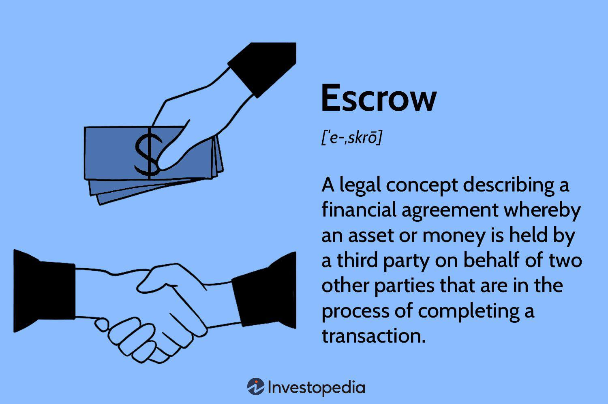

The world of financial transactions is complex and constantly evolving. In this article, we explore how escrow processes and receipts play a vital role in financial transactions, particularly in the context of algorithmic trading. Traditionally, escrow serves as a reliable intermediary to ensure that parties involved in a transaction meet their agreed-upon obligations before any exchange of funds or assets occurs. By securely holding assets or funds until predetermined conditions are fulfilled, escrow mitigates the risks inherent in financial exchange, fostering trust and compliance.

Algorithmic trading, a rapidly growing sector within financial markets, requires high-speed execution of trades and precise transaction handling. The integration of escrow services into these systems ensures robust security and minimizes discrepancies, making it an essential component for traders focusing on high-value activities such as trading stocks, buying properties, or dealing in cryptocurrencies. Understanding these processes is crucial for anyone navigating the complexities of today's financial landscape, as they offer a safeguard against potential financial pitfalls while enhancing the integrity of transactions.



## Table of Contents

## Understanding Escrow in Financial Transactions

Escrow refers to a financial arrangement wherein a neutral third party is entrusted with holding and regulating the distribution of funds or assets during a transaction between two involved parties. This intermediary role is pivotal in guaranteeing that the buyer and seller adhere to their pre-established terms before funds or assets are exchanged, thereby ensuring both security and compliance.

The escrow process is particularly significant in scenarios where the transaction involves substantial risk, complexity, or a lack of trust between parties. It is most commonly observed in real estate, where escrow accounts are often employed to manage funds until all conditions of a property sale are met. This includes ensuring that the purchase price is paid, necessary inspections are completed, and property titles are clear, thus reducing the risk for both buyers and sellers.

In business acquisitions, escrow serves as a safeguard by holding payments until contractual obligations, such as the transfer of business assets or the satisfaction of regulatory approvals, are fully met. By functioning as a financial buffer zone, escrow arrangements mitigate risks associated with the transaction.

The growing prevalence of online transactions has also seen an increased reliance on escrow services to foster trust and safety. In digital commerce, where buyers and sellers may never meet, escrow intermediaries ensure that payments are only released when the buyer is satisfied with the goods or services received. This reduces the risk of fraud significantly and builds confidence in online marketplaces.

In summary, escrow arrangements are integral to managing risk and fostering trust in various financial transactions. By holding funds or assets until all transaction criteria are met, escrow services play a crucial role in ensuring both parties fulfill their contractual obligations, thereby facilitating smoother and more secure exchanges.

## The Role of Escrow Receipts

An escrow receipt serves as a pivotal component in financial transactions, providing a confirmation from a financial institution that certifies the availability of funds or assets required for a particular transaction. This document acts as a reassuring guarantee for the buyer, ensuring that the financial resources will be accessible once the transaction conditions are satisfactorily met. This arrangement significantly minimizes the risk of financial loss for the involved parties by ensuring that the committed funds or assets are appropriately secured until transaction completion.

In options trading, the significance of escrow receipts becomes even more profound. Here, these receipts play a key role in confirming that the option writer possesses the necessary securities to fulfill the transaction commitments, should the need arise. This confirmation is crucial because it underpins the integrity and trustworthiness of options markets, where the potential for rights and obligations to trade on future dates is a foundational principle.

The utilization of escrow receipts in these contexts functions as a safeguard, ensuring that all financial commitments associated with the transaction are upheld with precision. By doing so, they help reduce the incidence of default by either party, thus enhancing the overall stability and reliability of financial markets.

In summary, escrow receipts are indispensable tools in financial transactions, both for verifying the availability of funds and for ensuring the fulfillment of obligations in options trading, thereby contributing to a more secure and stable trading environment.

## Integrating Escrow in Algorithmic Trading

Algorithmic trading has transformed the financial sector by leveraging advanced mathematical models and algorithms to execute trades at remarkable speeds and frequencies. In such a dynamic environment, the precision and security of transactions are paramount, and escrow services play a crucial role in ensuring these elements are met. By serving as an unbiased financial intermediary, escrow mitigates the risks inherent in high-frequency trading.

The integration of escrow services into [algorithmic trading](/wiki/algorithmic-trading) platforms enhances transaction security. The [volatility](/wiki/volatility-trading-strategies) and rapid pace of algorithmic trades heighten the potential for discrepancies or fraud. Escrow acts as a safeguard, ensuring that funds or assets are only exchanged once all predetermined conditions have been met. This added security is vital for maintaining trust in these platforms, reassuring both institutional and retail traders of the integrity of their transactions.

Moreover, the presence of escrow services in algorithmic trading enhances operational efficiency. By providing a mechanism for verified and secure fund transfers, escrow reduces the administrative burden associated with validating each transaction manually. This automation of trust allows traders to focus on refining their trading strategies without the constant concern of verifying counterparties' credentials or the legitimacy of available funds.

Mathematically, escrow can be represented as a conditional account that holds variable assets until a specific transaction condition $C$ is satisfied. In pseudocode, this can be understood as:

```python
def escrow_service(transaction_amount, condition):
    escrow_account = hold_funds(transaction_amount)
    if check_condition(condition):
        release_funds(escrow_account)
    else:
        return_funds_to_originator(escrow_account)
```

By implementing such logical procedures, escrow services reinforce the transactional framework within algorithmic trading systems.

In summary, the role of escrow in algorithmic trading cannot be overstated. Through secure and automated fund handling, escrow enhances the trust and efficiency of trading platforms, benefiting all market participants engaged in this fast-paced trading environment. As financial technologies continue to advance, the integration and adaptation of escrow processes remain pivotal for ensuring sustainable and secure trading practices.

## Special Considerations in Using Escrow Services

When choosing escrow services, several key considerations ensure the safe and effective management of transactions. Reputation is paramount; selecting an escrow service with a solid track record and positive feedback from past clients can significantly reduce the risk of fraud or mismanagement. This can be verified through industry reviews, certifications, and endorsements by reputable organizations. 

Additionally, understanding the fee structure is crucial. Escrow services often charge a percentage of the transaction amount or a flat fee, depending on the transaction's complexity and size. Clients should ensure these fees are transparent, competitive, and within budgetary constraints, as hidden costs could affect the transaction's final financial outcome.

Compliance with regulatory requirements cannot be overstated. Escrow services must adhere to the legal frameworks governing financial transactions in their operational jurisdiction. For international transactions, the complexity increases, as laws differ from one region to another. Engaging a legal expert familiar with these variances is advisable to navigate the potential pitfalls in international transactions.

Security measures are another critical consideration. The escrow service must employ robust security protocols to protect sensitive financial information and assets. This includes the use of advanced encryption technologies, multi-[factor](/wiki/factor-investing) authentication, and regular security audits. Data breaches or lapses in security could lead to significant financial and reputational damage.

Overall, when choosing escrow services, stakeholders must prioritize reputation, transparency in fees, legal compliance, and the implementation of rigorous security measures to safeguard their financial interests.

## Examples of Escrow in Financial Transactions

Escrow services play a critical role in various financial transactions by acting as a neutral third party that holds funds or assets until specific conditions are met. In the real estate sector, escrow accounts serve as a secure mechanism to handle funds necessary for property transactions. These accounts ensure that the agreed-upon conditions in a sale contract are met before funds are released. Typically, a buyer deposits the purchase price into an escrow account, where it is held until all conditions, such as property inspections and loan approvals, are satisfied, thereby protecting both buyer and seller from potential loss or fraud.

In the context of options trading, escrow receipts are crucial to ensuring that the writer, or seller, of an option holds sufficient underlying securities to meet their contractual obligations if the buyer decides to exercise the option. This mechanism not only provides assurance to the buyer but also stabilizes the market by reducing the risk of default. An escrow receipt confirms the availability of these securities, thus maintaining trust in the trading process.

Additionally, escrow services are invaluable in the e-commerce sector, particularly for high-value transactions. By securely holding funds until both parties fulfill the transaction terms, escrow services help mitigate the risk of fraud. When a buyer makes a purchase, the payment is temporarily held in escrow, and it is only released once the buyer has received and is satisfied with the purchased goods or services. This process protects both buyers and sellers from the risk of non-compliance and ensures a fair transaction. Such utilization of escrow services boosts consumer confidence, promoting safer online commerce environments.

## Conclusion

Escrow services are essential tools for modern financial transactions, offering security, trust, and compliance. As financial processes grow increasingly complex, particularly with the advent of high-speed algorithmic trading, the need for trustworthy intermediaries like escrow providers cannot be overstated. Escrow plays a pivotal role in these transactions by ensuring all parties fulfill their obligations, thus maintaining transaction integrity even when trades occur at rapid speeds.

In algorithmic trading, where trades are executed based on pre-defined criteria and algorithms, the precision and speed at which these trades are conducted demand robust safeguards to prevent discrepancies or fraud. Escrow services meet this need by serving as custodians of the funds or assets involved, thereby enhancing trust among trading parties. By integrating escrow into algorithmic trading platforms, traders—both institutional and retail—gain an extra layer of security, ensuring that transactions are protected, and conditions are precisely met.

As financial markets continue to evolve, the application of escrow services is expected to expand, safeguarding a broader range of transactions. This expansion is not only confined to traditional financial sectors such as real estate and business acquisitions but also extends to emerging fields like cryptocurrencies and digital assets. In these dynamic markets, escrow's role as a security mechanism becomes even more critical, providing assurance to all parties involved in high-value transactions.

In summary, escrow remains indispensable to the financial ecosystem, enabling secure, trusted, and compliant transactions across various sectors. As trading technologies advance, so too will the mechanisms for ensuring transaction security, with escrow services at the forefront of this evolution.

## References & Further Reading

[1]: Stephenson, T. (2020). ["The Complete Guide to Escrow and Title."](https://registration.jennair.ca/About/book-search/Download_PDFS/the%20complete%20idiots%20guide%20to%20writing%20your%20family%20history%20lynda%20rutledge%20stephenson.pdf) Harper Publishing.

[2]: Smith, C., & Vigna, P. (2018). ["The Truth Machine: The Blockchain and the Future of Everything."](https://books.google.com/books/about/The_Truth_Machine.html?id=37QoDwAAQBAJ) St. Martin's Press.

[3]: Choudhry, M. (2004). ["Structured Credit Products: Cash and Synthetic Securities."](https://archive.org/details/structuredcredit0000chou) John Wiley & Sons.

[4]: Hasbrouck, J. (2007). ["Empirical Market Microstructure: The Institutions, Economics, and Econometrics of Securities Trading."](https://archive.org/details/empiricalmarketm0000hasb) Oxford University Press.

[5]: Sussman, K. (2016). ["Algorithmic Trading and DMA: An Introduction to Direct Access Trading Strategies."](https://archive.org/details/algorithmictradi0000john) 4th Edition.