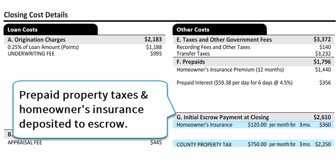

## Table of Contents

## What is an escrow receipt?

An escrow receipt is a document that shows you have put money or something valuable into an escrow account. An escrow account is like a safe place where a third party holds your money or valuable item until certain conditions are met. For example, when you buy a house, you might put your down payment into an escrow account until the sale is complete.

This receipt is important because it proves that you have done your part in the deal. It gives you a record that you can use if there are any problems later. The receipt will have details like the amount of money or the item you put in, the date, and who is holding it for you. It helps keep everything clear and fair for everyone involved.

## What is the purpose of an escrow receipt?

An escrow receipt is important because it acts as proof that you have put money or something valuable into an escrow account. This account is like a safe place where a third party holds your money or item until everyone agrees that certain conditions are met. The receipt helps to make sure that everyone knows you have done your part in the deal. It's a way to keep things clear and fair for all people involved.

Having an escrow receipt also gives you something to refer to if there are any disagreements or problems later on. It includes important details like the amount of money or the item you put in, the date, and who is holding it for you. This document helps to build trust between the people in the deal because it shows that you are serious about following through with your part of the agreement.

## How does an escrow receipt work?

An escrow receipt works by showing that you have put money or something valuable into an escrow account. This account is like a safe place where a third party holds your money or item until everyone agrees that certain conditions are met. For example, when you buy a house, you might put your down payment into an escrow account. The escrow receipt is a piece of paper or a digital document that proves you have done this. It has details like how much money you put in, the date, and who is holding it for you.

Once you get the escrow receipt, it helps keep the deal fair and clear for everyone involved. If there are any disagreements or problems later, you can use the receipt to show that you did your part. It's like a promise that you are serious about following through with your part of the agreement. The escrow receipt builds trust between the people in the deal because it shows that you are committed to making sure everything goes smoothly until the end.

## Who are the parties involved in an escrow receipt?

An escrow receipt involves three main parties: the buyer, the seller, and the escrow agent. The buyer is the person who puts money or something valuable into the escrow account. They want to make sure the seller does their part of the deal before they get their money or item back. The seller is the person who will get the money or item from the escrow account once they meet the agreed conditions. They want to be sure the buyer is serious and has the money or item ready.

The escrow agent is the third party who holds the money or item in the escrow account. They make sure everything is fair and that the money or item only goes to the seller when all the conditions are met. The escrow agent gives the buyer the escrow receipt as proof that they have put their money or item into the account. This receipt helps keep the deal clear and fair for everyone involved.

## What are the common uses of escrow receipts?

Escrow receipts are commonly used when people buy or sell things like houses, cars, or businesses. For example, when you buy a house, you might put your down payment into an escrow account. The escrow receipt shows that you have paid the money and helps keep the deal fair until everything is ready for you to get the house. It's like a promise that the money is safe and will only go to the seller when they give you the house keys.

Another common use of escrow receipts is in online transactions, especially for expensive items or services. If you're buying something valuable from someone you don't know well, you can use an escrow service. You put your money into an escrow account, and the seller sends you the item. Once you get the item and you're happy with it, the money goes to the seller. The escrow receipt proves that you paid and helps make sure the deal is fair and safe for both of you.

In business deals, escrow receipts can also be used when companies are buying or merging with other companies. When one company agrees to buy another, they might put the payment into an escrow account. The escrow receipt shows that the buying company has the money ready. It helps make sure the deal goes smoothly and that the money only goes to the selling company when all the conditions of the deal are met.

## What are the key components of an escrow receipt?

An escrow receipt has a few important parts that make it useful. It shows how much money or what item you put into the escrow account. This is really important because it proves that you did your part in the deal. The receipt also has the date when you put the money or item into the account. This helps keep track of when things happened. Another key part is the name of the escrow agent, the third party who is holding your money or item until everything is ready.

The escrow receipt also includes details about the buyer and the seller. This helps everyone know who is involved in the deal. It might have the names and contact information of both the buyer and the seller. Sometimes, the receipt will also say what the money or item is for, like buying a house or a car. All these parts together make the escrow receipt a clear and fair way to show that you are serious about following through with your part of the agreement.

## How is an escrow receipt different from an escrow agreement?

An escrow receipt is a document that shows you have put money or something valuable into an escrow account. It is like a proof that you did your part in the deal. The receipt has details like how much money you put in, the date, and who is holding it for you. It helps keep everything clear and fair for everyone involved in the deal.

An escrow agreement, on the other hand, is a contract between the buyer, the seller, and the escrow agent. It explains the rules and conditions of the deal. It says what needs to happen before the money or item can go from the escrow account to the seller. While the escrow receipt shows that you have put money into the account, the escrow agreement is all about the terms and conditions that everyone needs to follow.

## What are the legal implications of using an escrow receipt?

Using an escrow receipt has some important legal implications. It acts as a legal proof that you have put money or something valuable into an escrow account. This means it can be used in court if there are any disagreements or problems with the deal. If someone says you didn't pay, you can show the escrow receipt to prove that you did. It helps to keep things fair and clear for everyone involved.

Another legal aspect is that the escrow receipt is part of the bigger escrow agreement. This agreement sets out the rules and conditions that everyone needs to follow. If the terms of the escrow agreement are not met, the escrow agent can hold onto the money or item until everything is sorted out. The escrow receipt is a key piece of evidence that shows you followed the agreement by putting your money or item into the account.

## Can you provide examples of escrow receipts in real estate transactions?

When you buy a house, you might put your down payment into an escrow account. The escrow receipt shows that you paid the money. For example, if you are buying a house for $300,000 and your down payment is $30,000, you would put that $30,000 into an escrow account. The escrow receipt would say that you paid $30,000 on a certain date, and it would name the escrow agent who is holding the money. This receipt helps make sure the seller knows you are serious about buying the house and that the money is safe until everything is ready for you to get the house.

Another example is when you are selling a house and the buyer wants to make sure everything is okay before they pay the full amount. The buyer might put some money into an escrow account as a deposit. The escrow receipt would show that the buyer paid this deposit. For instance, if the buyer puts $5,000 into the escrow account as a good faith deposit, the receipt would show this amount, the date, and who is holding the money. This receipt helps the seller feel confident that the buyer is serious about the deal and that the money will be there when it's time to close the sale.

## How do escrow receipts function in online transactions?

In online transactions, escrow receipts help keep things safe and fair for everyone involved. When you want to buy something expensive from someone you don't know well, you can use an escrow service. You put your money into an escrow account, and the seller sends you the item. The escrow receipt shows that you paid the money and helps make sure the deal is fair. It has details like how much money you put in, the date, and who is holding it for you. This receipt is important because it proves you did your part in the deal and helps keep everything clear and fair.

Once you get the item and you're happy with it, the money goes to the seller. The escrow receipt is like a promise that the money is safe and will only go to the seller when you get what you paid for. If there are any problems, like the item not being what you expected, you can use the escrow receipt to show that you paid and ask for your money back. This helps build trust between you and the seller because it shows that you are serious about following through with your part of the agreement.

## What are the risks associated with escrow receipts and how can they be mitigated?

Using escrow receipts can have some risks. One big risk is if the escrow agent is not honest or goes out of business. If this happens, your money or item might not be safe. Another risk is if the buyer and seller don't agree on the terms of the deal. If they can't agree, the money or item might stay in the escrow account for a long time, and you might not get it back quickly. Also, if the escrow receipt is not clear or has mistakes, it could cause problems and disagreements later.

To lower these risks, it's important to choose a trusted and well-known escrow agent. Make sure to read reviews and check if they have a good history of keeping money and items safe. It's also a good idea to read the escrow agreement carefully before you put your money or item into the account. Make sure you understand all the rules and conditions. If you're not sure about something, ask questions. Also, make sure the escrow receipt is correct and clear. If there are any mistakes, get them fixed right away. This helps keep everything fair and clear for everyone involved.

## What are the international standards and regulations governing escrow receipts?

International standards and regulations for escrow receipts can be different depending on the country. In the United States, the Uniform Commercial Code (UCC) and state laws help set rules for escrow services. These laws make sure that escrow [agents](/wiki/agents) follow certain rules to keep money and items safe. In the European Union, the Payment Services Directive (PSD2) and other rules help protect people using escrow services. These rules make sure that escrow services are fair and safe for everyone.

Even though there are no global rules that apply to all countries, many countries have their own laws to make sure escrow services are safe and fair. It's a good idea to check the rules in your country before you use an escrow service. This can help you understand your rights and what to expect. By following these rules, escrow services can help keep your money and items safe when you're buying or selling things, no matter where you are.

## References & Further Reading

[1]: Stephenson, T. (2020). ["The Complete Guide to Escrow and Title."](https://registration.jennair.ca/About/book-search/Download_PDFS/the%20complete%20idiots%20guide%20to%20writing%20your%20family%20history%20lynda%20rutledge%20stephenson.pdf) Harper Publishing.

[2]: Smith, C., & Vigna, P. (2018). ["The Truth Machine: The Blockchain and the Future of Everything."](https://books.google.com/books/about/The_Truth_Machine.html?id=37QoDwAAQBAJ) St. Martin's Press.

[3]: Choudhry, M. (2004). ["Structured Credit Products: Cash and Synthetic Securities."](https://archive.org/details/structuredcredit0000chou) John Wiley & Sons.

[4]: Hasbrouck, J. (2007). ["Empirical Market Microstructure: The Institutions, Economics, and Econometrics of Securities Trading."](https://archive.org/details/empiricalmarketm0000hasb) Oxford University Press.

[5]: Sussman, K. (2016). ["Algorithmic Trading and DMA: An Introduction to Direct Access Trading Strategies."](https://archive.org/details/algorithmictradi0000john) 4th Edition.