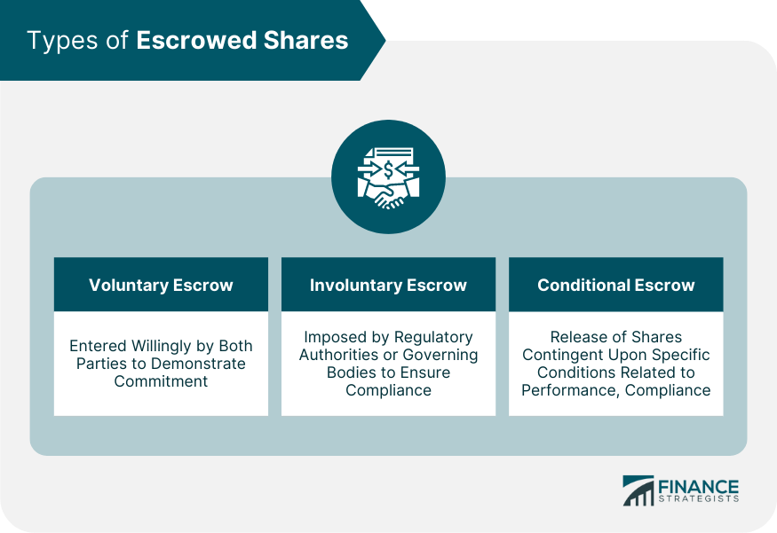

## Table of Contents

## What are escrowed shares?

Escrowed shares are stocks that are held by a third party for a certain period of time. This is often done to meet certain conditions before the shares can be sold or transferred. Companies might use escrowed shares to show investors that key people, like founders or executives, will stay with the company for a while. It can also be used to make sure that the shares are not sold right away, which can help keep the stock price stable.

Sometimes, escrowed shares are used when a company goes public or during a merger. This helps control how many shares are available in the market at one time. By holding onto the shares, the third party ensures that they are released slowly, which can prevent the stock price from dropping suddenly if too many shares were sold at once. This can be good for both the company and its investors.

## Why are shares placed in escrow?

Shares are placed in escrow to help control how they are sold or transferred. This is often done to make sure that important people, like founders or top executives, stay with the company for a certain time. By putting their shares in escrow, these people show that they believe in the company and plan to stick around. This can make investors feel more confident about the company's future.

Escrowed shares can also help keep the stock price stable. When a company goes public or merges with another, it might release a lot of new shares into the market. If everyone sold their shares at the same time, the stock price could drop a lot. By holding the shares in escrow, a third party slowly releases them over time. This helps prevent sudden drops in the stock price and can be good for both the company and its investors.

## What are the common types of escrowed shares?

There are mainly two types of escrowed shares: voluntary escrow and mandatory escrow. Voluntary escrow happens when shareholders, like founders or top executives, choose to put their shares in escrow. They do this to show they believe in the company and plan to stay with it for a while. This can make investors feel more confident about the company's future.

Mandatory escrow is different. It is required by rules or agreements, like when a company goes public or during a merger. The shares are held by a third party to control how they are sold or transferred. This helps keep the stock price stable by making sure the shares are not all sold at once, which could cause the price to drop suddenly. Both types of escrowed shares help protect the company and its investors.

## How do escrowed shares affect a company's stock price?

Escrowed shares can help keep a company's stock price steady. When shares are put in escrow, they are held by a third party and not sold right away. This means that a lot of shares don't suddenly enter the market all at once. If many shares were sold quickly, it could make the stock price go down a lot. By holding the shares in escrow, the company can slowly release them over time, which helps keep the stock price more stable.

Escrowed shares also show that key people, like founders or top executives, believe in the company and plan to stay with it. When these important people put their shares in escrow, it can make investors feel more confident. They see that the people running the company are committed to its success. This confidence can help keep the stock price from dropping and might even help it go up over time.

## Can you explain the difference between hard and soft lockup periods for escrowed shares?

A hard lockup period for escrowed shares means the shares cannot be sold or transferred at all during that time. It's like a strict rule that says "no selling" until the lockup period is over. Companies might use hard lockups to make sure important people, like founders or top executives, stay with the company for a while. This can help investors feel more sure about the company's future because they see that key people are committed.

A soft lockup period is less strict. During a soft lockup, shareholders can sometimes sell their shares, but there are rules they have to follow. For example, they might need to ask for permission before selling or they can only sell a small number of shares. Soft lockups give shareholders a bit more freedom but still help keep the stock price stable by controlling how many shares are sold at one time.

## What are the typical conditions for releasing escrowed shares?

Escrowed shares are released when certain conditions are met. These conditions can be based on time, like waiting for a certain number of months or years before the shares can be sold. For example, a company might say that shares can only be released after one year. This helps keep the stock price stable because it stops people from selling all their shares right away.

Other conditions can be about performance or events. A company might say that shares can be released if the company reaches certain goals, like making a certain amount of money or finishing a big project. Sometimes, shares are released after big events like a merger or when the company goes public. These conditions help make sure that the people with escrowed shares stay committed to the company and its success.

## How do escrowed shares impact investors and shareholders?

Escrowed shares can make investors feel more confident about a company. When important people like founders or top executives put their shares in escrow, it shows they believe in the company and plan to stay with it. This can make investors feel safer because they see that the people running the company are committed to its success. It's like a promise that these key people will stick around, which can help keep the stock price from dropping and might even help it go up over time.

Escrowed shares also help keep the stock price stable. When a company goes public or merges with another, it might release a lot of new shares into the market. If everyone sold their shares at the same time, the stock price could drop a lot. By putting shares in escrow, a third party holds onto them and slowly releases them over time. This helps prevent sudden drops in the stock price, which is good for both the company and its investors. It gives everyone a smoother ride as the company grows and changes.

## What are some examples of companies that have used escrowed shares?

One example of a company that used escrowed shares is Spotify. When Spotify went public in 2018, it used a direct listing instead of a traditional IPO. Many of the shares owned by founders and early investors were put in escrow. This meant they couldn't sell their shares right away. It helped keep the stock price stable because it stopped a lot of shares from being sold all at once.

Another example is Snap Inc., the company behind Snapchat. When Snap went public in 2017, it also used escrowed shares. The founders and some early investors had to keep their shares in escrow for a certain time. This showed that they believed in the company and planned to stay with it. It also helped control how many shares were sold, which can help keep the stock price from dropping suddenly.

## How do regulatory requirements influence the use of escrowed shares?

Regulatory requirements can make it necessary for companies to use escrowed shares. When a company goes public or does a merger, there are rules they have to follow. These rules might say that some shares need to be held in escrow for a while. This helps make sure the stock market stays fair and that the stock price doesn't change too much all at once. For example, the U.S. Securities and Exchange Commission (SEC) has rules about how shares can be sold after a company goes public. These rules can help keep the stock market stable and protect investors.

Regulatory requirements also help make sure that important people in the company, like founders or top executives, stay committed. When these people have to put their shares in escrow, it shows they believe in the company and plan to stay with it for a while. This can make investors feel more confident because they see that the people running the company are not going to leave right away. It's like a promise that helps everyone feel safer about investing in the company.

## What are the strategic advantages of using escrowed shares during mergers and acquisitions?

Using escrowed shares during mergers and acquisitions can help keep the stock price stable. When two companies merge, they might release a lot of new shares into the market. If everyone sold their shares at the same time, the stock price could drop a lot. By putting shares in escrow, a third party holds onto them and slowly releases them over time. This helps prevent sudden drops in the stock price, which is good for both the companies and their investors. It gives everyone a smoother ride as the companies come together.

Escrowed shares also show that key people from both companies are committed to the new merged company. When founders or top executives put their shares in escrow, it shows they believe in the merger and plan to stay with the new company for a while. This can make investors feel more confident because they see that the people running the new company are not going to leave right away. It's like a promise that helps everyone feel safer about investing in the merged company.

## How can escrowed shares be used as a tool for managing insider trading risks?

Escrowed shares can help manage insider trading risks by making sure that people who know a lot about the company can't sell their shares right away. When a company goes public or there's a big event like a merger, people inside the company might know things that could affect the stock price. If they could sell their shares whenever they wanted, they might try to make money from this secret information. By putting their shares in escrow, they have to wait before they can sell. This helps stop them from using inside information to trade unfairly.

Using escrowed shares also shows that the company is trying to be fair and follow the rules. When insiders have to keep their shares in escrow, it tells everyone that the company is working to prevent insider trading. This can make investors feel more confident because they know the company is taking steps to keep the stock market fair. It's like a promise that the company is doing what it can to stop people from using secret information to make money.

## What are the potential legal and financial implications of mishandling escrowed shares?

Mishandling escrowed shares can lead to big legal problems. If a company or its insiders don't follow the rules about when and how the shares can be sold, they might get in trouble with the law. The people in charge could face fines or even go to jail. Also, if someone sells their escrowed shares too early, they might be accused of insider trading. This happens when people use secret information to make money, which is against the law. So, it's really important for everyone to follow the rules about escrowed shares to stay out of legal trouble.

There can also be big financial problems if escrowed shares are not handled right. If too many shares are sold all at once, it can make the stock price drop a lot. This can hurt the company and its investors. People who bought the stock might lose money, and it can be hard for the company to get more money in the future. Also, if it looks like the company isn't following the rules, investors might not trust it anymore. This can make it even harder for the company to grow and be successful. So, handling escrowed shares the right way is important for keeping the company and its investors safe.

## References & Further Reading

[1]: Bergstra, J., Bardenet, R., Bengio, Y., & Kégl, B. (2011). ["Algorithms for Hyper-Parameter Optimization."](https://dl.acm.org/doi/10.5555/2986459.2986743) Advances in Neural Information Processing Systems 24.

[2]: ["Advances in Financial Machine Learning"](https://www.amazon.com/Advances-Financial-Machine-Learning-Marcos/dp/1119482089) by Marcos Lopez de Prado

[3]: ["Evidence-Based Technical Analysis: Applying the Scientific Method and Statistical Inference to Trading Signals"](https://www.amazon.com/Evidence-Based-Technical-Analysis-Scientific-Statistical/dp/0470008741) by David Aronson

[4]: ["Machine Learning for Algorithmic Trading"](https://github.com/stefan-jansen/machine-learning-for-trading) by Stefan Jansen

[5]: ["Quantitative Trading: How to Build Your Own Algorithmic Trading Business"](https://www.amazon.com/Quantitative-Trading-Build-Algorithmic-Business/dp/1119800064) by Ernest P. Chan

[6]: ["Escrow Agreement"](https://www.investopedia.com/terms/e/escrowagreement.asp) on Investopedia

[7]: Mankins, Michael C., & Garton, Eric. (2017). ["Employee Stock Ownership Plans and the Trillion Dollar Market Opportunity."](https://www.bain.com/insights/books/time-talent-energy/) Harvard Business Review.

[8]: Harris, Larry. (2003). ["Trading and Exchanges: Market Microstructure for Practitioners."](https://www.amazon.com/Trading-Exchanges-Market-Microstructure-Practitioners/dp/0195144708) Oxford University Press.

[9]: Sutton, Richard S., & Barto, Andrew G. (2018). ["Reinforcement Learning: An Introduction."](https://web.stanford.edu/class/psych209/Readings/SuttonBartoIPRLBook2ndEd.pdf) MIT Press.