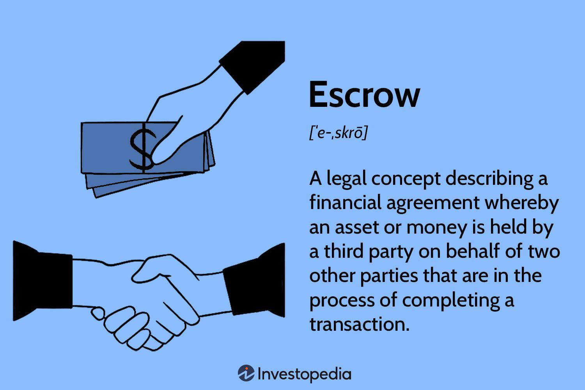

The financial world is filled with complex processes and instruments designed to maximize investor gains and minimize risks. Within this dynamic sphere, one of the key mechanisms is "escrowed to maturity," which plays a crucial role in financial maturity management and is gradually influencing algorithmic trading strategies. This article seeks to provide a comprehensive understanding of escrowed to maturity accounts, highlighting their unique features, the benefits they offer, and their application within modern financial management strategies.

At its core, escrowed to maturity involves the strategic use of funds set aside in an escrow account to ensure the full payment of a bond’s principal and interest by its maturity date. This mechanism is particularly significant in scenarios involving municipal bonds and other debt instruments, where minimizing risk and securing fiscal stability for both issuers and investors is critical.

Escrowed to maturity accounts are designed to offer structured financial security, thereby reducing the financial strain on issuers and instilling confidence among investors. This security is achieved through meticulously planned financial processes that manage obligations without resorting to additional borrowing.

In addition to risk management, escrowed to maturity finds relevance in the emerging landscape of algorithmic trading. By integrating these bonds into algorithmic strategies, financial managers can enhance trading efficiency and precision, potentially achieving better returns while managing risk exposure.

This article will explore the intricacies of escrowed to maturity within the contexts of financial maturity management and algorithmic trading, offering insights into how this financial instrument can be effectively leveraged in today's complex financial ecosystem.

## Table of Contents

## Understanding Escrowed to Maturity

Escrowed to maturity is a financial strategy utilized primarily to manage debt obligations associated with bonds. In this context, escrow refers to funds that are specifically set aside in a secure account to ensure that bondholders receive their due payments upon the maturity of the bond. This strategy is particularly relevant for municipal bonds, where achieving financial security and optimal management of debt is crucial.

The core mechanism of escrowed to maturity involves issuing new bonds and using their proceeds to fund an escrow account. This account is prudently invested in highly secure instruments, predominantly U.S. Treasury securities. The reason for choosing such securities lies in their safety and reliability, which guarantees that the bond's future cash flows are met with confidence.

By earmarking these funds in escrow, issuers can effectively pre-fund the payment of their existing debt obligations. The significance of this approach is multifaceted. First, it minimizes borrowing costs for the issuer. This is achieved because the pre-funding assures bondholders that the scheduled payments will be met, thereby potentially lowering the [interest rate](/wiki/interest-rate-trading-strategies) demanded by investors due to the reduced risk profile of the bond.

Furthermore, establishing an escrow fund enhances the financial security of both issuers and investors. For issuers, it alleviates concerns about future cash flow disruptions that could impair their ability to meet bond payments. For investors, it provides an additional layer of assurance that the financial obligations will be satisfied, thus safeguarding their investments.

The overarching economic advantage derived from this strategy is reflected in improved credit ratings for the municipality or entity issuing the bonds. With secure funding pathways ensured by the pre-funded escrow, rating agencies may award better credit scores, translating into lower interest rates on future borrowings.

In conclusion, escrowed to maturity accounts act as a prudent financial mechanism, balancing security with efficiency, and offering attractive benefits like reduced borrowing costs and enhanced financial stability for all parties involved. The deployment of these funds into secure Treasury securities emphasizes a strategic approach to debt management, reinforcing the issuer's credibility and the investors' trust.

## The Financial Maturity Process

Financial maturity refers to the planned management of debentures and bonds as they reach their maturity dates. This process is crucial for ensuring that financial obligations are met without imposing excessive strain on the issuer's resources. Escrowed to maturity is a strategy that plays a significant role in this process by facilitating the timely settlement of bonds through pre-funding arrangements. 

In the context of financial maturity, the issuer sets up an escrow account, into which proceeds from new bond issues or other funding sources are deposited. These funds are typically invested in high-quality securities, such as U.S. Treasury bonds, which match the timing and amount of the original bond's obligations. This alignment ensures that sufficient funds will be available at the bond's maturity to pay off the principal and interest due, thereby mitigating the risk of default. 

The advantages of using escrowed to maturity in financial maturity management are multifaceted. For the issuer, this strategy offers the benefit of lower borrowing costs. By securing the funds necessary for future obligations and reducing the uncertainty associated with the payment process, issuers can enhance their credit ratings. An improved credit rating may lead to more favorable terms on future borrowing, such as lower interest rates, thereby reducing the overall cost of debt.

From an investor's perspective, escrowed to maturity provides an additional layer of security. Knowing that their investments are backed by reliable and liquid assets increases confidence in receiving timely payments. The assurance of payment enhances long-term financial planning and stability, making these securities attractive, particularly to conservative investors seeking low-risk, stable returns.

In summary, managing the financial maturity process with escrowed to maturity arrangements ensures that debentures and bonds are paid off efficiently and securely. This strategic approach not only supports the issuer's financial health by preventing cash flow disruptions but also protects the interests of investors. Thus, escrowed to maturity is integral to achieving sustainable financial planning and stability in bond markets.

## Escrow Management in Financial Processes

Escrow management plays a crucial role in ensuring secure and trustworthy financial transactions across various sectors. In the context of escrowed to maturity, this approach involves creating a safety net that benefits both issuers and investors. By segregating funds in escrow accounts, participants ensure that capital is available to meet bond obligations at maturity, thus reducing the risk of default.

Escrowed to maturity is a strategy often employed for pre-funded municipal bonds, wherein the proceeds from new bond issues are set aside to cover the payments of existing or older bonds. Such pre-funding involves investing these proceeds into high-quality, low-risk securities, typically U.S. Treasury securities. The primary advantage of using Treasury securities is their creditworthiness, which adds an additional layer of security to the escrowed funds.

There are several types of escrow accounts used in financial markets, each serving distinct purposes:

1. **Real Estate Escrow**: This type of escrow is commonly used during property transactions to hold funds until all conditions of a sale are met. It protects both buyer and seller by ensuring neither party can access the money until the deal is finalized.

2. **Online Transaction Escrow**: In e-commerce, escrow services hold payment until goods or services are delivered satisfactorily, thus protecting both the buyer and seller from fraud.

3. **Construction Escrow**: In construction projects, funds are held in escrow to pay contractors once agreed milestones are completed, ensuring that contractors are paid appropriately for their work while safeguarding the project owner against unfinished work.

4. **Financial Instruments Escrow**: This involves holding securities or funds until certain contractual conditions are fulfilled. In the case of escrowed to maturity, this ensures that funds are available to pay bondholders when bonds reach maturity.

The use of escrow accounts in the financial sector reduces counterparty risk by ensuring that funds or assets are managed by an impartial third party. This transparency enhances trust among all parties involved, which is especially critical in situations involving large sums of money and complex transactions. 

Moreover, escrow accounts can provide [liquidity](/wiki/liquidity-risk-premium) benefits to issuers by allowing funds to be raised from new bonds even before old debts mature. This strategy can result in reduced borrowing costs and improved credit ratings, making them particularly appealing within the broader framework of financial management. As financial markets evolve, the structured use of escrow accounts continues to offer robust mechanisms for safeguarding investments and ensuring financial commitments are met without strain.

## Algorithmic Trading and Escrowed to Maturity

Algorithmic trading has transformed financial markets by automating and optimizing the process of buying and selling securities. Through sophisticated algorithms, it executes trades at speeds and frequencies unimaginable for human traders. As a result, [algorithmic trading](/wiki/algorithmic-trading) provides enhanced liquidity, reduced transaction costs, and improved market efficiency. In this context, escrowed to maturity (ETM) bonds present a unique opportunity for integration into algorithmic trading strategies.

ETM bonds, primarily involving municipal bonds backed by Treasury securities, offer a predictable cash flow due to their assured repayment at maturity. This characteristic aligns well with algorithmic trading, which thrives on securities with stable and foreseeable performance over time.

Integrating ETM bonds into algorithmic trading strategies can offer several advantages:

1. **Predictable Returns**: ETM bonds provide a secure and steady stream of income until maturity, which algorithms can reliably account for when constructing portfolios. Algorithms can be designed to track and adjust portfolios dynamically to optimize returns based on the predictable cash flows from ETM bonds.

2. **Risk Management**: Including ETM bonds in trading algorithms can enhance risk-adjusted returns. Algorithms can leverage the low risk associated with these bonds to balance more volatile securities, ensuring a stable portfolio performance.

3. **Increased Liquidity**: Algorithmic strategies can enhance market liquidity by executing large volumes of trades quickly and efficiently. ETM bonds, traditionally less liquid due to their long-term nature, benefit from this increased trading activity, making them more attractive to investors.

4. **Cost Efficiency**: Trading costs can be minimized through algorithmic trading by reducing bid-ask spreads and eliminating human errors. With ETM bonds having already reduced borrowing costs through pre-funding, the synergy with algorithmic trading makes them even more cost-effective.

However, integrating ETM bonds into algorithmic trading also presents challenges:

- **Complexity in Implementation**: Developing algorithms that accurately incorporate the features of ETM bonds requires sophisticated programming and financial modeling skills. Firms must invest in technology and talent to manage and maintain these systems.

- **Regulation and Compliance**: As with all algorithmic trading, strict regulatory compliance is necessary. ETM bonds' unique nature demands careful consideration of relevant municipal and federal securities laws to avoid potential legal issues.

- **Market Dynamics**: While ETM bonds provide stability, their performance may be affected by broader market conditions. Algorithms must account for these external factors to avoid adverse outcomes from unexpected market shifts.

In conclusion, the integration of ETM bonds into algorithmic trading strategies offers promising potential for enhancing portfolio stability, risk management, and cost efficiency. Despite the challenges, the strategic use of these bonds in automated trading propositions a viable path for financial professionals seeking to optimize investment performance.

## Advantages of Escrowed to Maturity in Modern Finance

Escrowed to maturity accounts serve as a robust financial mechanism offering several advantages, particularly appealing to conservative investors seeking stability and efficiency. These accounts provide a tax-advantaged investment option, delivering safety akin to government securities. This aspect is particularly attractive given the minimal risk default associated with such instruments.

One of the primary benefits of escrowed to maturity accounts is their potential to reduce borrowing costs for the issuer. By setting aside funds specifically earmarked for debt obligations, issuers can lower interest expenses associated with new borrowings. This reduction is often due to the enhanced security perceived by investors, thus allowing issuers to offer bonds at lower yields. Consequently, the cost of borrowing decreases, which is financially beneficial for municipalities and other large issuers.

Moreover, escrowed to maturity accounts can significantly enhance an issuer's credit rating. Credit rating agencies evaluate the financial health and reliability of issuers while assigning ratings. The presence of an escrowed account indicates a secure strategy for debt repayment, which can lead to better credit ratings. An improved credit rating subsequently opens doors for more favorable borrowing terms and conditions in the future.

From an investor's perspective, these accounts offer better after-tax yields due to their tax treatment. Generally, interest earned on escrowed to maturity accounts may be exempt from certain taxes, depending on the jurisdiction and type of bond. This taxation benefit effectively increases the yield compared to other taxable investment options offering similar safety levels.

In summary, escrowed to maturity accounts provide unique advantages by lowering borrowing costs, improving credit ratings, and offering superior after-tax yields. These features underline their utility and appeal, especially to investors with a risk-averse profile who prioritize security and efficiency in financial planning strategies.

## Conclusion

Escrowed to maturity plays a pivotal role in the financial ecosystem by ensuring that debt obligations are met in a timely and secure manner. This mechanism is designed to reduce financial risks by pre-funding debt repayments, typically using low-risk investments such as Treasury securities. By doing so, it not only provides a sense of security to investors but also enhances the issuer's creditworthiness, thereby potentially lowering future borrowing costs.

In the context of modern finance, the ability to manage liquidity effectively is crucial for both individual and institutional investors. Escrowed to maturity accounts are instrumental in this regard, as they offer a predictable and tax-advantaged investment strategy. These accounts are akin to government securities in terms of safety, making them an attractive option for conservative investors seeking to mitigate risk while obtaining reliable returns.

Furthermore, in the fast-paced world of algorithmic trading, integrating escrowed to maturity bonds can offer strategic advantages. These instruments can be used to complement algorithmic strategies by providing a stable and predictable element that balances the often volatile nature of automated trading environments. The precision and efficiency offered by algorithmic trading can be harnessed to optimize the management of such securities, ensuring that they are traded and maintained in a manner that maximizes their benefits.

Understanding the dynamics of escrowed to maturity is essential for financial professionals and investors alike. Mastery of this mechanism can enable more effective portfolio management, leveraging its benefits to enhance overall financial performance and stability. As the financial landscape continues to evolve, the strategic use of escrowed to maturity will remain a cornerstone in the management of financial obligations and the deployment of sophisticated trading strategies.

## References & Further Reading

[1]: Fabozzi, F. J., & Peterson, P. P. (2012). ["Bond Markets, Analysis, and Strategies"](https://books.google.com/books/about/Bond_Markets_Analysis_and_Strategies_ten.html?id=bQpNEAAAQBAJ). Pearson.

[2]: Brealey, R. A., Myers, S. C., & Allen, F. (2022). ["Principles of Corporate Finance"](https://www.mheducation.com/highered/product/Principles-of-Corporate-Finance-Brealey.html). McGraw-Hill Education.

[3]: Hull, J. C. (2018). ["Options, Futures, and Other Derivatives"](https://www.semanticscholar.org/paper/Options%2C-Futures%2C-and-Other-Derivatives-Hull/89bdee500c8623864fc9eb7a471546aa713acc44). Pearson.

[4]: Lopez de Prado, M. (2018). ["Advances in Financial Machine Learning"](https://www.amazon.com/Advances-Financial-Machine-Learning-Marcos/dp/1119482089). Wiley.

[5]: Fabozzi, F. J., & Polimeni, R. S. (2008). ["Municipal Bond Market Analysis and Techniques"](https://books.google.com/books/about/Bond_Markets_Analysis_and_Strategies_ten.html?id=bQpNEAAAQBAJ). CFA Institute.

[6]: Chan, E. P. (2009). ["Quantitative Trading: How to Build Your Own Algorithmic Trading Business"](https://github.com/ftvision/quant_trading_echan_book). Wiley.

[7]: Chincarini, L. B., & Kim, D. (2006). ["Quantitative Equity Portfolio Management: An Active Approach to Portfolio Construction and Management"](https://www.amazon.com/Quantitative-Equity-Portfolio-Management-Construction/dp/0071459391). McGraw-Hill Education.