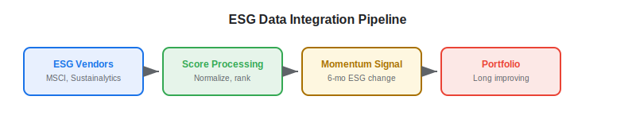
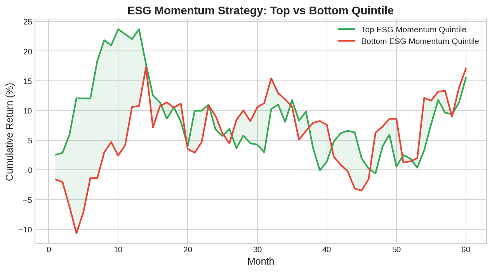

Environmental, Social, and Governance (ESG) data has evolved from a niche responsible investing metric into a mainstream [alternative data](https://paperswithbacktest.com/wiki/best-alternative-data) source for algorithmic trading. ESG scores and their underlying component data provide signals about operational risks, regulatory exposure, and long-term company quality that traditional financial metrics miss. For algo traders, ESG data offers both a risk-management overlay and an alpha source — particularly as regulatory mandates increasingly force capital allocation toward ESG-compliant investments.

## What Is ESG Data in Trading?

ESG data encompasses quantitative and qualitative assessments of a company's environmental impact (carbon emissions, resource usage), social practices (labor conditions, diversity, community relations), and governance quality (board independence, executive compensation, shareholder rights). Data providers aggregate this information from corporate disclosures, regulatory filings, news sources, and proprietary research into numerical scores.

The trading thesis has two dimensions. First, as a **risk signal**: companies with poor ESG scores face higher regulatory, reputational, and operational risks that may not be priced into equities. Second, as a **flow signal**: the growing pool of ESG-mandated capital (ESG ETFs, sustainable mandates) creates predictable demand for high-ESG stocks and selling pressure on low-ESG stocks.

## Key ESG Data Vendors

| Vendor | Methodology | Coverage | Update Frequency |
|---|---|---|---|
| MSCI ESG | Rules-based scoring, 0–10 scale | 14,000+ companies | Weekly-monthly |
| Sustainalytics (Morningstar) | Risk-based, 0–100 ESG risk | 20,000+ companies | Monthly |
| Refinitiv ESG | 450+ data points, percentile rank | 12,000+ companies | Weekly |
| S&P Global ESG | CSA questionnaire-based | 10,000+ companies | Annual + events |
| RepRisk | News/media monitoring for ESG incidents | 200,000+ companies | Daily |
| TruValue Labs (FactSet) | AI-driven, real-time NLP of news | 15,000+ companies | Daily |

For algo traders, **event-driven ESG data** (RepRisk, TruValue Labs) is more useful than static annual scores because it captures real-time changes that affect stock prices.



## Python Implementation: ESG Momentum Strategy

```python
import numpy as np
import pandas as pd

def esg_momentum_signal(
    esg_scores: pd.DataFrame,
    lookback_months: int = 6
) -> pd.DataFrame:
    """
    Compute ESG momentum signal: stocks with improving ESG scores.
    
    Parameters:
    - esg_scores: DataFrame with columns [date, ticker, esg_score]
    - lookback_months: Period for momentum calculation
    """
    df = esg_scores.sort_values(["ticker", "date"])
    
    # Compute ESG score change over lookback period
    df["esg_change"] = df.groupby("ticker")["esg_score"].diff(lookback_months)
    
    # Rank stocks by ESG improvement
    latest = df.groupby("ticker").last().reset_index()
    latest["esg_rank"] = latest["esg_change"].rank(pct=True)
    
    # Long top quintile (most improving), short bottom quintile
    latest["signal"] = np.where(
        latest["esg_rank"] >= 0.8, "LONG",
        np.where(latest["esg_rank"] <= 0.2, "SHORT", "NEUTRAL")
    )
    
    return latest[["ticker", "esg_score", "esg_change", "esg_rank", "signal"]]

# Simulated example
np.random.seed(42)
tickers = [f"STOCK_{i}" for i in range(50)]
dates = pd.date_range("2024-01-01", periods=12, freq="M")
data = []
for t in tickers:
    base = np.random.uniform(30, 80)
    trend = np.random.uniform(-0.5, 0.5)
    for i, d in enumerate(dates):
        data.append({"date": d, "ticker": t, "esg_score": base + trend * i + np.random.randn() * 2})

esg_df = pd.DataFrame(data)
result = esg_momentum_signal(esg_df, lookback_months=6)
print(result[result["signal"] != "NEUTRAL"].head(10))
```



## ESG Score Disagreement as a Signal

A well-documented phenomenon: different ESG vendors assign dramatically different scores to the same company. Berg, Koelbel, and Rigobon (2022) found correlations as low as 0.38 between major providers. This disagreement is itself an alpha signal — stocks with high ESG score dispersion tend to exhibit higher volatility and larger price moves when ESG events clarify the picture.

$$\text{ESG Dispersion}_i = \sigma(\text{Score}_{i,1}, \text{Score}_{i,2}, ..., \text{Score}_{i,K})$$

Where $K$ is the number of ESG rating providers and $\sigma$ is the standard deviation of their scores for company $i$.

## Limitations and Risks

**Greenwashing**: Companies may manipulate disclosures to inflate ESG scores without genuine operational improvement. NLP-based incident monitoring (RepRisk, TruValue) helps detect discrepancies between stated policies and actual behavior.

**Score inconsistency**: As noted, vendor disagreement is high. Using a single vendor's scores introduces model risk. The mitigation is to either use multiple vendors or focus on raw ESG events rather than composite scores.

**Regulatory changes**: ESG disclosure requirements are evolving rapidly (EU SFDR, SEC climate rules). Regulatory shifts can change which data is available and how it affects markets.

## Conclusion

ESG data occupies a unique position in the alternative data landscape: it is simultaneously a risk-management tool and an alpha source. For algo traders, the most actionable signals come from ESG momentum (improving scores), ESG events (real-time incidents via [NLP](https://paperswithbacktest.com/wiki/nlp-sentiment-analysis-trading)), and score dispersion (disagreement between vendors). As ESG-mandated capital flows grow, these signals will only become more important.

---

**Explore further on PapersWithBacktest:**
- Browse [backtested ESG strategies](https://paperswithbacktest.com/strategies) with Python code and performance metrics
- Access [clean historical market data](https://paperswithbacktest.com/datasets) for equities, crypto, and futures
- Take the [algo trading course](https://paperswithbacktest.com/course) — 60+ video lessons and notebooks
- Related wiki pages: [Best Alternative Data Sources](https://paperswithbacktest.com/wiki/best-alternative-data) · [NLP for Trading](https://paperswithbacktest.com/wiki/nlp-sentiment-analysis-trading)
