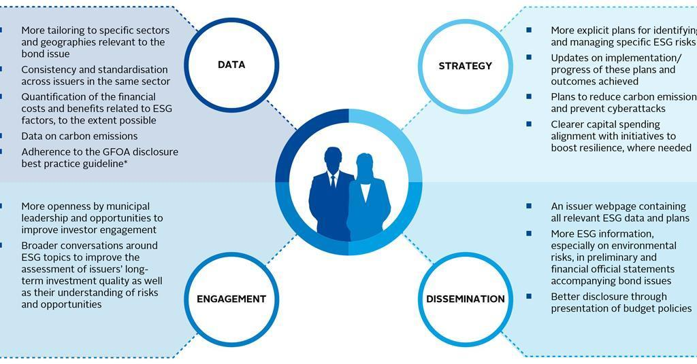

In recent years, the financial sector has experienced a significant shift towards sustainable finance, with increasing emphasis on ESG (Environmental, Social, and Governance) investing. This transformation reflects a growing awareness among investors and institutions of the need to incorporate ethical and sustainable practices into financial decision-making processes. The convergence of bonds, sustainable finance, ESG investing, and algorithmic trading represents a noteworthy development in the investment landscape, offering new ways for investors to align their portfolios with both ethical values and financial objectives.

At the heart of this evolution lies the integration of ESG principles into various financial instruments, most notably the bond markets. Bonds traditionally serve as a cornerstone of conservative investment strategies, providing stable returns with lower risk compared to equities. In the context of sustainable finance, bonds such as green bonds and ESG-linked bonds are crafted to fund projects with specific environmental or social outcomes. This alignment not only supports the achievement of societal objectives but also enhances investor confidence in their ability to generate sustainable growth.



Algorithmic trading further revolutionizes ESG investing by leveraging advanced technologies to make rapid, data-driven decisions. This method relies on predefined strategies encoded into algorithms, allowing for the efficient execution of trades across a vast array of securities. By incorporating ESG data into these algorithms, investors can automate the selection of stocks and bonds that meet their ethical and sustainability criteria. The synergy of algorithmic trading with ESG investing underscores the potential to enhance precision and efficiency in sustainable investment strategies.

The growing focus on ESG investing prompts a deeper examination of challenges and opportunities inherent to this approach. Issues such as data quality, standardization, and risk management are vital to ensuring the effectiveness of ESG-aligned investment strategies. At the same time, the integration of emerging technologies such as artificial intelligence and blockchain presents novel avenues for advancing sustainable finance.

This article endeavors to explore these multifaceted interactions, examining how ESG principles are applied within the bond markets, the transformative role of algorithmic trading in ESG investing, and the implications for the future of sustainable finance. As stakeholders navigate these developments, understanding how to balance ethical imperatives with financial goals becomes increasingly crucial. By shedding light on these dynamics, the article aims to provide valuable insights for investors seeking to integrate ESG factors into their financial strategies while contributing positively to environmental and social objectives.

## Table of Contents

## Understanding Bonds in Sustainable Finance

Bonds have emerged as a crucial component of sustainable finance, providing investors with an effective means to support projects that align with their ESG (Environmental, Social, and Governance) criteria. The growth in popularity of green bonds and ESG-linked bonds showcases their vital role in funding projects that have positive environmental and social impacts.

Green bonds are designed to raise capital for projects with specific environmental benefits, such as renewable energy, energy efficiency, waste management, and clean transportation. These bonds help channel investment into projects that mitigate climate change and promote ecological conservation. The increasing demand for green bonds reflects a growing awareness of environmental issues, allowing investors to align their portfolio with their ethical values while contributing to environmental conservation.

[ESG](/wiki/esg-investing)-linked bonds extend beyond environmental concerns, incorporating broader ESG criteria into bond issuance. These instruments may include social and governance considerations, allowing investors to support projects that also address issues such as education, healthcare, and gender equality. By integrating ESG factors, these bonds enable investors to pursue responsible investment strategies that cater to their ethical considerations and societal needs.

The unique dynamics of ESG bonds provide opportunities for investors to mitigate risks and enhance returns. Incorporating ESG criteria can lead to better risk management by identifying projects that are less susceptible to regulatory changes, resource scarcity, or reputational damage. Furthermore, companies that prioritize ESG considerations often exhibit stronger governance practices and higher transparency, contributing to improved financial performance and reduced default risk.

Sustainable bonds act as a bridge between traditional finance and ethical investing, offering a pathway for investors who wish to make socially responsible choices. These bonds facilitate the redirection of capital to sustainable projects and enterprises, enabling investors to contribute positively to society while seeking financial returns. As more investors consider ESG factors in their investment decisions, sustainable bonds continue to play a pivotal role in the evolution of the financial sector toward greater sustainability and responsibility.

## The Rise of ESG Investing

ESG investing, an approach that incorporates environmental, social, and governance criteria into investment decisions, has gained significant traction in recent years. This strategy aims to enhance long-term financial returns by assessing how companies manage ESG-related risks and opportunities. The growing prominence of ESG investing is reflected in the increasing number of funds and exchange-traded funds (ETFs) that specifically target sustainable business practices.

Investors are increasingly demanding ethical investment strategies, prompting a shift towards greater transparency and accountability in financial markets. This trend is not merely a response to moral imperatives but also reflects the financial benefits associated with sustainable investing. Companies that effectively manage ESG factors are often better positioned to mitigate risks and capitalize on emerging opportunities, leading to improved performance over the long term.

The ESG investing landscape is characterized by a range of financial products designed to meet the diverse needs of investors. This includes actively managed mutual funds that seek to outperform the market by selecting stocks based on rigorous ESG criteria and passive index funds that track ESG-focused indices.

Innovation is a key driver behind the evolution of ESG investing. As more investors prioritize ESG factors, financial institutions continue to develop new products and solutions that cater to this growing demand. Advanced data analytics and [machine learning](/wiki/machine-learning) technologies play a crucial role in this process, enabling investors to assess ESG performance more comprehensively and make informed investment decisions.

In conclusion, the rise of ESG investing represents a paradigm shift in the financial sector, where ethical considerations are increasingly integrated into investment strategies. This transformation not only addresses investor demand for responsible investing but also contributes to the development of more transparent and accountable financial markets. As this trend continues, the industry is likely to see further innovation, offering investors a broader range of opportunities to align their portfolios with sustainable objectives.

## The Role of Algorithmic Trading

Algorithmic trading leverages advanced computational techniques to execute trades with efficiency and precision, fundamentally transforming the landscape of financial markets. By employing algorithms governed by predefined strategies, traders can react to market changes in fractions of a second, optimizing timing and execution. 

The integration of Environmental, Social, and Governance (ESG) data into these trading algorithms marks a significant stride towards sustainable finance. This integration allows investors to automate their trading decisions in a way that aligns with ethical investment principles. With vast amounts of ESG-related data available, [algorithmic trading](/wiki/algorithmic-trading) systems can swiftly analyze such datasets to identify stocks and bonds that meet specific ESG criteria.

To accomplish this, sophisticated systems are required to parse and interpret complex ESG data accurately. This task involves not only processing extensive datasets but also understanding the nuanced dimensions of ESG factors, which may include carbon footprint metrics, diversity and inclusion indexes, and governance policies. For example, an algorithm could be designed to favor companies with low carbon emissions and strong governance practices by assigning higher weights to these factors in a trading model.

```python
def calculate_esg_score(carbon_emissions, diversity_score, governance_score):
    # Example model for ESG scoring
    # Lower carbon emissions are better, while higher diversity and governance scores are better
    weights = {'carbon': -0.5, 'diversity': 0.3, 'governance': 0.2}
    esg_score = (weights['carbon'] * carbon_emissions +
                 weights['diversity'] * diversity_score +
                 weights['governance'] * governance_score)
    return esg_score

# Sample data
company_data = [
    {'name': 'Company A', 'carbon_emissions': 50, 'diversity_score': 70, 'governance_score': 80},
    {'name': 'Company B', 'carbon_emissions': 30, 'diversity_score': 60, 'governance_score': 90},
]

for company in company_data:
    score = calculate_esg_score(company['carbon_emissions'], company['diversity_score'], company['governance_score'])
    print(f"{company['name']} ESG Score: {score}")
```

Integrating ESG factors into trading algorithms is not without its challenges. It demands the development of systems capable of discerning and weighting these factors against financial performance metrics. Nevertheless, this synergy between algorithmic trading and ESG considerations holds great potential. It enables enhanced precision in investment decision-making, aligning investment outcomes with broader societal and environmental objectives. This alignment represents a pivotal step towards fostering markets that support sustainable development while achieving financial returns.

## Challenges and Opportunities in ESG Algorithmic Trading

ESG algorithmic trading faces notable challenges that must be addressed to unlock its full potential. One of the primary obstacles is the quality of ESG data. High-quality data is essential to identify and analyze financial opportunities that align with sustainability goals. Ensuring the accuracy of ESG data is critical to avoid 'greenwashing,' which refers to presenting an investment as environmentally responsible without substantial backing. This misrepresentation can mislead investors and undermine the credibility of ESG investing. Consequently, robust frameworks for data verification and validation are essential.

The absence of standardized metrics for ESG evaluation further complicates comparisons and assessments across various markets. Without uniform standards, it is challenging for investors to determine the true ESG performance of different companies or financial instruments. Such inconsistency can hinder informed decision-making and create barriers to the widespread adoption of ESG principles in algorithmic trading. Therefore, developing and implementing standardized ESG metrics is crucial for enhancing transparency and fostering trust among investors.

Transparency and reliability of ESG data sources are also pressing needs. Investors and trading systems rely on data to make split-second decisions, necessitating accurate and timely information. As algorithmic trading systems integrate ESG considerations, they must be supported by data sources that are both transparent and dependable. Initiatives to improve ESG data collection methods and establish reliable channels for data dissemination are fundamental in addressing this challenge.

Despite these challenges, ESG algorithmic trading presents significant opportunities. Enhanced data quality and standardization can lead to more efficient markets by accurately pricing in ESG factors. Improved data can also enhance risk-adjusted returns by allowing for more precise assessments of a company's sustainability-related risks and opportunities. Furthermore, expanded access to sustainable investments becomes feasible as reliable data enables a broader range of investors and institutions to engage in ESG investing.

As the finance industry works toward overcoming these challenges, the potential rewards of ESG algorithmic trading include creating a more sustainable and equitable financial landscape. Collaboration between data providers, financial institutions, and regulatory bodies will be vital in realizing this vision. Addressing data quality issues, standardizing metrics, and developing reliable data sources can transform ESG algorithmic trading into a powerful tool for sustainable finance.

## The Future of Sustainable Finance and ESG Trading

The future of sustainable finance and ESG trading is set to evolve significantly due to rapid technological advancements and a shift in investor expectations. As environmental, social, and governance (ESG) criteria become increasingly important, financial institutions are integrating these principles into their strategies to meet evolving demands. This shift is, in part, driven by investors who prioritize responsible investing and seek to align their portfolios with sustainability goals.

Emerging technologies, such as [artificial intelligence](/wiki/ai-artificial-intelligence) (AI) and blockchain, hold significant promise in enhancing ESG trading strategies. AI can process vast amounts of data to optimize investment decisions, making it possible to identify trends and opportunities that align with ESG criteria. It allows for real-time analysis of market conditions and the ESG performance of various assets, improving decision-making accuracy and speed. Blockchain offers transparency and traceability, which are vital for building trust in sustainable financial products. It can verify ESG data and ensure that investment products adhere to their stated goals, reducing the risk of greenwashing.

Standardization of ESG metrics and regulations will be crucial in shaping the future of sustainable finance. Currently, the lack of uniformity in how ESG criteria are measured and reported poses a challenge for investors seeking to compare opportunities across different markets and companies. Efforts to harmonize these metrics globally could provide clearer benchmarks and foster greater accountability among issuers. Such standardization would enhance transparency, allowing investors to make more informed decisions and encouraging more companies to adopt sustainable practices.

Ultimately, the goal of sustainable finance is to align financial markets with ethical imperatives, ensuring that investments contribute positively to environmental and social outcomes. By integrating advanced technologies and standardized metrics, the financial industry can create more robust ESG trading frameworks, leading to improved allocation of capital towards sustainable projects. As these developments unfold, the potential for impactful and ethical investment strategies will expand, offering promising prospects for the future of sustainable finance.

## Conclusion

Bonds, ESG investing, and algorithmic trading collectively represent a significant shift in the landscape of sustainable finance, presenting both opportunities and challenges. Investors are uniquely positioned to capitalize on these trends, achieving financial objectives while promoting broader environmental and social well-being. The convergence of these elements provides a comprehensive framework for making informed investment decisions that are both ethically and financially sound.

A critical aspect of this paradigm shift is the integration of ESG factors into various financial instruments, which requires a nuanced understanding of how these criteria influence market behavior and investment outcomes. ESG data, once a peripheral consideration, now plays a central role in assessing the viability and sustainability of financial assets. Investors and financial analysts must adapt to this evolving landscape by incorporating ESG metrics into their decision-making processes, ensuring investments align with both ethical standards and economic objectives.

As sustainable finance continues to expand, collaboration among various stakeholders, including regulatory bodies, investment firms, and technology providers, will be crucial. These collaborations aim to address challenges such as data standardization, transparency, and the prevention of greenwashing. By working together, stakeholders can develop robust frameworks that maximize the potential of ESG investments, driving innovation and efficiency in the market.

The journey toward truly sustainable financial markets is ongoing. Technological advancements, alongside evolving investor expectations, herald a future where aligning financial markets with ethical imperatives becomes a standard practice. This ongoing development promises to yield significant benefits, enhancing the resilience and inclusivity of global financial systems and ensuring positive environmental and social impacts. As the field of ESG investing matures, it holds the promise of transforming the landscape of finance, embedding sustainability at the core of financial decision-making.

## References & Further Reading

[1]: Choudhry, M. (2020). ["ESG Investing](https://papers.ssrn.com/sol3/papers.cfm?abstract_id=3668998): Environmental, Social, and Governance Frameworks for Portfolio Construction." Wiley Finance.

[2]: Fabozzi, F. J., Ma, K. C., & Oliphant, B. J. (2008). ["Handbook of Fixed Income Securities](https://www.semanticscholar.org/paper/Sin-Stocks-Revisited%3A-Resolving-the-Sin-Stock-Blitz-Fabozzi/3a5a2cb5f63b3d38c5cf5e028d633d4674abc4c2)." McGraw-Hill Education.

[3]: Khan, M., & Serafeim, G. (2015). ["Corporate Sustainability: First Evidence on Materiality," Journal of Accounting and Economics,](https://papers.ssrn.com/sol3/papers.cfm?abstract_id=2575912) 60(1), 80-108.

[4]: Antweiler, W., & Frank, M. Z. (2004). ["Is All That Talk Just Noise? The Information Content of Internet Stock Message Boards," The Journal of Finance,](https://onlinelibrary.wiley.com/doi/abs/10.1111/j.1540-6261.2004.00662.x) 59(3), 1259-1294.

[5]: Gasser, S., & Rothensteiner, M. (2017). ["Sustainable Investing – Revolution or Rhetoric," CFA Institute Journal Review.](https://blogs.cfainstitute.org/investor/2017/12/05/best-of-2017-financial-analysts-journal-cfa-digest-and-in-practice/)