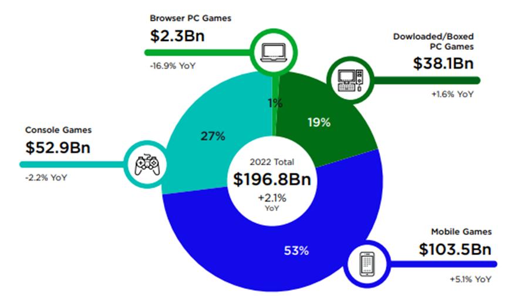

## Table of Contents

## What are eSports Exchange-Traded Funds (ETFs)?

eSports Exchange-Traded Funds (ETFs) are a type of investment fund that focuses on companies involved in the eSports industry. These companies can include video game developers, event organizers, streaming platforms, and hardware manufacturers that support eSports activities. ETFs work by pooling money from many investors to buy a diversified portfolio of stocks, which helps to spread out the risk. When you buy shares of an eSports ETF, you're essentially buying a small piece of many different companies in the eSports sector, rather than investing in just one company.

Investing in eSports ETFs can be appealing because it allows investors to tap into the growing popularity of eSports without having to pick individual stocks. The eSports industry has been growing rapidly, attracting a large audience and significant sponsorships, which can lead to potentially high returns. However, like any investment, eSports ETFs come with risks. The performance of these funds can be affected by factors like the overall health of the eSports market, changes in consumer behavior, and the success of the companies within the ETF. It's important for investors to do their research and consider their risk tolerance before investing in eSports ETFs.

## How do eSports ETFs differ from traditional ETFs?

eSports ETFs are a bit different from traditional ETFs because they focus only on companies that are part of the eSports world. Traditional ETFs usually include a mix of companies from different industries, like tech, health, or finance. But eSports ETFs stick to companies that make video games, run eSports events, or provide the gear and streaming services that gamers use. So, if you buy an eSports ETF, all your money goes into the eSports industry, not spread out across many different types of businesses.

The other big difference is that eSports ETFs are newer and tied to a fast-growing but smaller part of the market. Traditional ETFs often track well-known indexes like the S&P 500 and have been around for a long time. They can be a safer bet because they cover a broad range of established companies. On the other hand, eSports ETFs might offer more excitement and potential for big gains, but they can also be riskier because the eSports industry is still growing and can be unpredictable. So, while traditional ETFs might be more stable, eSports ETFs give you a chance to invest in a newer, trendy industry.

## What are the benefits of investing in eSports ETFs?

Investing in eSports ETFs can be a smart move if you believe in the future of gaming and eSports. These ETFs let you invest in many different companies in the eSports world all at once. This means you don't have to pick just one company to invest in, which can be risky. Instead, you spread your money across game makers, event organizers, streaming platforms, and gear makers. This can lower your risk because if one company doesn't do well, others in the [ETF](/wiki/etf-trading-strategies) might still do great.

Another benefit is that the eSports industry is growing fast. More and more people are watching and playing eSports, which means more money coming into the industry. This growth can lead to good returns for investors. Plus, eSports ETFs are easy to buy and sell, just like any other stock. This makes it simple for you to get in and out of your investment whenever you want. So, if you're excited about eSports and want to invest in its future, eSports ETFs can be a good choice.

## What are the risks associated with eSports ETFs?

Investing in eSports ETFs comes with some risks because the eSports industry is still pretty new and can be unpredictable. If the eSports industry doesn't grow as fast as people think it will, the companies in the ETF might not do well. This could mean your investment loses value. Also, eSports ETFs focus only on eSports companies, so if something bad happens to the whole industry, like fewer people watching games or big sponsors pulling out, it could hurt all the companies in the ETF at once.

Another risk is that eSports ETFs might not be as popular or well-known as other types of ETFs. This means they might not have as many buyers and sellers, which can make it harder to sell your shares quickly if you need to. Plus, because eSports is a newer industry, there might not be a lot of information or history to help you decide if it's a good investment. So, it's important to think carefully and maybe talk to a financial advisor before putting your money into eSports ETFs.

## How can beginners start investing in eSports ETFs?

If you're new to investing and want to get into eSports ETFs, the first step is to open a brokerage account. You can do this online with a company like Robinhood, E*TRADE, or Charles Schwab. Once your account is set up, you'll need to add some money to it. After that, you can search for eSports ETFs. Some popular ones might be the VanEck Vectors Video Gaming and eSports ETF (ESPO) or the Global X Video Games & Esports ETF (HERO). Just type the ticker symbol into your brokerage's search bar, decide how many shares you want to buy, and place your order.

Before you start investing, it's a good idea to do a bit of homework. Look up the eSports ETFs you're interested in and read about the companies they include. You can find this info on the ETF's website or through financial news sites. Remember, investing always comes with risks, so only invest money you can afford to lose. If you're not sure, talking to a financial advisor can help you make a better decision. Keep an eye on your investments and be ready to learn as you go, because the eSports industry can change quickly.

## What are the key performance indicators to look for in eSports ETFs?

When you're thinking about investing in eSports ETFs, it's helpful to look at some key numbers that show how well the ETF is doing. One important number is the ETF's total return, which tells you how much money you might make from the ETF over time, including any dividends. You should also check the expense ratio, which is how much you have to pay to own the ETF. A lower expense ratio means you get to keep more of your investment returns. Another thing to look at is the trading [volume](/wiki/volume-trading-strategy), which shows how many people are buying and selling the ETF. Higher trading volume usually means it's easier to buy and sell your shares.

It's also good to keep an eye on how the ETF is doing compared to other things you could invest in. For example, you might want to compare it to a broad market index like the S&P 500 to see if the eSports ETF is doing better or worse. You can also look at the ETF's beta, which tells you how much the ETF's price moves up and down compared to the market. A higher beta means the ETF is more risky but could also mean bigger gains or losses. Finally, understanding the companies inside the ETF, like their earnings growth and how much they're worth, can give you a better idea of what might happen to the ETF's value in the future.

## How do eSports ETFs contribute to the growth of the eSports industry?

eSports ETFs help grow the eSports industry by bringing in more money from investors. When people buy shares in an eSports ETF, they are putting their money into a bunch of different eSports companies all at once. This extra money can help these companies grow bigger, make better games, and put on bigger events. It's like a vote of confidence in the eSports world, showing that people believe it's going to keep getting bigger and better.

Also, eSports ETFs make it easier for more people to invest in eSports. Instead of having to pick just one company to invest in, which can be risky, people can buy into an ETF and spread their money across many different companies. This can attract more investors who might be interested in eSports but are nervous about [picking](/wiki/asset-class-picking) just one company. More investors mean more money flowing into the industry, which can help it keep growing and becoming more popular.

## What role does investor engagement play in the success of eSports ETFs?

Investor engagement is really important for the success of eSports ETFs. When investors are excited about eSports and believe in its future, they are more likely to buy shares in eSports ETFs. This means more money comes into the ETFs, which can help the companies inside the ETFs grow bigger and stronger. The more engaged investors are, the more they might talk about eSports ETFs with their friends or on social media, which can attract even more people to invest. This creates a cycle where more investment leads to more growth, which makes the ETFs more attractive to new investors.

On the other hand, if investors aren't engaged or lose interest, it can hurt eSports ETFs. If people start to think that eSports isn't going to keep growing, they might sell their shares, which can make the price of the ETF go down. This can scare away new investors and make it harder for the companies in the ETF to get the money they need to grow. So, keeping investors engaged and excited about eSports is a big part of making sure eSports ETFs keep doing well.

## How can investors engage with eSports ETFs beyond financial investment?

Investors can engage with eSports ETFs beyond just putting money into them by getting involved in the eSports community. This means watching eSports events, playing the games, and talking about eSports with others. By being part of the community, investors can learn more about what's happening in the eSports world. They can see which games are getting popular, which teams are doing well, and what new trends are starting. This helps them understand the companies in the ETF better and make smarter choices about their investments.

Another way to engage is by sharing their knowledge and excitement about eSports. Investors can write blog posts, make videos, or post on social media about why they think eSports is a good investment. This can help spread the word and get more people interested in eSports ETFs. When more people are excited about eSports, it can bring more money into the industry, which helps the ETFs grow. So, by being active in the eSports community and sharing their passion, investors can help make eSports ETFs more successful.

## What are the regulatory considerations for eSports ETFs?

When it comes to eSports ETFs, there are some rules that investors and companies need to follow. These rules are made by groups like the Securities and Exchange Commission (SEC) in the United States. The SEC makes sure that ETFs are fair and that people who invest in them have all the information they need to make good choices. This means that the people who run eSports ETFs have to tell investors about the risks and what the ETF is investing in. They also have to follow rules about how they buy and sell the stocks inside the ETF.

Another thing to think about is that eSports is a new industry, so the rules might change as it grows. The people who make the rules might decide to add new ones to protect investors or to help the eSports industry grow in a healthy way. For example, they might make rules about how eSports companies can advertise or how they need to report their money. Investors should keep an eye on these rules because they can affect how eSports ETFs do and what they can invest in.

## How do global market trends affect eSports ETFs?

Global market trends can have a big impact on eSports ETFs. When the world economy is doing well, people might have more money to spend on things like video games and eSports events. This can help the companies in the eSports ETFs grow bigger and make more money, which can make the ETFs go up in value. On the other hand, if the economy is struggling, people might not have as much money to spend on fun stuff, and this can hurt the eSports companies and the ETFs.

Trends in technology and entertainment also play a big role. If new technology makes it easier to watch or play eSports, like better streaming services or new gaming gadgets, this can help the eSports industry grow. Also, if eSports becomes more popular around the world, it can bring in more fans and sponsors, which is good for the companies in the ETFs. But if people start to lose interest in eSports or if there are problems with the technology, it can make the ETFs go down in value. So, keeping an eye on these global trends can help investors understand what might happen to their eSports ETFs.

## What advanced strategies can expert investors use to maximize returns from eSports ETFs?

Expert investors can use a few smart tricks to get the most out of their eSports ETFs. One way is to use a strategy called dollar-cost averaging. This means they put a little bit of money into the ETF at regular times, instead of all at once. This can help them buy shares at different prices and lower their overall cost. Another trick is to keep an eye on the companies inside the ETF and the eSports industry as a whole. If they see a company doing really well or a new trend starting, they might decide to buy more shares or hold onto them longer. They can also use stop-loss orders to protect their money. This means they set a price where they will automatically sell their shares if the ETF starts to drop a lot, to stop losing too much money.

Another advanced strategy is to mix eSports ETFs with other types of investments. This is called diversification. By spreading their money across different kinds of ETFs or stocks, expert investors can lower their risk. For example, they might invest in both eSports ETFs and tech ETFs, or even in different countries' eSports ETFs. This way, if one type of investment goes down, the others might still do well. They can also use options, which are like bets on whether the ETF will go up or down. Options can be risky, but if used right, they can help expert investors make more money or protect their investments.

## References & Further Reading

Newzoo, Global Games Market Report, 2023. This report provides an exhaustive analysis of the global gaming market, including insights on market trends, consumer preferences, and revenue forecasts. It's a valuable resource for understanding the potential of the gaming industry and its implications for investors.

Lopez de Prado, M. (2018). *Advances in Financial Machine Learning*. This book covers modern techniques in [machine learning](/wiki/machine-learning) applied to finance, offering insights into how these methods can enhance trading strategies and improve the decision-making process in financial markets, including ETF and [algorithmic trading](/wiki/algorithmic-trading).

Chan, E. P. (2008). *Quantitative Trading: How to Build Your Own Algorithmic Trading Business*. A comprehensive guide for establishing a trading business using quantitative strategies, focusing on the design and implementation of trading algorithms to capitalize on market opportunities.

Jansen, S. (2020). *Machine Learning for Algorithmic Trading*. This book provides a practical approach to algorithmic trading using machine learning tools, addressing topics like feature engineering, model selection, and [backtesting](/wiki/backtesting) strategies to optimize trading performance.

Aronson, D. (2006). *Evidence-Based Technical Analysis: Applying the Scientific Method and Statistical Inference to Trading Signals*. Aronson presents a rigorous evaluation of technical analysis tools, advocating for a scientific approach to trading, which includes statistical testing and validation of trading strategies to ensure robust investment decision-making.

