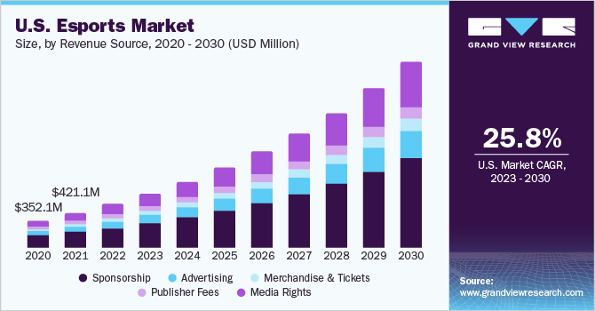

## Table of Contents

## What is esports?

Esports, short for electronic sports, is when people play video games competitively. It's like traditional sports, but instead of playing soccer or basketball, players compete in video games. These games can be anything from racing games to fighting games, and players can compete one-on-one or in teams.

Esports events are often big and exciting, just like big sports events. They can be watched online or in big arenas, and lots of people come to watch. Players can win money and become famous, just like professional athletes in other sports. Esports has grown a lot in recent years, and more and more people are getting interested in it.

## How did esports originate and evolve?

Esports started a long time ago, back in the 1970s. At first, people played simple games on computers at universities. One of the first big events was in 1980 when people competed in a game called Space Invaders. As computers and video games got better, more people started playing and watching these competitions. In the 1990s, games like Street Fighter and Doom became popular for competitions, and people started to organize bigger events.

Over time, esports grew a lot. In the 2000s, games like StarCraft and Counter-Strike became very popular, especially in South Korea where esports became a big deal. People started to watch these games on TV and online. As the internet got better, it became easier for people all over the world to play and watch esports. Now, there are big tournaments with lots of money and millions of people watching online. Games like League of Legends, Dota 2, and Fortnite have huge esports scenes, and players can even become professional athletes in esports.

## What are the most popular esports games?

Some of the most popular esports games are League of Legends and Dota 2. These are team games where players work together to destroy the other team's base. They are very popular because they are exciting to watch and play. Many big tournaments for these games have huge prize money and lots of people watch them online.

Another popular game is Fortnite. It's a battle royale game where lots of players fight until only one is left standing. Fortnite is fun because it has a lot of different ways to play and lots of colorful characters. It's popular with all ages and has big tournaments where players can win a lot of money.

Other popular esports games include Counter-Strike: Global Offensive and Overwatch. Counter-Strike is a shooting game where teams try to complete missions or stop the other team. Overwatch is also a team game where players have special powers and work together to win. These games are popular because they need good teamwork and skill, and they have big tournaments too.

## Who are some of the key figures in the history of esports?

Some key figures in the history of esports include Dennis "Thresh" Fong and Johnathan "Fatal1ty" Wendel. Dennis Fong was one of the first big names in esports. He became famous in the 1990s for being really good at games like Quake and Doom. He won a lot of money and helped show that playing video games could be a real job. Johnathan Wendel, known as Fatal1ty, was also very important. He was really good at shooting games like Unreal Tournament and Quake III Arena. He won many tournaments and helped make esports more popular. He even got his own line of gaming gear, which showed that esports was becoming a big business.

Another important figure is Lim "BoxeR" Yo-hwan from South Korea. He was a star player in the game StarCraft, which was very popular in South Korea. BoxeR helped make esports a big deal in his country and around the world. He was so famous that he even appeared on TV shows and in commercials. His success showed that esports players could be celebrities, just like sports stars. These people helped grow esports and make it what it is today.

## What is the structure of an esports tournament?

An esports tournament usually has different stages that players or teams go through. It starts with a lot of players or teams who want to compete. They might play in smaller events called qualifiers to see who can move on to the main tournament. Once they get to the main event, they are put into groups and play against each other in a round-robin format, where everyone in the group plays against everyone else. The best teams or players from each group move on to the next stage, which is often a playoff or knockout stage. In the playoffs, teams play in a single-elimination or double-elimination format, where losing once or twice can end their chance to win.

The final stage of an esports tournament is usually a big event where the best teams or players compete for the championship. This can be a best-of-three or best-of-five series, where the team that wins the most games wins the tournament. These final matches are often watched by a lot of people online or in big arenas. The winners get prizes, which can be money, trophies, or other rewards. The structure of an esports tournament can change a bit depending on the game and the organizers, but it usually follows this general pattern of qualifiers, group stages, and playoffs leading to a final championship.

## How do esports athletes train and prepare for competitions?

Esports athletes train a lot to get better at their games. They practice playing the game for many hours every day. This helps them learn all the tricks and strategies they need to win. They also watch videos of other players to learn new ways to play. Sometimes they practice with a coach who helps them get better. They also work on their teamwork if they play in a team, talking a lot with their teammates to make sure everyone knows what to do.

Besides playing the game, esports athletes also take care of their health. They make sure to eat healthy food and get enough sleep. This helps them stay focused and not get too tired. They also do exercises to keep their hands and fingers strong, because playing video games for a long time can be hard on their bodies. By training hard and taking care of themselves, esports athletes get ready to do their best in competitions.

## What are the different career paths in esports?

In esports, there are many different jobs you can do. You can be a professional player, which means you play the game really well and compete in tournaments. To be a pro player, you need to practice a lot and be good at working with a team. Some players also become streamers or content creators, where they play games and talk to people online. This can be a fun way to share your love of games and make money too.

Another career path is to be a coach or analyst. Coaches help players get better by teaching them strategies and giving them advice. Analysts study the game and the players to find out what works best. They help teams plan for matches and figure out how to win. There are also jobs in event management, where you help organize tournaments and make sure everything runs smoothly. These jobs are important because they make esports events exciting for everyone.

Lastly, there are careers in marketing and media. People in these jobs help promote esports and make it more popular. They might work on advertising, creating videos, or writing about esports. There are also jobs in game development, where you help make new games or update old ones. All these different jobs help make esports a big and exciting world.

## How has the esports industry grown financially?

The esports industry has grown a lot of money in recent years. At first, it was just a small thing with a few people playing and watching. But now, it's a big business with lots of money. In 2022, the esports industry made about $1.4 billion. This money comes from many places like selling tickets to watch games, selling things like team jerseys, and getting money from companies that want to advertise during the games. Big companies like Coca-Cola and Intel have started to pay for ads in esports, which shows that they think it's a good way to reach people.

Esports tournaments also give out a lot of prize money. Some tournaments have prizes of millions of dollars, which is more than some traditional sports. For example, the biggest Dota 2 tournament, The International, gave out over $40 million in 2021. This big prize money helps attract the best players and makes the tournaments more exciting to watch. As more people watch and play esports, the industry keeps growing and making more money. It's becoming a big part of the entertainment world, and it looks like it will keep getting bigger.

## What are the major esports leagues and organizations?

There are many big esports leagues and organizations that help run tournaments and make the games popular. One of the biggest is the Overwatch League, which is like a professional league for the game Overwatch. Teams from different cities around the world play against each other, and it's a lot like watching a traditional sports league. Another important league is the League of Legends Championship Series (LCS), which is for the game League of Legends. It has teams from North America and Europe, and they compete to be the best in their region. These leagues help make esports more organized and exciting to watch.

Another big organization is ESL (Electronic Sports League), which runs tournaments for many different games like Counter-Strike and Dota 2. They have big events all over the world where players can win a lot of money. There's also the FACEIT organization, which is known for running big tournaments and helping players get better through their platform. These organizations are important because they make sure the tournaments are fair and fun for everyone. They also help bring more people into esports by making it easier to watch and play.

## How does the esports scene vary by region?

The esports scene is different in different parts of the world. In South Korea, esports is very big and popular. They have a lot of people who watch and play games like StarCraft and League of Legends. In Korea, esports players can be as famous as movie stars. They have special TV channels just for esports, and big tournaments happen in big stadiums. In North America and Europe, esports is also growing fast. They have big leagues like the Overwatch League and the League of Legends Championship Series. These regions focus on games like Fortnite and Counter-Strike too, and they have a lot of money in their tournaments.

In China, esports is also very popular, especially games like League of Legends and Honor of Kings. They have a lot of players and big tournaments with a lot of money. China has its own big leagues and organizations that help make esports grow. In other parts of the world, like Southeast Asia and Latin America, esports is growing too but might not be as big yet. Each region has its own favorite games and ways of watching and playing esports, but they all help make the esports world bigger and more exciting.

## What are the current challenges facing the esports industry?

One big challenge for the esports industry is making sure that everyone plays fair. Some people use cheats or special programs to win, which is not fair to others. It's hard for organizers to stop this because new cheats can come out all the time. Another problem is keeping the games interesting. People can get tired of playing the same game over and over, so game makers need to keep updating and adding new things to keep players excited.

Another challenge is making money. Running big tournaments costs a lot, and not all of them make enough money back. It's hard to get enough people to watch and buy things to make the tournaments profitable. Also, esports needs to keep growing to stay popular. It has to attract new players and fans, which can be tough when there are so many other fun things to do. But if the industry can solve these problems, it can keep growing and being exciting for everyone.

## What technological advancements are influencing the future of esports?

New technology is changing esports in big ways. One important change is better internet, which makes it easier for people to play and watch games from anywhere. This means more people can join tournaments and watch the action live, no matter where they are. Another big thing is virtual reality (VR) and augmented reality (AR). These let players feel like they are really inside the game, which makes playing more fun and exciting. Also, new tools like better graphics and faster computers help make the games look and play better, which keeps people interested.

Another way technology is helping esports is through streaming and social media. With better streaming services, more people can watch esports events live and share them with friends. This makes esports more popular and helps it grow. Also, new ways of using data and AI are making the games smarter. They can help players get better by giving them tips and showing them what they need to work on. All these changes are making esports more fun to play and watch, and they are helping the industry grow even bigger.

## References & Further Reading

[1]: ["Global Esports Market Report 2021"](https://newzoo.com/resources/trend-reports/newzoos-global-esports-live-streaming-market-report-2021-free-version) by Newzoo

[2]: Streamlabs & Stream Hatchet. (2021). ["Live Streaming Industry Report Q1 2021"](https://streamlabs.com/content-hub/post/streamlabs-and-stream-hatchet-q1-2021-live-streaming-industry-report)

[3]: ["Overwatch League nets TV broadcast deal with ESPN and Disney"](https://www.cnbc.com/2018/07/11/espn-to-live-broadcast-activision-blizzard-esports-overwatch-league.html) by BBC News, 2018

[4]: Posey, S. (2018). ["Activision Blizzard strikes $90 million deal with Disney and ESPN for Overwatch League rights"](https://techcrunch.com/2018/07/11/overwatch-league-strikes-a-milestone-deal-with-disney-and-espn/) - The Verge

[5]: ["Algorithms for Hyper-Parameter Optimization"](https://dl.acm.org/doi/10.5555/2986459.2986743) by Bergstra, J., Bardenet, R., Bengio, Y., & Kégl, B. - Advances in Neural Information Processing Systems 24