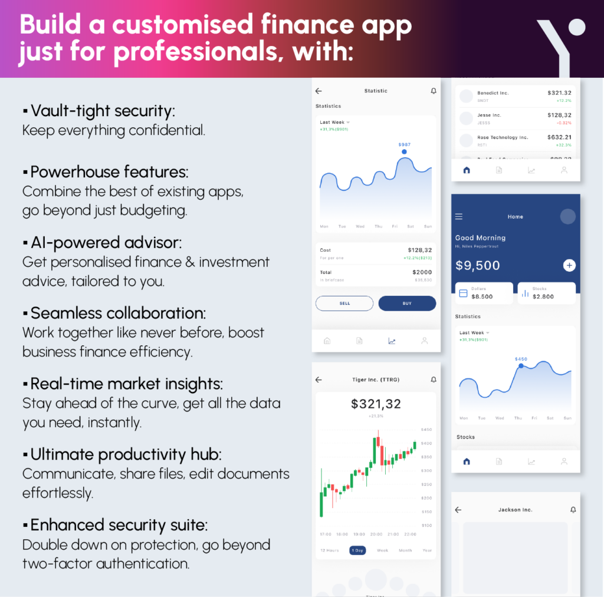

## Table of Contents

## What are the basic functions that financial analysts need in their apps?

Financial analysts need apps that can help them with their daily tasks. These apps should be able to gather and organize data from different places like stock markets, financial statements, and economic reports. The apps should also be able to show this data in a way that is easy to understand, like using graphs and charts. This helps analysts see trends and patterns quickly.

Another important function is the ability to do calculations and make predictions. Analysts use these apps to create financial models and forecasts. The apps should have tools that can handle complex math and formulas. This helps analysts make better decisions about investments and risks.

Lastly, the apps should allow analysts to work together and share information easily. They need to be able to send reports, collaborate on projects, and keep everyone updated. Good communication tools within the app can make their work more efficient and effective.

## How can beginners in financial analysis benefit from using specific apps?

Beginners in financial analysis can benefit a lot from using specific apps because these tools make it easier to learn and understand the basics. For example, apps like Bloomberg Terminal or Morningstar provide access to a lot of financial data and news. They help beginners by showing them how to look at stock prices, company earnings, and market trends in a simple way. These apps often have tutorials and guides that explain financial terms and concepts, which can be really helpful for someone just starting out.

Another way beginners can benefit is through the analysis tools these apps offer. Many apps come with built-in calculators and models that can help beginners practice analyzing financial data without needing to do everything from scratch. For instance, apps like YNAB (You Need A Budget) or Personal Capital can help beginners manage their own finances while learning about budgeting and investing. This hands-on experience is crucial for building confidence and skills in financial analysis.

Lastly, these apps often have community features where beginners can connect with more experienced analysts. This can be a great way to ask questions, get feedback, and learn from others. Apps like Seeking Alpha or StockTwits allow users to discuss market trends and investment strategies, which can provide valuable insights and support for those new to the field. By using these apps, beginners can gradually improve their understanding and proficiency in financial analysis.

## What features should a beginner look for in financial analysis apps?

When looking for a financial analysis app, beginners should focus on apps that are easy to use and have a lot of helpful resources. The app should have a simple design so it's not confusing. It should also have tutorials or guides that explain things like stocks, bonds, and financial terms in a way that's easy to understand. This helps beginners learn the basics without feeling overwhelmed. Also, the app should let beginners practice with real data, but in a safe way, so they can make mistakes and learn from them without losing money.

Another important feature is the ability to access a wide range of data and news. The app should pull information from different places like stock markets, company reports, and economic news. This helps beginners see how everything fits together. The app should also show this data in simple charts and graphs, which makes it easier to spot trends and patterns. Finally, having a community or forum where beginners can ask questions and learn from others can be really helpful. This way, they can get advice and feedback as they start their journey in financial analysis.

## Which apps are recommended for tracking and managing personal finances for financial analysts?

For financial analysts who want to track and manage their personal finances, apps like Mint and YNAB (You Need A Budget) are very helpful. Mint is great because it connects to your bank accounts and credit cards, showing all your money in one place. It helps you see where your money goes each month and even suggests ways to save. YNAB is also very useful because it focuses on giving every dollar a job, which means you plan how to spend your money before you actually spend it. This can help financial analysts stick to a budget and save more effectively.

Another good app for financial analysts is Personal Capital. This app not only tracks your spending and helps you budget, but it also gives you tools to plan for the future. It can help you see how much you need to save for retirement and even analyze your investment portfolio. For analysts who want to manage both their daily finances and long-term goals, Personal Capital is a great choice. These apps are easy to use and can help financial analysts keep their personal finances in order while they focus on their professional work.

## How do intermediate financial analysts use apps to enhance their data analysis?

Intermediate financial analysts use apps to make their data analysis better and faster. They use apps like Excel or Google Sheets to organize big sets of data. These apps have special functions and formulas that help analysts do complex calculations easily. For example, they can use pivot tables to look at data from different angles and find important trends. They also use apps like Tableau or Power BI to make cool charts and graphs. These visual tools help them see patterns in the data that might be hard to spot in a big spreadsheet.

Besides organizing and showing data, intermediate analysts also use apps to work together with their team. Apps like Slack or Microsoft Teams let them share their findings quickly and get feedback from others. This teamwork helps them make better decisions because they can see different points of view. Some apps, like Bloomberg Terminal, also give them real-time data and news, which is very important for making quick decisions in the fast-moving world of finance. By using these apps, intermediate financial analysts can do their job more effectively and make smarter choices.

## What are the top apps for advanced charting and technical analysis?

Advanced financial analysts often use apps like TradingView for their charting and technical analysis needs. TradingView is great because it lets users create detailed charts with many different indicators and drawing tools. This helps analysts see trends and patterns in the stock market easily. They can also share their charts and ideas with others on the platform, which can be useful for getting new ideas and feedback.

Another popular app is MetaTrader 4 (MT4) and its newer version, MetaTrader 5 (MT5). These apps are known for their powerful charting capabilities and the ability to use custom indicators and scripts. Analysts can automate their trading strategies with these apps, which saves time and helps them make decisions faster. Both MT4 and MT5 are widely used by professional traders because they offer a lot of tools and are easy to customize.

Lastly, Bloomberg Terminal is a top choice for advanced analysts who need detailed charting along with other financial data. It provides real-time data and advanced charting tools that can be customized to meet specific needs. Bloomberg Terminal also offers technical analysis features that help analysts predict market movements and make informed decisions. While it's more expensive, it's a comprehensive tool that many advanced financial analysts find indispensable.

## How can expert financial analysts use apps for portfolio management and optimization?

Expert financial analysts use apps like BlackRock's Aladdin to manage and optimize their portfolios. Aladdin helps them see all their investments in one place and uses fancy math to figure out the best way to spread their money. It can look at risks, predict how the market might change, and suggest ways to make the portfolio better. This helps analysts make smart choices about buying or selling investments to get the best returns while keeping risks low.

Another useful app is Morningstar Direct, which gives analysts a lot of data about different investments. They can use this data to compare how well different stocks or funds are doing and see which ones might be good to add to their portfolio. Morningstar Direct also has tools that help analysts build models to test different ways of managing their money. By using these models, they can find the best mix of investments that will help them reach their goals.

## Which apps provide the best real-time data and news feeds for financial analysis?

Expert financial analysts often use Bloomberg Terminal for the best real-time data and news feeds. This app is like a one-stop shop for all things finance. It gives you up-to-the-minute stock prices, company news, and economic reports. Analysts can customize their feeds to see only the information they need, which helps them make quick decisions. The app also lets them set alerts for specific events or price changes, so they never miss important updates.

Another great app for real-time data and news is Reuters Eikon. This app is known for its fast and reliable information. It covers a wide range of markets and provides detailed news stories, making it easy for analysts to stay informed. Reuters Eikon also has tools that help analysts see how news might affect the markets. They can use these insights to adjust their strategies and make better investment choices.

## What are the most useful apps for conducting in-depth market research and industry analysis?

Expert financial analysts often use apps like FactSet for in-depth market research and industry analysis. FactSet is great because it gathers a lot of data from different places like company reports, market trends, and economic indicators. Analysts can use this data to look at how different industries are doing and find out what might happen in the future. The app has tools that help them compare companies and see how they stack up against each other. This makes it easier to spot good investment opportunities and understand the risks.

Another useful app is S&P Capital IQ. This app gives analysts a lot of detailed information about companies and industries. They can see financial statements, news, and even what analysts from other firms are saying. S&P Capital IQ also has tools that help analysts build models to predict how companies might do in the future. By using these models, analysts can make smarter decisions about where to invest their money. Both FactSet and S&P Capital IQ are powerful tools that help experts do thorough research and analysis.

## How do financial analysts use apps to comply with regulatory requirements and manage risk?

Financial analysts use apps like ComplySci to make sure they follow the rules set by financial regulators. These apps help them keep track of things like who can trade what and when, and they make sure everyone follows the rules. ComplySci can also send alerts if something looks wrong, which helps analysts fix problems before they get big. This way, they can avoid getting in trouble with the people who watch over the financial world.

For managing risk, analysts often use apps like Riskalyze. This app helps them see how risky their investments are and if they fit with what their clients want. Riskalyze uses math to figure out how likely it is that something bad might happen to their money. By using these tools, analysts can make better choices about where to put their money and how to protect it from big losses. This helps them keep their clients happy and their portfolios safe.

## Which apps offer the best integration with other financial tools and platforms for expert users?

Expert financial analysts often use Bloomberg Terminal because it works well with many other financial tools and platforms. It can connect with trading systems, data providers, and even other analysis software. This makes it easy for analysts to get all the information they need in one place. They can quickly move data from Bloomberg Terminal to other apps they use, like Excel or custom-built models, without having to do a lot of extra work. This saves time and helps them make better decisions faster.

Another app that offers great integration is FactSet. It can link up with lots of different systems, like CRM software, risk management tools, and even other research platforms. This means analysts can pull in data from different places and use it all together in FactSet. They can also send their findings back to other systems easily. This kind of integration helps experts work more efficiently and get a complete view of their investments and the market.

## What future trends in financial analysis apps should experts be aware of?

Experts in financial analysis should keep an eye on the growing use of artificial intelligence and machine learning in apps. These technologies are becoming more common because they can help analysts make better predictions and find patterns in big sets of data. For example, AI can look at past stock prices and news to guess what might happen next in the market. This can save analysts a lot of time and help them make smarter choices. As these tools get better, they will become even more important for staying ahead in the fast-changing world of finance.

Another trend to watch is the rise of blockchain and decentralized finance (DeFi) apps. These apps are changing how money moves around and how investments are made. They let people do things like trade cryptocurrencies or lend money without needing a bank or other middleman. Financial analysts will need to understand how these new systems work and how they can affect traditional markets. As more people use blockchain and DeFi, the apps that help analysts keep up with these changes will become more important.

## What are the top financial apps for analysts?

Financial analysts increasingly rely on specialized apps to manage, analyze, and visualize vast amounts of data efficiently. The following are some of the top financial apps that every analyst should consider incorporating into their toolkit to enhance their analytical capabilities and decision-making processes.

The **Federal Reserve Economic Data (FRED) App** is an essential tool for analysts who require comprehensive economic data. Managed by the Federal Reserve Bank of St. Louis, this app provides access to over 820,000 data series covering a wide array of categories, including GDP, interest rates, employment [statistics](/wiki/bayesian-statistics), and more. This vast repository of data supports analysts in conducting economic research, generating forecasts, and contextualizing market movements. The convenience of having access to such a breadth of data on a mobile application allows analysts to stay updated with global and domestic market conditions, thereby supporting informed decision-making.

The **uValue App** is particularly beneficial for financial analysts engaged in corporate valuations. Created by Professor Aswath Damodaran of New York University, this app includes calculators for key valuation metrics such as Weighted Average Cost of Capital (WACC) and Adjusted Present Value (APV). By streamlining complex calculations and providing an intuitive interface, uValue enables analysts to efficiently assess a company's value. For instance, the WACC is vital for determining the cost of financing a company's operations and is calculated as follows:

$$
\text{WACC} = \left( \frac{E}{V} \times Re \right) + \left( \frac{D}{V} \times Rd \times (1-Tc) \right)
$$

where:
- $E$ is the market value of equity,
- $V$ is the total market value of equity and debt,
- $Re$ is the cost of equity,
- $D$ is the market value of debt,
- $Rd$ is the cost of debt, and
- $Tc$ is the corporate tax rate.

The **TheStreet App** is another valuable resource for analysts who require real-time financial news, stock analysis, and market commentary. Founded by financial journalist Jim Cramer, TheStreet offers a platform where users can access the latest news and expert insights into the stock market. This app not only helps analysts keep abreast of current trends and developments but also provides tools for stock analysis through charts and detailed reports. Through its stock screener feature, analysts can filter stocks based on multiple criteria, enabling targeted analysis for investment decisions.

These apps provide financial analysts with powerful tools for enhancing productivity, conducting thorough analyses, and staying informed about market developments. By integrating these applications into their daily workflow, analysts can effectively transform data into actionable insights.

## References & Further Reading

[1]: Bergstra, J., Bardenet, R., Bengio, Y., & Kégl, B. (2011). ["Algorithms for Hyper-Parameter Optimization."](https://papers.nips.cc/paper/4443-algorithms-for-hyper-parameter-optimization) Advances in Neural Information Processing Systems 24.

[2]: ["Advances in Financial Machine Learning"](https://www.amazon.com/Advances-Financial-Machine-Learning-Marcos/dp/1119482089) by Marcos Lopez de Prado

[3]: ["Evidence-Based Technical Analysis: Applying the Scientific Method and Statistical Inference to Trading Signals"](https://www.amazon.com/Evidence-Based-Technical-Analysis-Scientific-Statistical/dp/0470008741) by David Aronson

[4]: ["Machine Learning for Algorithmic Trading"](https://github.com/PacktPublishing/Machine-Learning-for-Algorithmic-Trading-Second-Edition) by Stefan Jansen

[5]: ["Quantitative Trading: How to Build Your Own Algorithmic Trading Business"](https://www.amazon.com/Quantitative-Trading-Build-Algorithmic-Business/dp/1119800064) by Ernest P. Chan

[6]: Damodaran, A. ["Investment Valuation: Tools and Techniques for Determining the Value of Any Asset"](https://www.wiley.com/en-us/Investment+Valuation%3A+Tools+and+Techniques+for+Determining+the+Value+of+Any+Asset%2C+3rd+Edition-p-9781118011522) by Aswath Damodaran

[7]: ["Algorithmic Trading: Winning Strategies and Their Rationale"](https://www.wiley.com/en-us/Algorithmic+Trading%3A+Winning+Strategies+and+Their+Rationale-p-9781118460146) by Ernest P. Chan

[8]: Federal Reserve Economic Data (FRED), [Access FRED Dashboard](https://fred.stlouisfed.org/) - Federal Reserve Bank of St. Louis

[9]: Interactive Brokers, [API Software](https://www.interactivebrokers.com/en/trading/ib-api.php) - Interactive Brokers Group

[10]: QuantConnect, [Algorithmic Trading Platform](https://www.quantconnect.com/)