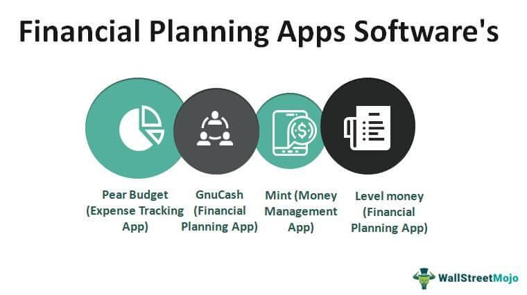

In today's fast-paced financial environment, productivity tools and financial apps are indispensable for financial analysts and traders. The rapid advancement of technology has equipped financial professionals with a diverse array of applications that significantly enhance efficiency and facilitate informed decision-making. These tools empower analysts and traders to handle data more effectively, access market information swiftly, and execute strategies with increased precision.

Algorithmic trading has gained considerable traction in recent years, providing automated strategies for managing complex trading tasks. This method utilizes sophisticated software to execute trades at speeds and frequencies that are impossible for a human trader. By leveraging algorithmic trading platforms, financial professionals can automate routine tasks and focus on developing strategies that respond to real-time market conditions.



This article will explore some of the top productivity tools, financial apps, and algorithmic trading platforms that every financial analyst should incorporate into their toolkit. By understanding and utilizing these technologies, financial professionals can optimize their workflow, improve the accuracy of their analyses, and maintain a competitive edge in an ever-evolving market landscape.

## Table of Contents

## The Importance of Financial Apps for Analysts

Financial apps provide analysts with real-time data, significantly enhancing their ability to make data-driven decisions. One of the primary benefits of these apps is their capability to deliver instantaneous market information, which is crucial for analysts who need to respond quickly to market changes. The immediacy with which these apps provide data helps analysts stay ahead of market fluctuations and capitalize on emerging opportunities.

These applications are equipped with a range of functionalities that are indispensable for modern financial analysis. Virtual portfolios, for instance, allow analysts to simulate trading strategies and assess their potential outcomes without exposing actual capital to market risks. This feature enables comprehensive risk assessment and strategic planning, ensuring that analysts can test and refine their approaches under various market conditions.

Additionally, financial apps often include advanced calculators and analytical tools. These features assist analysts in performing complex calculations swiftly and accurately, which is vital for tasks such as determining key financial ratios and metrics. For example, an app might offer a calculator for the Weighted Average Cost of Capital (WACC), facilitating the evaluation of investment projects or corporate valuations.

Access to an extensive pool of market data is another significant advantage of financial apps. By aggregating data from diverse sources, these apps provide analysts with a holistic view of market trends and conditions. This comprehensive data access enables analysts to identify patterns, understand market dynamics, and make informed investment decisions based on thorough quantitative and qualitative analysis.

Leveraging these tools allows analysts to remain updated with the latest market trends and adapt their strategies accordingly. By maintaining access to real-time data and sophisticated analytical functionalities, financial professionals can optimize their decision-making processes, leading to improved financial outcomes and a competitive edge in the markets.

## Top Financial Apps for Analysts

Financial analysts increasingly rely on specialized apps to manage, analyze, and visualize vast amounts of data efficiently. The following are some of the top financial apps that every analyst should consider incorporating into their toolkit to enhance their analytical capabilities and decision-making processes.

The **Federal Reserve Economic Data (FRED) App** is an essential tool for analysts who require comprehensive economic data. Managed by the Federal Reserve Bank of St. Louis, this app provides access to over 820,000 data series covering a wide array of categories, including GDP, interest rates, employment [statistics](/wiki/bayesian-statistics), and more. This vast repository of data supports analysts in conducting economic research, generating forecasts, and contextualizing market movements. The convenience of having access to such a breadth of data on a mobile application allows analysts to stay updated with global and domestic market conditions, thereby supporting informed decision-making.

The **uValue App** is particularly beneficial for financial analysts engaged in corporate valuations. Created by Professor Aswath Damodaran of New York University, this app includes calculators for key valuation metrics such as Weighted Average Cost of Capital (WACC) and Adjusted Present Value (APV). By streamlining complex calculations and providing an intuitive interface, uValue enables analysts to efficiently assess a company's value. For instance, the WACC is vital for determining the cost of financing a company's operations and is calculated as follows:

$$
\text{WACC} = \left( \frac{E}{V} \times Re \right) + \left( \frac{D}{V} \times Rd \times (1-Tc) \right)
$$

where:
- $E$ is the market value of equity,
- $V$ is the total market value of equity and debt,
- $Re$ is the cost of equity,
- $D$ is the market value of debt,
- $Rd$ is the cost of debt, and
- $Tc$ is the corporate tax rate.

The **TheStreet App** is another valuable resource for analysts who require real-time financial news, stock analysis, and market commentary. Founded by financial journalist Jim Cramer, TheStreet offers a platform where users can access the latest news and expert insights into the stock market. This app not only helps analysts keep abreast of current trends and developments but also provides tools for stock analysis through charts and detailed reports. Through its stock screener feature, analysts can filter stocks based on multiple criteria, enabling targeted analysis for investment decisions.

These apps provide financial analysts with powerful tools for enhancing productivity, conducting thorough analyses, and staying informed about market developments. By integrating these applications into their daily workflow, analysts can effectively transform data into actionable insights.

## Algorithmic Trading Platforms

Algorithmic trading utilizes software to enact trades based on predefined criteria and mathematical algorithms. This method allows traders to execute orders with speed and precision, optimizing their strategies by quantifying and automating repetitive trading tasks. Algorithmic trading platforms such as TradeStation and [Interactive Brokers](/wiki/interactive-brokers-api) cater to both novice and experienced traders by providing sophisticated features that enhance trading efficiency and effectiveness.

TradeStation is renowned for its powerful scanning tools and intuitive programming language, EasyLanguage. This platform empowers traders to create custom trading strategies that can be backtested against historical data. By doing so, traders gain insights into the potential profitability of their strategies before deploying them in live markets. TradeStation's capabilities include advanced order execution and comprehensive market data analysis, allowing users to automate trade execution based on complex technical indicators and market movements. 

Interactive Brokers offers a robust [algorithmic trading](/wiki/algorithmic-trading) suite with an extensive Application Programming Interface (API) that supports various programming languages, most notably Python and C++. This flexibility allows traders to develop and implement custom trading algorithms that can seamlessly integrate with their existing trading systems. Through Interactive Brokers, traders can automate their trading processes, perform detailed [backtesting](/wiki/backtesting), and analyze vast datasets to refine their strategies. The platform accommodates a wide range of trading instruments, making it an all-encompassing tool for traders seeking comprehensive automation solutions.

Both platforms provide essential functionalities for algorithmic trading, such as automated trade execution and backtesting, enabling traders to optimize their strategies based on historical performance data. By leveraging these algorithmic trading platforms, financial professionals can improve their trading processes, enhance decision-making, and potentially increase their returns by capitalizing on market inefficiencies through automated strategies.

## Best Algorithmic Trading Software

TradeStation is highly regarded in the algorithmic trading domain for its powerful scanning tools and its proprietary programming language, EasyLanguage. EasyLanguage is designed to be accessible for users who are not proficient in traditional programming languages yet powerful enough to develop complex trading strategies. This platform supports comprehensive market analysis through advanced charting capabilities and real-time data streaming, enabling traders to identify opportunities and automate their trading strategies efficiently.

Interactive Brokers is another prominent platform, offering a comprehensive API that allows traders to build customized trading algorithms using Python, C++, Java, and several other programming languages. Its API provides access to extensive market data and account management functions, empowering users to develop and deploy sophisticated trading systems. A simple Python example to connect and retrieve market data might look like this:

```python
from ibapi.client import EClient
from ibapi.wrapper import EWrapper

class TestApp(EWrapper, EClient):
    def __init__(self):
        EClient.__init__(self, self)

    def nextValidId(self, orderId):
        self.start()

    def start(self):
        self.reqMarketDataType(1)  # live data
        self.reqMktData(1, "AAPL", "", False, False, [])

app = TestApp()
app.connect("127.0.0.1", 7496, clientId=0)
app.run()
```

QuantConnect stands out as an open-source algorithmic trading platform, offering an engine for backtesting and executing high-frequency trading strategies. Its development environment, Lean, supports multiple programming languages including Python and C#, providing flexibility for traders in designing and optimizing their algorithms. QuantConnect's cloud-based structure allows users to test their models using historical data, ensuring they are robust before real-world deployment.

These platforms, by leveraging modern computational resources and programming capabilities, provide traders with the tools to develop, test, and implement trading strategies with a higher degree of precision and speed, contributing significantly to the field of algorithmic trading.

## Key Considerations for Selecting Tools

When selecting financial apps and trading platforms, financial analysts and traders must evaluate several critical factors to ensure optimal functionality and alignment with their professional needs. One of the first considerations is the ease of use of the platform or app. A user-friendly interface can significantly reduce the learning curve, allowing analysts to focus on data analysis and decision-making tasks without being hindered by complex navigation or functionalities. Intuitive design and accessibility can enhance productivity by minimizing time spent on technical troubleshooting.

Cost is another essential [factor](/wiki/factor-investing), encompassing not only the initial purchase price or subscription fees but also additional costs related to data access or premium features. Analysts and traders should assess their budget constraints and weigh these against the potential return on investment that the tool might offer. A higher initial cost may be justified if the app or platform significantly boosts productivity or provides unique capabilities that drive better investment outcomes.

Access to data is paramount for informed decision-making. The selected tools should offer comprehensive data sets relevant to the analyst's focus areas, whether these entail international markets, specific industries, or detailed financial metrics. Tools that provide real-time data updates can be especially beneficial, enabling timely responses to market movements and reducing reliance on static or outdated data sources.

Integration capabilities are also crucial. Financial analysts often use multiple tools and platforms, so seamless integration can streamline workflows and ensure data consistency across applications. Platforms supporting API access can facilitate customized solutions and enable the leveraging of software ecosystems, enhancing an analyst's ability to perform complex analyses or automate routine tasks.

Lastly, analysts and traders must ensure that the chosen tools align with their investment strategies and workflow requirements. This alignment means that the tool's features should support the strategic objectives of the analyst's investment approach, whether this involves high-frequency trading, value investing, or technical analysis. Customization options and scalability potential should be considered to allow the tool to evolve alongside changing strategic needs and market conditions.

Incorporating these considerations can help financial professionals select apps and platforms that not only enhance their current productivity but also support their long-term strategic objectives in the financial marketplace.

## Conclusion

In the fast-evolving landscape of finance, productivity tools and financial apps have become essential assets for analysts and traders. These digital solutions offer a multitude of functionalities that empower financial professionals to optimize their workflows, enhance data analysis, and make well-informed decisions. By seamlessly integrating real-time data feeds and sophisticated analytical tools, these apps enable users to promptly respond to market developments and execute strategies with precision.

Moreover, the adoption of algorithmic trading platforms has revolutionized the way trades are executed, providing traders with the ability to automate strategies and backtest them against historical data to refine their approaches. Platforms like TradeStation and Interactive Brokers have made it feasible for even novice traders to engage in algorithmic trading, fostering a more analytical and systematic approach to market engagement.

Selecting the appropriate tools is critical; factors such as ease of use, data accessibility, and integration capabilities should align with an analyst’s specific needs. This careful selection process ensures that financial professionals do not just possess the latest tools but harness them effectively to support their investment strategies and enhance their operational efficiency.

Harnessing these advanced tools empowers analysts and traders to maintain a competitive edge in a crowded market, ultimately improving decision-making capabilities and productive outcomes. As technology continues to progress, the landscape of financial analysis is bound to keep evolving, making it imperative for professionals to stay current with technological advancements to remain relevant and prosperous.

## References & Further Reading

[1]: Bergstra, J., Bardenet, R., Bengio, Y., & Kégl, B. (2011). ["Algorithms for Hyper-Parameter Optimization."](https://papers.nips.cc/paper/4443-algorithms-for-hyper-parameter-optimization) Advances in Neural Information Processing Systems 24.

[2]: ["Advances in Financial Machine Learning"](https://www.amazon.com/Advances-Financial-Machine-Learning-Marcos/dp/1119482089) by Marcos Lopez de Prado

[3]: ["Evidence-Based Technical Analysis: Applying the Scientific Method and Statistical Inference to Trading Signals"](https://www.amazon.com/Evidence-Based-Technical-Analysis-Scientific-Statistical/dp/0470008741) by David Aronson

[4]: ["Machine Learning for Algorithmic Trading"](https://github.com/PacktPublishing/Machine-Learning-for-Algorithmic-Trading-Second-Edition) by Stefan Jansen

[5]: ["Quantitative Trading: How to Build Your Own Algorithmic Trading Business"](https://www.amazon.com/Quantitative-Trading-Build-Algorithmic-Business/dp/1119800064) by Ernest P. Chan

[6]: Damodaran, A. ["Investment Valuation: Tools and Techniques for Determining the Value of Any Asset"](https://www.wiley.com/en-us/Investment+Valuation%3A+Tools+and+Techniques+for+Determining+the+Value+of+Any+Asset%2C+3rd+Edition-p-9781118011522) by Aswath Damodaran

[7]: ["Algorithmic Trading: Winning Strategies and Their Rationale"](https://www.wiley.com/en-us/Algorithmic+Trading%3A+Winning+Strategies+and+Their+Rationale-p-9781118460146) by Ernest P. Chan

[8]: Federal Reserve Economic Data (FRED), [Access FRED Dashboard](https://fred.stlouisfed.org/) - Federal Reserve Bank of St. Louis

[9]: Interactive Brokers, [API Software](https://www.interactivebrokers.com/en/trading/ib-api.php) - Interactive Brokers Group

[10]: QuantConnect, [Algorithmic Trading Platform](https://www.quantconnect.com/)