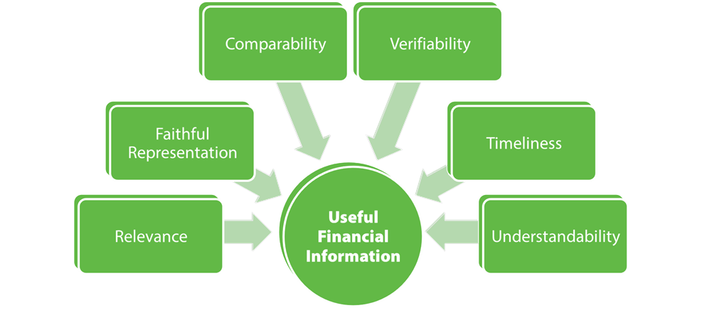

Financial statements, accounting basics, financial analysis, and algorithmic trading form an intricate network that is crucial for investors and traders. Financial statements offer a quantitative summary of a company's financial health and performance. Understanding these documents is fundamental for investors and traders as they serve as the primary source of financial data, which is essential for assessing an organization's viability and making decisions regarding investing or trading in its securities.

Financial analysis plays a pivotal role in empowering investors and traders to make well-informed trading decisions. Through financial analysis, stakeholders can analyze data from financial statements to evaluate a company's profitability, solvency, and liquidity. By employing various financial ratios and models, analysts can identify trends and predict future performance, aiding strategic investment and trading decisions.



Algorithmic trading, which involves using automated systems to execute trades based on predefined strategies, relies heavily on financial data extracted from these analyses. The strategies are often developed based on past financial performance and current market data. As algorithms depend on precise and timely data to optimize trading strategies, the quality of financial data incorporated into these systems is paramount. Algorithmic trading also leverages technical and fundamental analyses, integrating complex data sets and employing machine learning techniques to enhance decision-making and optimize the timing of trades.

In summary, mastery of financial statements and accounting principles forms the foundation upon which financial analysis can be accurately performed, leading to the creation of sophisticated algorithmic trading strategies. This interconnectedness enhances market efficiency and trader decision-making capabilities while expanding the scope for innovation and development within the financial sector.

## Table of Contents

## Understanding Financial Statements

Financial statements are essential tools for evaluating a company's financial health and performance. They serve as a comprehensive scorecard for investors, providing insights into various aspects of a business's operations and financial position. Understanding these statements is crucial for making informed investment decisions and identifying potential opportunities.

Financial statements typically consist of three main components: balance sheets, income statements, and cash flow statements. Each component offers unique insights:

1. **Balance Sheet**: The balance sheet provides a snapshot of a company's financial position at a specific point in time. It outlines the fundamental accounting equation: Assets = Liabilities + Equity. 
   - **Assets** represent the resources owned by the company, which can include cash, inventory, property, and equipment. They are divided into current assets, which are expected to be converted into cash within a year, and non-current assets, which are long-term investments.
   - **Liabilities** are the obligations the company owes to outside parties, such as loans and accounts payable. They are categorized into current liabilities, payable within a year, and long-term liabilities.
   - **Equity** represents the owner's claim after all liabilities have been settled. It includes capital contributed by shareholders and retained earnings.

2. **Income Statement**: Also known as the profit and loss statement, it provides insights into a company's revenue and expenses over a defined period, typically a fiscal quarter or year.
   - **Revenue** is the total income generated from core business activities, such as the sale of goods or services.
   - **Expenses** are the costs incurred in generating revenue, including cost of goods sold (COGS), operating expenses, interest, and taxes.
   - The result of the income statement is the net income, calculated as Revenue - Expenses, which indicates the company's profitability.

3. **Cash Flow Statement**: This statement details the inflows and outflows of cash over a period. It is divided into three sections:
   - **Operating Activities**: Cash flows directly related to the core business operations, such as receipts from customers and payments to suppliers.
   - **Investing Activities**: Cash flows from purchasing and selling long-term assets, like property or equipment.
   - **Financing Activities**: Cash flows related to debt and equity financing, including issuing shares, paying dividends, and repaying loans.

The significance of each financial statement lies in its ability to provide a different perspective on the company’s operation and financial health. For instance, the balance sheet offers a view of financial stability and [liquidity](/wiki/liquidity-risk-premium), the income statement reveals operational efficiency and profitability, while the cash flow statement highlights the liquidity and cash management practices.

For investors, these financial statements are crucial for assessing a company's ability to generate profits, manage debts, and sustain operations over the long term. Key concepts like assets, liabilities, equity, revenue, and expenses form the basis for evaluating financial metrics such as liquidity ratios, profitability ratios, and leverage ratios. These metrics help investors screen stocks and make informed investment decisions.

Moreover, financial statements are instrumental for regulatory compliance and providing transparency to all stakeholders, including investors, creditors, and regulatory bodies.

Understanding these components and their significance not only aids in investment analysis but also plays a fundamental role when incorporating financial data into advanced trading strategies, such as [algorithmic trading](/wiki/algorithmic-trading).

## Accounting Basics for Financial Analysis

Accounting serves as the backbone of financial analysis, offering a structured approach to recording, summarizing, and interpreting financial information. At its core lie fundamental principles, including revenue recognition, matching, and full disclosure, that ensure the accuracy and consistency of financial data.

Revenue recognition is a critical accounting principle that determines when income should be recorded. According to this principle, revenue is recognized when it is earned and realizable, irrespective of when the cash is actually received. This approach helps provide an accurate reflection of a company's financial performance over specific periods.

The matching principle complements revenue recognition by dictating that expenses should be recorded in the same period as the revenues they helped generate. By aligning expenses with associated revenues, this principle ensures that a company's financial statements accurately depict its financial situation, providing insightful data for analysis.

Full disclosure requires that all material information is presented in financial statements, ensuring that users are not misled by omissions or misrepresentations. This transparency is crucial for both investors and analysts seeking a comprehensive understanding of a company's financial health.

Accounting provides accurate financial data by adhering to these principles, thus forming the foundation for robust financial analysis. The importance of standardized financial reporting frameworks like Generally Accepted Accounting Principles (GAAP) and International Financial Reporting Standards (IFRS) cannot be overstated. These frameworks ensure consistency and comparability of financial statements across different regions and industries, enhancing the reliability and credibility of financial analysis.

Accounting is often perceived as an art due to the judgment and estimation involved in applying its principles. For instance, deciding on the rate of depreciation or estimating bad debts requires significant professional judgment. Such subjectivity can impact financial analysis, as interpretations and estimations may vary among accountants. This perception underscores the importance of skilled judgment in analyzing financial statements, recognizing that numbers may only tell part of a story without context.

In conclusion, the fundamental principles of accounting—revenue recognition, matching, and full disclosure—form the basis for accurate financial reporting and analysis. Together with standardized frameworks like GAAP and IFRS, they facilitate informed decision-making. Understanding the artful aspects of accounting helps financial analysts appreciate the nuances in financial data, promoting more insightful evaluations of a company's performance.

## Financial Ratios and Indicators

Financial ratios are crucial tools for investors and analysts, providing insights into the operational efficiency and financial health of a company. These ratios can be broadly categorized into three types: liquidity ratios, profitability ratios, and leverage ratios. Each offers a different perspective on a company's performance, helping stakeholders make informed decisions.

### Liquidity Ratios

Liquidity ratios assess a company's ability to meet its short-term obligations using its most liquid assets. The most common liquidity ratios are the Current Ratio and the Quick Ratio.

- **Current Ratio**: This measures the ability of a company to pay its short-term liabilities with its short-term assets. It is calculated as:
$$
  \text{Current Ratio} = \frac{\text{Current Assets}}{\text{Current Liabilities}}

$$

  A higher ratio indicates a better ability to cover short-term debts, but excessively high values may suggest inefficient asset use.

- **Quick Ratio**: Also known as the acid-test ratio, this is a more stringent measure that excludes inventory from current assets. It is given by:
$$
  \text{Quick Ratio} = \frac{\text{Current Assets} - \text{Inventory}}{\text{Current Liabilities}}

$$

  This ratio provides a more conservative view of a company's liquidity position.

### Profitability Ratios

Profitability ratios evaluate a company's ability to generate income relative to revenue, assets, equity, and other financial components. Key profitability ratios include the Net Profit Margin, Return on Assets (ROA), and Return on Equity (ROE).

- **Net Profit Margin**: This ratio shows what percentage of revenue is converted into net income, calculated as:
$$
  \text{Net Profit Margin} = \left( \frac{\text{Net Income}}{\text{Revenue}} \right) \times 100

$$

  A higher margin indicates efficient cost management and successful revenue conversion.

- **Return on Assets (ROA)**: This measures how efficient a company is at using its assets to generate earnings, expressed as:
$$
  \text{ROA} = \left( \frac{\text{Net Income}}{\text{Total Assets}} \right) \times 100

$$

  Higher values suggest better asset utilization.

- **Return on Equity (ROE)**: This reflects the ability of a firm to generate profits from its shareholders' investments, calculated as:
$$
  \text{ROE} = \left( \frac{\text{Net Income}}{\text{Shareholders' Equity}} \right) \times 100

$$

  It indicates how effectively management is using the equity financing.

### Leverage Ratios

Leverage ratios help assess the degree of financial leverage a company is employing. These ratios are vital for understanding the risk associated with a company's debt levels. Key leverage ratios include the Debt-to-Equity Ratio and Interest Coverage Ratio.

- **Debt-to-Equity Ratio**: It measures the relative proportion of shareholders' equity and debt used to finance a company's assets:
$$
  \text{Debt-to-Equity Ratio} = \frac{\text{Total Liabilities}}{\text{Shareholders' Equity}}

$$

  A high ratio implies significant leverage and, potentially, higher financial risk.

- **Interest Coverage Ratio**: This indicates a firm's ability to pay interest on outstanding debt, computed as:
$$
  \text{Interest Coverage Ratio} = \frac{\text{Earnings Before Interest and Taxes (EBIT)}}{\text{Interest Expense}}

$$

  Higher values suggest a better capacity to cover interest payments.

### Role in Stock Screening and Evaluation

Financial ratios play a pivotal role in stock screening and evaluating investment potential. Investors use these metrics to compare companies within the same industry, identify trends over time, and determine financial stability and profitability. Ratios like the Price-to-Earnings (P/E) ratio provide a benchmark for valuing stocks:

- **P/E Ratio**: It measures a company's current share price relative to its per-share earnings:
$$
  \text{P/E Ratio} = \frac{\text{Market Value per Share}}{\text{Earnings per Share (EPS)}}

$$

  A high P/E may suggest expected growth, but too high a value could also indicate an overvalued stock.

Financial analysis using these ratios helps investors identify potential investments and assess portfolio risks. By comparing ratio results across different companies and against industry averages, investors can gauge which stocks offer the best opportunities for growth and profitability.

## Integration of Accounting Data in Algo Trading

The integration of accounting data into algorithmic trading strategies represents a sophisticated convergence of finance and technology, enabling traders to formulate more precise and effective trading algorithms. Accounting data serves as the foundation for financial analysis that underpins algorithmic trading strategies, offering structured insights into a company's financial performance. By evaluating historical and current financial statements, traders can develop algorithms that better predict market behaviors and price movements.

Financial analysis contributes to algorithm development by enabling a detailed evaluation of company-specific metrics, which can then be programmed into trading algorithms. Key financial ratios and indicators derived from accounting data, such as earnings per share (EPS), return on equity (ROE), and the debt-to-equity ratio, are instrumental in identifying potential investment opportunities and managing risk. These metrics facilitate the creation of quantitative models that automatically evaluate securities against set criteria, making trading decisions based on financial health indicators.

Using accounting data enhances the precision of algorithmic trading by allowing for more informed risk management. By integrating comprehensive financial data, algorithms can assess and adapt to market [volatility](/wiki/volatility-trading-strategies), ensuring trades are aligned with the trader's risk tolerance and investment goals. Additionally, incorporating [fundamental analysis](/wiki/fundamental-analysis) factors into trading models often leads to improved predictive accuracy, as it helps identify intrinsic stock value, potentially giving traders an edge in volatile markets.

Machine learning has revolutionized the way accounting data is processed and analyzed for trading. By deploying [machine learning](/wiki/machine-learning) algorithms, traders can identify patterns and correlations in vast datasets that might not be evident through traditional analysis methods. Machine learning models, such as neural networks or decision trees, can be trained to optimize trading algorithms by learning from historical data and continuously improving decision-making prowess over time. These models assist in analyzing vast amounts of structured and unstructured data, thereby refining trading strategies with sophisticated variable interconnections and adaptive responses to new data inputs.

Python, a popular language in algorithmic trading and data analysis, can be employed to build and test machine learning models with libraries such as TensorFlow or Scikit-learn. For example, a simple implementation might involve using a supervised learning model to predict stock price movements based on historical financial data:

```python
from sklearn.model_selection import train_test_split
from sklearn.ensemble import RandomForestClassifier
import pandas as pd

# Load financial data
data = pd.read_csv('financial_data.csv')

# Features (e.g., ratios, EPS) and target variable (e.g., price movement direction)
X = data.drop('target', axis=1)
y = data['target']

# Split data into training and testing sets
X_train, X_test, y_train, y_test = train_test_split(X, y, test_size=0.2, random_state=42)

# Train a Random Forest Classifier
model = RandomForestClassifier()
model.fit(X_train, y_train)

# Evaluate model
accuracy = model.score(X_test, y_test)
print(f'Model Accuracy: {accuracy:.2f}')
```

Such integration of accounting data into algorithmic trading not only facilitates the design of sophisticated trading strategies but also enhances the agility and reliability of those strategies in a rapidly changing market environment. As technology and financial analysis continue to evolve, the synergy between algorithmic trading and accounting data is likely to deepen, providing traders with even more robust tools to navigate complex market landscapes.

## Challenges and Considerations

Integrating financial statements into algorithmic trading systems presents several challenges, primarily concerning data accuracy, timeliness, computational complexity, and regulatory compliance. Addressing these challenges is critical for developing robust trading algorithms that can effectively respond to market dynamics.

Data accuracy is paramount in algorithmic trading. Inaccurate financial data can lead to erroneous trading signals and significant financial losses. Financial statements may contain discrepancies due to errors in accounting entries, fraudulent activities, or differences in accounting standards. To mitigate these risks, traders often rely on third-party data providers that ensure high data integrity. These providers validate information from various sources, cross-referencing data to identify anomalies and provide corrected datasets.

Timeliness is another crucial [factor](/wiki/factor-investing). For trading algorithms that depend on financial statement data, any delay in data delivery can result in outdated information being used for decision-making, potentially leading to suboptimal trading outcomes. One solution is to integrate real-time data feeds from financial news services that provide updates on company earnings, statements, and other relevant news. These real-time feeds can be coupled with latency-optimized data pipelines to ensure that information reaches algorithmic systems with minimal delay.

The computational complexity of processing and analyzing large volumes of financial data can also hamper algorithmic trading systems. Comprehensive analysis involves extracting key insights from financial statements, such as evaluating liquidity, profitability, and leverage. This requires substantial computational resources, especially when dealing with big data analytics and machine learning models. Cloud computing and parallel processing techniques can be employed to handle this complexity, allowing for scalable and efficient data processing. For instance, distributed computing frameworks like Apache Hadoop or Apache Spark can be used to process financial datasets in parallel, improving both speed and efficiency.

Regulatory compliance and the associated legal considerations present additional challenges. Financial reporting is subject to various national and international regulations, such as the Generally Accepted Accounting Principles (GAAP) in the United States or the International Financial Reporting Standards (IFRS) globally. Traders must ensure that the financial data they integrate into their systems comply with these standards. Compliance also involves maintaining accurate records of data usage and ensuring transparency in algorithmic decision-making processes. Legal frameworks require that firms have adequate checks and balances to prevent fraudulent reporting and ensure the ethical use of financial data. Implementing robust audit trails and employing compliance management software can help in meeting these regulatory requirements.

Traders can overcome these challenges by employing advanced technologies like machine learning for automated data cleansing and validation, blockchain for securing data integrity, and leveraging API integrations for accessing up-to-date financial information. Adopting a comprehensive data management system that combines these technologies can enhance the ability of algorithmic trading systems to utilize financial statements effectively, thus improving trading performance and reducing risks.

## Conclusion

Understanding financial statements is essential for financial analysis and serves as a cornerstone for algorithmic trading. Insights drawn from balance sheets, income statements, and cash flow statements provide a comprehensive view of a company's financial health, forming the basis for making informed investment decisions. This financial clarity enables investors to assess risk effectively and tailor their strategies accordingly.

Integrating accounting data into trading strategies offers a multitude of benefits. By assimilating detailed financial data, traders can develop more precise algorithms that enhance decision-making processes considerably. Financial ratios and indicators derived from this data allow for nuanced analysis, contributing to improved risk management and potentially higher returns. Moreover, leveraging this data fosters the creation of algorithms that can adapt to market changes more dynamically, thus optimizing trading performance.

The future holds promising prospects as technological advancements continue to bridge the gap between financial analysis and algorithmic trading. Machine learning and [artificial intelligence](/wiki/ai-artificial-intelligence) are playing pivotal roles, offering increased accuracy in analyzing complex datasets and identifying trading opportunities that might otherwise be overlooked. These technologies empower traders to synthesize financial data on an unprecedented scale, facilitating more responsive and predictive trading strategies.

Continued education and adaptation to evolving financial standards and technologies are pivotal in navigating this intricate landscape. As financial instruments and reporting standards evolve, staying informed and agile becomes crucial for maintaining a competitive edge. Embracing lifelong learning and leveraging technological innovations ensures that traders can harness the full potential of financial statements and accounting data, positioning themselves strategically in an ever-evolving market environment.

## References & Further Reading

[1]: ["Financial Statement Analysis and Security Valuation"](https://www.mheducation.com/highered/product/Financial-Statement-Analysis-and-Security-Valuation-Penman.html) by Stephen H. Penman

[2]: ["Intermediate Accounting"](https://accountingtestprep.com/intermediate-accounting-2/) by Donald E. Kieso, Jerry J. Weygandt, and Terry D. Warfield

[3]: ["Algorithmic Trading: Winning Strategies and Their Rationale"](https://www.amazon.com/Algorithmic-Trading-Winning-Strategies-Rationale-ebook/dp/B00CY5HC0U) by Ernie Chan

[4]: ["Understanding Financial Statements"](https://online.hbs.edu/blog/post/how-to-read-financial-statements) by Aileen Ormiston and Lyn Fraser

[5]: ["Corporate Finance"](https://www.investopedia.com/terms/c/corporatefinance.asp) by Stephen Ross, Randolph Westerfield, and Jeffrey Jaffe