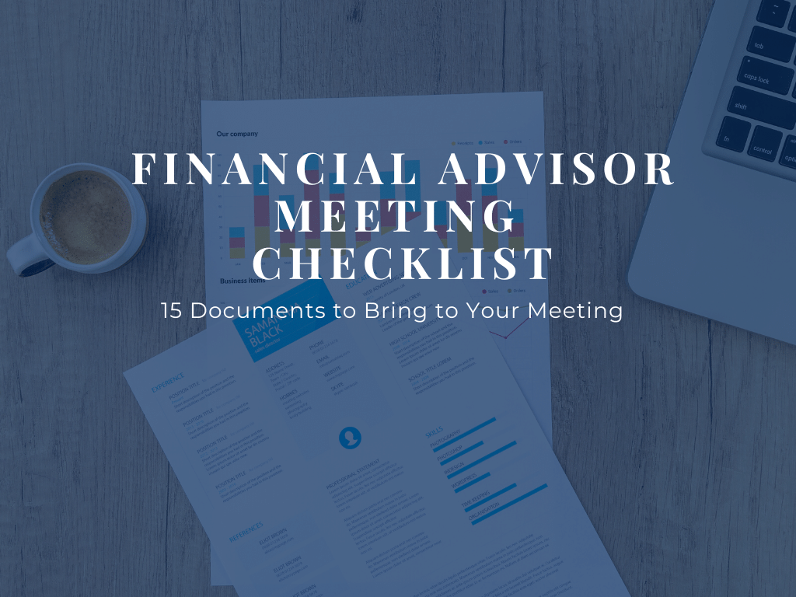

## Table of Contents

## What documents should I bring to my first financial advisor appointment?

When you go to your first meeting with a financial advisor, it's a good idea to bring some important documents. You should bring your recent pay stubs to show how much money you make. Also, bring your bank statements so the advisor can see how much money you have and how you spend it. If you have any investment accounts, like a 401(k) or IRA, bring those statements too. They help the advisor understand your current investments.

It's also helpful to bring any debt information, like credit card statements or loan documents. This shows the advisor how much you owe and what your monthly payments are. If you have a budget, bring that as well. It gives the advisor a clear picture of your financial situation. Lastly, if you have any specific financial goals, like saving for a house or retirement, bring notes about those goals so you can discuss them with your advisor.

## How can I prepare financially before meeting with a financial advisor?

Before you meet with a financial advisor, it's a good idea to take a look at your money situation. Start by figuring out how much money you make each month and how much you spend. Look at your bank statements and see where your money goes. If you don't have a budget, now is a good time to make one. It will help you see if you're spending too much on things you don't need. Also, think about any debts you have, like credit cards or loans. Write down how much you owe and what your monthly payments are. This will give you a clear picture of your finances before you meet with the advisor.

Next, think about what you want to achieve with your money. Do you want to save for a house, pay off debt, or plan for retirement? Write down your financial goals so you can talk about them with your advisor. It's also helpful to gather all your financial documents, like pay stubs, bank statements, and investment account statements. Having these ready will make your meeting more productive. By preparing ahead of time, you'll be able to have a more focused and helpful conversation with your financial advisor.

## What are the key questions I should ask my financial advisor during our first meeting?

During your first meeting with a financial advisor, it's important to ask questions that will help you understand their approach and how they can help you. Start by asking about their experience and qualifications. You want to know how long they've been a financial advisor and if they have any special certifications. It's also good to ask about their investment philosophy. Do they believe in taking big risks for big rewards, or do they prefer safer, more conservative investments? Understanding their approach will help you decide if they're a good fit for your financial goals.

Next, ask about the services they offer and how they get paid. Some advisors charge a flat fee, while others earn a commission on the products they sell. It's important to know this so you can understand any potential conflicts of interest. Also, ask how often you'll meet and how they'll communicate with you. Will you have regular check-ins, or will you only meet when there's a big change in your financial situation? Finally, discuss their plan for achieving your specific financial goals. How do they intend to help you save for a house, pay off debt, or plan for retirement? Getting clear answers to these questions will help you feel more confident in your financial advisor's ability to help you reach your goals.

## What financial goals should I discuss with my financial advisor?

When you meet with your financial advisor, it's important to talk about your short-term and long-term financial goals. Short-term goals might include saving for a vacation, buying a new car, or paying off credit card debt. These are things you want to achieve in the next few years. Your advisor can help you create a plan to reach these goals by setting up a savings plan or suggesting ways to reduce your spending. It's also good to talk about any big purchases you're thinking about, like a new laptop or furniture, so your advisor can help you budget for them.

For long-term goals, you should discuss things like buying a house, saving for your kids' college education, or planning for retirement. These goals take many years to achieve and require careful planning. Your financial advisor can help you figure out how much you need to save each month and what kind of investments will help you grow your money over time. They can also suggest ways to protect your money, like getting insurance or setting up an emergency fund. By talking about both your short-term and long-term goals, you and your advisor can create a comprehensive financial plan that helps you achieve all your dreams.

## How do I assess the credibility and expertise of a financial advisor?

To assess the credibility and expertise of a financial advisor, start by checking their qualifications and certifications. Look for advisors who have certifications like Certified Financial Planner (CFP) or Chartered Financial Analyst (CFA). These certifications show that the advisor has gone through rigorous training and passed exams to prove their knowledge. Also, find out how long they have been working as a financial advisor. More experience usually means they have seen a lot of different financial situations and know how to handle them. You can also check if they have any history of disciplinary actions by looking them up on the Financial Industry Regulatory Authority (FINRA) website.

Next, consider their reputation and how they work with clients. Ask for references from other clients and read online reviews to see what others say about their experience with the advisor. It's also important to understand how the advisor gets paid. Some advisors charge a flat fee, while others earn commissions from selling financial products. Knowing this can help you see if there might be any conflicts of interest. Finally, have a conversation with the advisor about their approach to financial planning. Ask about their investment philosophy and how they plan to help you reach your goals. If they can explain things clearly and seem to have a good plan for you, that's a sign of their expertise and credibility.

## What types of financial products might a financial advisor recommend during our initial meeting?

During your first meeting with a financial advisor, they might suggest some basic financial products to help you start managing your money better. One common recommendation could be a savings account, which is a safe place to keep your money and earn a little interest. They might also talk about setting up an emergency fund, which is money you save for unexpected expenses like car repairs or medical bills. Another product they might mention is a certificate of deposit (CD), which lets you save money for a set period of time and earn more interest than a regular savings account.

Your advisor might also discuss investment options like mutual funds or exchange-traded funds (ETFs). These are ways to invest your money in a mix of stocks and bonds, which can help your money grow over time. They might suggest starting with a retirement account like an IRA or a 401(k) if you don't already have one. These accounts offer tax benefits and can help you save for the future. Depending on your goals, they might also mention insurance products like life insurance or disability insurance to protect your finances if something unexpected happens.

## How should I evaluate the financial advisor's proposed investment strategies?

When your financial advisor suggests investment strategies, it's important to think about if they match your financial goals and how much risk you're willing to take. Your advisor might suggest putting your money in things like stocks, bonds, or mutual funds. You should ask them to explain how each one works and why they think it's good for you. If you want to save for a long time, like for retirement, they might suggest more risky investments that could grow a lot. But if you need the money soon, they might suggest safer options. Make sure the strategy they suggest fits with what you want to achieve and how much risk you can handle.

Also, think about how the advisor's suggestions might change over time. Good investment strategies can change based on what's happening in the economy or in your own life. Ask your advisor how often they'll check on your investments and if they'll make changes if needed. It's important that they keep an eye on things and adjust the plan to make sure you stay on track to meet your goals. By understanding how the strategies work and how they'll be managed, you can feel more confident about the advice you're getting.

## What are the common fees and costs associated with financial advisory services?

Financial advisors can charge you in different ways. One common way is a fee based on a percentage of the money they manage for you, usually around 1% each year. This means if they manage $100,000 for you, you might pay $1,000 a year. Another way is a flat fee, where you pay a set amount for their services, like $2,000 a year no matter how much money they manage. Some advisors also charge hourly rates, often between $100 and $300 per hour, which can be good if you just need advice now and then.

Another type of fee is a commission, which advisors earn when they sell you financial products like mutual funds or insurance. This can be a percentage of the amount you invest, so if you buy $10,000 worth of a mutual fund and the commission is 5%, the advisor gets $500. It's important to know about these commissions because they might make the advisor suggest products that earn them more money, not necessarily what's best for you. Always ask your advisor how they get paid so you understand the costs and can make sure their advice is in your best interest.

## How can I ensure my personal financial information remains confidential during and after the appointment?

To keep your personal financial information safe during and after your appointment with a financial advisor, start by choosing an advisor who follows strict privacy rules. Make sure they are registered with organizations like the Financial Industry Regulatory Authority (FINRA) or the Securities and Exchange Commission (SEC). These groups have rules that advisors must follow to protect your information. Also, ask the advisor about their privacy policy. A good advisor will explain how they keep your information safe, who can see it, and what they do to protect it from being stolen.

After your appointment, keep checking in with your advisor to make sure your information stays private. Ask them how they store your documents and if they use secure methods like encrypted files or locked cabinets. If you ever feel worried about your information, don't be afraid to ask questions or even switch to a different advisor who makes you feel more secure. By being careful and asking the right questions, you can help make sure your personal financial information stays confidential.

## What long-term financial planning aspects should be covered in the first meeting?

In your first meeting with a financial advisor, you should talk about your long-term financial goals. This includes things like saving for retirement, buying a house, or paying for your kids' college education. Your advisor will want to know how much money you think you'll need for these goals and when you want to reach them. They'll ask about your current savings and investments to see where you stand now. This helps them figure out a plan to get you where you want to be in the future.

Your advisor will also talk about how they can help you save and invest your money over the long term. They might suggest putting money into retirement accounts like a 401(k) or an IRA, which can help your money grow over time. They'll also discuss different types of investments, like stocks or bonds, and explain how they fit into your long-term plan. It's important to understand how much risk you're comfortable taking with your investments, as this will affect the strategies they recommend. By covering these long-term planning aspects in your first meeting, you and your advisor can start building a solid plan for your future financial security.

## How can I effectively communicate my risk tolerance to my financial advisor?

To effectively communicate your risk tolerance to your financial advisor, start by being honest about how you feel about losing money. Tell them if the idea of your investments going down in value makes you feel nervous or if you're okay with taking bigger risks for the chance of bigger rewards. You can also share stories about past experiences with money, like if you've ever lost money in an investment and how it made you feel. This helps your advisor understand your comfort level with risk.

It's also helpful to use numbers to explain your risk tolerance. You can tell your advisor how much of your money you're willing to risk losing in a bad year. For example, you might say you're okay with losing up to 10% of your investment in a year but no more. This gives your advisor a clear idea of what kind of investments might be right for you. By sharing both your feelings and specific numbers, you can make sure your advisor knows exactly how much risk you're comfortable with.

## What follow-up actions should I expect after my initial financial advisor appointment?

After your first meeting with a financial advisor, they will usually send you a summary of what you talked about. This summary will include the financial goals you discussed, like saving for a house or planning for retirement, and the steps they suggested to reach those goals. They might also include some homework for you, like gathering more financial documents or starting to track your spending more closely. This helps them get a better picture of your money situation so they can give you better advice.

Your advisor will also set up a time for your next meeting. This could be in a few weeks or a few months, depending on what you both think is best. During this time, they might keep in touch with you through emails or phone calls to see how you're doing with the steps they suggested. They want to make sure you're on track and to answer any questions you might have. By staying in touch and following up, your advisor helps you stay focused on your financial goals and keeps your plan moving forward.

## References & Further Reading

[1]: Bergstra, J., Bardenet, R., Bengio, Y., & Kégl, B. (2011). ["Algorithms for Hyper-Parameter Optimization."](https://papers.nips.cc/paper/4443-algorithms-for-hyper-parameter-optimization) Advances in Neural Information Processing Systems 24.

[2]: ["Advances in Financial Machine Learning"](https://www.amazon.com/Advances-Financial-Machine-Learning-Marcos/dp/1119482089) by Marcos Lopez de Prado

[3]: ["Evidence-Based Technical Analysis: Applying the Scientific Method and Statistical Inference to Trading Signals"](https://www.amazon.com/Evidence-Based-Technical-Analysis-Scientific-Statistical/dp/0470008741) by David Aronson

[4]: ["Machine Learning for Algorithmic Trading"](https://github.com/stefan-jansen/machine-learning-for-trading) by Stefan Jansen

[5]: ["Quantitative Trading: How to Build Your Own Algorithmic Trading Business"](https://www.amazon.com/Quantitative-Trading-Build-Algorithmic-Business/dp/1119800064) by Ernest P. Chan