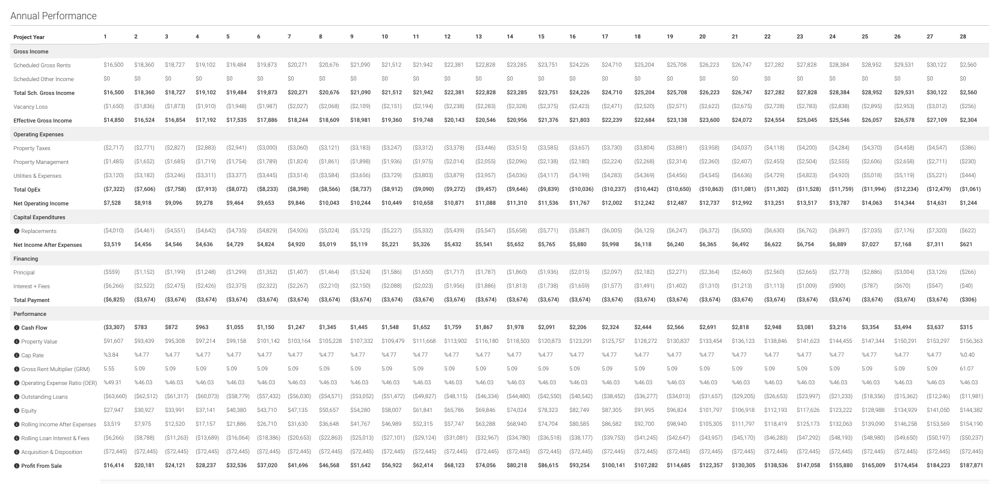

## Table of Contents

## What are the basic metrics a beginner should know for real estate investment analysis?

When you start looking into real estate investments, there are a few basic metrics you should know to help you make smart choices. The first one is the Gross Rent Multiplier (GRM). This is a simple way to see how much you're paying for the property compared to how much rent you can get from it. You find the GRM by dividing the property's price by its yearly rental income. A lower GRM usually means the property might be a better deal. Another important metric is the Capitalization Rate, or Cap Rate. This tells you the rate of return on your investment if you bought the property in cash. You calculate it by dividing the property's net operating income by its current market value. A higher Cap Rate can mean a better investment, but it also might come with more risk.

Another key metric is the Cash-on-Cash Return, which shows you how much cash flow you're getting compared to how much cash you put down. You find this by dividing the annual pre-tax cash flow by the total cash invested. This helps you understand how quickly you might get your money back. Lastly, the Debt Service Coverage Ratio (DSCR) is important if you're using a loan to buy the property. It shows if the property's income can cover the mortgage payments. You calculate it by dividing the net operating income by the total debt service. A DSCR over 1 means the property's income covers the debt, which is good. These metrics give you a good starting point to analyze real estate investments and make informed decisions.

## How do you calculate the Gross Rent Multiplier (GRM) and what does it tell you about a property?

To calculate the Gross Rent Multiplier (GRM), you take the price of the property and divide it by the yearly rental income it brings in. For example, if a property costs $200,000 and it earns $20,000 in rent each year, the GRM would be 10. This means you're paying 10 times the annual rent to buy the property. It's a quick way to compare different properties and see if one might be a better deal than another.

The GRM tells you how many years it would take for the rental income to equal the purchase price of the property. A lower GRM can mean the property is a good deal because you're paying less for each dollar of rent. But, it's important to remember that GRM doesn't consider expenses like taxes, maintenance, or vacancies. So, while it's a helpful starting point, you should look at other metrics too to get a full picture of the investment.

## What is the Capitalization Rate (Cap Rate) and how is it used in evaluating real estate investments?

The Capitalization Rate, or Cap Rate, is a way to figure out how good of an investment a property might be. It shows you the rate of return you'd get if you bought the property with cash. You find the Cap Rate by dividing the property's yearly net operating income by its current market value. For example, if a property makes $10,000 a year after expenses and it's worth $100,000, the Cap Rate would be 10%. This means you're getting a 10% return on your investment each year.

The Cap Rate is really useful because it lets you compare different properties quickly. A higher Cap Rate usually means a better return, but it might also mean the property is riskier. It's important to remember that the Cap Rate doesn't take into account how you finance the property or future changes in value. So, while it's a great tool to start with, you should look at other things too, like the property's location, condition, and potential for growth, to make a smart investment decision.

## Can you explain the Cash on Cash Return and its importance for investors?

Cash on Cash Return is a way to figure out how much money you're making on the cash you put into a property. You find it by dividing the yearly cash flow you get before taxes by the total cash you invested. For example, if you put down $20,000 and you get $2,000 a year from the property, your Cash on Cash Return would be 10%. This means for every dollar you put in, you're getting 10 cents back each year.

This metric is really important for investors because it shows how fast you might get your money back. It's especially useful if you're using a loan to buy the property because it tells you how well the property is doing with the money you actually put down, not the whole price of the property. A higher Cash on Cash Return means you're getting a better return on your investment, which can help you decide if a property is worth buying.

## What role does the Net Operating Income (NOI) play in real estate analysis?

Net Operating Income (NOI) is a key number in real estate analysis. It tells you how much money a property makes after paying for things like maintenance, insurance, and property taxes, but before paying any loans or taxes on the income. You find the NOI by taking the total income from the property and subtracting all the operating expenses. This number is important because it shows how well the property is doing on its own, without considering how it was bought or any loans.

Investors use NOI to figure out if a property is a good investment. It's used to calculate important metrics like the Capitalization Rate (Cap Rate) and the Debt Service Coverage Ratio (DSCR). For example, the Cap Rate helps you see the return on your investment if you paid cash for the property. A higher NOI means a better return, which can make the property more attractive. By looking at the NOI, investors can compare different properties and make smart choices about where to put their money.

## How do Internal Rate of Return (IRR) and Return on Investment (ROI) differ, and when should each be used?

Internal Rate of Return (IRR) and Return on Investment (ROI) are two ways to figure out how good an investment might be, but they look at things differently. IRR is a bit more complex. It's the rate at which the net present value of all the cash flows from an investment equals zero. In simpler terms, it tells you the average annual return you can expect from your investment over time. IRR is really useful when you're looking at investments that have cash flows coming in at different times, like real estate where you might have rent coming in every month and a big payout when you sell the property.

ROI, on the other hand, is simpler and more straightforward. It's calculated by taking the profit from an investment and dividing it by the initial cost of the investment, then turning that into a percentage. For example, if you put in $100 and got $110 back, your ROI would be 10%. ROI is great for quick comparisons and is easier to understand, but it doesn't take into account the timing of when you get your money back. So, you should use IRR when you want a more detailed look at the performance of an investment over time, especially if cash flows are spread out. Use ROI for a quick and simple snapshot of an investment's performance.

## What advanced metrics should an expert consider for deeper real estate investment analysis?

For deeper real estate investment analysis, experts should consider the Cash Flow Analysis. This looks at the money coming in and going out over time. It shows how much money you'll have left after all the expenses like mortgage payments, taxes, and maintenance are paid. This is really important because it helps you understand if the property will actually make you money each month or if you'll need to put more money in. Experts use this to see if the investment is sustainable over the long term and to plan for future costs.

Another advanced metric is the Equity Build-Up. This shows how much of the property you own over time as you pay down the mortgage. It's important because it tells you how much wealth you're building through the property. As you pay off the loan, you own more of the property, which can be a big part of your return on investment. Experts use this to see how quickly they're building wealth and to plan for future sales or refinancing.

Lastly, the Break-Even Ratio is a key metric for experts. This tells you what percentage of the property's income is needed to cover all the costs, including mortgage payments, taxes, and operating expenses. A lower break-even ratio means the property is more profitable because it needs less of the income to break even. Experts use this to see how sensitive the investment is to changes in rent or expenses, helping them understand the risk and potential of the property.

## How can the Debt Service Coverage Ratio (DSCR) impact the decision to invest in a property?

The Debt Service Coverage Ratio (DSCR) is a really important number to look at when you're thinking about buying a property with a loan. It tells you if the money the property makes is enough to pay the loan back. You find the DSCR by dividing the yearly net operating income by the yearly debt payments. If the DSCR is more than 1, that's good because it means the property makes enough to cover the loan. If it's less than 1, that's a warning sign because it means the property isn't making enough to pay the loan, and you might have to put more money in.

This ratio can really affect your decision to invest. A high DSCR means the property is safer because it can handle the loan payments easily, even if something goes wrong like a tenant not paying rent. This makes lenders more likely to give you a loan because they see it as less risky. On the other hand, a low DSCR might make lenders hesitant, and it could mean the property is riskier for you. So, looking at the DSCR helps you understand if the investment is a smart choice and if you'll be able to manage the loan payments without trouble.

## What is the Break-Even Ratio and how does it help in assessing the risk of a real estate investment?

The Break-Even Ratio is a number that tells you how much of the money a property makes is needed to pay all the costs. You figure it out by adding up all the expenses like the mortgage, taxes, insurance, and maintenance, then dividing that total by the money the property brings in from rent. If the Break-Even Ratio is low, it means the property doesn't need much of the rent money to cover the costs, which is good. If it's high, it means almost all the rent money is going towards expenses, and that can be risky.

This ratio helps you see how safe or risky a real estate investment might be. If the Break-Even Ratio is low, the property is less risky because it can handle changes like a tenant not paying rent or costs going up without causing big problems. But if the ratio is high, the property is more risky because even small changes could mean you don't have enough money to cover the costs. So, looking at the Break-Even Ratio helps you decide if a property is a smart investment or if it might be too risky.

## How do you evaluate the potential for appreciation in a real estate investment?

To evaluate the potential for appreciation in a real estate investment, you need to look at a few things. First, check the location of the property. Properties in areas that are growing or improving, like places with new businesses, schools, or public transport, tend to go up in value faster. Also, look at the local economy. If jobs are growing and people want to live there, the value of properties will likely go up. Another thing to consider is the condition of the property itself. If it's old and needs a lot of work, you might be able to fix it up and sell it for more, which adds to its appreciation.

Another way to gauge potential appreciation is by looking at past trends. Check how much property values have gone up in the area over the last few years. If they've been increasing steadily, there's a good chance they'll keep going up. You can also talk to local real estate experts who know the area well and can give you insights on what might happen in the future. By putting all these pieces together, you can get a good idea of whether a property is likely to appreciate and by how much.

## What are the key considerations for analyzing the impact of leverage on real estate investments?

When you use leverage in real estate, you're borrowing money to buy a property. This can make your investment bigger than what you could afford with just your own money. The good thing about leverage is that it can increase your returns. If the property goes up in value or if you make more money from rent than what you pay on the loan, you can make a lot more money than if you had paid for the whole property yourself. But, leverage also makes things riskier. If the property doesn't make enough money to cover the loan payments, or if the value goes down, you could lose money or even the property itself.

To figure out how leverage will affect your investment, you need to look at a few things. First, check the interest rate on the loan. A lower rate means less money going out each month, which can make the investment more profitable. Next, think about how much of the property's value you're borrowing. The more you borrow, the riskier it gets because you have less of your own money in the deal. Also, consider the property's cash flow. If the rent covers the loan payments and leaves you with extra money, that's a good sign. But if the rent barely covers the payments, or doesn't cover them at all, that's a warning that the investment might be too risky with leverage.

## How can sophisticated investors use scenario analysis and stress testing in real estate investment decisions?

Sophisticated investors use scenario analysis to think about different things that could happen with their real estate investment. They might look at what would happen if rent goes up or down, if costs like taxes or repairs change, or if they can't find a tenant for a while. By playing out these different scenarios, they can see how the investment might do under different conditions. This helps them understand the risks and decide if the investment is worth it. For example, they might find out that even if rent drops a bit, the property will still make money, which makes them feel more confident about the investment.

Stress testing is another tool that investors use to see how their investment would handle really tough situations. They might test what would happen if the worst things they can think of actually happened, like a big economic downturn or a natural disaster. By doing this, they can see if the property can still cover its costs and if they might lose money. This helps them prepare for the worst and make sure their investment can handle it. Both scenario analysis and stress testing help investors make smarter choices by understanding how their real estate investment might do in good times and bad.

## What are the key metrics to understand in real estate investment?

Real estate investment metrics are essential for evaluating the profitability and risks associated with property investments. These metrics serve as fundamental tools for investors to assess the potential financial outcomes and inherent risks of specific properties. Key metrics, including Net Operating Income (NOI), Cap Rate, Cash on Cash Return, and Internal Rate of Return (IRR), are frequently employed to derive these insights.

**Net Operating Income (NOI)** is a critical measure representing the annual profitability of a property after deducting all operating expenses. It is calculated as follows:

$$
\text{NOI} = \text{Gross Operating Income} - \text{Operating Expenses}
$$

NOI provides investors with a clear view of the property's operating efficiency, helping to compare similar properties by normalizing the income they generate irrespective of financing and tax considerations.

**Capitalization Rate (Cap Rate)** is another pivotal metric that indicates the expected rate of return on a property based on its NOI. It is calculated using the formula:

$$
\text{Cap Rate} = \frac{\text{NOI}}{\text{Current Market Value}}
$$

A higher Cap Rate generally suggests a higher risk investment, and vice versa. It is particularly useful for comparing the relative value of real estate investments, allowing investors to assess potential returns given the market price.

**Cash on Cash Return** measures the return on the actual cash investment made in the property. This metric gives investors insight into the cash-generating efficiency of a property based on cash inputs. It is computed as:

$$
\text{Cash on Cash Return} = \frac{\text{Annual Cash Flow}}{\text{Total Cash Invested}}
$$

This metric focuses on the short-term performance of a property by evaluating the actual cash yield or income generated relative to the amount of cash invested, making it crucial for investors seeking immediate returns.

**Internal Rate of Return (IRR)** provides a comprehensive measure of an investment's profitability over time. It represents the discount rate at which the net present value (NPV) of all cash flows from a property equals zero. Although the calculation of IRR is more complex, involving iterative methods or dedicated financial software, its importance lies in its ability to factor in the time value of money, offering a long-term view of investment viability.

Each of these metrics provides unique insights into a property’s financial health and projection. Accurate calculation and interpretation of these metrics can empower investors to make informed decisions, encouraging strategic alignment with their overall investment objectives. By applying these metrics, investors can effectively assess potential investments, mitigate risks, and devise robust strategies for property analysis and investment.

## What are Comprehensive Property Analysis Techniques?

Property analysis is a fundamental aspect of real estate investing, integrating both quantitative and qualitative evaluations to provide a holistic understanding of an investment opportunity. This process involves a variety of methodologies designed to assess the potential and risks associated with property investments.

**Comparative Market Analysis (CMA)** is one of the most commonly used techniques. It involves evaluating the prices of similar properties in the vicinity to estimate a fair market value for a property under consideration. CMA requires gathering data on recent sales, property features, and market conditions, allowing investors to establish competitive pricing strategies and anticipate market trends.

**Financial assessments** are another critical component of property analysis. These assess the financial viability of a property by calculating metrics such as Net Operating Income (NOI), Cash on Cash Return, and the Internal Rate of Return (IRR). For instance, NOI is calculated as:

$$

NOI = \text{Gross Operating Income} - \text{Operating Expenses} 
$$

This metric is pivotal for understanding a property's profitability before financing and taxes. Additionally, IRR provides insight into the potential return on investment, helping investors compare different investment opportunities on a like-for-like basis.

**Physical property inspections** offer a qualitative assessment, essential for identifying any structural issues or required maintenance. A thorough inspection evaluates the condition of key property components, ensuring that unforeseen expenses do not diminish the investment's profitability.

Technological advancements have significantly transformed property analysis, introducing tools like real-time data analytics and Geographic Information Systems (GIS) for spatial analysis. GIS technology allows investors to analyze spatial data related to property locations, surrounding infrastructure, and environmental factors. This spatial analysis aids in identifying growth areas by visualizing trends and correlations in the data, enhancing strategic decision-making processes.

Furthermore, real-time data analytics facilitate an up-to-date understanding of market dynamics, enabling more responsive and accurate investment decisions. With tools that process large datasets, investors can quickly gain insights into property values, rental demands, and economic indicators, streamlining the analysis to align with the fast-paced nature of the real estate market.

Integrating technology into property analysis has increased the precision and efficiency of investment decisions. The blend of traditional techniques with modern technological tools provides a comprehensive framework for evaluating real estate opportunities, ensuring investors are equipped to make informed and strategic choices in a competitive market.

## How can metrics and algorithmic trading be integrated into property analysis?

The integration of investment metrics and algorithmic trading into property analysis represents a significant advancement in the evaluation of real estate investments. By combining traditional financial metrics with technology-driven insights, investors can gain a comprehensive view of potential investments, increasing accuracy and efficiency in decision-making processes.

Investment metrics such as Capitalization Rate (Cap Rate) and Internal Rate of Return (IRR) traditionally require detailed analysis to determine the value and profitability of a property. Cap Rate, defined as:

$$
\text{Cap Rate} = \frac{\text{Net Operating Income (NOI)}}{\text{Current Market Value}}
$$

provides insight into the expected rate of return on property investments. Similarly, IRR is calculated to determine the profitability of potential investments over time. However, evaluating these metrics manually for multiple properties can be time-consuming and prone to human error.

Algorithmic trading systems offer a solution by automating the analysis of these investment metrics. Algorithms can quickly process large datasets, evaluating the Cap Rate and IRR for numerous properties simultaneously. This automation enables investors to instantly identify properties that meet their specific investment criteria. Additionally, algorithms provide data-driven insights by incorporating machine learning models to predict market trends, assess risks, and optimize portfolio management.

For example, an investor could use Python to automate the calculation of Cap Rates across various properties using libraries such as pandas for data manipulation and NumPy for numerical calculations. An illustration of this process is as follows:

```python
import pandas as pd

# Sample data for properties
data = {
    'Property': ['A', 'B', 'C'],
    'NOI': [120000, 150000, 100000],
    'Market_Value': [2000000, 2500000, 1800000]
}

df = pd.DataFrame(data)

# Calculate Cap Rate
df['Cap_Rate'] = df['NOI'] / df['Market_Value']
print(df)
```

Beyond automating evaluations, the integration allows for more effective risk management. Algorithms can dynamically adjust portfolios based on evolving market conditions, reducing the potential for losses due to unforeseen downturns. This adaptability enhances the investor’s ability to maintain a competitive edge in a constantly shifting marketplace.

Adopting this integrated approach provides investors with the tools to not only streamline their property evaluations but also strategically position themselves within the competitive real estate market. As the landscape of real estate investment continues to evolve, those who effectively harness the power of both financial metrics and algorithmic trading are likely to find greater success and sustainability in their investment strategies.

## References & Further Reading

[1]: Bergstra, J., Bardenet, R., Bengio, Y., & Kégl, B. (2011). ["Algorithms for Hyper-Parameter Optimization."](https://papers.nips.cc/paper/4443-algorithms-for-hyper-parameter-optimization) Advances in Neural Information Processing Systems 24.

[2]: ["Advances in Financial Machine Learning"](https://www.amazon.com/Advances-Financial-Machine-Learning-Marcos/dp/1119482089) by Marcos Lopez de Prado

[3]: ["Evidence-Based Technical Analysis: Applying the Scientific Method and Statistical Inference to Trading Signals"](https://www.amazon.com/Evidence-Based-Technical-Analysis-Scientific-Statistical/dp/0470008741) by David Aronson

[4]: ["Machine Learning for Algorithmic Trading"](https://github.com/stefan-jansen/machine-learning-for-trading) by Stefan Jansen

[5]: ["Quantitative Trading: How to Build Your Own Algorithmic Trading Business"](https://www.amazon.com/Quantitative-Trading-Build-Algorithmic-Business/dp/1119800064) by Ernest P. Chan