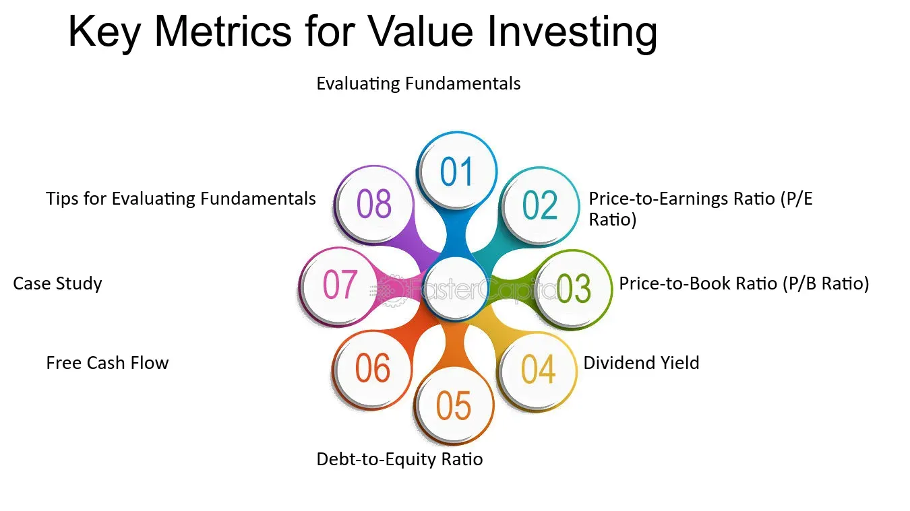

## Table of Contents

## What is value investing and why are metrics important in this strategy?

Value investing is a way of picking stocks that are priced lower than what they are really worth. People who use this strategy look for companies that the market has overlooked or undervalued. They believe that over time, the market will realize the true value of these companies, and the stock price will go up. This approach is like buying a good quality item on sale, expecting its price to increase later.

Metrics are important in value investing because they help investors figure out if a stock is undervalued. These metrics, like the price-to-earnings ratio or the book value, give investors a way to compare the stock's current price to its actual worth. By using these numbers, investors can make smarter choices about which stocks to buy. It's like using a map to find the best deals in a big store; the metrics guide investors to the stocks that might be a good buy.

## What is the Price-to-Earnings (P/E) ratio and how do beginners use it to evaluate stocks?

The Price-to-Earnings (P/E) ratio is a simple way to see how much you are paying for a company's earnings. It's calculated by taking the current stock price and dividing it by the earnings per share (EPS). If a stock is selling for $50 and the EPS is $5, the P/E ratio would be 10. This means you are paying 10 times the company's earnings for the stock. The P/E ratio helps you understand if a stock is priced fairly compared to its earnings.

Beginners can use the P/E ratio to compare different stocks and see which ones might be a good deal. If one company has a lower P/E ratio than another in the same industry, it might mean the first company is undervalued. However, it's important not to rely only on the P/E ratio. You should also look at other things like the company's growth, the industry it's in, and the overall market conditions. By using the P/E ratio along with other information, beginners can make smarter choices about which stocks to buy.

## How does the Price-to-Book (P/B) ratio help in identifying undervalued stocks?

The Price-to-Book (P/B) ratio helps investors find stocks that might be undervalued by comparing the market price of a stock to its book value. The book value is what the company would be worth if it sold all its assets and paid off all its debts. You find the P/B ratio by dividing the stock's current price by its book value per share. If the P/B ratio is low, it might mean the stock is cheaper than its actual worth, which could be a good sign for value investors.

However, using the P/B ratio isn't always straightforward. A low P/B ratio can be a sign of an undervalued stock, but it could also mean the company is facing problems. For example, if a company has a lot of old or hard-to-sell assets, its book value might not be a good measure of its true worth. That's why it's important to look at other factors too, like the company's earnings, its industry, and what's happening in the market. By considering all these things together, investors can make better decisions about whether a stock with a low P/B ratio is really a good buy.

## What is the Dividend Yield and why is it significant for value investors?

Dividend Yield is a way to see how much money you get back from a stock in the form of dividends. It's calculated by taking the yearly dividend per share and dividing it by the stock's price. If a stock costs $100 and pays $5 in dividends each year, the dividend yield would be 5%. This number helps investors understand how much income they can expect from their investment, aside from any gains or losses in the stock's price.

For value investors, the dividend yield is important because it can show if a stock is a good value. A high dividend yield might mean the stock is undervalued, or it could mean the company is giving back a lot of its earnings to shareholders. Value investors often look for companies that not only have a good dividend yield but also have strong fundamentals, like steady earnings and a solid business model. By focusing on stocks with a good dividend yield, value investors can find investments that provide both income and the potential for the stock price to go up over time.

## How can the Debt-to-Equity ratio inform a value investor about a company's financial health?

The Debt-to-Equity (D/E) ratio tells a value investor how much a company is using debt to grow compared to using money from its owners. It's found by dividing the company's total debt by its total equity. A low D/E ratio means the company is not using a lot of borrowed money, which can be a good sign for value investors. It shows the company is financially stable and less risky because it's not relying heavily on loans to keep running.

On the other hand, a high D/E ratio can be a warning sign. It might mean the company is taking on a lot of debt, which could be risky if the company's earnings drop or if interest rates go up. Value investors look for companies with a healthy balance between debt and equity because it suggests the company can handle its financial obligations and still grow. By checking the D/E ratio, value investors can better understand if a company's low stock price is a good deal or if it's a sign of bigger financial problems.

## What is the importance of the Return on Equity (ROE) in assessing a company's profitability?

Return on Equity (ROE) is a key number that tells investors how well a company is using the money that shareholders have put into it. It's found by dividing the company's net income by its total equity. A high ROE means the company is making good use of the money it has, turning it into more profit. This is important for investors because it shows how efficient the company is at growing its earnings without needing more money from shareholders.

For value investors, ROE is especially useful because it helps them find companies that are not just cheap but also profitable. If a company has a high ROE and a low stock price, it might be a hidden gem. But it's also important to compare the ROE with other companies in the same industry and look at it over time. A company with a consistently high ROE could be a good sign that it's a strong business worth investing in.

## How does the Earnings Yield help in comparing the profitability of different investments?

Earnings Yield is a simple way to see how much profit a company makes compared to its stock price. You find it by taking the earnings per share and dividing it by the stock price, then multiplying by 100 to get a percentage. This number helps investors compare different investments easily. If one company has a higher earnings yield than another, it might be making more money for each dollar you invest in its stock.

This is useful when you want to see if a stock is a better deal than other investments like bonds. For example, if a stock has an earnings yield of 8% and a bond has a yield of 5%, the stock might be a better choice if you're looking for more profit. But remember, earnings yield is just one piece of the puzzle. You should also look at other things like how safe the investment is and what's happening in the market. By using earnings yield along with other information, you can make smarter choices about where to put your money.

## What role does the Free Cash Flow (FCF) play in value investing, and how is it calculated?

Free Cash Flow (FCF) is really important for value investors because it shows how much money a company has left after it pays for everything it needs to keep running and growing. This extra money, or FCF, can be used to pay dividends, buy back shares, or invest in new projects. Value investors like to see a high FCF because it means the company is financially healthy and has the cash to do good things for shareholders.

To calculate Free Cash Flow, you start with the company's operating cash flow, which is the money coming in from its regular business activities. Then, you subtract the capital expenditures, which are the costs of buying or maintaining things like buildings or equipment that the company needs to operate. The formula is simple: FCF = Operating Cash Flow - Capital Expenditures. By looking at this number, value investors can see if a company is a good buy because it has enough cash to support its growth and reward its investors.

## How can the Price-to-Sales (P/S) ratio be used to find undervalued companies?

The Price-to-Sales (P/S) ratio is a tool that helps investors see if a company's stock is priced too low compared to its sales. You find the P/S ratio by dividing the company's stock price by its revenue per share. A low P/S ratio might mean the stock is a good deal because you're paying less for each dollar of the company's sales. For example, if one company has a P/S ratio of 1 and another has a P/S ratio of 3, the first company could be undervalued if both companies are in the same industry and have similar growth prospects.

However, it's important not to just look at the P/S ratio alone. Sometimes a low P/S ratio can be a sign of problems, like the company not making enough profit or facing tough competition. That's why value investors should also check other things like the company's earnings, its debt, and what's happening in its industry. By putting all these pieces together, investors can better decide if a low P/S ratio really means the stock is a good buy or if there are other issues to consider.

## What advanced metrics like EV/EBITDA can tell a value investor about a company's value?

EV/EBITDA, or Enterprise Value to Earnings Before Interest, Taxes, Depreciation, and Amortization, is a fancy way to see if a company is a good deal. It looks at the whole value of the company, including its debts and cash, and compares it to its earnings before taking away some costs. A lower EV/EBITDA ratio might mean the company is undervalued, which is what value investors like to find. It's a bit like looking at the price tag of a store that's on sale, but you also get to see how much money the store is making.

This metric is really helpful because it gives a clearer picture of a company's value than just looking at the stock price. It helps investors see past the surface and understand if a company is really a bargain. But, like with all numbers, it's important not to use EV/EBITDA alone. You should also look at other things like the company's growth, how much debt it has, and what's happening in its industry. By using EV/EBITDA along with other information, value investors can make smarter choices about where to put their money.

## How do value investors use the PEG Ratio to refine their investment decisions?

The PEG Ratio, or Price/Earnings to Growth Ratio, helps value investors find stocks that are not just cheap but also have good growth potential. It's calculated by taking the P/E ratio and dividing it by the company's expected earnings growth rate. A PEG Ratio of less than 1 is often seen as a sign that a stock might be undervalued, considering its growth. This is useful because it adds the growth [factor](/wiki/factor-investing) to the basic P/E ratio, giving investors a more complete picture of a stock's value.

Value investors use the PEG Ratio to compare different stocks and see which ones might be the best deals. If two companies have the same P/E ratio but one has a lower PEG Ratio, it might mean the second company is growing faster and could be a better investment. However, like all metrics, the PEG Ratio should not be used alone. Investors should also look at other factors like the company's financial health, industry trends, and overall market conditions to make the best investment decisions.

## What are some expert-level considerations when combining multiple metrics for a comprehensive value investing strategy?

When combining multiple metrics for a comprehensive value investing strategy, experts consider how different numbers work together to give a full picture of a company's value. For example, they might look at the P/E ratio to see if a stock is cheap compared to its earnings, the PEG Ratio to check if it's also growing well, and the Debt-to-Equity ratio to understand the company's financial health. By using these metrics together, investors can spot companies that are not just undervalued but also have strong fundamentals and good growth prospects. It's like putting together pieces of a puzzle to see the whole image clearly.

Experts also pay attention to industry comparisons and historical trends when using multiple metrics. They know that a low P/E ratio might look good, but if it's higher than the industry average or the company's own historical average, it might not be as good a deal as it seems. They also consider macroeconomic factors, like interest rates and economic cycles, because these can affect how different metrics are interpreted. By looking at all these things together, value investors can make more informed decisions and find the best investment opportunities.

## What is Understanding Value Investing?

Value investing is an investment strategy that emphasizes purchasing stocks trading for less than their intrinsic values. The main premise is that over time, the market will recognize the true value of the stock, leading to price corrections that benefit the investor. This approach was pioneered by Benjamin Graham, often referred to as the "father of value investing." Graham introduced the concept of a "margin of safety," which suggests buying securities at a significant discount to their inherent value to mitigate risks associated with market [volatility](/wiki/volatility-trading-strategies) and potential valuation errors (Graham & Dodd, 1934).

Several key metrics are utilized by value investors to assess whether a stock is undervalued. The Price-to-Earnings (P/E) Ratio is one such metric, offering insights into how the market prices a company's earnings. It can be calculated as:

$$
\text{P/E Ratio} = \frac{\text{Market Price per Share}}{\text{Earnings per Share (EPS)}}
$$

A lower P/E ratio may indicate that the stock is undervalued relative to its earnings potential.

Another vital metric is the Price-to-Book (P/B) Ratio, which compares the market value of a stock to its book value, where the book value is the company's assets minus its liabilities. It is calculated as:

$$
\text{P/B Ratio} = \frac{\text{Market Price per Share}}{\text{Book Value per Share}}
$$

A lower P/B ratio might suggest that the stock is trading below its intrinsic worth, making it appealing to value investors.

The Debt-to-Equity Ratio is also critical for analyzing a company's financial health. It signifies the proportion of a company's total debt to its shareholder equity and is expressed as:

$$
\text{Debt-to-Equity Ratio} = \frac{\text{Total Debt}}{\text{Shareholder Equity}}
$$

A lower ratio generally denotes a more financially stable company, making it attractive for long-term investment. 

Free Cash Flow (FCF) is equally important, as it reflects the cash a company can generate after accounting for capital expenditures. FCF is instrumental in evaluating a company's ability to maintain operations, pay dividends, and expand its business without relying on external financing.

The primary objective of value investing is to exploit market inefficiencies. By purchasing stocks that are priced below their intrinsic values, investors aim to achieve substantial returns once the market corrects itself and recognizes the true value of these securities. This approach requires patience and meticulous analysis but has been proven effective over the long term by successful investors like Warren Buffett, who have consistently applied these principles to generate significant wealth.

## What role do financial ratios play in value investing?

Financial ratios play a pivotal role in value investing by providing tools to evaluate the financial health and intrinsic value of companies. These ratios serve as critical parameters for investors seeking to identify undervalued stocks that may offer substantial long-term gains.

The Price-to-Earnings (P/E) Ratio is one of the most widely used metrics in value investing. It measures a company's current share price relative to its per-share earnings. The formula for P/E Ratio is:

$$
\text{P/E Ratio} = \frac{\text{Market Value per Share}}{\text{Earnings per Share (EPS)}}
$$

A low P/E ratio may indicate that the stock is undervalued relative to its earnings, making it a potential candidate for investment.

The Price-to-Book (P/B) Ratio compares a stock’s market value to its book value, offering insight into how much investors are willing to pay for each dollar of net assets. It is calculated as follows:

$$
\text{P/B Ratio} = \frac{\text{Market Value per Share}}{\text{Book Value per Share}}
$$

This ratio is particularly useful in assessing companies with substantial tangible assets, such as those in the manufacturing or real estate sectors. A lower P/B ratio might suggest that the stock is undervalued relative to its net assets.

The Debt-to-Equity Ratio provides an understanding of a company's financial leverage by comparing its total liabilities to shareholder equity. It is expressed with the formula:

$$
\text{Debt-to-Equity Ratio} = \frac{\text{Total Liabilities}}{\text{Shareholder's Equity}}
$$

A lower ratio is often preferable, indicating that a company is not excessively reliant on debt for financing, which could be a sign of financial stability.

Free Cash Flow (FCF) is another essential metric, representing the cash a company generates after accounting for capital expenditures required to maintain or expand its asset base. Free Cash Flow is calculated as:

$$
\text{Free Cash Flow} = \text{Operating Cash Flow} - \text{Capital Expenditures}
$$

Investors use FCF to assess a company's ability to generate cash flow, which can be used for growth, dividends, or reducing debt.

The PEG Ratio is an extension of the P/E ratio, incorporating a company's earnings growth rate into the valuation process. It is calculated by:

$$
\text{PEG Ratio} = \frac{\text{P/E Ratio}}{\text{Earnings Growth Rate}}
$$

This ratio allows investors to determine a stock's value while considering growth expectations. A PEG ratio below one may indicate that a stock is undervalued relative to its growth potential.

These financial ratios are crucial tools for examining a company's valuation and financial viability, facilitating better investment decisions by highlighting stocks that might be undervalued in the market.

## References & Further Reading

Graham, B. (2006). *The Intelligent Investor: The Definitive Book on Value Investing*. This book is considered a classic text in value investing and offers timeless strategies for identifying undervalued stocks and making sound investment decisions.

Graham, B., & Dodd, D. L. (1934). *Security Analysis*. This foundational work presents a comprehensive framework for analyzing securities, with a focus on uncovering a stock's intrinsic value and maintaining a margin of safety in uncertain markets.

Lopez de Prado, M. (2018). *Advances in Financial Machine Learning*. This text explores the use of [machine learning](/wiki/machine-learning) techniques in financial markets, providing insights into the development of [algorithmic trading](/wiki/algorithmic-trading) strategies enhanced by modern computational tools.

Chan, E. P. (2008). *Quantitative Trading: How to Build Your Own Algorithmic Trading Business*. This book serves as a guide to developing and deploying [quantitative trading](/wiki/quantitative-trading) systems, covering the essential components of algorithmic trading and offering practical advice for those looking to build a trading business.

Jansen, S. (2020). *Machine Learning for Algorithmic Trading*. Jansen's work discusses the integration of machine learning techniques into algorithmic trading systems, offering both theoretical foundations and practical examples for implementing these strategies in Python.

