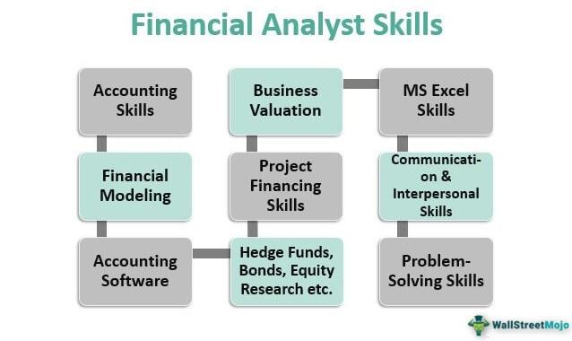

In an ever-evolving financial landscape, financial advisors play a crucial role in guiding clients toward financial health and security. As individuals and businesses navigate complex financial decisions, the expertise and knowledge of financial advisors become indispensable. Understanding the qualifications and certifications necessary for a financial advisor is fundamental to ensuring that individuals receive the best possible guidance tailored to their unique needs and circumstances.

This article will explore the essential skills, certifications, and qualifications required for financial advisors. These elements form the foundation of a competent advisor capable of offering sound financial advice and constructing viable financial plans. As part of this exploration, we will investigate the educational pathways that prepare advisors for their roles, highlighting the importance of degrees in finance, economics, or related fields. Furthermore, licensing requirements such as those mandated by the Financial Industry Regulatory Authority (FINRA), including Series 7 or Series 65 exams, will be discussed as crucial components of a financial advisor’s career.



An additional focal point will be the emerging trend of algorithmic trading and its impact on financial advising practices. The integration of technology in financial planning offers new opportunities for enhancing portfolio management efficiency and precision in decision-making. Understanding algorithmic trading, which relies on computer algorithms to execute trades based on pre-set criteria, will provide insights into how financial advisors can leverage technology to meet client demands and stay competitive.

In summary, the qualifications and skills required for financial advisors are crucial for building trust and credibility in financial planning. The advent of technological innovations like algorithmic trading further underscores the need for continuous professional development. This convergence of traditional financial advising principles and modern technological advancements is setting the stage for the future of financial advising, where adaptability and ongoing learning are key to a successful career.

## Table of Contents

## Essential Financial Planning Skills

Financial planning is an intricate process that demands a diverse set of skills, each crucial for ensuring clients achieve their financial objectives. Key among these skills are risk assessment, investment strategy development, and comprehensive financial planning. These competencies help financial advisors provide structured guidance tailored to the specific challenges and opportunities faced by their clients.

**Risk Assessment**: A core component of financial planning is the ability to evaluate and manage risk. Financial advisors need to identify potential risks in their clients' financial portfolios and recommend strategies to mitigate these risks. This involves understanding both market volatilities and personal risk tolerances. Advisors often use tools like the Sharpe Ratio, which measures risk-adjusted returns:

$$
\text{Sharpe Ratio} = \frac{E[R_p] - R_f}{\sigma_p}
$$

where $E[R_p]$ is the expected portfolio return, $R_f$ is the risk-free rate, and $\sigma_p$ is the standard deviation of the portfolio's excess return.

**Investment Strategy Development**: Crafting investment strategies is pivotal to financial planning. Advisors design and implement strategies that align with their clients' long-term financial goals. This might involve asset allocation, diversification, and continual assessment of investment performance. Understanding market trends and economic indicators is crucial. Techniques in data analysis and financial modeling assist advisors in predicting outcomes and adjusting strategies accordingly.

**Communication Skills**: Despite the complexity of financial instruments and plans, advisors must distill intricate financial concepts into clear, actionable advice. Effective communication fosters strong client relationships and ensures that clients comprehend the rationale behind their financial strategies. Advisors also benefit from strong interpersonal skills, which help in negotiating better terms for client transactions and engendering trust.

**Analytical Skills**: The ability to critically analyze financial data is indispensable. With quantitative tools and software, advisors parse through large datasets to spot trends and forecast future market movements. Advisors employ statistical methods and machine learning algorithms to refine data-driven insights, which are crucial in forming investment advice and real-time decision-making processes.

```python
# Example code for a simple moving average, a common financial analysis tool
def moving_average(prices, window):
    """Calculate the moving average for a list of prices."""
    if len(prices) < window:
        raise ValueError("Window size is larger than the number of prices.")
    return [sum(prices[i:i+window]) / window for i in range(len(prices) - window + 1)]
```

**Customization of Financial Plans**: No two clients have identical financial situations. Hence, a one-size-fits-all approach is ineffective. Financial advisors must tailor financial plans to accommodate the specific needs, goals, and risk appetites of each client. This personalization requires a comprehensive understanding of diverse financial products and the ability to integrate these into a harmonious and individualized plan.

**Ethical Judgment and Professional Integrity**: In a world where trust is paramount, ethical judgment and integrity form the foundation of the client-advisor relationship. Financial advisors are expected to adhere to stringent ethical standards and transparency, ensuring clients' interests are always prioritized. This not only builds trust but also fortifies the advisor's reputation within the industry.

In summary, the role of a financial advisor is multifaceted, demanding a delicate balance between analytical prowess and interpersonal finesse. Mastery of these essential skills positions financial advisors to empower their clients in navigating the complexities of personal and investment finance effectively.

## Financial Advisor Certification and Qualifications

Certifications such as the Certified Financial Planner (CFP) and Chartered Financial Analyst (CFA) are essential credentials for financial advisors seeking to establish credibility and trust with clients. These certifications are recognized globally and signify a high standard of professional knowledge and ethical practice.

Obtaining a CFP designation requires candidates to pass a comprehensive exam that covers various aspects of financial planning, including retirement, tax, estate planning, and insurance. The CFP Board demands that candidates possess substantial professional experience—typically three years—and adhere to a strict code of ethics. This ensures that certified professionals can deliver competent and ethical financial advice.

The CFA designation is another esteemed certification in the financial industry. It consists of three levels of exams, each progressively more challenging, emphasizing investment management and finance. CFA candidates must also demonstrate at least four years of relevant professional work experience and commit to upholding the CFA Institute's ethical guidelines.

In addition to certifications, financial advisors often need to obtain licenses to provide certain services legally. For instance, the Financial Industry Regulatory Authority (FINRA) offers the Series 7 license, which allows individuals to trade general securities. The Series 65 license is particularly important for investment advisers as it qualifies them to provide investment advice to clients for a fee. These licenses ensure that financial advisors possess the necessary competency in their areas of service.

A bachelor's degree in finance, economics, or business is typically the educational baseline for those entering the financial advising profession. This foundational education provides necessary insights into economic principles, financial analysis, and management strategies, all essential for advising clients effectively.

The field of financial advising is constantly evolving, so continuous professional development is crucial. Advisors must stay current with changes in financial regulations, market dynamics, and technological advancements to maintain their competence. This may involve attending workshops, enrolling in advanced courses, and seeking opportunities for further certifications. Staying informed not only enhances an advisor's professional knowledge but also improves their ability to provide insightful guidance in an ever-shifting financial landscape.

## The Role of Algorithmic Trading in Financial Advising

Algorithmic trading is a sophisticated method that utilizes computer algorithms to execute trades, typically at speeds and frequencies that are impossible for human traders. By automating trading strategies, algorithms can process large volumes of data and analyze market conditions to make split-second decisions based on pre-defined criteria. This capability provides financial advisors with opportunities to optimize portfolio management by enhancing the precision and speed of trades, which is crucial, especially in volatile markets.

The integration of [algorithmic trading](/wiki/algorithmic-trading) in financial advising also necessitates a robust technical skill set. Financial advisors must be well-versed in quantitative analysis and programming to effectively employ algorithmic strategies. Familiarity with programming languages such as Python, which is widely used for developing trading algorithms due to its simplicity and extensive libraries, is essential. For instance, using Python, one could employ libraries like Pandas for data manipulation and NumPy for numerical operations to construct and test trading algorithms. An example of a basic algorithmic trading strategy in Python might include moving averages to determine buy and sell signals:

```python
import pandas as pd

# Sample function to calculate moving averages
def moving_average(data, window_size):
    return data.rolling(window=window_size).mean()

# Example data
prices = pd.Series([100, 102, 104, 101, 98, 97, 99, 100, 105, 110])

# Calculating moving averages
short_window = moving_average(prices, window_size=3)
long_window = moving_average(prices, window_size=5)

# Example trading signal logic
signals = (short_window > long_window) * 1  # 1 means buy, 0 means sell
```

Despite its advantages, algorithmic trading also carries inherent risks that financial advisors must understand. These include [liquidity](/wiki/liquidity-risk-premium) risks, market risks, and the potential for algorithmic errors, which can escalate rapidly given the automated nature of trading. As such, advisors must perform rigorous [backtesting](/wiki/backtesting) and continuously monitor algorithmic performance to mitigate these risks effectively.

Moreover, financial advisors should be knowledgeable about the regulatory considerations associated with algorithmic trading. Regulations may vary by jurisdiction but generally aim to ensure market stability and protect investors from fraudulent activities. Advisors should keep abreast of regulatory updates, such as the Securities and Exchange Commission (SEC) in the United States, which may impose specific compliance requirements on algorithmic trading practices.

In conclusion, algorithmic trading offers financial advisors compelling benefits but requires a deep understanding of both technical and regulatory aspects. Mastery of these areas can significantly enhance the capability of financial advisors to deliver more sophisticated and effective financial advice.

## Continuous Learning and Career Progression

Financial advising is inherently dynamic, necessitating a commitment to lifelong learning through workshops, seminars, and advanced academic courses. Advisors are tasked with understanding complex market dynamics and financial instruments, which are continuously evolving. To maintain proficiency, they must actively seek opportunities for education and development beyond the basic certifications required in the industry.

One effective strategy for career progression in financial advising is networking with peers and seasoned professionals. Participation in conferences, industry gatherings, and online forums can facilitate the exchange of ideas and best practices. Networking can lead to new partnerships and client relationships, expanding an advisor's professional reach and impact.

Staying updated on the latest trends in financial technology, especially algorithmic trading, is crucial. Algorithmic trading uses intricate mathematical models and data analysis to make investment decisions at speeds beyond human capability, providing a competitive edge. For example, a simplistic form of an algorithmic trading strategy in Python might involve moving average crossovers:

```python
def moving_average_strategy(prices, short_window=40, long_window=100):
    signals = pd.DataFrame(index=prices.index)
    signals['signal'] = 0.0

    # Short moving average
    signals['short_mavg'] = prices['close'].rolling(window=short_window, min_periods=1, center=False).mean()

    # Long moving average
    signals['long_mavg'] = prices['close'].rolling(window=long_window, min_periods=1, center=False).mean()

    # Generate signals
    signals['signal'][short_window:] = np.where(signals['short_mavg'][short_window:] 
                                                > signals['long_mavg'][short_window:], 1.0, 0.0)   

    # Generate trading orders
    signals['positions'] = signals['signal'].diff()

    return signals
```

This script emphasizes the necessity for advisors to cultivate a strong technical skill set to harness algorithmic trading effectively.

Focusing on specialized skills in areas such as tax planning, retirement planning, or estate planning can significantly increase an advisor's marketability and potential earnings. These niche skills allow advisors to cater to specific client needs, thereby enhancing service value and client satisfaction.

Advisors can further their careers by engaging in educational roles, such as teaching financial literacy workshops or writing industry-relevant publications. By sharing knowledge and expertise, they contribute to the overall improvement of the financial advisory field, fostering an informed clientele capable of making sound financial decisions. This dual role of advisor and educator can reinforce credibility and lead to a more robust professional profile.

In summary, continuous learning and active engagement in the evolving landscape of financial advising are integral to career progression and success. By embracing educational opportunities, technology trends, and networking, financial advisors can ensure enduring growth and relevance in their profession.

## Conclusion

The qualifications and certifications of financial advisors are fundamental to establishing trust and competence in financial planning. Credentials like Certified Financial Planner (CFP) and Chartered Financial Analyst (CFA) ensure that advisors possess the necessary knowledge, experience, and ethical grounding to guide clients effectively. In addition, licensing requirements, such as FINRA's Series 7 or Series 65, further bolster an advisor's legal authorization to provide financial services.

The role of a financial advisor is evolving with the rapid advancement of technology, including algorithmic trading. This technological integration calls for advisors to adapt by enhancing their technical skill sets and maintaining an informed understanding of market developments and regulatory changes. The ability to harness technology for improved decision-making and efficiency is increasingly valuable.

Continuous learning and professional development are crucial for adapting to these technological and market shifts. Financial advisors need to participate in workshops, obtain advanced certifications, and engage in lifelong education to remain informed and competitive. This commitment to education ensures they can offer the most relevant and up-to-date advice to their clients.

When selecting a financial advisor, it's crucial for individuals to look beyond traditional qualifications. Assessing an advisor’s ability to learn and adapt in the ever-changing financial landscape is essential. An advisor's agility in identifying and integrating technological advancements can significantly impact their effectiveness and the quality of their guidance.

For prospective financial advisors, embracing technological advancements and committing to professional development will be key to sustaining a long and successful career. The ability to integrate new technologies, like algorithmic trading, within their practice offers a strategic advantage, ensuring they remain relevant and valuable in a dynamic industry.

## References & Further Reading

[1]: ["Certified Financial Planner Board of Standards"](https://www.cfp.net/) - Official site for CFP certification.

[2]: ["Chartered Financial Analyst (CFA) Institute"](https://www.cfainstitute.org/programs/cfa-program) - Official site for CFA certification.

[3]: Lopez de Prado, M. (2018). ["Advances in Financial Machine Learning."](https://www.amazon.com/Advances-Financial-Machine-Learning-Marcos/dp/1119482089) Wiley.

[4]: Chan, E. P. (2009). ["Quantitative Trading: How to Build Your Own Algorithmic Trading Business."](https://github.com/egorpe/EPChan-QuantitativeTrading/blob/master/example7_6.m) Wiley.

[5]: Jansen, S. (2020). ["Machine Learning for Algorithmic Trading."](https://github.com/stefan-jansen/machine-learning-for-trading) Packt Publishing.

[6]: Aronson, D. (2007). ["Evidence-Based Technical Analysis: Applying the Scientific Method and Statistical Inference to Trading Signals."](https://www.amazon.com/Evidence-Based-Technical-Analysis-Scientific-Statistical/dp/0470008741) Wiley.

[7]: Financial Industry Regulatory Authority (FINRA). ["Site for FINRA Exams."](https://www.finra.org/registration-exams-ce/qualification-exams)