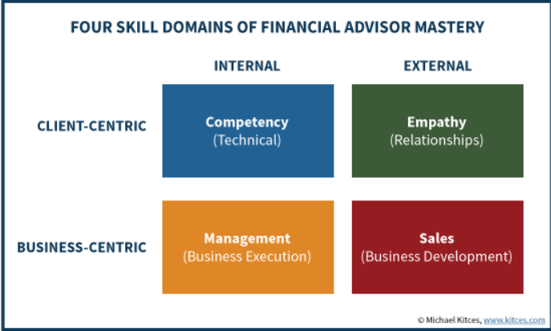

## Table of Contents

## What basic education is required to become a financial advisor?

To become a financial advisor, you usually need at least a high school diploma or equivalent. Many financial advisors also have a bachelor's degree. Common majors include finance, business, economics, or accounting. These degrees help you learn about money, investments, and how businesses work. Some colleges offer specific programs in financial planning, which can be very helpful.

After getting your education, you might need to get a license to work as a financial advisor. This often involves passing exams like the Series 65 or Series 7, depending on what kind of financial advice you want to give. Some advisors also choose to get certified, like becoming a Certified Financial Planner (CFP). This requires passing more exams and having some work experience. While not always required, these certifications can make you more attractive to clients and employers.

## What are the most common certifications for financial advisors?

The most common certification for financial advisors is the Certified Financial Planner (CFP). To get this, you need to finish some education, pass an exam, have work experience, and follow ethical rules. The CFP certification shows that you know a lot about financial planning, including how to help people with their money, investments, taxes, and retirement. Many people trust advisors with this certification because it means they have a good understanding of many parts of finance.

Another popular certification is the Chartered Financial Analyst (CFA). This one is more focused on investment analysis and portfolio management. To become a CFA, you need to pass three tough exams and have work experience in investment decision-making. This certification is great if you want to work with investments and help clients make smart choices about where to put their money.

There are also other certifications like the Certified Public Accountant (CPA) and the Personal Financial Specialist (PFS). A CPA is good if you want to work with taxes and accounting, while a PFS is for advisors who want to focus on personal financial planning. Each of these certifications can help you stand out and show clients that you have special skills in certain areas of finance.

## How important is a background in finance or economics for a financial advisor?

A background in finance or economics is very helpful for a financial advisor. These subjects teach you about money, how it moves, and how to make smart choices with it. When you study finance or economics, you learn about things like investments, how markets work, and how to plan for the future. This knowledge makes it easier to understand what clients need and how to help them reach their financial goals. It also helps you pass the exams you need to become a certified financial advisor.

However, it's not the only way to become a good financial advisor. Some people start with a different background and learn about finance later. They might take special courses or get on-the-job training. What's most important is that you keep learning and stay up-to-date with what's happening in the world of money. With hard work and the right training, anyone can become a successful financial advisor, even if they didn't start with a finance or economics degree.

## What soft skills are essential for success as a financial advisor?

Being a good financial advisor is not just about knowing numbers and money. You also need to be good with people. One important soft skill is communication. You need to explain complicated financial ideas in a way that anyone can understand. This helps your clients trust you and feel comfortable asking questions. Listening is another big part of communication. When you really listen to what your clients want and need, you can give them the best advice.

Another key soft skill is empathy. This means understanding how your clients feel about their money and their future. When you show empathy, you build strong relationships with your clients. They feel like you care about them, not just their money. Being organized is also important. You need to keep track of a lot of information and make sure everything is done on time. This helps you give good service and keep your clients happy.

Lastly, problem-solving skills are crucial. Financial advisors often need to find creative solutions to help their clients reach their goals. Whether it's planning for retirement or saving for a big purchase, you need to think of different ways to help. Being able to solve problems quickly and effectively makes you a valuable advisor to your clients.

## How does one gain practical experience in financial advising?

To gain practical experience in financial advising, many people start by getting an internship at a financial firm. This gives them a chance to work with experienced advisors and learn how to help clients. Internships can be found through college career services or by reaching out to local financial companies. During an internship, you might help with research, prepare reports, or even sit in on client meetings. This hands-on experience is very important because it helps you see how the job works in real life.

Another way to gain experience is by working as an assistant to a financial advisor. In this role, you might handle administrative tasks like scheduling meetings or managing client files. Over time, you can take on more responsibilities, like helping with financial plans or talking to clients. This gradual increase in duties helps you learn the job step by step. Many advisors start this way and slowly build their skills and confidence.

Finally, some people gain experience by working in related fields, like banking or accounting. These jobs can teach you about money and how businesses work, which are important skills for a financial advisor. You might start as a bank teller or an accountant and then move into advising. Each of these paths helps you build the practical experience you need to become a successful financial advisor.

## What are the ethical standards that financial advisors must adhere to?

Financial advisors have to follow strict ethical rules to make sure they treat their clients fairly and honestly. One big rule is to always put the client's interests first. This means advisors should give advice that helps their clients, not just what makes them more money. They also need to be honest and clear about any fees or costs. This helps clients understand exactly what they are paying for and why. Another important rule is to keep client information private. Advisors can't share personal details with others without permission. This builds trust and makes clients feel safe.

Another key part of ethical standards is to avoid conflicts of interest. This means advisors should not let their own financial gains affect the advice they give to clients. For example, they shouldn't recommend a product just because they get a big commission from it. They also need to be open about any conflicts that might come up. This way, clients can make informed decisions. Overall, these ethical standards help make sure financial advisors act in a way that is fair, honest, and good for their clients.

## What advanced degrees can enhance a financial advisor's career?

An advanced degree like a Master of Business Administration (MBA) can really help a financial advisor's career. An MBA teaches you a lot about business, money, and how to make smart decisions. It can help you understand how companies work and how to manage big projects. Some MBAs even have special classes in finance, which can make you even better at advising clients. With an MBA, you might get better jobs and earn more money because it shows you have a deep understanding of business and finance.

Another helpful degree is a Master of Science in Financial Planning or a similar program. These degrees focus on the specific skills you need as a financial advisor. You'll learn about investments, taxes, retirement planning, and how to help clients with their money. This kind of degree can make you stand out and show that you're serious about your career. It can also help you get certifications like the Certified Financial Planner (CFP), which many clients look for when choosing an advisor.

## How do financial advisors stay updated with the latest financial regulations and products?

Financial advisors stay updated with the latest financial regulations and products by regularly reading industry publications and attending professional development courses. Magazines, websites, and newsletters from groups like the Financial Planning Association or the CFA Institute keep advisors informed about new laws and investment options. They also often take classes or workshops to learn about changes in the financial world. These courses can be online or in-person and help advisors stay sharp and knowledgeable.

Another way financial advisors keep up-to-date is by joining professional networks and attending conferences. These events let advisors meet other professionals and learn from experts in the field. They can hear about new regulations, products, and strategies that can help their clients. By being part of these networks, advisors can ask questions, share ideas, and stay on top of what's happening in the world of finance.

## What role does technology play in modern financial advising?

Technology plays a big role in modern financial advising. It helps advisors do their jobs better and faster. For example, they use special software to keep track of their clients' money and investments. This software can show them how their clients' money is doing and help them make smart choices. Advisors also use technology to talk to their clients, like through video calls or secure messages. This makes it easier for them to help people no matter where they are.

Another way technology helps is with something called "robo-advisors." These are computer programs that give financial advice without a human advisor. They use math and rules to figure out the best way for people to invest their money. While robo-advisors can't do everything a human advisor can, they make financial advice cheaper and easier for some people to get. Overall, technology makes financial advising more efficient and accessible to everyone.

## What are the differences in qualifications needed for different types of financial advisors (e.g., wealth managers vs. investment advisors)?

Different types of financial advisors have different qualifications they need to meet. For example, wealth managers usually need a lot of education and experience. They often have a bachelor's degree in finance, business, or economics, and many also have an MBA or another advanced degree. Wealth managers help rich people manage their money, so they need to know a lot about investments, taxes, and estate planning. They might also need certifications like the Certified Financial Planner (CFP) or Chartered Financial Analyst (CFA) to show they are experts in their field.

On the other hand, investment advisors focus more on helping people with their investments. They need to pass exams like the Series 65 or Series 7 to get a license to give investment advice. A bachelor's degree in finance or a related field can be helpful, but it's not always required. Investment advisors might also get the CFA certification if they want to show they know a lot about investing. While both types of advisors need to understand finance, the specific qualifications and focus of their work can be quite different.

## How can financial advisors specialize in niche markets or services?

Financial advisors can specialize in niche markets or services by focusing on specific groups of people or types of financial advice. For example, some advisors might choose to work with young families, helping them plan for their children's education and their own retirement. Others might focus on business owners, giving advice on how to manage their company's money and plan for the future. To specialize, advisors need to learn a lot about their chosen niche. They might take extra classes, read [books](/wiki/algo-trading-books), or join groups that focus on that area. This helps them understand the unique needs and challenges of their clients and give the best advice possible.

Another way advisors can specialize is by offering specific services. Some might focus on retirement planning, helping people figure out how to save enough money to live comfortably when they stop working. Others might specialize in estate planning, helping clients make sure their money and property go to the right people after they pass away. To become experts in these areas, advisors often need to get special certifications or licenses. For example, someone focusing on estate planning might become a Certified Estate Planner (CEP). By specializing, advisors can stand out from others and attract clients who need their specific skills and knowledge.

## What ongoing professional development is necessary for expert financial advisors?

Expert financial advisors need to keep learning to stay good at their job. They do this by reading books and articles about finance and going to classes or workshops. These classes can be about new laws, new ways to invest money, or how to help clients better. Advisors might also join groups like the Financial Planning Association where they can learn from other experts. By always learning, advisors can give the best advice to their clients.

Another important part of ongoing professional development is getting more certifications. Advisors might decide to become a Certified Financial Planner (CFP) or a Chartered Financial Analyst (CFA). These certifications show that they know a lot about finance and are serious about helping their clients. To keep these certifications, advisors have to take more classes and pass tests every few years. This helps them stay up-to-date and keep getting better at what they do.

## What are essential financial planning skills?

Financial planning is an intricate process that demands a diverse set of skills, each crucial for ensuring clients achieve their financial objectives. Key among these skills are risk assessment, investment strategy development, and comprehensive financial planning. These competencies help financial advisors provide structured guidance tailored to the specific challenges and opportunities faced by their clients.

**Risk Assessment**: A core component of financial planning is the ability to evaluate and manage risk. Financial advisors need to identify potential risks in their clients' financial portfolios and recommend strategies to mitigate these risks. This involves understanding both market volatilities and personal risk tolerances. Advisors often use tools like the Sharpe Ratio, which measures risk-adjusted returns:

$$
\text{Sharpe Ratio} = \frac{E[R_p] - R_f}{\sigma_p}
$$

where $E[R_p]$ is the expected portfolio return, $R_f$ is the risk-free rate, and $\sigma_p$ is the standard deviation of the portfolio's excess return.

**Investment Strategy Development**: Crafting investment strategies is pivotal to financial planning. Advisors design and implement strategies that align with their clients' long-term financial goals. This might involve asset allocation, diversification, and continual assessment of investment performance. Understanding market trends and economic indicators is crucial. Techniques in data analysis and financial modeling assist advisors in predicting outcomes and adjusting strategies accordingly.

**Communication Skills**: Despite the complexity of financial instruments and plans, advisors must distill intricate financial concepts into clear, actionable advice. Effective communication fosters strong client relationships and ensures that clients comprehend the rationale behind their financial strategies. Advisors also benefit from strong interpersonal skills, which help in negotiating better terms for client transactions and engendering trust.

**Analytical Skills**: The ability to critically analyze financial data is indispensable. With quantitative tools and software, advisors parse through large datasets to spot trends and forecast future market movements. Advisors employ statistical methods and machine learning algorithms to refine data-driven insights, which are crucial in forming investment advice and real-time decision-making processes.

```python
# Example code for a simple moving average, a common financial analysis tool
def moving_average(prices, window):
    """Calculate the moving average for a list of prices."""
    if len(prices) < window:
        raise ValueError("Window size is larger than the number of prices.")
    return [sum(prices[i:i+window]) / window for i in range(len(prices) - window + 1)]
```

**Customization of Financial Plans**: No two clients have identical financial situations. Hence, a one-size-fits-all approach is ineffective. Financial advisors must tailor financial plans to accommodate the specific needs, goals, and risk appetites of each client. This personalization requires a comprehensive understanding of diverse financial products and the ability to integrate these into a harmonious and individualized plan.

**Ethical Judgment and Professional Integrity**: In a world where trust is paramount, ethical judgment and integrity form the foundation of the client-advisor relationship. Financial advisors are expected to adhere to stringent ethical standards and transparency, ensuring clients' interests are always prioritized. This not only builds trust but also fortifies the advisor's reputation within the industry.

In summary, the role of a financial advisor is multifaceted, demanding a delicate balance between analytical prowess and interpersonal finesse. Mastery of these essential skills positions financial advisors to empower their clients in navigating the complexities of personal and investment finance effectively.

## References & Further Reading

[1]: ["Certified Financial Planner Board of Standards"](https://www.cfp.net/) - Official site for CFP certification.

[2]: ["Chartered Financial Analyst (CFA) Institute"](https://www.cfainstitute.org/programs/cfa-program) - Official site for CFA certification.

[3]: Lopez de Prado, M. (2018). ["Advances in Financial Machine Learning."](https://www.amazon.com/Advances-Financial-Machine-Learning-Marcos/dp/1119482089) Wiley.

[4]: Chan, E. P. (2009). ["Quantitative Trading: How to Build Your Own Algorithmic Trading Business."](https://github.com/egorpe/EPChan-QuantitativeTrading/blob/master/example7_6.m) Wiley.

[5]: Jansen, S. (2020). ["Machine Learning for Algorithmic Trading."](https://github.com/stefan-jansen/machine-learning-for-trading) Packt Publishing.

[6]: Aronson, D. (2007). ["Evidence-Based Technical Analysis: Applying the Scientific Method and Statistical Inference to Trading Signals."](https://www.amazon.com/Evidence-Based-Technical-Analysis-Scientific-Statistical/dp/0470008741) Wiley.

[7]: Financial Industry Regulatory Authority (FINRA). ["Site for FINRA Exams."](https://www.finra.org/registration-exams-ce/qualification-exams)