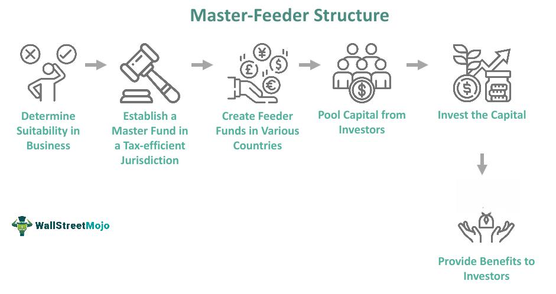

The financial sector of the United Kingdom is highly developed and globally recognized, serving as a critical hub for a range of innovative financial services. Hedge funds, key players within this ecosystem, are known for their diverse and complex trading strategies that aim to achieve substantial returns. These funds cater primarily to accredited investors, including high-net-worth individuals and institutional investors, due to their sophisticated nature and potential high risk.

In recent years, algorithmic trading has notably impacted the hedge fund industry in the UK, driving a paradigm shift towards increased efficiency and improved returns. Algorithmic trading, or algo trading, involves the use of computer algorithms to execute trades at optimal speed and frequency, thereby enhancing decision-making processes. This technology enables hedge funds to manage large asset volumes with precision and anonymity, making it a valuable tool in their arsenal.



The integration of algorithmic trading within the UK's financial sector signifies a substantial transformation. This article explores the dynamics of this innovation, its significance, the regulatory environment it operates within, and potential future trends. As technology continues to evolve, the role of algorithmic trading in hedge funds is expected to grow, presenting new opportunities and challenges. Understanding these elements is key to navigating the future of hedge fund trading in the UK.

## Table of Contents

## Understanding Hedge Funds

Hedge funds represent a specialized class of pooled investment vehicles that aim to achieve high returns by employing a diverse array of aggressive strategies. These funds are distinct from traditional investment vehicles, such as mutual funds, primarily due to their focus on absolute wealth returns irrespective of prevailing market conditions. Hedge funds are characterized by intricate investment methodologies and a higher risk profile, necessitating that they cater exclusively to accredited investors. These investors typically include high-net-worth individuals and institutional entities who possess the financial acumen and resources to engage with the complex structures and potential risks presented by hedge funds.

This exclusivity is partly due to the less liquid nature of hedge fund investments. Unlike mutual funds, which offer relatively easier redemption terms, hedge funds often impose lock-up periods during which investments cannot be withdrawn. This illiquidity allows hedge fund managers the flexibility to implement long-term strategies without the pressure of frequent withdrawals, although it requires investors to commit capital for extended periods.

Regulatory oversight for hedge funds is comparatively lenient, adhering to fewer constraints than mutual funds. This leniency permits hedge fund managers to exercise a broader range of investment tactics, from leveraging and short selling to derivatives and arbitrage strategies. Such strategies enable hedge funds to pursue returns that do not solely depend on rising market conditions and can potentially profit from both market upturns and downturns.

To summarize, hedge funds are complex and flexible financial vehicles catering to sophisticated investors who seek potentially high returns through varied and aggressive investment strategies. Their distinct structure, including less [liquidity](/wiki/liquidity-risk-premium) and fewer regulatory constraints, enables hedge funds to target absolute returns across different market scenarios.

## The Rise of Algorithmic Trading

Algorithmic trading utilizes sophisticated computer algorithms to execute trades with optimal speed and frequency. These algorithms process vast amounts of market data to make precise trading decisions, significantly enhancing decision-making capabilities within hedge funds. This technique involves the deployment of predefined sets of instructions based on various parameters such as timing, price, and [volume](/wiki/volume-trading-strategy), ensuring trades are executed at varying times without the need for manual intervention.

In the United Kingdom, the rapid adoption of [algorithmic trading](/wiki/algorithmic-trading) is attributed to its efficacy in managing sizeable asset volumes with increased precision and anonymity. By leveraging algorithmic solutions, hedge funds can efficiently process and analyze complex data to achieve faster execution of trades, thus capitalizing on even the minutest market fluctuations. This capability helps funds manage significant quantities of assets by minimizing transaction costs and reducing the market impact of trading large blocks of shares.

Algorithmic trading has enabled hedge funds to exploit market inefficiencies, which are subtle discrepancies in pricing that may arise due to market mispricing, temporal discontinuities, or ineffective market functioning. By identifying and acting on these inefficiencies, hedge funds can improve their performance and risk management outcomes. The application of algorithms to detect and react to these anomalies ensures that hedge funds can execute [arbitrage](/wiki/arbitrage) strategies and optimize their portfolios more effectively.

Furthermore, algorithmic trading helps in enhancing risk management. Algorithms can be programmed to adhere strictly to risk management principles, such as limiting potential losses through stop-loss provisions or diversifying trades to minimize overall portfolio risk. Additionally, the systematic and disciplined approach facilitated by algorithmic trading significantly reduces the emotional biases that can often influence manual trading decisions.

Overall, the integration of algorithmic trading technology in the UK's [hedge fund](/wiki/hedge-fund-trading-strategies) sector marks a significant shift towards more efficient and data-driven trading practices. This advancement not only supports enhanced performance outcomes but also fosters improved transparency and accountability within the financial market framework, setting a precedent for the continued evolution of trading strategies.

## Regulations Governing Hedge Funds in the UK

The regulatory framework for hedge funds in the United Kingdom is primarily overseen by the Financial Conduct Authority (FCA). The FCA's central role is to ensure transparency within the financial market and provide robust protection for investors. Hedge funds, by nature, are complex financial instruments employing high-risk strategies and, as such, are held to stringent standards by regulatory authorities.

One of the key regulatory requirements the hedge funds in the UK must adhere to involves the Markets in Financial Instruments Directive (MiFID) and the Alternative Investment Fund Managers Directive (AIFMD). MiFID is a cornerstone of the EU's regulation of financial markets, aiming to increase competition and enhance consumer protection in investment services. It lays out requirements on how financial institutions, including hedge funds, should operate their trading activities, market transparency, and reporting mechanisms. Meanwhile, AIFMD specifically targets hedge funds and other alternative investments, mandating authorization procedures, transparency requirements, and investor disclosures.

The authorization process under the FCA is both comprehensive and demanding. Hedge fund managers are required to demonstrate their financial stability, which includes providing detailed reports on cash flow, asset holdings, and expected financial projections. They must also establish and maintain robust operational systems capable of managing the fund's activities efficiently and securely. This involves having reliable risk management practices in place, ensuring cybersecurity measures to protect client data, and adequate internal controls to prevent conflicts of interest.

Furthermore, compliance with these regulations requires significant documentation and auditing. Hedge funds must regularly submit detailed reports to the FCA, covering aspects such as fund performance, fee structures, and any changes in the fund's strategy or management. These reports are critical for maintaining transparency and allowing the FCA to monitor compliance with existing regulations.

In summary, the regulatory environment for hedge funds in the UK, supervised by the FCA, imposes rigorous standards designed to protect investors and maintain the integrity of the financial system. Compliance with regulations such as MiFID and AIFMD is crucial for hedge funds, impacting their operational methodologies and market interactions.

## Challenges and Opportunities in Hedge Fund Algo Trading

Algorithmic trading offers numerous benefits, but it also presents significant challenges within the hedge fund industry. One of the principal challenges relates to the technological costs associated with implementing and maintaining sophisticated trading systems. Developing advanced algorithms requires substantial investment in infrastructure, skilled personnel, and ongoing research. These expenses can be daunting, especially for smaller hedge funds striving to compete with larger, more resource-rich entities.

The competitive nature of the hedge fund industry necessitates constant innovation in trading strategies and tools. As more funds adopt algorithmic trading, maintaining a competitive edge becomes increasingly difficult. Hedge funds must continuously develop new models and algorithms to stay ahead of market trends and exploit emerging opportunities. This relentless pursuit of innovation can strain resources and requires a constant influx of technical expertise.

Regulatory compliance adds another layer of complexity. In the UK, hedge funds must navigate a stringent regulatory environment imposed by bodies such as the Financial Conduct Authority (FCA). Compliance with regulations like the Markets in Financial Instruments Directive (MiFID) and the Alternative Investment Fund Managers Directive (AIFMD) is essential but challenging. These regulations mandate transparency and impose strict controls, which can limit the flexibility of algorithmic trading strategies and increase operational costs.

Despite these challenges, algorithmic trading presents substantial opportunities for hedge funds. Advances in [machine learning](/wiki/machine-learning) and [artificial intelligence](/wiki/ai-artificial-intelligence) (AI) offer promising avenues for enhancing trading capabilities. By utilizing sophisticated AI models, hedge funds can analyze vast datasets to identify patterns and predict market movements with higher accuracy. Machine learning algorithms can adapt to new data, improving their predictive performance over time.

These technological advancements provide hedge funds with the ability to capitalize on market inefficiencies more effectively. For example, machine learning techniques can be used to develop predictive models for asset price movements or to optimize portfolio construction. Python, a popular programming language in the financial sector, offers various libraries such as TensorFlow and Scikit-learn for implementing machine learning models. Here's a simple example demonstrating basic usage of a linear regression model for predicting stock prices:

```python
from sklearn.linear_model import LinearRegression
import numpy as np

# Example data: previous stock prices
X = np.array([1, 2, 3, 4, 5]).reshape(-1, 1)
y = np.array([100, 150, 200, 250, 300])

# Create a linear regression model
model = LinearRegression()
model.fit(X, y)

# Predict future price
future_day = np.array([6]).reshape(-1, 1)
predicted_price = model.predict(future_day)
print(f"Predicted stock price for day 6: {predicted_price[0]}")
```

This example illustrates how simple models can be developed to analyze and predict financial data. As these technologies continue to evolve, hedge funds are positioned to develop more complex models that further enhance algorithmic trading strategies. However, embracing these opportunities requires a balance between technological innovation and rigorous compliance with regulatory frameworks to ensure sustainable growth and stability within the hedge fund industry.

## Case Studies of Leading UK Hedge Funds

Prominent UK-based hedge funds, such as Brevan Howard and Capula Investment Management LLP, have successfully integrated algorithmic trading into their strategic operations, underscoring the transformative impact of technological innovations in financial markets. 

Brevan Howard, founded in 2002, has established itself as a leader in macroeconomic hedge funds, primarily focusing on interest rates, fixed income, and foreign exchange. By leveraging algorithmic trading, Brevan Howard utilizes sophisticated quantitative models that process vast volumes of financial data to identify market trends and execute trades with precision and speed. The firm employs a team of quants and data scientists who develop custom algorithms designed to predict market movements and optimize trading strategies. This approach enables Brevan Howard to adapt to ever-changing market conditions, balancing high returns with effective risk management. The firm's algorithmic trading strategy is complemented by rigorous stress testing and scenario analysis, ensuring that the algorithms perform robustly under a variety of market conditions.

Similarly, Capula Investment Management LLP, established in 2005, specializes in fixed income and macroeconomic strategies, with a keen emphasis on risk-adjusted returns. Capula employs algorithmic trading to enhance its quantitative approach by integrating complex algorithms with advanced statistical models. These models are tasked with analyzing intricate data sets to explore arbitrage opportunities and execute trades with minimized latency, thereby achieving optimal timing and pricing. Capula's commitment to technology is evident in its continuous investment in infrastructure and analytical tools, which facilitate the seamless execution of trades across multiple asset classes.

Both Brevan Howard and Capula Investment Management illustrate the success achievable through algorithmic trading, evidenced by their consistent performance and ability to navigate volatile markets. By systematically assessing market conditions with quantitative rigor, these funds exemplify the potential of algo trading to deliver superior returns while carefully managing financial risk. Their pioneering work in implementing algorithmic solutions underscores the importance of technology in contemporary hedge fund operations, setting a benchmark for others in the industry to follow.

## Future Trends in Hedge Fund Algorithmic Trading

As technology continues to advance, algorithmic trading within hedge funds is poised for significant growth. One of the primary drivers of this evolution is the increasing adoption of artificial intelligence (AI) and machine learning (ML) technologies. These technologies enable hedge funds to process vast amounts of data, identify patterns, and execute trades with greater precision and efficiency. AI-driven algorithms can adapt to changing market conditions in real-time, optimizing trading strategies and reducing the potential for human error.

The burgeoning emphasis on data analytics plays a pivotal role in the development of more sophisticated algorithms. By leveraging big data, hedge funds can extract actionable insights from various sources, including market data, economic indicators, and social media trends. This data-centric approach facilitates the customization of algorithms to better fit specific market conditions, enhancing the ability to predict market movements and ultimately improve returns.

Increased regulatory scrutiny, exemplified by frameworks such as MiFID II and AIFMD, necessitates enhanced compliance measures in algorithmic trading. Regulators are focused on ensuring that trading practices are transparent and that systemic risks are mitigated. As a result, hedge funds are investing in robust compliance systems capable of monitoring and documenting algorithmic activities. These systems not only help in adhering to regulatory standards but also in fostering a stable and transparent trading environment.

Technological innovations are anticipated to lead to the integration of quantum computing and blockchain technologies in hedge fund operations. Quantum computing holds the potential to revolutionize algorithmic trading by processing information at unprecedented speeds, potentially opening new horizons for complex problem-solving in market analysis. Similarly, blockchain technology offers improved security and traceability, which could enhance the integrity and transparency of trading transactions.

In conclusion, the future of hedge fund algorithmic trading is characterized by the integration of cutting-edge technologies and a focus on data-driven strategies. Funds that embrace these advancements while maintaining rigorous compliance will likely thrive in the competitive landscape. It is essential for hedge funds to remain agile and adaptive, continuously evolving their strategies to capitalize on emerging technological trends and regulatory developments.

## Conclusion

The integration of algorithmic trading in the United Kingdom's hedge fund industry underscores a substantial advancement in technological innovation. This transition to algorithmic systems has not only increased the efficiency and speed of trading operations but has also significantly enhanced precision. These improvements have made algorithmic trading an attractive prospect for investment, with many seeking to capitalize on the potential for higher returns.

Despite these advantages, there are notable challenges that accompany the adoption of algorithmic trading. These include substantial technological costs, ongoing development requirements, and stringent regulatory compliance. However, the benefits of algorithmic trading—especially in terms of operational efficiency and market precision—continue to draw significant interest and capital from investors who are eager to leverage these advantages for improved portfolio performance.

Looking to the future, the continued success of hedge fund algorithmic trading in the UK will depend largely on the ability to stay current with technological advancements and regulatory developments. The dynamic nature of both technology and financial regulations necessitates a proactive approach to innovation and compliance. This will be essential not only for maintaining competitive advantages but also for ensuring the stability and transparency of trading activities within this rapidly evolving industry. Maintaining this equilibrium is critical for hedge funds aiming to secure long-term success and sustainability in a competitive market landscape.

## References & Further Reading

[1]: ["Algorithmic Trading: Winning Strategies and Their Rationale"](https://www.wiley.com/en-us/Algorithmic+Trading%3A+Winning+Strategies+and+Their+Rationale-p-9781118460146) by Ernest P. Chan

[2]: ["Hedge Fund Market Wizards"](https://www.amazon.com/Hedge-Fund-Market-Wizards-Winning/dp/1480590010) by Jack D. Schwager

[3]: Mansini, R., Ogryczak, W., & Speranza, M. G. (2015). ["Linear and Mixed Integer Programming for Portfolio Optimization."](https://link.springer.com/book/10.1007/978-3-319-18482-1) Springer.

[4]: Zakamulin, V. (2017). ["Market Timing with Moving Averages: The Anatomy and Performance of Trading Rules."](https://www.semanticscholar.org/paper/Market-Timing-with-Moving-Averages%3A-Anatomy-and-of-Zakamulin/d2b021a050fb78327ca18d2a9401871d74c0871b) Routledge.

[5]: Aldridge, I. (2013). ["High-Frequency Trading: A Practical Guide to Algorithmic Strategies and Trading Systems."](https://www.amazon.com/High-Frequency-Trading-Practical-Algorithmic-Strategies/dp/1118343506) Wiley.