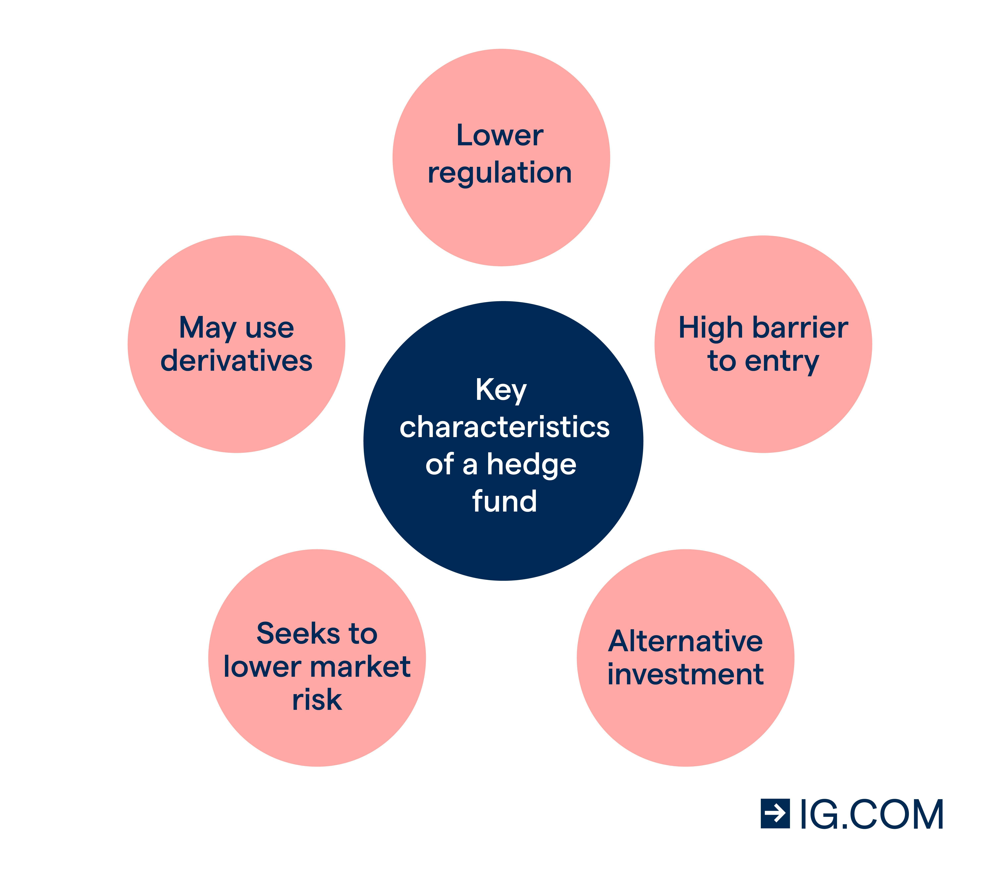

## Table of Contents

## What is a hedge fund and how does it operate?

A hedge fund is a type of investment fund that pools money from investors and uses different strategies to try to make money. These strategies can be more risky and complex than those used by regular investment funds. Hedge funds are usually only available to wealthy people or big institutions because they are seen as riskier investments.

Hedge funds operate by taking the money they get from investors and using it to buy and sell different kinds of investments, like stocks, bonds, and commodities. They often use strategies like borrowing money to invest more, betting on prices going down, and using computer models to decide what to buy and sell. The goal is to make more money for the investors than they could get from regular investments, but there's also a higher chance of losing money.

## What are the basic legal requirements for starting a hedge fund in the UK?

Starting a hedge fund in the UK involves meeting certain legal requirements. First, you need to set up a legal structure for your fund, which is usually a limited partnership or a limited liability partnership. This structure helps protect the personal assets of the fund managers and investors. You also need to register with the Financial Conduct Authority (FCA), which is the main financial regulator in the UK. The FCA will check that you meet their rules, like having enough money and the right skills to run a hedge fund.

Next, you need to follow rules about who can invest in your fund. Hedge funds in the UK are usually only open to professional investors or high net worth individuals. This means you have to check that your investors meet certain financial thresholds before they can put money into your fund. You also need to create a detailed prospectus or offering document that explains how your fund works, the risks involved, and how you plan to make money. This document helps investors understand what they are getting into and is required by the FCA.

## How do you register a hedge fund with the Financial Conduct Authority (FCA)?

To register a [hedge fund](/wiki/hedge-fund-trading-strategies) with the Financial Conduct Authority (FCA), you need to start by filling out an application form. This form asks for details about your fund, like its name, structure, and the people running it. You'll need to show that you have enough money and the right skills to manage a hedge fund. The FCA will check your application carefully to make sure you meet their rules. This process can take some time, so it's good to be patient and ready to answer any questions they might have.

Once you've sent in your application, the FCA will review it. They might ask for more information or want to talk to you about your plans. If everything looks good and you meet all their requirements, they will approve your registration. After that, you'll need to keep following their rules, like reporting regularly on how your fund is doing and making sure only the right kind of investors can put money into your fund.

## What types of hedge fund structures are available in the UK?

In the UK, hedge funds usually use two main types of structures: limited partnerships and limited liability partnerships. A limited partnership has two kinds of partners: general partners who run the fund and make decisions, and limited partners who invest money but don't get involved in running the fund. The general partners are responsible for any debts the fund might have, while the limited partners' risk is limited to the money they put in. This structure is popular because it helps protect the investors' personal money.

The other common structure is a limited liability partnership (LLP). In an LLP, all partners have limited liability, which means their personal money is safer if the fund gets into trouble. LLPs are good for hedge funds because they give more flexibility in how the fund is run and taxed. Both structures need to follow the rules set by the Financial Conduct Authority (FCA) to make sure they are doing things the right way.

## What are the key compliance and regulatory considerations for UK hedge funds?

Running a hedge fund in the UK means you have to follow a lot of rules to make sure everything is done the right way. The main regulator is the Financial Conduct Authority (FCA), and they have strict rules about how hedge funds should operate. You need to register with the FCA and show that you have enough money and the right skills to manage a hedge fund. The FCA will also check who can invest in your fund, making sure they are professional investors or high net worth individuals. This is to protect people who might not understand the risks involved in hedge fund investments.

Another important thing is that you need to keep good records and report regularly to the FCA. This means you have to tell them how your fund is doing, what investments you are making, and any big changes in your business. You also need to make sure you follow rules about how you market your fund, like being honest and clear about the risks and potential rewards. All these rules are there to make sure your hedge fund is run fairly and safely, and to protect your investors.

## How can one attract and manage investors in a UK hedge fund?

To attract investors to your UK hedge fund, you need to show them why your fund is a good choice. Start by making a clear and honest prospectus that explains how your fund works, the risks involved, and how you plan to make money. This document should be easy to understand and show that you know what you're doing. You can also reach out to potential investors through networking events, conferences, and by working with financial advisors who can introduce you to wealthy individuals and institutions. It's important to build trust by being transparent about your strategies and performance.

Once you have investors, managing their expectations and keeping them happy is key. Regular communication is important, so make sure to send them updates on how the fund is doing, any big changes, and how their money is being used. Being open about both good and bad news helps build trust. Also, make sure you're following all the rules set by the Financial Conduct Authority (FCA), like who can invest and how you report your performance. By doing this, you can keep your investors confident in your fund and maybe even attract more people to invest in the future.

## What are the tax implications of running a hedge fund in the UK?

Running a hedge fund in the UK means you have to think about taxes. If your fund is set up as a limited partnership, the profits are usually passed directly to the investors, who then pay tax on their share. This can be good for the fund because it doesn't have to pay corporation tax on its profits. But, the investors might have to pay income tax or capital gains tax on what they earn from the fund. The general partners, who run the fund, might also have to pay tax on their share of the profits, which could be treated as income or capital gains depending on how the fund is structured.

If your hedge fund is set up as a limited liability partnership (LLP), the tax situation is a bit different. In an LLP, all partners have to pay tax on their share of the profits, but the LLP itself doesn't pay corporation tax. This means the partners report their earnings on their personal tax returns and pay income tax or capital gains tax, just like in a limited partnership. The key thing to remember is to keep good records and follow all the tax rules, because the tax authorities will want to know exactly how much money is being made and how it's being taxed.

## How do you develop an effective investment strategy for a UK hedge fund?

Developing an effective investment strategy for a UK hedge fund starts with understanding your goals and the risks you're willing to take. You need to decide if you want to focus on making money quickly or if you're okay with a slower, steadier approach. You also need to think about the kinds of investments you want to make, like stocks, bonds, or other financial products. It's important to do a lot of research to find good opportunities and to use tools like computer models to help you make smart choices. Talking to other experts and learning from their experiences can also help you come up with a solid plan.

Once you have your basic strategy, you need to keep an eye on how it's working and be ready to make changes if things aren't going well. This means looking at how your investments are doing and making sure they match up with what you want to achieve. You might need to adjust your strategy if the market changes or if you find new opportunities. It's also important to think about how much risk you're taking and whether you need to be more careful or if you can take on more risk to try to make more money. By staying flexible and always learning, you can keep your investment strategy strong and effective.

## What are the operational challenges and solutions for managing a hedge fund in the UK?

Running a hedge fund in the UK comes with a lot of operational challenges. One big challenge is making sure you follow all the rules set by the Financial Conduct Authority (FCA). This means you have to keep good records, report regularly on how your fund is doing, and make sure only the right kind of people can invest in your fund. Another challenge is managing the money and investments well. You need to keep track of all the money coming in and going out, and make sure your investment strategies are working the way you planned. It can also be hard to find and keep good people to work with you, because running a hedge fund needs a lot of skill and knowledge.

To solve these challenges, you need to be organized and careful. For the regulatory rules, you can hire people who know a lot about the FCA's requirements to help you stay on track. You can also use good computer systems to keep your records straight and to report to the FCA on time. To manage the money and investments, it's important to have clear plans and to check regularly how things are going. If something isn't working, you need to be ready to change your strategy. For finding and keeping good staff, you can offer good pay and a chance to learn and grow in their jobs. By being prepared and flexible, you can handle the operational challenges of running a hedge fund in the UK.

## How do you measure and report performance in a UK hedge fund?

Measuring and reporting performance in a UK hedge fund involves looking at how well your investments are doing over time. You usually do this by calculating the returns on your investments, which is how much money you've made or lost. One common way to measure this is by using the net asset value (NAV), which is the total value of all the investments in your fund minus any debts. You can also compare your fund's performance to a benchmark, like a stock market index, to see if you're doing better or worse than the market. It's important to do this regularly, like every month or quarter, so you can keep track of how your fund is doing.

Reporting the performance to your investors and the Financial Conduct Authority (FCA) is also important. You need to make sure your reports are clear and easy to understand. In your reports, you should include the returns you've calculated, any fees you've charged, and any big changes in your investments. You should also explain any risks that might affect your fund's performance. The FCA has rules about how often you need to report and what information you need to include, so make sure you follow those rules carefully. By being honest and clear in your reports, you can help your investors trust you and make good decisions about their money.

## What advanced risk management techniques should be implemented in a UK hedge fund?

To manage risk well in a UK hedge fund, you need to use advanced techniques that help you understand and control the risks you're taking. One important technique is stress testing, which means you look at how your investments would do if something bad happened, like a big drop in the stock market. This helps you see if your fund could handle tough times. Another technique is [value at risk](/wiki/var-value-at-risk) (VaR), which tells you the most money you could lose in a certain time, like a day or a week, with a certain level of confidence. Using VaR helps you know how much risk you're taking and if you need to make changes to your strategy.

You also need to use diversification, which means spreading your money across different kinds of investments. This can help lower your risk because if one investment does badly, the others might do well and balance things out. Another good technique is to use stop-loss orders, which automatically sell an investment if it drops to a certain price. This can help limit your losses if the market goes against you. By using these advanced risk management techniques, you can keep your hedge fund safer and more stable, which is good for you and your investors.

## How does Brexit affect the operation and regulation of hedge funds in the UK?

Brexit has changed some things for hedge funds in the UK. Before Brexit, UK hedge funds could easily do business in the European Union because the UK was part of the EU. But now, they have to follow new rules to work with EU countries. This means they might need to set up new offices in the EU or get special permissions to keep working with EU investors. It can make things more complicated and expensive for UK hedge funds.

The rules from the Financial Conduct Authority (FCA) in the UK are still the same, but Brexit means UK hedge funds can't use EU rules to make things easier. They need to be careful about how they do business with EU countries. Also, Brexit has made the UK's financial markets a bit different, so hedge funds might need to change their strategies to fit the new situation. Overall, Brexit has added some challenges for UK hedge funds, but they can still work well if they adapt to the new rules and conditions.

## References & Further Reading

[1]: ["Algorithmic Trading: Winning Strategies and Their Rationale"](https://www.wiley.com/en-us/Algorithmic+Trading%3A+Winning+Strategies+and+Their+Rationale-p-9781118460146) by Ernest P. Chan

[2]: ["Hedge Fund Market Wizards"](https://www.amazon.com/Hedge-Fund-Market-Wizards-Winning/dp/1480590010) by Jack D. Schwager

[3]: Mansini, R., Ogryczak, W., & Speranza, M. G. (2015). ["Linear and Mixed Integer Programming for Portfolio Optimization."](https://link.springer.com/book/10.1007/978-3-319-18482-1) Springer.

[4]: Zakamulin, V. (2017). ["Market Timing with Moving Averages: The Anatomy and Performance of Trading Rules."](https://www.semanticscholar.org/paper/Market-Timing-with-Moving-Averages%3A-Anatomy-and-of-Zakamulin/d2b021a050fb78327ca18d2a9401871d74c0871b) Routledge.

[5]: Aldridge, I. (2013). ["High-Frequency Trading: A Practical Guide to Algorithmic Strategies and Trading Systems."](https://www.amazon.com/High-Frequency-Trading-Practical-Algorithmic-Strategies/dp/1118343506) Wiley.