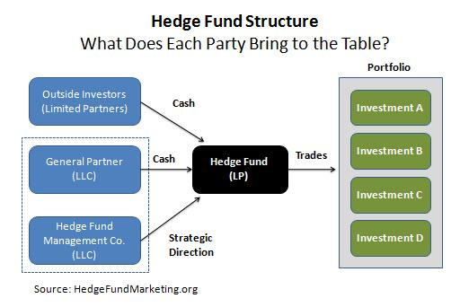

The world of finance is experiencing a rapid transformation, driven by the integration of cutting-edge technology. Financial startups are spearheading this transformation by utilizing technological advancements to create innovative investment management solutions. These startups harness technologies such as artificial intelligence, big data analytics, and blockchain to offer services that were once the domain of traditional financial institutions. They aim to democratize access to sophisticated investment tools, making it easier for a broader audience to participate in the financial markets.

Hedge funds, known for high-stakes investing, are also adapting to this evolving landscape. One significant change is the incorporation of algorithmic trading into their strategies. Algorithmic trading involves using complex computer algorithms to make trading decisions at speeds and efficiencies beyond human capabilities. This integration allows hedge funds to analyze vast datasets, optimize portfolios, and execute trades with reduced costs and lower risks. 



This article explores the intersection of financial startups, investment management, hedge funds, and algorithmic trading. These elements are reshaping the financial landscape by providing more dynamic, efficient, and accessible investment opportunities. Investors need to understand these changes to navigate the evolving market effectively. As technology continues to advance, its impact will likely deepen, offering both new opportunities and challenges for investors and financial institutions alike.

## Table of Contents

## Understanding Financial Startups

Financial startups are emerging as vital players in the financial ecosystem, specializing in delivering innovative financial products and services that are transforming the traditional landscape. Known for deploying financial technology, or fintech, these startups are reshaping how consumers engage with financial services by disrupting established market practices. An exemplary offering from such companies is robo-advising, a digital platform that manages investments and provides financial advice with minimal human intervention. These platforms harness advanced algorithms and data analytics to tailor investment strategies according to individual user preferences and risk profiles.

In addition to robo-advising, digital banking services are a hallmark of financial startups. By offering online and mobile banking solutions, these startups eliminate the need for physical branches, thereby cutting operational costs and extending banking services to a broader audience. Digital banking encompasses a variety of services, including basic transactions, personal finance management, loans, and even investment options, all delivered with seamless user experiences through intuitive interfaces.

A key characteristic of financial startups is their emphasis on user-friendly platforms. These platforms are designed to provide customers with easy access to a range of services, making financial management more convenient and efficient. By leveraging data analytics, startups can offer highly personalized financial advice, enhancing the consumer experience. This personalization is achieved through the analysis of user data, which helps in identifying patterns and preferences, allowing startups to offer tailored financial solutions.

The surge in popularity of financial startups can largely be attributed to their ability to democratize access to investment opportunities. By lowering entry barriers and offering more flexible, consumer-friendly alternatives, these startups make investing and financial management activities more accessible to everyday consumers. This democratization is evident in the way they structure their products and services; many financial startups utilize subscription models, micro-investment options, and zero-commission trading to attract a diverse range of customers, including those who might have previously been excluded from traditional financial services due to high costs or lack of financial knowledge.

Overall, financial startups are distinctive for their innovative approaches and strategic use of technology to deliver cutting-edge financial services. Their focus on accessibility, personalization, and user-centric design significantly enhances consumer engagement with financial products, paving the way for a more inclusive financial sector.

## Investment Management Evolution

Investment management is undergoing a profound transformation driven by the integration of advanced technologies, particularly [artificial intelligence](/wiki/ai-artificial-intelligence) (AI) and [machine learning](/wiki/machine-learning). These technologies are reshaping the way investment managers approach data analysis and portfolio optimization.

At the core of this transformation is the use of sophisticated algorithms. Investment managers now have access to vast amounts of market data, which they analyze using AI-driven algorithms. These algorithms can process a multitude of data points far quicker than traditional methods, identifying patterns and trends that may not be immediately apparent to human analysts. For example, machine learning models can be employed to forecast asset prices by analyzing historical price data, sentiment analysis from news articles, and other relevant factors. This predictive capability allows managers to make more informed investment decisions, enhancing both the efficiency and accuracy of their strategies.

The shift towards these technologies also enhances risk management. By predicting market trends with greater accuracy, AI and machine learning models help in identifying potential risks and [volatility](/wiki/volatility-trading-strategies) factors before they impact the portfolio. This proactive risk management approach enables managers to adjust their strategies dynamically, thus minimizing potential losses and improving returns.

Financial startups are playing a key role in driving innovation within investment management. These startups often work alongside traditional financial firms, collaboratively integrating advanced technologies into existing systems. This partnership allows for the sharing of expertise and resources, enabling the development of cutting-edge solutions that can be scaled effectively across the financial industry.

To illustrate, consider the application of machine learning in analyzing portfolio diversification. A Python implementation using libraries such as NumPy and SciPy could optimize a portfolio using techniques like mean-variance optimization. Here's a simplified example:

```python
import numpy as np
from scipy.optimize import minimize

# Expected returns and covariance matrix
returns = np.array([0.1, 0.2, 0.15])
cov_matrix = np.array([
    [0.005, -0.010, 0.004],
    [-0.010, 0.040, -0.002],
    [0.004, -0.002, 0.023],
])

def portfolio_variance(weights):
    return np.dot(weights.T, np.dot(cov_matrix, weights))

# Constraints for weights sum to 1
constraints = ({'type': 'eq', 'fun': lambda x: np.sum(x) - 1})
bounds = tuple((0, 1) for _ in range(len(returns)))

# Initial guess
init_guess = len(returns) * [1. / len(returns),]

result = minimize(portfolio_variance, init_guess, method='SLSQP', bounds=bounds, constraints=constraints)

# Optimized portfolio weights
optimized_weights = result.x
```

This code snippet demonstrates a basic structure for optimizing a portfolio's variance, reflecting how technology is used to refine investment management strategies.

The evolution of investment management towards technology-driven processes represents a significant leap forward for the financial industry. It promises enhanced efficiency, improved risk management, and more sophisticated strategies that cater to the modern investor's needs. As this landscape continues to evolve, the collaboration between financial startups and traditional firms will likely result in even more innovative solutions, fostering a dynamic and competitive investment environment.

## The Hedge Fund Landscape

Hedge funds are specialized investment vehicles that employ a wide range of strategies to manage and optimize their portfolios. Unlike conventional investment funds, hedge funds are renowned for their aggressive pursuit of high returns, regardless of market direction. This is often achieved through both long and short positions across various markets, including equities, fixed income, and commodities. The versatility of hedge funds allows them to adapt and capitalize on diverse economic conditions, often utilizing leverage and derivatives to enhance their investment activities.

A hallmark of hedge funds is their active management style. This involves real-time analysis and decision-making to exploit market inefficiencies. Hedge fund managers apply intricate strategies that may include macroeconomic analysis, [arbitrage](/wiki/arbitrage) opportunities, or even investment in distressed assets. In recent years, there has been a pronounced shift towards technology-driven strategies, particularly quantitative and [algorithmic trading](/wiki/algorithmic-trading). These strategies rely on sophisticated mathematical models and computer algorithms to execute trades automatically, often within milliseconds, based on a set of pre-defined rules.

The integration of technology into [hedge fund](/wiki/hedge-fund-trading-strategies) strategies aligns with the broader trend towards data-driven decision-making in financial markets. Quantitative strategies analyze vast datasets to identify patterns and predict future price movements. Algorithmic trading can reduce transaction costs and human error, leading to increased efficiency and consistency in execution. 

Understanding hedge funds involves distinguishing them not only from mutual funds but also from private equity. Hedge funds differ fundamentally from mutual funds in several ways. Firstly, hedge funds are less regulated, allowing for a greater degree of leverage and a wider variety of investment instruments, such as derivatives. This potential for high reward comes with increased risk, manifesting in the fund's volatility and [liquidity](/wiki/liquidity-risk-premium) characteristics. Secondly, hedge funds typically impose restrictions on redemption periods to allow managers the flexibility to execute their strategies without concern for short-term withdrawals.

Private equity, on the other hand, invests directly in private companies or takes public companies private, often seeking to restructure and improve these businesses over several years before exiting. In contrast, hedge funds are more likely to engage in frequent trading and seek short- to medium-term gains. This distinct approach underscores their superior liquidity for investors relative to private equity investments, although they [carry](/wiki/carry-trading) different risk profiles.

In summary, hedge funds are a pivotal element in modern finance, offering sophisticated strategies that embrace cutting-edge technology. Their ability to dynamically adjust investment strategies to market conditions, albeit with inherent risks, distinguishes them from traditional investment vehicles. This complexity necessitates a thorough understanding of their unique risk-return characteristics for investors considering hedge fund allocation.

## Integration of Algorithmic Trading

Algorithmic trading employs computer algorithms to execute trades based on predefined strategies. This approach has fundamentally changed trading methods, especially in the context of hedge funds that thrive on capturing small price discrepancies in the blink of an eye. The primary goal is to leverage computational power and automation to analyze vast amounts of market data, execute trades in fractions of a second, and optimize the decision-making process.

The introduction of algorithmic trading has brought several key advantages. Primarily, it reduces transaction costs by streamlining operations and minimizing the need for human intervention. This reduction is achieved through automation and the elimination of manual processes that could be slow or error-prone. Furthermore, algorithmic trading minimizes human errors that can occur due to emotional decision-making or oversight, ensuring more consistent and reliable trade execution.

Another significant advantage is enhanced efficiency. Algorithms can process information and execute orders much faster than a human trader, leading to more opportunities to exploit market inefficiencies. This increased speed and efficiency are particularly advantageous in high-frequency trading environments, where market conditions can change in microseconds.

Hedge funds have embraced algorithmic trading for various tasks such as arbitrage, [market making](/wiki/market-making), and [trend following](/wiki/trend-following). In arbitrage strategies, algorithms can identify price differentials between markets or financial instruments and execute trades simultaneously to lock in profits before the discrepancies disappear. For market making, algorithms help in quoting buy and sell prices at volumes that balance the market demand, providing liquidity while [earning](/wiki/earning-announcement) the spread. Trend-following strategies use historical data to identify market trends and execute trades in the direction of the trends, attempting to benefit from sustained movements in the markets.

An example of a simple algorithmic strategy in Python for a moving average crossover, a form of trend following, could be implemented as follows:

```python
import pandas as pd
import numpy as np

# Sample market data
data = {'Prices': [101, 102, 101, 103, 104, 102, 104, 105, 107, 110]}
df = pd.DataFrame(data)

# Calculate short and long-term moving averages
df['Short_MA'] = df['Prices'].rolling(window=3).mean()
df['Long_MA'] = df['Prices'].rolling(window=5).mean()

# Generate trading signals
df['Signal'] = 0
df['Signal'][3:] = np.where(df['Short_MA'][3:] > df['Long_MA'][3:], 1, 0)

# Calculate positions
df['Position'] = df['Signal'].diff()

print(df)
```

This Python code demonstrates a basic moving average crossover strategy where trades are triggered when the short-term moving average crosses above or below the long-term moving average. This code showcases the simplicity and power of algorithmic strategies in automating trading decisions based on mathematical and statistical principles.

In summary, algorithmic trading has become a cornerstone of modern hedge fund strategies. By optimizing trade execution through speed, accuracy, and efficiency, hedge funds can better manage the complexities and opportunities of today's financial markets.

## Case Studies of Successful Financial Startups

Case studies of successful financial startups illustrate how these companies have effectively integrated investment management and algorithmic trading solutions to enhance their offerings. These startups reveal diverse strategic approaches and technological innovations that have enabled them to succeed in the competitive financial landscape.

One notable startup is Wealthfront, a pioneer in the robo-advisory space, which has revolutionized personal investment management by leveraging advanced algorithms to offer automated, low-cost financial advisory services. Wealthfront's strategy was to target tech-savvy millennials, providing a user-friendly digital platform that eliminates the need for traditional financial advisors. Their proprietary algorithms analyze clients' financial profiles and market data to optimize portfolios, offering a streamlined investment experience. Regulatory challenges were addressed by obtaining necessary approvals and maintaining transparent communication with clients regarding investment strategies and risks. Wealthfront's approach has resulted in significant growth, with billions in assets under management and a steadily expanding user base.

Another example is QuantConnect, an open-source algorithmic trading platform that provides tools for financial engineers to design, test, and deploy trading algorithms. QuantConnect capitalized on the increasing demand for democratized algorithmic trading by offering a cloud-based platform that supports multiple programming languages, including Python and C#. Their market entry strategy involved building a strong developer community, attracting both amateur and professional traders who could contribute algorithms and share insights. Despite regulatory complexities, QuantConnect's platform complies with financial regulations by ensuring that users have the necessary licenses to engage in trading activities. This strategic approach has facilitated the platform's growth, enabling traders to backtest strategies across diverse market data, ultimately improving investor returns.

Robinhood, another exemplary startup, disrupted the brokerage industry by adopting a commission-free trading model supported by algorithmic order execution. The founders identified a market gap for accessible trading platforms and introduced a mobile-first app that appeals to younger generations. Robinhood's use of algorithms streamlines trade execution, reducing costs and enhancing the speed of transactions. Although facing regulatory scrutiny over its marketing practices and data security measures, Robinhood's proactive steps in addressing these issues have fortified its market position. The startup's success in attracting millions of users and transforming retail trading has had a notable impact on reducing entry barriers for novice investors.

These case studies illustrate the diverse strategies financial startups employ to navigate market entry, regulatory challenges, and technological integration. Their success underscores the significance of leveraging algorithmic solutions and innovative platforms to enhance investment management and deliver tangible benefits to investors.

## Challenges and Considerations

Financial startups and hedge funds, while driving innovation within the financial sector, encounter several significant challenges that can impact their operations and strategic goals. Two of the predominant challenges include regulatory compliance and cybersecurity threats, both of which necessitate considerable attention and resources.

Regulatory compliance remains a substantial challenge for financial startups and hedge funds. The rapidly changing regulatory landscape requires these entities to keep up with new regulations, such as the General Data Protection Regulation (GDPR) in Europe and the Dodd-Frank Act in the United States. These regulations are designed to protect investors and the financial ecosystem but can impose heavy compliance costs on financial entities. Non-compliance might lead to severe penalties and damage to reputation, which can be detrimental to new and emerging startups that lack the financial buffers of more established firms.

Cybersecurity is another pressing concern. As financial technology startups and hedge funds increasingly rely on digital platforms and datasets, they become more vulnerable to cyberattacks. These threats can compromise sensitive financial data, resulting in significant financial and reputational harm. Implementing robust cybersecurity measures is critical, yet it can be costly and requires constant updates to combat evolving threats. 

Adapting to technological advancements is also imperative yet challenging. While advancements like artificial intelligence and blockchain offer potential efficiencies and capabilities, they require new skill sets, substantial investment, and occasionally, a re-thinking of existing business models. Financial startups and hedge funds must continuously adapt their technological infrastructure to maintain competitiveness, which can be resource-intensive.

For investors, understanding these challenges is crucial as they evaluate their engagement with financial startups or hedge funds. Insights into how these entities navigate regulatory demands, protect against cyber threats, and integrate new technologies can inform smarter investment decisions. By assessing how well-positioned these companies are to address these challenges, investors can better gauge the potential risks and opportunities they present. This strategic assessment helps ensure that investments are both secure and positioned for growth in an ever-evolving financial landscape.

## The Future of Financial Startups and Hedge Funds

The future landscape of financial startups and hedge funds is poised for significant transformation driven by advances in artificial intelligence (AI) and data analytics. As these technologies mature, they are becoming essential tools in developing cutting-edge investment strategies and improving decision-making processes within the financial sector.

Financial startups are expected to play a crucial role in democratizing access to investment opportunities. By leveraging AI and data analytics, these startups can offer sophisticated investment tools and insights to a broader audience, breaking down barriers that have traditionally limited access to high-quality financial services. This democratization is likely to empower individual investors, providing them with capabilities that were once exclusive to large institutional investors.

Hedge funds, known for their innovative and adaptive strategies, are predicted to continue refining their approaches using advanced algorithms. These algorithms can process vast amounts of data at unprecedented speeds, uncovering patterns and insights that were previously inaccessible. By incorporating machine learning models, hedge funds can enhance their predictive accuracy and optimize trade execution, reducing costs and increasing returns.

This ongoing evolution is expected to significantly alter the competitive landscape of the financial industry. New entrants with a strong technological foundation could challenge established players, leading to increased competition and innovation. For financial startups, this could mean seizing market share from traditional institutions through superior technology and user experience. Established players, meanwhile, may need to innovate continually to maintain their competitive edge.

The integration of AI and data analytics also introduces new challenges, such as ensuring data privacy and securing complex algorithms against malicious threats. As the industry evolves, regulatory frameworks will need to adapt to address these issues, balancing innovation with investor protection.

In conclusion, the convergence of AI, data analytics, and financial services is set to reshape the future of financial startups and hedge funds. The ability to harness technology effectively will be a decisive [factor](/wiki/factor-investing) in defining success in the ever-changing financial markets.

## Conclusion

The interconnected roles of financial startups, hedge funds, and algorithmic trading are shaping the contemporary financial environment. Financial startups are pioneering new ways to make investing more accessible to a wider audience, often leveraging cutting-edge technologies and user-centric designs. By integrating innovative fintech solutions, these startups are democratizing access to financial services that were once predominantly the domain of large institutions.

Hedge funds, historically known for their complex and enigmatic strategies, continue to evolve by incorporating algorithmic trading techniques. These algorithms can optimize returns by executing trades with precision at unimaginable speeds, thereby minimizing human error and tapping into short-lived market opportunities. As they enhance their strategies with technology, hedge funds become more adaptable and can manage risks more effectively.

Algorithmic trading, on its part, has revolutionized transaction efficiency. By minimizing transaction costs and errors, it complements the goals of both financial startups and hedge funds. As technology advances, the prospects for improved efficiency and novel investment strategies continue to expand, presenting both opportunities and challenges.

For investors, staying informed about these developments is crucial. By understanding the synergy between financial startups, hedge funds, and algorithmic trading, investors can identify new opportunities while effectively managing associated risks. As the financial landscape evolves, continuous adaptation and learning will be essential to navigate and succeed in the markets. The future holds significant potential, as deeper integration of artificial intelligence and data analytics is set to further transform investment management, offering an exciting but competitive landscape for all market participants.

## References & Further Reading

[1]: Bergstra, J., Bardenet, R., Bengio, Y., & Kégl, B. (2011). ["Algorithms for Hyper-Parameter Optimization."](https://dl.acm.org/doi/10.5555/2986459.2986743) Advances in Neural Information Processing Systems 24.

[2]: ["Advances in Financial Machine Learning"](https://www.amazon.com/Advances-Financial-Machine-Learning-Marcos/dp/1119482089) by Marcos Lopez de Prado

[3]: ["Evidence-Based Technical Analysis: Applying the Scientific Method and Statistical Inference to Trading Signals"](https://www.amazon.com/Evidence-Based-Technical-Analysis-Scientific-Statistical/dp/0470008741) by David Aronson

[4]: ["Machine Learning for Algorithmic Trading"](https://github.com/stefan-jansen/machine-learning-for-trading) by Stefan Jansen

[5]: ["Quantitative Trading: How to Build Your Own Algorithmic Trading Business"](https://www.amazon.com/Quantitative-Trading-Build-Algorithmic-Business/dp/1119800064) by Ernest P. Chan