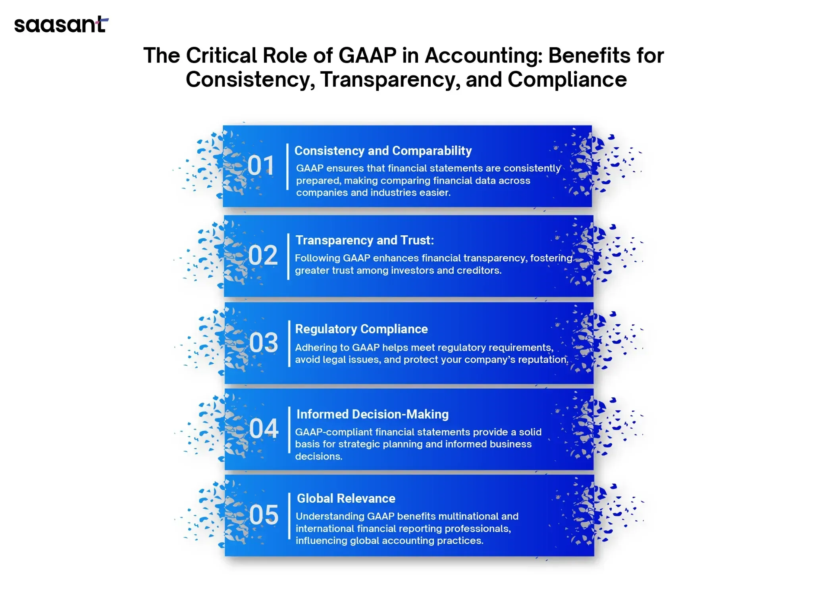

## Table of Contents

## What does GAAP stand for?

GAAP stands for Generally Accepted Accounting Principles. It is a set of rules and guidelines that companies in the United States must follow when they prepare their financial statements. These rules help make sure that the financial information a company shares is clear, accurate, and easy to compare with other companies.

GAAP covers many different areas of accounting, like how to record income, expenses, assets, and liabilities. It helps accountants know what to do in different situations, so everyone is using the same methods. This makes it easier for investors, creditors, and other people to understand a company's financial health and make good decisions.

## Why was GAAP established?

GAAP was established to make sure that everyone follows the same rules when they write down a company's money information. Before GAAP, different companies used different ways to keep track of their money, which made it hard to compare them. If one company said it made a lot of money, but used a different way of counting than another company, it was tough to know which one was really doing better. GAAP helps fix this problem by setting clear rules that everyone has to follow.

Another reason GAAP was created is to help people trust the money information that companies share. When investors and others look at a company's financial statements, they want to know that the numbers are correct and fair. GAAP makes sure that accountants use honest and clear methods to show how much money a company has, how much it owes, and how well it is doing. This helps people feel more confident when they make choices about where to put their money or whether to lend it to a company.

## Who is responsible for setting GAAP standards in the United States?

In the United States, the Financial Accounting Standards Board (FASB) is the main group that sets the rules for GAAP. The FASB is a private, non-profit organization that makes sure the rules are clear and fair. They work hard to keep the rules up to date so that they match what's happening in the business world today.

The Securities and Exchange Commission (SEC) also plays a big role. The SEC is a government agency that watches over the stock market and makes sure companies follow the rules. While the FASB makes the GAAP rules, the SEC can approve or change them. This helps make sure that the rules are good for everyone who uses them, like investors and companies.

## How does GAAP help in financial reporting?

GAAP helps in financial reporting by making sure all companies use the same rules to write down their money information. This means that when people look at financial statements from different companies, they can trust that the numbers are fair and easy to compare. Without GAAP, companies might use different ways to count their money, making it hard to know which company is doing better or worse. GAAP sets clear guidelines on how to record things like income, expenses, assets, and liabilities, so everyone does it the same way.

Another way GAAP helps is by making financial reports more honest and clear. When investors, banks, or other people need to make choices about a company, they want to know the financial information is correct. GAAP rules help accountants show the real picture of a company's money situation. This builds trust because people know the numbers have been put together carefully and fairly. By following GAAP, companies can show that they are open and honest about their financial health, which is important for keeping good relationships with everyone who cares about their business.

## What are the main principles of GAAP?

GAAP has several main principles that help companies keep their financial records in a clear and honest way. One of the most important principles is the principle of consistency, which means that once a company picks a way to record its money, it should keep using that way every time. This helps people who look at the financial reports understand them better because they know what to expect. Another key principle is the principle of conservatism, which tells companies to be careful and not to guess too high when they are not sure about something. They should always pick the option that shows the lowest possible value for their money if there's any doubt.

Another important principle is the principle of materiality, which means that companies should focus on the big things that really matter and not worry too much about the small stuff that doesn't make a big difference. This helps keep the financial reports simple and easy to understand. The principle of full disclosure is also very important because it says that companies need to tell everything that could affect someone's decision about the company. This means being open and honest about all the important financial information, so people can trust what they see in the reports.

The principle of relevance and reliability is crucial as well. This means that the financial information should be useful and trustworthy. It should help people make good choices about the company, and it should be based on facts that can be checked. Lastly, the principle of matching says that companies should match their income with the expenses that helped earn that income in the same time period. This gives a clearer picture of how well the company is doing over time. By following these principles, GAAP makes sure that financial reports are fair, clear, and helpful for everyone who uses them.

## Can you explain the difference between GAAP and IFRS?

GAAP, or Generally Accepted Accounting Principles, is used mostly in the United States. It's a set of rules that companies have to follow when they write down their money information. GAAP has very specific rules about how to record things like income, expenses, and assets. It's like a detailed guidebook that tells companies exactly what to do in different situations. This makes it easier for people in the U.S. to compare financial reports from different companies because everyone is following the same rules.

On the other hand, IFRS, or International Financial Reporting Standards, is used in many countries around the world. IFRS is more like a set of general principles that give companies a bit more freedom in how they record their money. Instead of strict rules, IFRS focuses on making sure the financial information is clear, honest, and helpful for people who need to use it. Because IFRS is used in many different countries, it helps people compare financial reports from companies all over the world, not just in one country.

The main difference between GAAP and IFRS is how detailed the rules are. GAAP has very specific rules that companies must follow, while IFRS gives more general guidelines and lets companies use their judgment more. This means that sometimes the same financial situation might be recorded a bit differently under GAAP and IFRS, which can make it tricky when people need to compare companies that use different standards. But both GAAP and IFRS are trying to do the same thing: make sure financial reports are clear, honest, and easy to understand.

## How often are GAAP standards updated?

GAAP standards are updated pretty often to keep up with changes in the business world. The Financial Accounting Standards Board (FASB), which is the group that makes the rules for GAAP, is always looking at how things are changing and figuring out if the rules need to be updated. They might change the rules because of new laws, new ways of doing business, or new kinds of money situations that companies are dealing with.

When the FASB decides to make a change, they go through a careful process. They talk to a lot of different people, like accountants, business owners, and investors, to make sure the new rules will be fair and helpful. After they've talked to everyone and made their decision, they write up the new rules and share them with everyone who needs to know. This can take a while, but it helps make sure that the GAAP standards stay up to date and useful for everyone.

## What industries are most affected by GAAP regulations?

GAAP rules touch many industries, but some feel it more than others. Big businesses in the finance world, like banks and insurance companies, really have to pay attention to GAAP. They deal with a lot of money coming in and going out, and they need to show everyone that their numbers are right. If they mess up, it could be a big problem. So, they have to be extra careful to follow the GAAP rules exactly.

Another group that GAAP hits hard is public companies. These are businesses that sell their stocks to people, so they have to share their money information with everyone. Investors and others who might want to buy their stocks need to trust that the numbers are fair and correct. That's why these companies have to follow GAAP closely, to make sure their financial reports are clear and honest.

## How does GAAP impact the auditing process?

GAAP helps make the auditing process easier and more trustworthy. When auditors check a company's financial records, they use GAAP as a guide to see if everything is done right. If the company follows GAAP rules, it's easier for auditors to understand the financial statements and check if they are correct. This makes the whole process smoother because everyone is using the same rules. Auditors can also be sure that the financial information is fair and honest because GAAP sets clear standards for how things should be recorded.

GAAP also helps auditors spot problems more easily. If a company isn't following GAAP, it's a big red flag for auditors. They can see if the company is trying to hide something or if they're just making mistakes. By comparing the company's records to GAAP rules, auditors can make sure that the financial reports are clear and give a true picture of the company's money situation. This helps keep companies honest and makes sure that people who use the financial reports, like investors, can trust what they see.

## What are some common challenges companies face when implementing GAAP?

One common challenge companies face when implementing GAAP is understanding all the rules. GAAP has a lot of detailed rules and it can be hard to keep track of them all. Companies need to make sure their accountants know these rules well, so they can record everything the right way. If they make a mistake, it could cause big problems later, like getting in trouble with the people who watch over financial reports or making investors lose trust in the company.

Another challenge is the cost and time it takes to follow GAAP. Companies need to spend money on training their staff and maybe even hiring experts to help them understand and apply the rules. They also need to spend time making sure all their financial records match up with GAAP, which can be a lot of work. For smaller companies, this can be especially tough because they might not have as much money or people to help them get everything right.

Keeping up with changes in GAAP can also be hard. The rules get updated pretty often to keep up with new ways of doing business and new laws. Companies have to stay on top of these changes and adjust their financial reporting to match the new rules. This means they need to keep learning and updating their systems, which can be a big ongoing challenge.

## How do GAAP standards influence financial decision-making?

GAAP standards help people make better financial decisions by making sure the money information from companies is clear and honest. When investors or banks look at a company's financial reports, they want to know the numbers are fair and correct. GAAP rules make sure that all companies follow the same way of recording their money, so it's easier to compare them. This helps people decide if a company is doing well or if it's a good place to put their money.

Sometimes, following GAAP can show a company in a different light than if they used a different way of counting their money. For example, GAAP might make a company look less profitable in the short term because of the way it tells them to record some expenses. But this helps give a true picture of the company's health over time. By having clear and honest information, people can make smarter choices about buying stocks, lending money, or making other big financial decisions.

## What future developments can we expect in GAAP?

In the future, GAAP might change to match new ways of doing business and new technology. As companies start using more digital tools and doing business online, the rules might need to be updated to cover these new situations. The people who make the GAAP rules, like the Financial Accounting Standards Board (FASB), will keep looking at how things are changing and decide if they need to make new rules or change the old ones. This helps make sure that GAAP stays useful and fair for everyone.

Another thing that might happen is that GAAP could start to look more like the rules used in other countries, like IFRS. Right now, GAAP is mostly used in the United States, but if more countries start using the same rules, it could make it easier for companies to do business all over the world. This would mean that the FASB might work more closely with the groups that make the rules for other countries to find ways to make the rules more similar. By doing this, they can help make financial reports clearer and easier to compare, no matter where the company is from.

## What is the role of financial reporting in algorithmic trading?

Algorithmic trading requires precise financial reporting to function effectively, as the accuracy of trading algorithms depends significantly on the quality of financial data. Financial statements, including balance sheets and income statements, serve as critical inputs that inform trading algorithms. These documents provide a snapshot of a company's financial health, allowing algorithms to make informed decisions within milliseconds.

At a fundamental level, balance sheets supply algorithms with information regarding a company's assets, liabilities, and equity. This information enables the assessment of a firm's financial stability and [liquidity](/wiki/liquidity-risk-premium), directly impacting risk management strategies. For instance, the basic accounting equation:

$$
\text{Assets} = \text{Liabilities} + \text{Equity}
$$

forms the backbone of balance sheet analysis. By integrating this data into trading systems, algorithms can evaluate the solvency and long-term viability of potential investment targets.

Income statements contribute by offering insights into revenue streams, expenses, net earnings, and profit margins. These metrics allow algorithms to gauge the operational efficiency and profitability of companies. The net income, given by:

$$
\text{Net Income} = \text{Revenue} - \text{Expenses}
$$

provides essential inputs for evaluating stock performance predictions and market sentiment analysis.

Accurate financial data is indispensable for optimizing strategies and making decisions in [algorithmic trading](/wiki/algorithmic-trading). Reliable data ensures that algorithms have a dependable foundation for conducting quantitative assessments and formulating strategies. This precision enhances both the speed and confidence of trading decisions, which are crucial in today's competitive markets.

Algorithmic trading platforms often deploy sophisticated technologies to ensure data accuracy, including real-time streaming data, API integrations, and [machine learning](/wiki/machine-learning) models that continuously evaluate and verify financial data streams. By automating the data validation process, these technologies minimize the likelihood of errors that could result in significant financial losses.

In summary, the quality and accuracy of financial reports directly affect the functionality and success of algorithmic trading operations. Continuous efforts in maintaining the integrity of financial data are vital in supporting the decision-making processes and strategic optimizations that drive algorithmic trading success.

## References & Further Reading

Various resources provide comprehensive insights into the principles of accounting and algorithmic trading, essential for anyone seeking to understand or work within these fields. The International Financial Reporting Standards (IFRS) and the Generally Accepted Accounting Principles (GAAP) are fundamental to the accounting profession, offering frameworks that ensure consistency, transparency, and accuracy in financial reporting. These guidelines serve as critical references for setting high standards in financial disclosure and operational efficiency.

In addition to IFRS and GAAP guidelines, literature focused on financial analytics and trading strategies offers invaluable knowledge for integrating these principles with algorithmic trading. Such resources typically cover quantitative finance methods, statistical models, and data analysis techniques crucial for developing effective algorithmic trading strategies. 

Continuous learning through these resources is vital for maintaining competitiveness in an industry that is rapidly evolving with technology. Books and peer-reviewed journals on financial mathematics, as well as courses on data science and [artificial intelligence](/wiki/ai-artificial-intelligence), can also support the enhancement of one's skills in algorithmic trading. For instance, understanding Python programming can be particularly beneficial, given its extensive libraries such as NumPy, pandas, and scikit-learn, which are used for data manipulation and machine learning in trading systems.

Among the suggested readings, "Algorithmic Trading: Winning Strategies and Their Rationale" by Ernest P. Chan and "Python for Finance" by Yves Hilpisch provide practical insights into the application of programming and statistical techniques in trading. Additionally, websites like Investopedia and the Financial Times offer regularly updated content related to financial markets, which can help professionals stay abreast of the latest trends and practices.

Utilizing these resources not only bolsters one's understanding of accounting and trading principles but also aids in adapting to the continuous changes and innovations within financial markets. Maintaining a habit of ongoing education is essential for professionals aiming to leverage the full potential of accounting standards in the development and fine-tuning of algorithmic trading strategies.

