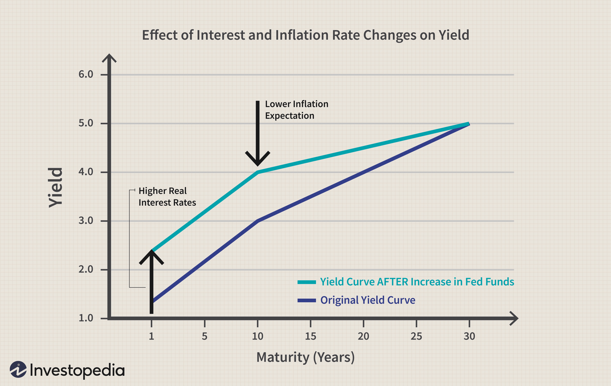

Understanding long-term investment returns is a fundamental aspect for investors seeking sustainable financial growth. These returns represent the profit or loss generated by an investment over an extended period, typically exceeding five years. They are influenced by factors such as the initial investment amount, the duration of the investment, and the types of asset classes involved. The significance of long-term investment returns lies in their potential to secure financial independence and create wealth, which is essential for retirement planning and other long-term objectives.

Financial calculations play a pivotal role in assessing investments. They provide investors with quantitative insights into the potential outcomes and risks associated with various investment choices. Key metrics, such as the Compound Annual Growth Rate (CAGR) and Internal Rate of Return (IRR), allow investors to evaluate performance over time. These calculations help in making informed decisions by projecting future cash flows and determining the present value of expected returns. Moreover, tools and techniques like Net Present Value (NPV) and Modified Internal Rate of Return (MIRR) are crucial in comparing different investment opportunities.



In recent years, algorithmic trading has transformed the investment landscape. By leveraging computer programs and algorithms to execute trades, investors can optimize their strategies based on complex mathematical models and vast data sets. Algorithmic trading enhances the efficiency and precision of investment strategies, making it an attractive approach for contemporary investors.

This article will explore the interconnectedness of these elements, providing a thorough examination of investment returns and algorithmic trading. We'll discuss the significance of precise financial calculations as they are essential for long-term success. With the integration of technology, investors are better equipped than ever to analyze market data, minimize risks, and maximize returns.

## Table of Contents

## Understanding Long-term Investment Returns

Long-term investment returns refer to the gains earned from holding investments over an extended period, typically exceeding five years. These returns are crucial for investors seeking to build wealth through strategic asset allocation, as they capture the compounding effects that can significantly enhance portfolio value over time.

Compounding is a powerful driver of long-term investment returns. It involves reinvesting earned interest, dividends, and capital gains, which generates earnings on both the original investment and the accumulated returns. For instance, an initial investment of $10,000 with an annual [interest rate](/wiki/interest-rate-trading-strategies) of 7% can grow to approximately $19,672 over ten years when compounded annually. The formula for compound interest is:

$$
A = P \times \left(1 + \frac{r}{n}\right)^{nt}
$$

where:
- $A$ is the amount of money accumulated after n years, including interest.
- $P$ is the principal amount (initial investment).
- $r$ is the annual interest rate (decimal).
- $n$ is the number of times that interest is compounded per year.
- $t$ is the time in years.

Various asset classes are suitable for long-term investment due to their potential for stable returns over time. Stocks, for instance, historically offer high returns and are favored for growth portfolios. Bonds provide fixed-income streams and are considered less volatile than stocks. Real estate investment can yield substantial capital appreciation and rental income, making it another popular choice for long-term investors.

Historical trends underscore the viability of long-term investing strategies. The stock market, exemplified by indices like the S&P 500, has shown average annual returns of around 10% over the past decades, despite experiencing periods of [volatility](/wiki/volatility-trading-strategies) and economic downturns. This resilience highlights the benefits of maintaining a long-term perspective and underscores the importance of patience and discipline in investing.

Key metrics for evaluating long-term investment performance include the Compound Annual Growth Rate (CAGR) and the Internal Rate of Return (IRR). CAGR provides a smooth annual growth rate over a specific investment period, calculated using the formula:

$$
\text{CAGR} = \left( \frac{V_f}{V_i} \right)^{\frac{1}{t}} - 1
$$

where:
- $V_f$ is the final value of the investment.
- $V_i$ is the initial value of the investment.
- $t$ is the number of years.

IRR, on the other hand, is used to estimate the profitability of potential investments by calculating the discount rate that makes the net present value (NPV) of cash flows equal to zero. Both metrics offer valuable insights into the growth potential and profitability of investments over time.

In conclusion, understanding long-term investment returns, the power of compounding, diversification across asset classes, and the use of key performance metrics are pivotal for investors aiming to optimize their strategies and achieve sustainable financial growth.

## The Importance of Financial Calculations in Investment

Financial calculations are instrumental in evaluating investment opportunities, providing quantitative insights into prospective returns, risks, and overall viability. These calculations allow investors to make informed decisions, weigh potential outcomes, and optimize their investment strategies.

**Tools and Formulas for Calculating Returns**

Several key metrics and formulas are essential for assessing investment returns:

1. **Return on Investment (ROI):** ROI measures the gain or loss generated by an investment relative to its initial cost. It is calculated as:
$$
   \text{ROI} = \frac{\text{Net Profit}}{\text{Cost of Investment}} \times 100

$$

   This percentage helps investors compare the efficiency of different investments.

2. **Net Present Value (NPV):** NPV determines the value of an investment by calculating the present value of expected cash flows, discounted at a specific rate. The formula is:
$$
   \text{NPV} = \sum \frac{R_t}{(1 + r)^t} - C_0

$$

   where $R_t$ is the net cash inflow during period $t$, $r$ is the discount rate, and $C_0$ is the initial investment. A positive NPV indicates a potentially profitable investment.

3. **Modified Internal Rate of Return (MIRR):** MIRR accounts for the cost of investment and reinvestment of cash flows, providing a more realistic view of an investment's profitability. It is especially useful when cash flow signs change over time.

**Role of Risk Assessment and Diversification**

Financial calculations are incomplete without considering risk assessment and diversification. Diversification—spreading investments across asset classes, sectors, or geographical areas—helps mitigate the risks associated with individual investments. Calculating a portfolio's risk involves evaluating the standard deviation of returns and using tools like the Sharpe Ratio, which is defined as:

$$
\text{Sharpe Ratio} = \frac{\text{Expected Portfolio Return} - \text{Risk-Free Rate}}{\text{Standard Deviation of Portfolio Return}}
$$

A higher Sharpe Ratio indicates better risk-adjusted returns, assisting investors in assessing the trade-off between risk and return.

**The Need for Precise Calculations**

Precise financial calculations are crucial to accurately forecast long-term growth and sustainability. Inaccurate calculations can lead to suboptimal investment decisions, affecting the potential for achieving financial goals. Sophisticated software tools and financial models facilitate precise calculations, guiding strategic planning and resource allocation based on projected growth scenarios.

**Financial Modeling Techniques**

Financial modeling techniques project future cash flows and returns by building comprehensive models that simulate real-world financial scenarios. Techniques range from simple discounted cash flow models to complex multi-[factor](/wiki/factor-investing) models incorporating various economic indicators. These models help investors understand potential future performance, evaluate different strategies, and make data-driven decisions.

Example of a simple financial model in Python to calculate NPV:

```python
def calculate_npv(discount_rate, cash_flows):
    npv = 0
    for t, cash_flow in enumerate(cash_flows):
        npv += cash_flow / (1 + discount_rate) ** t
    return npv

# Example usage:
discount_rate = 0.08
cash_flows = [-100000, 20000, 30000, 40000, 50000]  # Initial investment and cash inflows
npv = calculate_npv(discount_rate, cash_flows)
print(f"The NPV of the investment is: {npv:.2f}")
```

By integrating tools, formulas, and modeling techniques, financial calculations provide a robust framework for evaluating investment opportunities, enabling investors to align their strategies with long-term financial objectives and risk tolerance.

## Algorithmic Trading: Revolutionizing Investment Strategies

Algorithmic trading, often referred to as "algo trading," applies computer algorithms to execute trades in financial markets. These algorithms are programmed to follow specific strategies and make decisions based on real-time data, thereby removing human biases. The role of [algorithmic trading](/wiki/algorithmic-trading) in financial markets is significant due to its capacity to process complex data sets and manage vast numbers of transactions swiftly and accurately.

Algorithms enhance trading efficiency and decision-making by automating the trading process. This automation allows for faster trade execution, reduced transaction costs, and the ability to operate in multiple markets simultaneously. Algorithms can continuously monitor market conditions and execute trades at optimal times, which would be impossible for a human to achieve manually. This real-time processing helps traders capitalize on market movements that present themselves rapidly.

However, algorithmic trading is not without its challenges and risks. The main advantages include speed, accuracy, and the ability to manage and execute a large [volume](/wiki/volume-trading-strategy) of trades. On the downside, the reliance on technology means trading strategies can be significantly disrupted by system failures or faulty algorithms. Moreover, the markets' increasing reliance on algorithms can lead to unexpected market volatility, as witnessed during the 2010 "Flash Crash."

Various types of algorithmic trading strategies are utilized, each with unique objectives and methodologies. Trend following strategies capitalize on market trends and patterns, allowing traders to enter and [exit](/wiki/exit-strategy) positions based on the expectation that a trend will continue. Arbitrage strategies exploit price discrepancies between different markets or instruments, seeking to profit from momentary differentials. Market making involves providing [liquidity](/wiki/liquidity-risk-premium) to the market by simultaneously offering to buy and sell an asset, capturing the spread as profit.

Recent innovations in [machine learning](/wiki/machine-learning) and [artificial intelligence](/wiki/ai-artificial-intelligence) (AI) have greatly influenced algorithmic trading, enabling the design of more sophisticated and adaptive trading strategies. Machine learning models analyze historical and real-time data to identify patterns that inform trading decisions. AI's ability to learn from data and adapt to changing market conditions makes it an invaluable tool for developing predictive algorithms that can adapt to volatile market conditions.

Incorporating machine learning into algorithmic trading is often achieved through techniques such as supervised learning, where historical data is used to train algorithms to recognize profitable trading signals. Python libraries such as TensorFlow and scikit-learn offer powerful tools for implementing machine learning models in algorithmic trading systems. Below is a simple Python code snippet to give an idea of how machine learning can be integrated into such strategies:

```python
from sklearn.ensemble import RandomForestClassifier
import numpy as np

# Example of historical data and corresponding labels
historical_data = np.array([[1.2, 0.7], [0.4, 1.5], [0.5, 0.7], [1.8, 2.0]])
labels = np.array([1, 0, 0, 1])  # Buy or Sell decisions

# Train the Random Forest model
model = RandomForestClassifier(n_estimators=100)
model.fit(historical_data, labels)

# Predict trading action
new_data = np.array([[1.3, 0.8]])
action = model.predict(new_data)
print("Trading Action:", "Buy" if action[0] == 1 else "Sell")
```

Algorithmic trading, augmented by advancements in AI, continues to revolutionize financial markets, offering opportunities for improved returns while also presenting new challenges that require ongoing risk management and regulatory oversight.

## Calculating Investment Returns in the Age of Algo Trading

Algorithmic trading significantly influences how investment returns are calculated by introducing advanced computational techniques and a reliance on large datasets. The automation and precision brought by algorithms require investors to adapt traditional methods of calculating returns to account for dynamic trading strategies.

**Backtesting for Profitability**

Backtesting is a critical process in determining the potential profitability of algorithmic strategies. It involves running a trading algorithm on historical data to evaluate how it would have performed in past market conditions. This process helps in identifying strengths and weaknesses before deploying strategies in live environments. Effective [backtesting](/wiki/backtesting) requires a comprehensive dataset and should consider factors such as transaction costs, slippage, and market impact to produce realistic results. An example of a backtesting framework in Python is:

```python
import backtrader as bt

class MyStrategy(bt.Strategy):
    def next(self):
        # Define your trading strategy logic here
        pass

data = bt.feeds.YahooFinanceData(dataname='AAPL', fromdate=datetime(2019,1,1), todate=datetime(2020,12,31))
cerebro = bt.Cerebro()
cerebro.addstrategy(MyStrategy)
cerebro.adddata(data)
cerebro.run()
```

**Data Analysis and Real-time Monitoring**

Data analysis plays a pivotal role in optimizing investment returns through algorithmic trading. Investors use statistical and machine learning techniques to identify patterns and predict market moves. Real-time monitoring, on the other hand, helps in making swift decisions based on current market conditions. This combination allows traders to rapidly execute buy and sell orders, capitalizing on short-term price fluctuations. Algorithms can process vast amounts of data in seconds, providing a competitive edge in rapidly changing markets.

**Challenges in Calculating Returns**

Calculating returns with algorithmic trading presents challenges, such as understanding the impact of high-frequency trading and accounting for technical issues that might arise. Algorithms can sometimes lead to overfitting, where they perform well on historical data but fail in live trading. Furthermore, maintaining accurate and consistent data is crucial, as data discrepancies can skew calculations and affect perceived performance. Latency and execution risk also pose challenges, where delays in market order execution can lead to significant differences between expected and actual returns.

**Tips for Enhancing Algo Trading Strategies**

To enhance algorithmic trading strategies through financial calculations, investors should:

1. **Utilize Advanced Metrics**: Use metrics like the Sharpe Ratio, Sortino Ratio, and Maximum Drawdown to evaluate the risk-adjusted returns of algorithms.

2. **Diversify Strategies**: Employ a mix of strategies to mitigate risks associated with market fluctuations and ensure a more stable return profile.

3. **Continuous Optimization**: Regularly update algorithms based on new data and market conditions to maintain their effectiveness.

4. **Risk Management Tools**: Implement position sizing and stop-loss orders to protect against unexpected market moves.

5. **Leverage Automated Tools**: Use platforms that offer real-time data feeds, execution, and risk management features to streamline the trading process.

Algorithmic trading, with its reliance on cutting-edge technology and real-time data, offers significant opportunities for optimizing investment returns. However, it requires meticulous planning and constant vigilance to tackle the associated challenges. By effectively incorporating financial calculations, investors can enhance their strategies and achieve better performance outcomes.

## The Future of Long-term Investment Returns and Algo Trading

As technology continues to advance, it is poised to have a significant impact on long-term investment returns and algorithmic trading. The integration of technology, particularly artificial intelligence (AI), into financial markets is reshaping how investors approach their strategies, potentially enhancing returns and efficiency. 

### Future Trends in Investment Returns Influenced by Technology

One of the most prominent trends is the integration of AI and machine learning in personal finance and investment platforms. These technologies are enabling more personalized financial advice, automating complex decision-making processes, and improving the accuracy of predictions regarding market movements. AI-driven platforms can analyze vast datasets quickly, identifying patterns and trends that may not be immediately apparent to human analysts. This capability can lead to more informed investment decisions and potentially higher returns over the long term.

### Potential Regulatory and Market Changes Impacting Algorithmic Trading

As algorithmic trading becomes more prevalent, regulatory bodies are likely to adapt their frameworks to address the unique challenges it presents. Regulators might implement stricter controls to manage risks associated with high-frequency trading and ensure market stability. There's also the possibility of new regulations on data usage and privacy, given the reliance on big data for algorithmic strategies. Market changes, such as shifts in trading volume or liquidity due to technological advancements, will also influence the effectiveness of algorithmic trading.

### Sustainable and Ethical Investing Considerations

Sustainability and ethical considerations are increasingly influencing investment decisions, shaping the future landscape of long-term returns. Investors are more conscious of environmental, social, and governance ([ESG](/wiki/esg-investing)) factors, driving demand for investments that align with these values. This shift could result in higher returns for companies that prioritize sustainability and ethical practices. Algorithmic traders might incorporate ESG data into their models to capitalize on these trends, ensuring that portfolios align with the evolving values of investors.

### Continuous Learning and Adaptation

In this rapidly evolving landscape, continuous learning and adaptation are critical for investors aiming to remain competitive. The pace of technological change requires investors to stay informed about the latest tools and trends. By combining traditional analysis with cutting-edge technological advancements, investors can optimize their strategies for better long-term returns. Continuous education in areas like AI, data analytics, and algorithmic trading can provide investors with a competitive edge, allowing them to navigate the complexities of modern financial markets effectively.

In conclusion, the future of long-term investment returns and algorithmic trading is being shaped by technological advancements, regulatory changes, and ethical considerations. Investors who embrace these changes and invest in continuous learning will be well-positioned to thrive in an increasingly dynamic market environment.

## Conclusion

Understanding long-term investment returns and financial calculations is fundamental for investors aiming to secure and grow their wealth over time. Long-term returns provide the foundation for strategic planning, offering insights into the potential gains from investments made today. Financial calculations, integral to this understanding, equip investors with the analytical tools necessary to evaluate opportunities and make informed decisions.

Algorithmic trading stands as a pivotal force in the evolution of modern investing. By employing advanced algorithms and computational power, investors can efficiently process vast amounts of data, identify profitable patterns, and execute trades with precision. The transformative nature of algorithmic trading lies in its ability to enhance traditional investment approaches, making them more robust and responsive to the dynamic nature of financial markets.

For optimal investment outcomes, it is crucial to integrate technology with traditional financial analysis. While algorithms provide speed and data-driven insights, traditional analysis offers the contextual understanding and intuition developed by human expertise. This blended approach leverages the strengths of both worlds, providing a comprehensive strategy that can adapt to various market conditions.

Continuous education and adaptation are vital in maintaining a competitive edge in investing. As technology advances and markets evolve, staying informed about new tools, theories, and strategies helps investors adapt to changing environments. Whether through formal education or practical experience, embracing a mindset of lifelong learning ensures that investors can effectively respond to new challenges and opportunities.

As the landscape of investing continually shifts, investors are encouraged to engage with these topics more deeply. Questions and further exploration are welcomed, fostering a community of learning that empowers individuals to navigate the complexities of modern financial markets successfully.

## References & Further Reading

[1]: Bergstra, J., Bardenet, R., Bengio, Y., & Kégl, B. (2011). ["Algorithms for Hyper-Parameter Optimization."](https://papers.nips.cc/paper/4443-algorithms-for-hyper-parameter-optimization) Advances in Neural Information Processing Systems 24.

[2]: ["Advances in Financial Machine Learning"](https://www.amazon.com/Advances-Financial-Machine-Learning-Marcos/dp/1119482089) by Marcos Lopez de Prado

[3]: ["Evidence-Based Technical Analysis: Applying the Scientific Method and Statistical Inference to Trading Signals"](https://www.amazon.com/Evidence-Based-Technical-Analysis-Scientific-Statistical/dp/0470008741) by David Aronson

[4]: ["Machine Learning for Algorithmic Trading"](https://github.com/stefan-jansen/machine-learning-for-trading) by Stefan Jansen

[5]: ["Quantitative Trading: How to Build Your Own Algorithmic Trading Business"](https://github.com/LucindaYa/quant-resources/blob/master/Quantitative%20Trading%20How%20to%20Build%20Your%20Own%20Algorithmic%20Trading%20Business.pdf) by Ernest P. Chan