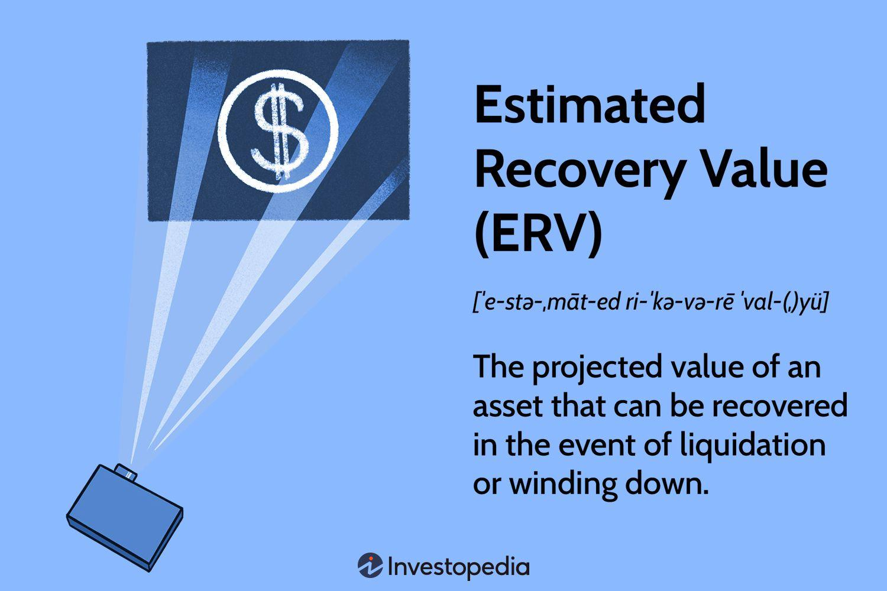

## Table of Contents

## What is Estimated Recovery Value (ERV)?

Estimated Recovery Value (ERV) is a term used in finance and insurance to describe the amount of money that can be expected to be recovered from an asset or a claim after it has been damaged or lost. It is an important figure for businesses and insurers because it helps them understand how much they might get back after an incident, which can affect their financial planning and decision-making.

For example, if a company owns a piece of machinery that gets damaged, the ERV would be the estimated amount they could get by selling the damaged machinery or the parts that can still be used. This value is often calculated by considering factors like the original cost of the asset, its current condition, market demand, and any potential costs involved in the recovery process. Knowing the ERV helps companies and insurers make informed decisions about whether to repair, replace, or sell off the damaged asset.

## Why is ERV important in financial analysis?

ERV, or Estimated Recovery Value, is important in financial analysis because it helps businesses and insurers figure out how much money they can get back after something goes wrong. When an asset like a machine or a building gets damaged, knowing the ERV helps them decide what to do next. Should they fix it, replace it, or sell what's left? This information is key for making smart choices about money.

Understanding ERV also helps in planning for the future. If a company knows how much they might recover from damaged assets, they can better prepare their budgets and financial strategies. This can affect how they manage risks and set aside money for unexpected events. By knowing the ERV, businesses can protect themselves better and make sure they are financially stable, even when things don't go as planned.

## How is ERV calculated?

Calculating the Estimated Recovery Value (ERV) involves looking at a few important things about the damaged asset. First, you need to know what the asset originally cost. This gives you a starting point. Then, you check the asset's current condition. If it's really damaged, the ERV might be lower. You also have to think about what people might pay for it now, even in its damaged state. This is called the market demand. If nobody wants to buy it, the ERV could be very low.

Next, you need to consider any costs you might have to pay to get the asset ready to sell or use again. These could be repair costs or fees for taking it apart to sell the pieces. Subtract these costs from what you think you can sell it for, and that gives you a good guess at the ERV. It's not an exact science, but by looking at these factors, you can come up with a number that helps you decide what to do with the damaged asset.

## What factors influence the ERV of an asset?

The ERV of an asset depends on a few key things. One is the original cost of the asset. If you know how much it cost when it was new, you can start to figure out its value now. Another big [factor](/wiki/factor-investing) is the current condition of the asset. If it's really damaged, the ERV will be lower because it's worth less to buyers. Market demand is also important. If a lot of people want to buy the asset, even if it's damaged, the ERV could be higher.

You also need to think about any costs to get the asset ready to sell or use again. These might be repair costs or fees to take it apart and sell the pieces. Subtracting these costs from what you think you can sell the asset for gives you the ERV. It's a bit of a guess, but by looking at these things, you can get a good idea of what the asset might be worth after it's been damaged.

## Can ERV be applied to both tangible and intangible assets?

Yes, ERV can be applied to both tangible and intangible assets. Tangible assets are things you can touch, like machines or buildings. If a machine gets damaged, you can figure out its ERV by looking at how much it cost new, its current condition, what people might pay for it now, and any costs to fix or sell it. This helps decide whether to repair it, replace it, or sell it for parts.

Intangible assets are things you can't touch, like patents or trademarks. If a patent gets damaged because of a legal issue, you can still calculate its ERV. You'd look at what it was worth before the issue, its current value, and any costs to fix the problem or sell the rights. Knowing the ERV helps businesses make smart choices about what to do with both kinds of assets, even when they're damaged or facing problems.

## How does ERV differ from other valuation metrics like book value or market value?

ERV, or Estimated Recovery Value, is different from other valuation metrics like book value and market value because it focuses on what an asset might be worth after it's been damaged or lost. Book value is what an asset is worth on a company's financial records, usually the original cost minus any depreciation. It doesn't consider what might happen if the asset gets damaged. Market value, on the other hand, is what someone would pay for the asset in its current condition, assuming it's not damaged. ERV, though, looks at what you could get back from a damaged asset, taking into account repair costs and what buyers might pay for it in its damaged state.

While book value and market value give you a picture of an asset's worth in normal situations, ERV is all about what happens when things go wrong. It's a more practical measure for businesses and insurers when they need to decide what to do with damaged assets. For example, if a machine breaks down, its book value might still show it as valuable, and its market value might be high if it were working, but its ERV would be lower because it's damaged and needs repairs or can only be sold for parts. This difference makes ERV a key tool for planning and decision-making in tough situations.

## What role does ERV play in bankruptcy proceedings?

In bankruptcy proceedings, ERV helps figure out how much money can be gotten back from a company's assets when it goes bankrupt. When a company can't pay its debts, it might have to sell off its things to pay back what it owes. ERV tells everyone how much those things might be worth, even if they're damaged or not working well. This helps decide if it's better to fix the assets, sell them as they are, or just sell the parts.

Knowing the ERV is important because it affects how much money creditors might get back. If the ERV is high, creditors might get more of their money back. If it's low, they might get less. This information helps everyone involved in the bankruptcy, like the court and the creditors, make better choices about what to do with the company's assets. It's a key part of figuring out the best way to handle the situation and make sure things are fair for everyone.

## How can ERV be used in strategic business decisions?

ERV can help businesses make smart choices about what to do with their damaged things. If a company knows how much they can get back from a broken machine or a damaged building, they can decide if it's better to fix it, buy a new one, or sell what's left. This helps them save money and use their resources in the best way possible. For example, if the ERV of a damaged machine is high, it might be worth fixing it instead of buying a new one. But if the ERV is low, selling it for parts might be the better choice.

Using ERV also helps companies plan for the future. If a business knows how much they might recover from damaged assets, they can set aside the right amount of money for unexpected problems. This can make their budgets more accurate and help them be ready for anything that might happen. By thinking about ERV, companies can make sure they're not caught off guard and can keep their business running smoothly, even when things go wrong.

## What are the common challenges faced when estimating ERV?

Estimating ERV can be tricky because there are a lot of things to think about. One big challenge is figuring out how much damage there is to the asset. If it's really messed up, it can be hard to guess what it might be worth. Another challenge is knowing what people might pay for it. The value can change a lot depending on if anyone wants to buy it, even if it's broken. Plus, you have to think about any costs to fix it or get it ready to sell, which can make the ERV go down.

Another problem is that the market can change quickly. What something is worth today might not be the same next week. This makes it hard to come up with a good guess for the ERV. Also, different people might have different ideas about what an asset is worth. An insurance company might see it one way, while a buyer might see it another way. All these things together can make it tough to get a clear picture of what the ERV really is.

## How does the accuracy of ERV impact investment decisions?

The accuracy of ERV is really important when making investment decisions. If you know the right ERV of a damaged asset, you can make better choices about whether to fix it, replace it, or sell it. If the ERV is wrong, you might spend too much money fixing something that isn't worth it, or you might miss out on selling it for a good price. Getting the ERV right helps investors use their money in the best way and avoid losing money on bad decisions.

Having a good idea of the ERV also helps investors plan for the future. If they know how much they can get back from damaged things, they can set aside the right amount of money for unexpected problems. This makes their budgets more accurate and helps them be ready for anything that might happen. By knowing the ERV, investors can make sure they're not caught off guard and can keep their investments strong, even when things go wrong.

## What advanced methodologies can be used to improve ERV estimates?

To get better ERV estimates, companies can use advanced methods like data analytics and [machine learning](/wiki/machine-learning). These tools can look at a lot of information at once, like past sales of similar damaged items, current market trends, and even how much it might cost to fix things. By using this data, they can come up with a more accurate guess about what a damaged asset might be worth. It's like having a super smart helper that can see patterns and make predictions based on a lot of different things.

Another way to improve ERV estimates is by using expert opinions and specialized software. Sometimes, it helps to talk to people who know a lot about the type of asset you're dealing with. They can give you good advice on what the asset might be worth. Special software can also help by doing complex calculations and taking into account things like depreciation and market demand. By combining these methods, businesses can get a clearer picture of the ERV and make better decisions about what to do with their damaged assets.

## How does ERV forecasting integrate with broader financial modeling techniques?

ERV forecasting fits into broader financial modeling by helping businesses predict how much money they might get back from damaged assets. This information is important for making budgets and planning for the future. When a company knows the ERV, they can use it in their financial models to see how much money they might lose if something goes wrong. This helps them set aside the right amount of money to cover unexpected problems and make sure their plans are realistic. By including ERV in their financial models, businesses can be better prepared for anything that might happen.

Using ERV in financial modeling also helps companies make smarter decisions about what to do with their assets. If a company can predict the ERV accurately, they can decide if it's better to fix a damaged machine, buy a new one, or sell what's left. This kind of planning helps them use their resources in the best way possible and avoid wasting money. By integrating ERV forecasting into their financial models, businesses can improve their overall strategy and make sure they're ready for both good times and bad.

## What is Defining Investment Valuation?

Investment valuation is the analytical process of determining the present value of an asset or company. This calculated valuation serves as a fundamental metric for investors, allowing them to make well-informed decisions about buying, selling, or holding investments. Several methods exist for valuating investments, with the choice of methodology largely depending on the type and nature of the asset as well as the availability and reliability of requisite data.

One of the most widely used methods is the Discounted Cash Flow (DCF) analysis. This approach estimates the value of an investment based on its expected future cash flows, which are adjusted for the time value of money. The DCF formula is expressed as:

$$

DCF = \sum \frac{CF_t}{(1 + r)^t} 
$$

where $CF_t$ represents the cash flow in year $t$, and $r$ is the discount rate. The primary goal is to ascertain how much an investment is worth today based on projections of how much revenue it will generate in the future.

Another popular method is Comparable Company Analysis (CCA), which involves comparing the target investment to similar companies in the industry. This method relies heavily on market-based metrics, such as price-to-earnings ratios, to assess the relative value of an investment.

Precedent Transactions Analysis is a third method, which involves reviewing historical transactions of similar companies to establish a value benchmark. This approach takes into consideration acquisition multiples and the circumstances at the time of each deal.

Each method offers different insights and may be suited to distinct scenarios. For instance, DCF analysis is useful for valuing companies with stable and predictable cash flows, while CCA and Precedent Transactions Analysis can offer insight for companies in industries with readily available market data.

Proper investment valuation is crucial, not only for potential investors but also for stakeholders like managers, creditors, and policy-makers, to ensure that resources are allocated efficiently and risks are minimized. The integration of precise valuation techniques, therefore, plays an integral role in the strategic decision-making process within financial markets.

## What is the Understanding of Estimated Recovery Value (ERV)?

Estimated Recovery Value (ERV) is a crucial metric used in financial assessments to evaluate the expected recoverable value of an asset during liquidation. It serves as an essential component in determining the potential financial recovery of assets that become subject to liquidation proceedings. ERV provides creditors and stakeholders with a quantifiable measure to assess potential losses and develop strategies for financial recovery.

The calculation of ERV involves a straightforward formula, where the expected recovery rate is multiplied by the book value of the asset. Mathematically, this can be expressed as:

$$
\text{ERV} = \text{Recovery Rate} \times \text{Book Value of Asset}
$$

- **Recovery Rate**: This is an estimate of the percentage of the asset's value that can be expected to be recovered during the liquidation process. The recovery rate can vary significantly depending on market conditions, asset type, and liquidation strategies.
- **Book Value of Asset**: This represents the value of the asset as recorded on the balance sheet. It reflects the historical cost of the asset minus any depreciation or amortization.

In practical terms, understanding ERV allows creditors to make informed decisions regarding their potential exposure to losses. For instance, in a scenario where an asset has a book value of $1,000,000 and an expected recovery rate of 60%, the ERV would be calculated as follows:

$$
\text{ERV} = 0.60 \times 1,000,000 = 600,000
$$

This means that creditors can expect to recover $600,000 from the asset during liquidation, allowing them to plan accordingly for potential financial adjustments.

The integration of ERV into financial analysis provides a clearer picture of an asset's risk profile, aiding in the development of more effective liquidation strategies. By offering a realistic assessment of recoverable values, ERV enables stakeholders to optimize decision-making processes, mitigate potential losses, and enhance the overall strategy for financial recovery in liquidation scenarios.

## References & Further Reading

[1]: Bergstra, J., Bardenet, R., Bengio, Y., & Kégl, B. (2011). ["Algorithms for Hyper-Parameter Optimization."](https://dl.acm.org/doi/10.5555/2986459.2986743) Advances in Neural Information Processing Systems 24.

[2]: ["Advances in Financial Machine Learning"](https://www.amazon.com/Advances-Financial-Machine-Learning-Marcos/dp/1119482089) by Marcos Lopez de Prado

[3]: ["Evidence-Based Technical Analysis: Applying the Scientific Method and Statistical Inference to Trading Signals"](https://www.amazon.com/Evidence-Based-Technical-Analysis-Scientific-Statistical/dp/0470008741) by David Aronson

[4]: ["Machine Learning for Algorithmic Trading"](https://github.com/stefan-jansen/machine-learning-for-trading) by Stefan Jansen

[5]: ["Quantitative Trading: How to Build Your Own Algorithmic Trading Business"](https://www.amazon.com/Quantitative-Trading-Build-Algorithmic-Business/dp/1119800064) by Ernest P. Chan