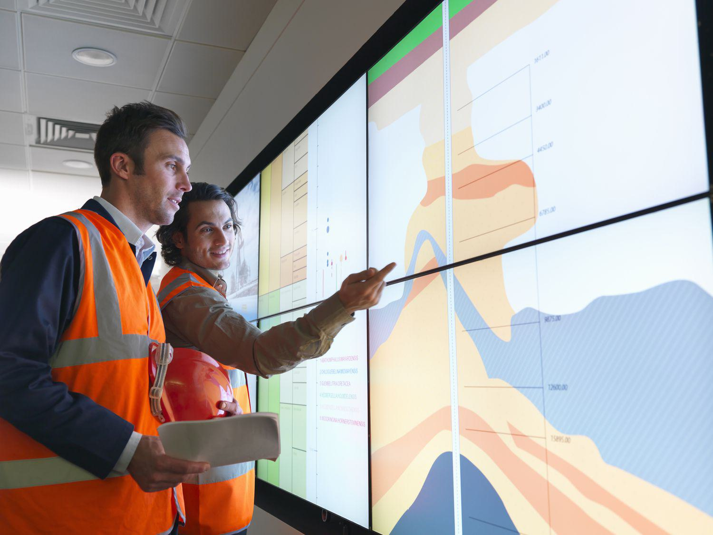

The oil and gas industry plays a pivotal role in the global energy landscape, providing the primary energy source for countless applications worldwide. Ensuring the efficient management of its reserves is fundamental to sustaining the industry's productivity and meeting the burgeoning energy demands. A key concept in this domain is the Estimated Ultimate Recovery (EUR), a metric essential for assessing the total volume of hydrocarbons that can be economically retrieved from a reservoir. It is indispensable for appraising the value and potential output of oil and gas reserves.

EUR estimation serves as a cornerstone for making informed investment decisions and determining project feasibility within the industry. As the industry evolves, integrating modern technology and algorithmic trading becomes crucial. Algorithmic trading leverages advanced computational models to make automated, data-driven trading decisions. Applied to the oil and gas sector, these technologies can substantially improve the precision and accuracy of EUR calculations. By analyzing vast datasets, algorithmic trading and technological optimizations stand to revolutionize how reserves are evaluated and managed.



This article evaluates the synergy between Estimated Ultimate Recovery metrics and algorithmic trading in the oil and gas industry. This intersection is vital for optimizing resource management, enhancing financial forecasting, and ensuring sustainable operational outcomes in a sector critical to global energy supply.

## Table of Contents

## Understanding Estimated Ultimate Recovery (EUR)

Estimated Ultimate Recovery (EUR) refers to the total [volume](/wiki/volume-trading-strategy) of hydrocarbons anticipated to be economically recoverable from a reservoir's life span, under prevailing economic and operational conditions. This metric serves as a guiding quantitative measure for assessing the potential output from an oil or gas field. Accurate EUR estimations are imperative in the oil and gas industry as they shape investment strategies, dictate the economic feasibility of exploration and production activities, and influence the overall project viability.

EUR is generally classified into three main categories: Proven, Probable, and Possible reserves. Proven reserves are those with a high degree of certainty (usually 90% probability) of being recoverable under existing economic and operation conditions. These reserves are often confirmed through actual production and supporting geological and engineering data. Probable reserves have a lower certainty (at least 50% probability) and are often contingent on favorable economic or technological conditions. Possible reserves have the lowest certainty (around 10% probability) and are dependent on hypothetical minimal favorable conditions.

For investors and stakeholders, precise EUR estimation is crucial. It affects project financing, as underestimated or overestimated EUR figures will lead to inappropriate capital allocation. A more accurate estimation enables better risk assessment and management, helping to align projects with realistic production forecasts. This is particularly important in contexts where fluctuating oil prices and technological advancements can dramatically alter the economic viability of a project.

Several techniques can be employed to enhance the accuracy of EUR calculations. These include Decline Curve Analysis (DCA), which involves projecting future production based on historical output data, and Reservoir Simulation models that leverage complex geological, fluid, and production data to predict future recovery. Technological advancements, including big data analytics and [machine learning](/wiki/machine-learning) algorithms, are increasingly being used to refine these methods, allowing for more precise and adaptable EUR assessments tailored to dynamic market and operational conditions. 

In essence, EUR is a vital component of resource management in the oil and gas sector, guiding economic evaluations and strategic decision-making processes.

## Significance of EUR in the Oil and Gas Industry

Estimated Ultimate Recovery (EUR) plays a pivotal role in the oil and gas industry, primarily by aiding in the assessment of the potential profitability and lifespan of oil and gas fields. By providing an estimate of the total recoverable hydrocarbons, EUR serves as a foundational metric that influences various strategic and operational aspects of the industry.

One of the key influences of EUR is on strategic planning. Oil and gas companies rely on EUR estimates to determine the viability of developing new fields or enhancing existing ones. The estimation of recoverable resources directly impacts decisions regarding the allocation of capital and operational resources, ensuring that investments are directed towards fields with favorable recovery prospects and economic potential.

Asset valuation is another area where EUR holds significant sway. The value of oil and gas reserves on a company's balance sheet is largely determined by the estimated volumes recoverable as indicated by EUR. Accurate EUR estimates enable more precise asset valuation, which in turn affects the financial health of the company and can influence mergers, acquisitions, and investment activities in the sector.

Moreover, EUR influences regulatory compliance. Governments and regulatory bodies often require oil and gas companies to report their reserves based on standardized classifications, such as Proven, Probable, and Possible reserves. The certainty levels associated with these classifications help in understanding the likelihood of recovery, impacting both licensing and taxation strategies. As such, reliable EUR estimates ensure that companies comply with reporting standards and avoid potential legal and financial penalties.

Technological advancements and fluctuating market conditions can lead to the reclassification of reserves. Enhanced recovery technologies, such as hydraulic fracturing and advanced drilling techniques, can transform previously uneconomical resources into viable reserves, thereby affecting EUR estimates. Economic factors such as oil prices also play a role, as they can alter the economic recoverability threshold, prompting a reassessment and possible reclassification of reserves. 

In essence, EUR serves as a critical indicator of economic viability and operational potential in the oil and gas industry, guiding companies in strategic decision-making and ensuring adherence to regulatory standards. Its integration with emerging technologies and adaptation to market dynamics positions it as an indispensable tool for the effective management and exploitation of energy resources.

## Algorithmic Trading in Oil and Gas

Algorithmic trading has become increasingly influential in the oil and gas industry, employing sophisticated computing models to automate the buying and selling of commodities. This approach leverages large volumes of data and enhances the speed and precision of trading activities, thus promoting operational efficiency. 

In the oil and gas sector, [algorithmic trading](/wiki/algorithmic-trading) can optimize exploration and production forecasts by processing diverse data sets, including geological information, market trends, and historical production figures. These forecasts are critical for the strategic planning of exploration and extraction operations. By automating these processes, companies can react more swiftly to market changes and make informed decisions regarding resource allocation and investment.

The integration of historical data with predictive analytics is a cornerstone of algorithmic trading in this industry. Predictive models utilize historical price data, output metrics, and other relevant variables to forecast future market movements and resource needs. A basic example can be demonstrated using a Python-based linear regression model to predict future pricing trends, as shown below:

```python
import numpy as np
from sklearn.linear_model import LinearRegression

# Example historical data (price per barrel over time)
time = np.array([1, 2, 3, 4, 5, 6, 7, 8, 9, 10]).reshape(-1, 1)
price = np.array([50, 55, 53, 58, 60, 57, 65, 68, 66, 70])

# Create and train the model
model = LinearRegression()
model.fit(time, price)

# Forecasting
future_time = np.array([11, 12, 13]).reshape(-1, 1)
predicted_price = model.predict(future_time)

print(predicted_price)
```

Through such applications, algorithmic trading allows companies to improve their decision-making processes by providing a clearer understanding of potential market scenarios. The ability to predict price movements and adjust trading strategies accordingly can result in more profitable operations, aligning with the economic goals of stakeholders.

Thus, algorithmic trading is not merely a tool for financial transactions; it has become integral to optimizing resource extraction and managing risks associated with market [volatility](/wiki/volatility-trading-strategies). This technological integration represents a progressive step toward more sustainable and economically viable operations within the oil and gas industry.

## The Role of Technology in EUR Calculation

Modern technology plays a pivotal role in enhancing the accuracy of Estimated Ultimate Recovery (EUR) calculations in the oil and gas industry. Tools like Decline Curve Analysis (DCA) and Reservoir Simulation are integral to this process.

Decline Curve Analysis is a method that estimates future oil and gas production based on historical production data. This technique involves plotting production data over time and fitting it to a decline curve model. The most widely used models are the Exponential, Hyperbolic, and Harmonic decline models. A common formula used in DCA is the Arps’ equation for the Hyperbolic decline:

$$

q_t = q_i \left(1 + b D_i t \right)^{-1/b} 
$$

where:
- $q_t$ is the production rate at time $t$,
- $q_i$ is the initial production rate,
- $b$ is the decline curve exponent,
- $D_i$ is the initial decline rate.

Reservoir Simulation is another technology that enhances EUR accuracy by modeling the behavior of fluids within a reservoir. It uses complex mathematical algorithms and geological models to simulate fluid flow and pressure changes, allowing for the estimation of recoverable resources. These simulations can be adjusted as new data becomes available, ensuring that EUR calculations are as accurate as possible.

The integration of big data and Artificial Intelligence (AI) algorithms further refines these processes. AI techniques, such as machine learning, help in processing vast amounts of geological and production data to identify patterns and trends that may not be immediately apparent through traditional analysis methods. For instance, predictive analytics can be employed to forecast reservoir performance and improve EUR estimates. This can be achieved using Python libraries such as scikit-learn or TensorFlow for implementing machine learning algorithms.

Moreover, technological tools facilitate the continuous adjustment of EUR estimates based on real-time data and market fluctuations. This adaptability is crucial for maintaining the economic viability of oil and gas projects, as market conditions and technological advancements can significantly alter the recoverable volumes.

Software platforms like Petrel and Eclipse are widely used for reservoir simulation and management, enabling companies to visualize subsurface structures in 3D and make data-driven decisions. These tools not only enhance the precision of EUR calculation but also assist in optimizing recovery strategies, ensuring that the maximum amount of resources are extracted efficiently.

In sum, the integration of advanced software tools, big data, and AI technologies is transforming EUR calculation into a dynamic and precise process, better aligned with the demands of the modern energy sector.

## Challenges and Opportunities

Challenges in estimating Estimated Ultimate Recovery (EUR) are multifaceted, principally involving data quality, economic uncertainties, and the rapid evolution of technologies. The accuracy of EUR calculations fundamentally depends on the quality and precision of geological and production data. However, these data may be incomplete, corrupted, or subject to significant noise, which can lead to unreliable results. Collecting high-quality data requires substantial investment in advanced sensing technologies and rigorous quality control procedures, which can be both costly and resource-intensive.

Economic uncertainties also pose significant challenges to EUR estimation. Fluctuations in oil prices, changes in regulatory frameworks, and geopolitical tensions can significantly impact the profitability and viability of oil and gas projects. These uncertainties make it difficult to predict future market conditions and, hence, affect investment decisions related to the development of oil and gas fields. 

The rapid pace of technological advancement is another challenge. While new technologies offer the potential for more accurate EUR estimation, they also require ongoing investment in training and system upgrades. The integration of innovative technologies such as [artificial intelligence](/wiki/ai-artificial-intelligence) (AI) and machine learning (ML) into existing processes can be complex and demands a workforce with specialized skills. Furthermore, technological obsolescence can render previous investments in systems and tools less effective over time.

Despite these challenges, significant opportunities exist for enhancing EUR estimation. Leveraging technology is central to these opportunities. For instance, advancements in AI and ML enable the processing of vast datasets to discern patterns and relationship insights that would be impractical through traditional methods. Sophisticated algorithms can optimize resource recovery by refining reservoir models and production forecasts, thus contributing to more precise EUR estimates. 

Collaboration is crucial in harnessing these technological advancements effectively. The complex nature of EUR estimation calls for interdisciplinary cooperation among technologists, geologists, and financial analysts. This cooperation ensures that technological solutions are grounded in robust geological understanding and are economically viable. By working together, these experts can develop integrated approaches that enhance the accuracy of reserve assessments and optimize resource extraction strategies.

In conclusion, while challenges in EUR estimation are substantial, particularly concerning data quality, economic uncertainties, and technology evolution, they are complemented by opportunities rooted in technological advancements and collaboration. Embracing these opportunities can lead to more precise EUR estimates and optimized resource management, driving better strategic decisions and improved profitability in the oil and gas sector.

## Conclusion

Estimated Ultimate Recovery (EUR) is a critical component in the evaluation and management of oil and gas reserves, serving as a foundational metric for determining the feasible extraction quantities of hydrocarbons. The accurate assessment of EUR not only aids in forecasting the potential profitability of oil and gas fields but also provides valuable insights into the optimal lifespan of these reserves. As market conditions and technological capabilities evolve, so too must the methods employed in calculating EUR, thereby necessitating an adaptive approach to reserve evaluation.

The integration of algorithmic trading into EUR estimation presents a promising pathway for enhancing resource management within the oil and gas industry. By employing advanced computational models to analyze extensive datasets, companies can achieve a higher precision in predicting exploration and production outcomes. Algorithmic trading facilitates the automation of buying and selling decisions, optimizing these operations in alignment with real-time market dynamics. This synergy between EUR estimation and algorithmic trading not only enhances the accuracy of reserve calculations but also optimizes the overall supply chain, potentially leading to more strategic, data-driven decisions.

Moreover, the effective integration of technology into EUR estimation processes can significantly improve profitability across the oil and gas sector. By leveraging tools such as big data analytics and artificial intelligence, stakeholders are equipped to handle the complexities associated with geological variability and market fluctuations. These technologies enable the rapid processing and interpretation of geological and production data, allowing for continuous refinement of EUR predictions. Consequently, stakeholders are positioned to implement strategic decisions that reflect both current reserve evaluations and anticipated market trends, ultimately fostering a more resilient and profitable industry landscape.

## References & Further Reading

[1]: Ahmed, U. (2017). ["Machine Learning: Trends, Perspectives, and Prospects."](https://www.science.org/doi/10.1126/science.aaa8415) Neural Networks, Elsevier.

[2]: "SPE-204155-MS: Application of Machine Learning Techniques for EUR Estimation." Society of Petroleum Engineers.

[3]: Zhang, D. (2001). ["Oil and Gas Reservoir Estimation via Numerical Simulation and Model Based Learning."](https://www.researchgate.net/publication/379000387_Reservoir_Modeling_Simulation_Advancements_Challenges_and_Future_Perspectives) Springer.

[4]: ["Uncertainty Analysis in Reservoir Modeling: A Practical Guide to Statistical Analysis and Modeling of Uncertainty."](https://link.springer.com/referenceworkentry/10.1007/978-3-319-02330-4_234-1) by Y. Jin.

[5]: Geman, H. (2005). ["Commodities and Commodity Derivatives: Modelling and Pricing for Agriculturals, Metals, and Energy."](https://download.e-bookshelf.de/download/0000/5675/90/L-G-0000567590-0015270354.pdf) John Wiley & Sons.

[6]: "Introduction to Petroleum Geology and Geophysics." ["Geophysical Methods in Petroleum Exploration."](https://www.academia.edu/8117172/Introduction_to_Petroleum_Geology_and_Geophysics) Norwegian Geotechnical Institute. 

[7]: Peters, E.J., & Pence, R.F. (2012). ["Introduction to Stellar Structure and Evolution."](https://assets.cambridge.org/97811088/35817/frontmatter/9781108835817_frontmatter.pdf) Springer.