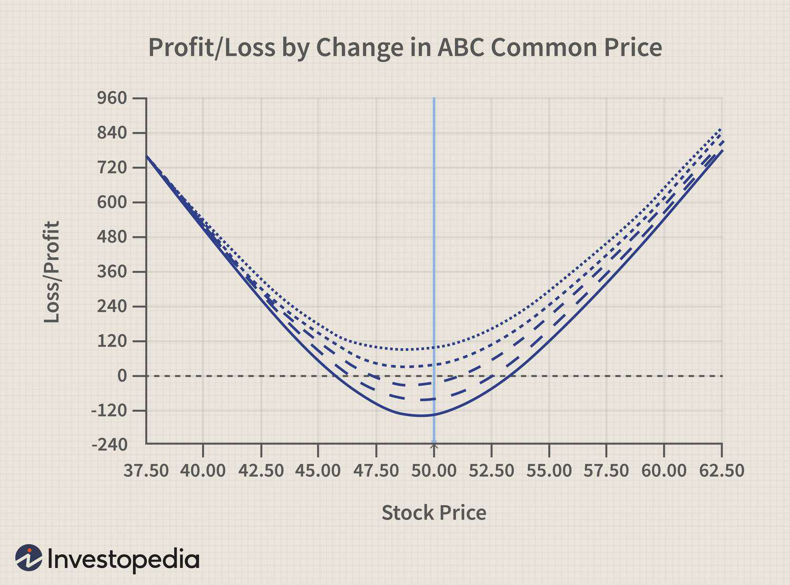

Financial analysis serves as a cornerstone for successful trading operations, offering critical insights into the viability and potential profitability of investment opportunities. In the competitive environment of financial markets, the ability to effectively analyze and interpret financial data ensures that traders and investors can make informed decisions, balancing both profit potential and risk management. These two factors, profit potential and risk management, are integral to making strategic choices that align with long-term financial goals.

The increasing integration of algorithmic trading in financial markets underscores the need for robust financial analysis. Algorithms, by their design, operate on financial data in real-time to execute trades with precision and speed beyond human capacity. They optimize profit and mitigate risk through complex computations and predefined trading strategies. This has transformed market dynamics, offering traders opportunities for better efficiency and efficacy in executing trades.



Another vital aspect of diversified trading strategies is options trading. This involves contracts that give traders the right, but not the obligation, to buy or sell an underlying asset at a predetermined price, allowing for strategic positioning to manage risk and leverage. The versatility of options can enable traders to devise various profit strategies, from hedging to speculation, enhancing profit potential while managing associated risks.

As we progress, this article will explore how financial analysis, profit potential, risk management, algorithmic trading, and options trading interplay to provide strategic advantages in the financial markets. Each topic will be dissected to understand its impact on profit optimization, aiming to equip traders with the knowledge required to maximize their success.

## Table of Contents

## Understanding Financial Analysis

Financial analysis is a vital process in evaluating the viability, stability, and profitability of investment opportunities. It involves examining financial data to understand a company's past performance, current standing, and future prospects, thereby enabling informed decision-making for traders and investors. One of its essential roles is in identifying undervalued securities, ensuring efficient resource allocation, and predicting financial outcomes.

Key components of financial analysis include financial statements, ratios, and trends. Financial statements, such as balance sheets, income statements, and cash flow statements, serve as foundational documents that provide a comprehensive snapshot of a company’s financial health. The balance sheet reveals a company's assets, liabilities, and equity at a specific point in time, while the income statement shows the company's revenues and expenses over a period, culminating in net profit or loss. The cash flow statement, on the other hand, reflects the cash generated and used during the period.

Ratios are crucial tools for comparing and analyzing financial data. Commonly used ratios include:

1. **Liquidity Ratios**: Measure a company's ability to meet short-term obligations (e.g., Current Ratio = Current Assets / Current Liabilities).
2. **Profitability Ratios**: Assess a company's ability to generate earnings relative to its revenue, assets, or equity (e.g., Return on Equity = Net Income / Shareholder's Equity).
3. **Leverage Ratios**: Evaluate the extent of a company's financial obligations relative to its equity (e.g., Debt to Equity Ratio = Total Debt / Total Equity).

Analyzing trends involves reviewing historical data to identify patterns or anomalies that could indicate future financial performance. Trend analysis can reveal growth patterns, cyclical fluctuations, or deteriorating conditions, providing a context for forecasting future financial outcomes.

Incorporating graphs and visual tools in financial analysis enhances the ability to interpret complex data sets. Graphical data representation such as line charts, bar graphs, and pie charts allows for a more intuitive understanding of financial trends, performance metrics, and comparative analyses. These visual tools assist traders and investors in quickly identifying opportunities and risks, making it easier to recognize trends and patterns that might not be immediately evident through numerical data alone.

For example, a line graph could depict a company's revenue growth over time, allowing an investor to visually assess whether the company is on a steady growth path. Similarly, a pie chart might be used to represent the distribution of expenses across different operations, highlighting areas of significant cost.

In summary, financial analysis is indispensable in shaping the investment decisions of traders and investors. By providing insights through financial statements, ratios, trends, and visualizations, it enables market participants to evaluate a company's financial standing effectively, thereby supporting strategic investment decisions aligned with their risk and return objectives.

## Profit Potential in Trading

Profit potential refers to the anticipated financial gain that can be achieved from a trading activity, rooted in the difference between the cost of investment and the expected revenue generated. This concept is crucial for traders as it directly influences their decision-making processes regarding which assets to buy, hold, or sell.

To assess profit potential in financial markets, traders employ various methodologies and metrics. One common method is [fundamental analysis](/wiki/fundamental-analysis), which evaluates a security’s intrinsic value by examining related economic, financial, and other qualitative and quantitative factors. Key metrics used in this analysis include earnings per share (EPS), price-to-earnings (P/E) ratio, and return on equity (ROE). Another vital approach is technical analysis, focusing on statistical trends gathered from trading activity, such as price movement and [volume](/wiki/volume-trading-strategy). Indicators like moving averages, relative strength index (RSI), and Bollinger Bands are often utilized to gauge potential price movements and profit opportunities.

High profit potential scenarios are typically characterized by certain indicators and market conditions. For instance, a stock that is significantly undervalued compared to its intrinsic value, or a company with rapidly growing revenues and profits that are not yet reflected in its stock price, may present high profit potential. Market inefficiencies, such as [arbitrage](/wiki/arbitrage) opportunities across different exchanges or markets, also offer lucrative profit potential.

To optimize profit potential, strategic trading decisions must be made. This involves a blend of analysis, risk management, and timing. Implementing a robust trading strategy that combines both fundamental and technical analysis can enhance a trader's ability to maximize profit. For instance, traders might employ a [momentum](/wiki/momentum) trading strategy, capitalizing on trends to buy assets that are on an uptrend and short-sell those on a downtrend, adjusting based on market signals to [exit](/wiki/exit-strategy) positions profitably.

Moreover, diversifying one’s investment portfolio across a mix of asset types and geographical locations can also optimize profit potential by mitigating risks and capitalizing on various market opportunities. Additionally, leveraging advanced [algorithmic trading](/wiki/algorithmic-trading) platforms can significantly enhance profit potential by automating trades, back-testing strategies, and quickly executing orders to capitalize on fleeting market conditions.

In conclusion, understanding and maximizing profit potential is foundational to successful trading. By employing comprehensive analysis techniques and strategic decision-making, traders can effectively optimize profits while managing associated risks.

## Exploring Options Trading

Options trading is a versatile and complex financial instrument within the trading landscape. At its core, options are contracts that grant the holder the right, but not the obligation, to buy or sell an underlying asset at a predetermined price, known as the strike price, on or before a specified expiration date. There are two primary types of options: calls and puts. A call option provides the holder the right to purchase the asset, whereas a put option grants the right to sell.

Options can be strategically employed to manage risk and leverage positions. They serve as a risk mitigation tool by allowing traders to hedge against potential adverse movements in the market. For example, an investor holding a diversified portfolio might purchase put options as insurance against a potential downturn, effectively setting a floor price on their assets. Conversely, leveraging can be achieved by using options to gain exposure to an underlying asset with a relatively smaller investment than directly purchasing the asset, thanks to the inherent leverage of options contracts.

The potential benefits and profit strategies within options trading are manifold. One common strategy is the covered call, where a trader holds a long position in an asset and sells call options on the same asset to generate income from option premiums. This strategy might limit profit potential if the asset's price surges, but it generates steady income when the asset remains flat or slightly appreciates. Another strategy is the protective put, which serves as a hedge and involves purchasing a put option for an asset already owned, thus capping the potential downside risk.

For instance, assume a trader owns 100 shares of a stock currently valued at $50 per share and anticipates market [volatility](/wiki/volatility-trading-strategies). By purchasing a put option with a strike price of $48 for a premium of $2 per share, the trader limits potential losses to $4 per share ($50 - $48 + $2). This is a classic case of a protective put strategy.

Additionally, more advanced strategies, such as the iron condor, involve multiple options contracts and are designed to capitalize on low-volatility markets by profiting from time decay and stable price patterns. This strategy combines two vertical spreads: a bull put spread and a bear call spread.

Real-world examples of successful options trading strategies include the use of straddles and strangles before major earnings announcements. These strategies involve purchasing both call and put options to profit from significant price movements, providing the trader with a hedge against forecast errors.

Options trading, with its distinct characteristics, offers opportunities for managing risk and optimizing returns. It requires a profound understanding of market dynamics and strategic planning, underscoring the importance of using options judiciously to enhance trading portfolios.

## Risk Management and Assessment

Risk management in financial trading involves identifying, analyzing, and mitigating uncertainties in investment decisions to minimize potential losses and enhance returns. It is essential for preserving capital and ensuring long-term financial success. Effective risk management can significantly affect a trader's profit potential, given that markets are inherently unpredictable.

To conduct effective risk assessment, traders and investors utilize a variety of tools and techniques. One common approach is the use of Value at Risk (VaR), which estimates the maximum potential loss over a specific time period at a given confidence level. Such statistical measures equip traders with insights into potential downside risks.

Another powerful tool is scenario analysis, where traders project different market conditions and evaluate how their portfolios might perform in each scenario. This allows them to understand the possible outcomes under adverse circumstances. Stress testing, which simulates extreme market conditions, further aids in evaluating the resilience of trading strategies.

Options and derivatives are often employed to hedge against potential losses. By using options contracts, traders can lock in prices or insure against large price movements. Techniques like stop-loss orders also serve as automated triggers to sell an asset when it falls below a specific price, thus limiting potential losses.

Understanding and assessing risk directly impacts profit potential. A well-calibrated risk management strategy ensures that traders do not expose themselves to excessive risks that could lead to significant losses. As a result, it creates a more stable platform for achieving consistent returns.

Balancing risk and reward involves considering the risk-reward ratio, which helps manage trades by comparing the potential profit of a trade to the potential loss. A commonly used strategy is ensuring that the potential reward outweighs the risk, often seeking a ratio of at least 2:1.

Incorporating diversification within a portfolio is another strategy to balance risk and reward. By spreading investments across various assets, traders can reduce the impact of adverse movements in any single asset. Finally, regularly reviewing and adjusting trading strategies based on market conditions and performance is crucial in maintaining an optimal balance between risk and reward.

In summary, effective risk management and assessment are vital components in financial trading that not only protect traders from potential losses but also enhance their ability to achieve profit potential. The consistent application of these principles, supported by robust tools and strategic planning, leads to sustained success in trading activities.

## The Role of Algorithms in Trading

Algorithmic trading, often referred to as algo-trading, is the use of computer programs to automate the execution of trading strategies. These programs make decisions to buy or sell financial instruments on financial markets by analyzing market data according to a set of pre-defined rules. The advent of algorithmic trading has significantly transformed the landscape of trading, introducing efficiencies and complexities alike.

Algorithms are designed to optimize profit and minimize risk by exploiting various market opportunities in real time. They do this by analyzing large volumes of market data for detecting trading signals, implementing [statistical arbitrage](/wiki/statistical-arbitrage), and executing trades at optimal prices. Algorithms can ensure faster execution at lower transaction costs, thereby facilitating high-frequency trading ([HFT](/wiki/high-frequency-trading-strategies)). For example, a trading algorithm might be designed to execute trades when a stock's price deviates from its moving average by a certain threshold, maximizing the probability of executing profitable trades while minimizing losses.

The impact of algorithmic trading on market dynamics and efficiency is profound. By executing trades at high speeds, algorithmic trading contributes to market [liquidity](/wiki/liquidity-risk-premium), making it easier for market participants to buy and sell securities. Additionally, algo-trading can enhance market efficiency by quickly correcting mispricings. However, these positive effects may be counterbalanced by potential risks, such as heightened market volatility and the exacerbation of flash crashes, where rapid sell-offs create temporary market collapses.

Ethical considerations and regulatory aspects are critical in the context of algorithmic trading. The use of algorithms raises concerns about market manipulation, fairness, and transparency. Regulators worldwide, such as the U.S. Securities and Exchange Commission (SEC) and the European Securities and Markets Authority (ESMA), have implemented guidelines to monitor and regulate algorithmic trading activities. These regulations aim to ensure algorithms do not engage in market manipulation or exacerbate systemic risks. For instance, firms engaged in algo-trading might need to maintain pre-trade risk controls and undergo regular assessments to mitigate potential dangers associated with automated trading systems. 

The responsibility of constructing ethically responsible algorithms that align with regulatory standards is incumbent upon developers and financial institutions. In addition, the constant evolution of technology necessitates ongoing scrutiny and adaptation of regulations to address new challenges posed by innovations in algorithmic trading.

## Utilizing Graphs in Financial Analysis

Graphical data representation plays a pivotal role in financial analysis, offering traders and investors a visual interpretation of complex datasets. This technique simplifies the decision-making process by highlighting key patterns and trends that might not be immediately evident from raw data alone. 

There are several common types of financial graphs that serve distinct purposes. Line graphs, for example, are frequently used to display historical price movements over time, providing a clear depiction of trends and facilitating comparative analysis between different assets. Bar charts and candlestick charts, on the other hand, are primarily used in technical analysis to represent price movements within a specific period, showcasing opening and closing prices, as well as highs and lows. These types of charts are essential for traders analyzing short-term price patterns and market sentiment.

Graphs aid traders and investors by unveiling trends and cyclical patterns, crucial for making informed decisions. For instance, moving averages superimposed on these charts can smooth out price data to identify the direction of a trend, offering buy or sell signals. Similarly, volume graphs can indicate the strength of a price movement; high volumes may suggest a strong trend, whereas low volumes might signal a potential reversal.

Moreover, using graphs for statistical analysis, traders can enhance their trading strategies. The Relative Strength Index (RSI) is often plotted as a line graph to illustrate overbought or oversold conditions in the market. Python libraries like Matplotlib and Pandas can be employed to create such graphical representations:

```python
import matplotlib.pyplot as plt
import pandas as pd

# Example of creating a simple line graph for a stock's closing prices
data = pd.read_csv('stock_data.csv')  # Assuming a CSV with a 'Date' and 'Close' column
data['Date'] = pd.to_datetime(data['Date'])
plt.figure(figsize=(10, 5))
plt.plot(data['Date'], data['Close'], label="Closing Price")
plt.title("Stock Closing Prices Over Time")
plt.xlabel("Date")
plt.ylabel("Closing Price")
plt.legend()
plt.show()
```

By providing a visual context, graphs not only make data more accessible but also enable traders to spot critical points of interest, such as resistance and support levels. This can significantly enhance trading decisions, allowing for more precise entry and exit points and better risk management. 

In conclusion, graphical analysis is an indispensable tool in financial analysis, empowering traders and investors to decipher complex data, detect significant trends, and optimize trading strategies effectively.

## Conclusion

The interconnectedness of financial analysis, profit potential, risk, and trading strategies is vital for successful trading in modern financial markets. Financial analysis provides the foundational understanding needed to evaluate investment opportunities, highlighting potential gains and identifying lurking risks. It aids traders and investors in making informed decisions by offering insights into financial statements, ratios, and trends. The assessment of profit potential, a metric crucial to traders, is enhanced by strategic decision-making informed by thorough financial analysis, ensuring that trading activities align with profit objectives.

The growing role of algorithmic trading underscores the importance of incorporating advanced tools to optimize efficiency. Algorithms are designed to process vast amounts of data at high speeds, identifying patterns and executing trades with precision. This technology allows traders to make data-driven decisions and manage risk more effectively, minimizing the latency in trade execution and potentially increasing profit margins. By leveraging algorithms, traders can respond to market changes in real time, thus optimizing opportunities for profit while keeping risks in check.

In the continuously evolving world of trading, continual learning and adaptation to new technologies and strategies are essential. The financial markets are dynamic, with technological advancements and innovative trading strategies constantly emerging. Traders who stay informed about these changes and skillfully integrate them into their strategies can maintain a competitive edge. Embracing new tools and methodologies not only enhances trading performance but also prepares traders to navigate complexities within the financial landscape effectively.

To conclude, balancing profit aspirations with risk management is paramount. While the pursuit of profit drives trading activities, understanding and mitigating risks ensures long-term sustainability in the markets. A balanced approach that incorporates financial analysis, strategic decision-making, and the use of advanced technologies like algorithmic trading will likely yield the best results for traders. This equilibrium allows traders to maximize their profit potential while safeguarding against excessive losses, aligning their activities with both short-term gains and long-term financial goals.

## References & Further Reading

[1]: ["Options, Futures, and Other Derivatives"](https://www.amazon.com/Options-Futures-Other-Derivatives-9th/dp/0133456315) by John C. Hull

[2]: ["Algorithmic Trading: Winning Strategies and Their Rationale"](https://books.google.com/books/about/Algorithmic_Trading.html?id=WAlFDwAAQBAJ) by Ernie Chan

[3]: Lo, A. W., & Hasanhodzic, J. (2011). ["The Evolution of Technical Analysis: Financial Prediction from Babylonian Tablets to Bloomberg Terminals."](https://archive.org/details/evolutionoftechn0000loan) Wiley.

[4]: Bergstra, J., Bardenet, R., Bengio, Y., & Kégl, B. (2011). ["Algorithms for Hyper-Parameter Optimization."](https://dl.acm.org/doi/10.5555/2986459.2986743) Advances in Neural Information Processing Systems 24.

[5]: ["Advances in Financial Machine Learning"](https://www.amazon.com/Advances-Financial-Machine-Learning-Marcos/dp/1119482089) by Marcos Lopez de Prado

[6]: ["Evidence-Based Technical Analysis: Applying the Scientific Method and Statistical Inference to Trading Signals"](https://www.amazon.com/Evidence-Based-Technical-Analysis-Scientific-Statistical/dp/0470008741) by David Aronson

[7]: ["Quantitative Trading: How to Build Your Own Algorithmic Trading Business"](https://www.amazon.com/Quantitative-Trading-Build-Algorithmic-Business/dp/1119800064) by Ernest P. Chan

[8]: Black, F., & Scholes, M. (1973). ["The Pricing of Options and Corporate Liabilities."](https://www.cs.princeton.edu/courses/archive/fall09/cos323/papers/black_scholes73.pdf) Journal of Political Economy.