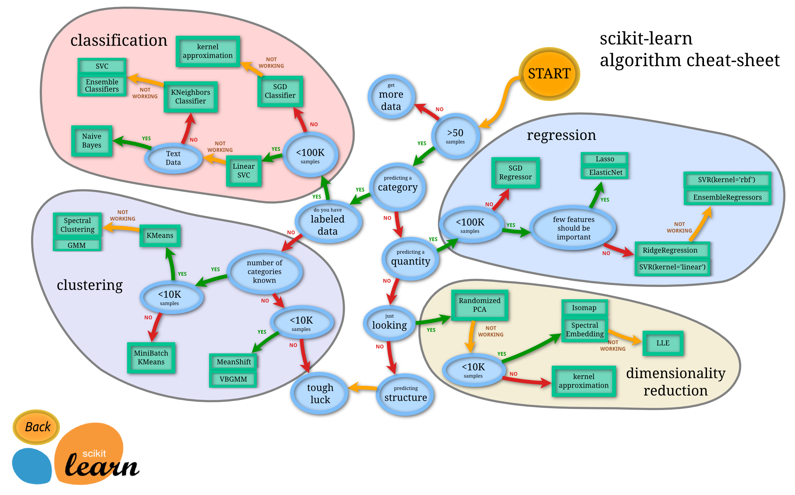

## Table of Contents

## What is an estimator in machine learning?

An estimator in machine learning is a method or algorithm used to estimate the values of parameters in a model based on the data it is given. Think of it like trying to guess the average height of all people in a city by measuring the height of a few people. The estimator uses the data it has to make the best guess about the model's parameters, which can then be used to make predictions or decisions.

Estimators are important because they help us build models that can learn from data. For example, if we want to predict house prices, an estimator might look at past house sales data to estimate how factors like size and location affect price. The quality of an estimator is often judged by how close its estimates are to the true values, and how consistent its estimates are when given different sets of data.

## How does an estimator differ from a model in machine learning?

In machine learning, a model is like a blueprint or a set of rules that helps make predictions or decisions based on data. It's the overall structure that defines how inputs are transformed into outputs. For example, a model might be a simple linear equation like $$y = mx + b$$, where $$m$$ and $$b$$ are parameters that need to be figured out.

An estimator, on the other hand, is the tool or method used to find the best values for the parameters in the model. It's like a detective that looks at the data and tries to guess the right numbers for $$m$$ and $$b$$ in our linear equation example. The estimator uses the data to adjust the model's parameters until it finds the values that make the model's predictions as accurate as possible.

So, while a model is the framework that makes predictions, an estimator is the process that helps the model learn from the data. The model gives us the "what" - what the structure looks like, and the estimator gives us the "how" - how to find the best settings for the model to work well.

## What are the main types of estimators used in machine learning?

In [machine learning](/wiki/machine-learning), there are mainly two types of estimators: parametric and non-parametric. Parametric estimators assume that the data follows a specific type of model with a fixed number of parameters. For example, if you're trying to predict house prices, a parametric estimator might use a simple linear model like $$y = mx + b$$, where $$m$$ and $$b$$ are the parameters that need to be estimated from the data. These estimators are great when you have a good idea about the shape of the relationship between your inputs and outputs.

Non-parametric estimators, on the other hand, don't make any assumptions about the model's structure. Instead, they let the data itself guide the shape of the model. A common example of a non-parametric estimator is k-nearest neighbors (k-NN), which predicts the output for a new data point by looking at the outputs of its closest neighbors in the training data. These estimators are flexible and can capture complex relationships in the data, but they might need more data to work well and can be slower to use because they don't have a fixed set of parameters to adjust.

## How do you choose the right estimator for a specific problem?

Choosing the right estimator for a specific problem depends on a few important things. First, you need to think about the type of data you have and the problem you want to solve. For example, if your data follows a clear pattern like a straight line, a parametric estimator like linear regression, where you use a formula like $$y = mx + b$$, might work well. But if your data is more complicated and doesn't fit into a simple shape, you might need a non-parametric estimator like k-nearest neighbors (k-NN) that can learn from the data without assuming a specific form.

Another thing to consider is how much data you have and how fast you need your model to work. Parametric estimators usually need less data and are faster because they have a fixed set of parameters to adjust. Non-parametric estimators, on the other hand, can be slower and might need more data to give good predictions, but they are more flexible. So, if you have a lot of data and time, a non-parametric estimator might be a good choice. But if you need quick results with less data, a parametric estimator could be better.

Lastly, you should also think about how important it is for your model to be easy to understand and explain. Parametric models are often simpler and easier to interpret, which can be important in fields like medicine or finance where you need to explain your predictions. Non-parametric models can be more like a "black box" and harder to explain, but they might give better predictions if the data is complex. So, the choice between parametric and non-parametric estimators often comes down to balancing accuracy, speed, data availability, and the need for explainability.

## What is the process of training an estimator?

Training an estimator means using data to find the best values for the parameters in your model. Imagine you're trying to teach a model to predict house prices. You start with some guesses for the parameters, like how much the size of the house or its location might affect the price. Then, you use a bunch of examples of houses and their prices to see how well your model's guesses match the real prices. If the guesses are off, you adjust the parameters a little bit to make the predictions better. You keep doing this over and over, tweaking the parameters until your model's predictions are as close as possible to the actual house prices.

The way you adjust the parameters depends on the type of estimator you're using. For a parametric estimator like linear regression, where you might use a formula like $$y = mx + b$$, you might use a method called gradient descent. This method looks at how changing the parameters affects the model's accuracy and moves the parameters in the direction that makes the predictions better. For non-parametric estimators like k-nearest neighbors (k-NN), training might be simpler. You just store all the data, and when you need to make a prediction, you find the closest examples in your data and use their outcomes to make your prediction. Either way, the goal is the same: to use the data to make your model's predictions as accurate as possible.

## How do you evaluate the performance of an estimator?

To evaluate the performance of an estimator, you use a part of your data that the estimator hasn't seen before. This part is called the test set. You use the estimator to make predictions on the test set and then compare these predictions to the actual outcomes. A common way to measure how well the estimator is doing is by calculating the error between the predictions and the actual values. For example, in a regression problem where you're trying to predict numbers, you might use the mean squared error (MSE), which is the average of the squared differences between the predicted and actual values. The formula for MSE is $$ \text{MSE} = \frac{1}{n} \sum_{i=1}^{n} (y_i - \hat{y}_i)^2 $$, where $$ y_i $$ is the actual value, $$ \hat{y}_i $$ is the predicted value, and $$ n $$ is the number of examples.

Another important way to evaluate an estimator is by looking at how well it generalizes to new data. This means checking if the estimator can make good predictions on data it hasn't seen during training. You can do this by using cross-validation, where you split your data into different parts and train and test the estimator multiple times on different combinations of these parts. If the estimator performs well across all these different tests, it's a sign that it's not just memorizing the training data but learning something useful that applies to new situations. This is crucial because the ultimate goal of an estimator is to make accurate predictions on new, unseen data.

## What are bias and variance in the context of estimators, and how do they affect performance?

Bias and variance are two important ideas that help us understand how well an estimator works. Bias is like a systematic error in the estimator's predictions. If an estimator always guesses too high or too low, it has high bias. For example, if you're trying to predict house prices and your model always predicts prices that are too low, that's high bias. On the other hand, variance is about how much the estimator's predictions change when you use different sets of data. If an estimator's predictions jump around a lot when you train it on different data, it has high variance. Imagine if you trained your house price model on different sets of houses and got wildly different predictions each time; that's high variance.

The balance between bias and variance is crucial for an estimator's performance. If an estimator has high bias, it might miss important patterns in the data and make consistently wrong predictions. If it has high variance, it might be too sensitive to the specific data it's trained on and not generalize well to new data. The goal is to find an estimator that has low bias and low variance, which means it makes accurate predictions that don't change much when you use different data. This balance is often shown in the bias-variance tradeoff, where reducing one can increase the other. The total error of an estimator can be thought of as the sum of the bias squared, the variance, and some unavoidable noise: $$ \text{Total Error} = \text{Bias}^2 + \text{Variance} + \text{Irreducible Error} $$. Finding the right balance helps make sure your estimator performs well on new, unseen data.

## How can overfitting be detected and prevented when using estimators?

Overfitting happens when an estimator learns too much from the training data, including the random noise, and doesn't work well on new data. You can detect overfitting by splitting your data into a training set and a test set. Train your estimator on the training set and then see how it does on the test set. If the estimator does much better on the training set than on the test set, it's probably overfitting. Another way to check is by using cross-validation, where you divide your data into several parts, train on some parts, and test on others. If the performance varies a lot across different parts, it might be overfitting.

To prevent overfitting, you can use a few tricks. One common method is regularization, which adds a penalty to the estimator's parameters to keep them from getting too big. For example, in linear regression, you might use L2 regularization, which adds a term to the cost function like $$ \lambda \sum_{i=1}^{n} \theta_i^2 $$, where $$ \lambda $$ is a tuning parameter and $$ \theta_i $$ are the model's parameters. Another way to prevent overfitting is by using more data if you can get it, because more data helps the estimator learn the real patterns better. Finally, you can also try simpler models or reduce the complexity of your current model, like using fewer features or setting a smaller number of neighbors in k-nearest neighbors (k-NN).

## What are ensemble methods and how do they improve estimator performance?

Ensemble methods are like getting a bunch of estimators to work together to make better predictions. Instead of using just one estimator, you use several of them and combine their predictions. This can make your overall predictions more accurate and reliable. Think of it like asking a group of friends for advice instead of just one friend. If you have a few friends who are good at different things, their combined advice is usually better than any single friend's advice.

Ensemble methods help improve estimator performance by reducing both bias and variance. If you have a bunch of estimators that are good at different parts of the problem, their combined predictions can be more accurate. For example, in a method called bagging, you train many estimators on different parts of your data and then average their predictions. This can reduce variance because the random differences in the data get smoothed out. Another method called boosting trains estimators one after another, with each new estimator focusing on the examples that the previous ones got wrong. This can help reduce bias because the model gets better at predicting the tricky cases. By using these methods, you can make your estimator more robust and better at generalizing to new data.

## How do you handle hyperparameter tuning for estimators?

Hyperparameter tuning means adjusting the settings of an estimator to make it work better. These settings, or hyperparameters, are different from the parameters the estimator learns from the data. For example, in a k-nearest neighbors (k-NN) model, the number of neighbors, k, is a hyperparameter you need to set before training. To find the best hyperparameters, you can try different values and see which ones make your model perform the best on a test set. A common way to do this is through grid search, where you try every combination of hyperparameters from a list you choose. Another way is random search, where you randomly pick combinations to try, which can be faster and sometimes find good settings more quickly.

One popular method for hyperparameter tuning is cross-validation. You split your data into several parts, train your model on all but one part, and test it on the remaining part. You do this many times, each time using a different part for testing. This helps you see how well your model will work on new data. For each set of hyperparameters, you run cross-validation and see how well the model does. The set of hyperparameters that gives the best average performance across all the parts of the data is usually the best choice. You can use tools like scikit-learn in Python to make this process easier. For example, you might use the following code to do a grid search with cross-validation:

```python
from sklearn.model_selection import GridSearchCV
from sklearn.neighbors import KNeighborsClassifier

# Define the parameter grid
param_grid = {'n_neighbors': [3, 5, 7, 9], 'weights': ['uniform', 'distance']}

# Create a base model
knn = KNeighborsClassifier()

# Instantiate the grid search model
grid_search = GridSearchCV(estimator=knn, param_grid=param_grid, cv=5, scoring='accuracy')

# Fit the grid search to the data
grid_search.fit(X_train, y_train)

# Get the best parameters and the best score
best_params = grid_search.best_params_
best_score = grid_search.best_score_

print(f"Best parameters: {best_params}")
print(f"Best cross-validation score: {best_score}")
```

This code tries different values for the number of neighbors and the weighting method, using 5-fold cross-validation to find the best settings for the k-NN model.

## What advanced techniques can be used to improve the robustness of estimators?

To make estimators more robust, one advanced technique is called "stacking." Stacking combines predictions from different estimators to create a final prediction. Imagine you have a bunch of friends who are good at different things. You ask them all for their advice and then use another friend to combine all their advice into the best possible answer. In stacking, you train several different estimators on your data and then train a "meta-estimator" to take their predictions and make the final prediction. This can help reduce both bias and variance because the different estimators might be good at different parts of the problem, and the meta-estimator learns how to use their strengths to make better predictions.

Another technique is "regularization." Regularization adds a penalty to the estimator's parameters to keep them from getting too big. This helps prevent overfitting, where the estimator learns the noise in the training data instead of the real patterns. For example, in linear regression, you might use L2 regularization, which adds a term to the cost function like $$ \lambda \sum_{i=1}^{n} \theta_i^2 $$, where $$ \lambda $$ is a tuning parameter and $$ \theta_i $$ are the model's parameters. By adding this penalty, the estimator focuses more on the important patterns in the data and less on the random noise, making it more robust and better at generalizing to new data.

## How do recent research developments impact the use of estimators in machine learning?

Recent research in machine learning has brought new ways to make estimators work better. One big change is the use of [deep learning](/wiki/deep-learning), which uses neural networks with many layers to learn from data. These neural networks can be thought of as very complex estimators that can learn to recognize patterns in data that simpler models might miss. For example, in image recognition, deep learning models can learn to identify objects in pictures by looking at the pixels. This has made estimators more powerful and able to handle more complex problems. Another important development is the use of transfer learning, where an estimator trained on one task can be used to help with another task. This can make estimators more robust because they can use what they've learned from one problem to help solve another.

Another area of research that impacts estimators is the development of more advanced ensemble methods. These methods combine the predictions of many different estimators to make a final prediction that is more accurate and reliable. For example, techniques like gradient boosting and random forests have become very popular because they can reduce both bias and variance in the estimator's predictions. Gradient boosting, for instance, trains estimators one after another, with each new estimator focusing on the examples that the previous ones got wrong. This can help the estimator learn the tricky parts of the data better. These ensemble methods have made estimators more robust and better at generalizing to new data, which is crucial for real-world applications.

## References & Further Reading

[1]: Hastie, T., Tibshirani, R., & Friedman, J. (2009). ["The Elements of Statistical Learning: Data Mining, Inference, and Prediction."](https://link.springer.com/book/10.1007/978-0-387-84858-7) Springer.

[2]: James, G., Witten, D., Hastie, T., & Tibshirani, R. (2013). ["An Introduction to Statistical Learning: With Applications in R."](https://link.springer.com/book/10.1007/978-1-0716-1418-1) Springer.

[3]: Pedregosa, F., Varoquaux, G., Gramfort, A., Michel, V., Thirion, B., Grisel, O., ... & Duchesnay, E. (2011). ["Scikit-learn: Machine Learning in Python."](https://dl.acm.org/doi/10.5555/1953048.2078195) Journal of Machine Learning Research, 12, 2825-2830.

[4]: Friedman, J., Hastie, T., & Tibshirani, R. (2001). ["The Elements of Statistical Learning."](https://link.springer.com/book/10.1007/978-0-387-84858-7) Springer Series in Statistics.

[5]: Kuhn, M., & Johnson, K. (2013). ["Applied Predictive Modeling."](https://link.springer.com/book/10.1007/978-1-4614-6849-3) Springer.

[6]: Breiman, L. (2001). ["Random Forests."](https://link.springer.com/article/10.1023/A:1010933404324) Machine Learning, 45(1), 5-32.

[7]: Bergstra, J., & Bengio, Y. (2012). ["Random Search for Hyper-Parameter Optimization."](https://dl.acm.org/doi/10.5555/2188385.2188395) Journal of Machine Learning Research, 13, 281-305.

[8]: Goodfellow, I., Bengio, Y., & Courville, A. (2016). ["Deep Learning."](https://www.deeplearningbook.org/) MIT Press.