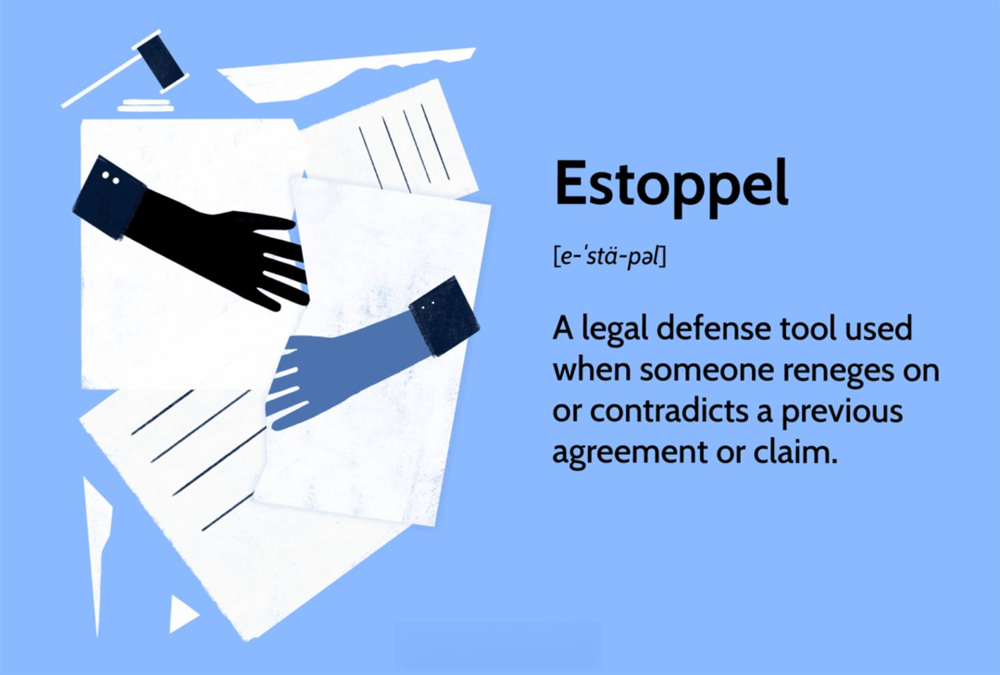

In an era marked by the confluence of law, finance, and technology, grasping concepts like estoppel and algorithmic trading is essential for both legal and financial professionals. As these domains increasingly overlap, the necessity to comprehensively understand their intersections grows, particularly given their implications for legal frameworks and financial market operations. 

This article offers an exploration of the historical development of estoppel, a crucial legal principle that has evolved to prevent individuals from contradicting prior statements or actions in legal contexts. Originating from English common law, estoppel serves as a tool to ensure fairness and consistency, thereby protecting parties from potential injustices that might arise due to contradictory behaviors. By examining its historical roots and development, we gain insight into its current role and significance within legal systems worldwide.



Moreover, the discussion extends to algorithmic trading, a technology-driven practice that has transformed global financial markets by employing computer algorithms to execute trades. The rise of algorithmic trading highlights the profound impact of technological advancements on financial operations, emphasizing speed and precision. This technological evolution raises pertinent legal challenges around market manipulation, fairness, and transparency, presenting scenarios where legal doctrines, such as estoppel, could play a pivotal role.

This article aims to bridge legal principles and financial technology innovations, offering insights into how these fields mutually influence and shape one another. This understanding is increasingly critical as both fields evolve, underscoring the need for multidisciplinary knowledge to navigate the complexities of modern financial markets and legal systems. Understanding these connections will not only provide a deeper appreciation of legal doctrines but also help inform the regulation of advanced financial technologies, ensuring fairness and integrity in financial markets.

## Table of Contents

## Understanding the Legal Principle of Estoppel

Estoppel is a fundamental legal doctrine originating from common law, designed to promote fairness and justice by preventing individuals from asserting positions that contradict their earlier statements or commitments within legal contexts. By inhibiting contradictory behavior, estoppel serves as a critical mechanism to uphold consistency and prevent injustice in legal proceedings.

At its core, estoppel prohibits parties from taking advantage of their own previous misrepresentations or actions, ensuring that no party suffers undue harm due to another's inconsistent statements or conduct. This doctrine embodies a commitment to ethical dealings, integrity, and honesty within legal frameworks.

Several distinct forms of estoppel have emerged, each addressing specific scenarios to maintain fair dealings. Collateral estoppel, also known as issue preclusion, prevents the re-litigation of issues or facts that have already been judicially determined in a prior lawsuit involving the same parties. This form ensures that judgments are conclusive in subsequent actions, preserving the finality of decisions and reducing repetitive litigation. 

Equitable estoppel is applied when one party, through its actions or representations, causes another to materially alter their position to their detriment based on a reasonable reliance on those representations. This form seeks to prevent injustice by holding parties accountable for the expectations they create, thus promoting trust and reliability in contractual and legal relationships.

Promissory estoppel focuses on enforcing promises that, although not formalized as contracts due to lack of consideration, have been relied upon by the promisee. This form ensures that individuals or entities can depend on commitments made to them, securing their investments of time, resources, or efforts based on those assurances. By binding parties to their promises, promissory estoppel mitigates potential damages arising from unfulfilled expectations. 

Through these variants, estoppel contributes to the legal landscape by deterring manipulative practices and fostering a stable legal environment where predictability and trust are prioritized. This pivotal role underscores estoppel's importance in maintaining the integrity and coherence of legal systems worldwide.

## Historical Development of Estoppel

The legal doctrine of estoppel has seen a significant evolution since its origins in English common law, reflecting the adaptability and robustness of legal systems in various jurisdictions. Estoppel initially developed as a means to prevent contradictions in statements or conduct that could lead to unfair or unjust outcomes in legal disputes. As such, it has been instrumental in promoting consistency and integrity within legal proceedings.

Over the centuries, several landmark cases have played pivotal roles in shaping the understanding and application of estoppel. The doctrine's roots can be traced back to the early English legal system, where common law principles were developed through judicial decisions. One of the earliest references to estoppel is found in the case of "Stratton v. Rastall" (1792), where the court introduced the concept that a party should not be allowed to assume a position in legal actions that contradicts a previously established stance if it would harm the opposing party who relied on the initial position.

The concept of estoppel continued to evolve, with significant contributions from notable cases such as "Pickard v. Sears" (1837). In this case, the court articulated the principle of equitable estoppel, emphasizing that when a party, by its conduct, leads another to believe in certain facts and induces them to act on that belief, the first party cannot later contradict those facts if it would cause harm. This ruling underscored the essential nature of fairness and reliance in the doctrine's application.

Another noteworthy development occurred in "Hughes v. Metropolitan Railway Co." (1877), which further expanded the scope of estoppel. The court in this case recognized the importance of promissory estoppel, where a promise, even without the formal consideration typically required in contract law, could be enforceable if a party has reasonably relied on it, leading to a significant change in their position. This case highlighted the evolving nature of estoppel as it began to incorporate elements of equity, ensuring justice beyond strict legal formalism.

The adaptation of estoppel to modern legal frameworks has been influenced by various jurisdictions that have incorporated unique interpretations based on their legal traditions. In the United States, for example, estoppel has been extensively applied in both federal and state court systems, contributing to the development of legal doctrines such as collateral estoppel, which prevents re-litigation of issues that have already been resolved in previous proceedings.

Internationally, estoppel has found relevance in contexts beyond traditional legal systems. In commercial transactions, for instance, estoppel certificates are often used in real estate and financing agreements to prevent parties from reneging on previously agreed-upon facts. This demonstrates the principle's utility in ensuring consistency and reliability in business dealings.

Through these historical milestones, estoppel has solidified its role as a crucial legal doctrine that upholds fairness and prevents injustice, highlighting its enduring significance in the legal landscape. The continuous evolution of estoppel indicates its adaptability to emerging challenges, making it a vital component of legal systems worldwide.

## Estoppel's Role in Modern Legal Systems

In contemporary legal practice, the doctrine of estoppel is pivotal in maintaining consistency and integrity within legal proceedings. Estoppel ensures that parties cannot renege on their prior statements or conduct to the detriment of others. This is crucial in upholding fairness in judicial and business environments.

In the United States, estoppel manifests in various forms, such as equitable estoppel and promissory estoppel. Equitable estoppel prevents a party from taking a legal position that contradicts their previous statements. For instance, if a landlord assured a tenant they could renew their lease, the landlord might be estopped from evicting the tenant when the lease term concludes, provided the tenant relied on that assurance. Promissory estoppel, on the other hand, permits enforcement of a promise made without formal consideration if one party relied on that promise to their detriment. A classic example is when an employer promises an employee a pension, encouraging them to retire, and later attempts to retract the promise.

In the United Kingdom, estoppel also plays a critical role, particularly in contractual and property disputes. Proprietary estoppel has been notably invoked in cases where an individual's rights to property may be affected by their reliance on another's assurance. For example, if a property owner assured a relative they could inherit or use land, and the relative relied on that assurance to their detriment, the courts may prevent the property owner from denying those rights.

Estoppel certificates are a practical application of this principle in real estate transactions. These certificates confirm particular facts about a lease or mortgage agreement, serving as a binding acknowledgment of its terms. For instance, when a property is sold, tenants might provide estoppel certificates to affirm their lease details, ensuring the new owner is aware of existing agreements and cannot later claim ignorance or dispute the stated facts.

Across jurisdictions, the application of estoppel varies but maintains a consistent aim: preventing unfairness by holding parties accountable to their words and conduct. Estoppel thus reinforces the reliability of legal and business transactions, fostering a trustworthy environment where individuals can act with knowledge and confidence that established positions will be honored. This steadfast principle remains integral in bridging the certainty between law and its application in everyday scenarios.

 to Algorithmic Trading

Algorithmic trading utilizes computer algorithms to automate the process of trading financial instruments, marking a significant shift in the way financial markets operate. These algorithms can process vast amounts of market data, identify trading opportunities, and execute orders at speeds and efficiencies that are impossible for human traders to achieve. A common framework for understanding these processes involves analyzing price trends, executing [arbitrage](/wiki/arbitrage) opportunities, and optimizing portfolio management strategies.

Historically, [algorithmic trading](/wiki/algorithmic-trading) emerged in the late 20th century, primarily to reduce the cost of trading and minimize human error. With its inception, the practice focused on breaking up large orders and executing them over time to reduce market impact. Over the years, as technology has advanced, algorithmic trading has become integral to the operational infrastructure of financial markets globally.

Its significance lies in the profound impact it has had on the trading landscape. It allows for trades to be executed at the most favorable prices, with transaction costs minimized and market [liquidity](/wiki/liquidity-risk-premium) improved as a result. Moreover, the precision and consistency with which algorithmic trading systems operate act to enhance the efficiency of financial markets, reducing the likelihood of significant price distortions.

The rise of big data and [machine learning](/wiki/machine-learning) has further propelled the evolution of algorithmic trading. Algorithms can now incorporate machine learning techniques to adaptively learn and improve from historical data, identifying patterns and adjusting strategies dynamically. For example, machine learning models can predict market trends based on large datasets, analyzing millions of pieces of information to anticipate potential future price movements. The Python programming language, often utilized in this field, enables practitioners to create and backtest sophisticated trading algorithms. A basic example in Python might include using the Pandas library to handle data and NumPy for numerical analysis, as shown below:

```python
import pandas as pd
import numpy as np

# Sample data
data = {'Date': pd.date_range(start='1/1/2023', periods=5),
        'Price': [100, 102, 101, 103, 105]}
df = pd.DataFrame(data)

# Simple moving average strategy
df['SMA'] = df['Price'].rolling(window=3).mean()
df['Signal'] = np.where(df['Price'] > df['SMA'], 1, 0)

print(df)
```

In this example, a simple moving average strategy is employed where the 'Signal' column is used to determine whether a stock price is above the calculated moving average, indicating a buy signal.

As algorithmic trading continues to evolve, its focus on speed and precision remains paramount. High-frequency trading ([HFT](/wiki/high-frequency-trading-strategies)) is an extension of algorithmic trading that underscores this focus, executing a large number of orders at extremely high speeds over fractions of a second. The ability to capitalize on minute price movements on such scales illustrates the formidable capabilities of algorithmic systems.

In summary, algorithmic trading has revolutionized financial markets by leveraging the power of technology to enhance the speed, efficiency, and accuracy of trades, significantly impacting global trading landscapes. The integration of big data and machine learning will likely continue to push the boundaries of what is possible in financial markets, further embedding algorithmic trading as a cornerstone of modern market operations.

## Legal Challenges in Algorithmic Trading

Algorithmic trading, which employs computer algorithms to automate trading decisions, has revolutionized financial markets by increasing the speed and efficiency of trades. However, this technological advancement introduces several legal challenges, particularly concerning market manipulation, fairness, and transparency. These issues arise largely because algorithmic trading can potentially exploit market vulnerabilities or create an uneven playing field among market participants.

Market manipulation concerns center around the ability of algorithmic traders to manipulate pricing through high-frequency trades or 'spoofing', where orders are placed with the intent to cancel them before execution, misleading other traders about demand or supply. Such practices can distort market integrity, leading to unfair advantages. Regulators have been actively working to detect and manage these practices through stringent laws and oversight mechanisms.

The principle of estoppel, a legal doctrine that inhibits parties from contradicting statements or commitments relied upon by others, can intersect with algorithmic trading in several contexts. For instance, in scenarios where algorithmic trading strategies are encoded into smart contracts, estoppel could be applied to prevent parties from backing out of executed trades that were based on initial algorithms that they are now contesting. This is particularly pertinent in situations where a trader employs certain strategies and then later disputes the outcomes of these strategies based on their own algorithm's errors or market impact manipulations.

Real-world examples highlight these issues. In 2010, the "Flash Crash" saw the Dow Jones Industrial Average plummet by about 1,000 points within minutes, largely due to algorithmic trade strategies. While regulatory investigation followed, the potential role of legal principles like estoppel was apparent in arbitrating disputes arising from such rapid market changes. Here, the defense against unfair reversals of trades executed via algorithms could potentially rely on estoppel principles, ensuring that executed transactions remain binding despite post hoc disputes.

Additionally, estoppel might resolve disputes involving algorithm-driven contractual obligations, where parties might argue for voiding contracts over perceived technical malfunctions or unintended trades. By binding parties to their algorithm's initial decisions, estoppel could foster a legal framework that ensures predictability and trust in algorithmic trading environments.

In conclusion, as automation in trading grows, the legal industry must adapt by integrating traditional legal doctrines like estoppel to address emerging challenges, providing a robust framework for ensuring fairness and accountability in the rapidly evolving financial landscape.

## The Intersection of Estoppel and Algorithmic Trading

Legal doctrines such as estoppel can significantly influence the regulatory framework of algorithmic trading by providing mechanisms to ensure ethical conduct and prevent exploitation within financial markets. Estoppel, by its nature, is designed to enforce consistency and accountability, attributes that are essential in a trading environment dominated by automated systems.

One critical area where estoppel could offer safeguards is in mitigating market manipulation. Algorithmic trading systems, due to their speed and complexity, have the potential to exploit market inefficiencies intentionally or unintentionally. For instance, algorithms might engage in practices like spoofing—placing large orders with the intent to cancel them before execution to mislead the market. If traders or institutions have previously committed to fair trading practices, estoppel can be applied to hold them accountable, thereby deterring manipulation.

Moreover, estoppel can offer protections when contractual obligations are involved in algorithmic trading. Contracts in trading agreements often contain terms on how algorithms should behave and under what conditions they should execute or cancel trades. If a party tries to deviate from these agreed-upon terms, estoppel could be invoked to prevent such behavior, thus ensuring compliance with established contractual standards.

Algorithmic errors pose another challenge where estoppel might serve as a protective mechanism. Trading algorithms can malfunction due to bugs or unexpected market conditions, potentially causing harm to market participants. In cases where responsibility for maintaining the accuracy and reliability of algorithms has been expressly stated, estoppel can prevent a party from denying liability for damages caused by algorithmic errors. This legal enforcement promotes a more responsible and transparent trading environment.

To illustrate this concept with code, consider a simple Python function that checks whether an algorithm complies with predefined trading rules:

```python
def check_algorithm_compliance(algorithm, rules):
    """
    Function to check if a trading algorithm follows the predefined rules.

    Parameters:
    algorithm (dict): A dictionary containing the algorithm's parameters and behavior.
    rules (dict): A dictionary containing the agreed-upon trading rules.

    Returns:
    bool: True if the algorithm complies with the rules, False otherwise.
    """
    for rule, value in rules.items():
        if algorithm.get(rule) != value:
            return False
    return True

# Example use case:
algorithm_config = {'max_order_size': 100, 'min_price_change': 0.01}
trading_rules = {'max_order_size': 100, 'min_price_change': 0.01}

compliance = check_algorithm_compliance(algorithm_config, trading_rules)
print("Algorithm complies with rules:", compliance)
```

This example demonstrates the importance of verifying that trading systems operate within agreed parameters, akin to how estoppel ensures adherence to prior commitments.

In summary, estoppel possesses significant potential to safeguard market participants by deterring unethical trading practices, reinforcing adherence to contractual obligations, and protecting against errors in algorithmic trading. Its application can help bridge the gap between legal standards and technological advancements, promoting a fairer and more stable financial market.

## Future Implications and Developments

As technology and law continue to evolve, the interplay between legal principles such as estoppel and automated trading systems opens new avenues for application. Emerging technologies like blockchain and [artificial intelligence](/wiki/ai-artificial-intelligence) (AI) are reshaping financial markets, necessitating an adaptation in legal frameworks to address potential ethical and regulatory challenges effectively.

Blockchain technology, which promotes transparency, decentralization, and immutability, poses unique challenges and opportunities for implementing estoppel. Smart contracts, which execute automatically when predefined conditions are met, may inadvertently breach agreements due to unforeseen code errors or ambiguities. In such situations, estoppel could serve as a corrective mechanism, preventing parties from taking advantage of these technical discrepancies and ensuring adherence to the original intent of the contract. This preventive measure could provide substantial benefits in maintaining fairness, especially in environments that rely heavily on code-driven transactions.

Furthermore, AI's role in trading systems further complicates the landscape, as decision-making is increasingly delegated to algorithms that can learn and adapt autonomously. These systems, while enhancing efficiency and speed, also introduce risks related to accountability. Consider a scenario where an AI-based trading algorithm makes a decision based on incorrect assumptions or biased data, leading to unintended market consequences. In such cases, estoppel can potentially hold relevant parties accountable, ensuring that they cannot deny the consequences of the actions taken by their [agents](/wiki/agents), be it human or machine.

Here's a simplified Python example of a smart contract on blockchain where estoppel principles might come into play:

```python
class SmartContract:
    def __init__(self, state):
        self.state = state

    def perform_action(self):
        if self.state == "initial":
            self.state = "pending"
        elif self.state == "pending":
            self.state = "completed"
        else:
            raise ValueError("Invalid state transition")

# Assume user creates a contract and performs an action
contract = SmartContract("initial")
contract.perform_action()

# If a programming error leads to inconsistencies, estoppel may prevent exploitation
try:
    contract.perform_action()  # This should not transition directly to "completed" if faulty
except ValueError as e:
    print(f"Error: {e}")
```

The ongoing development of regulatory strategies tailored to novel technologies highlights the significance of maintaining flexible legal principles. For instance, the European Union's initiatives like the Markets in Financial Instruments Directive (MiFID II) aim to modernize trading regulations to cover automated trading systems more comprehensively, including algorithmic and high-frequency trading. Integrating estoppel within these frameworks can bolster efforts to mitigate unethical trading practices by holding parties to their prior statements or actions.

In future scenarios, as AI-driven systems grow more autonomous, the foundational tenets of estoppel might need to evolve, potentially giving rise to new legal doctrines or interpretations that address issues unique to automated systems. This evolution underscores the need for ongoing collaboration between technologists, legal experts, and regulators to ensure the fair and accountable deployment of technology in financial markets. As we advance, the application of estoppel and similar principles might be pivotal in safeguarding ethical standards and legal integrity across increasingly complex trading ecosystems.

## Conclusion

The intertwining of legal principles such as estoppel with financial innovations like algorithmic trading is an evolving dynamic deserving ongoing attention. Understanding these connections not only fosters a deeper appreciation of legal doctrines but also informs the regulation of cutting-edge financial technologies. As the legal framework encounters the rapid advancements in financial technology, maintaining a balance between innovation and regulation becomes crucial. This integration requires a nuanced view of both fields—the adherence to established legal norms and the willingness to embrace technological potential.

The complexities that emerge at this intersection highlight the importance of cross-disciplinary knowledge. A legal principle like estoppel offers a framework for ensuring consistency and fairness in legal and financial transactions. In the context of algorithmic trading, estoppel can help address challenges related to contract enforcement and compliance, providing a mechanism for accountability in scenarios where automation might lead to unforeseen consequences.

Moreover, the dynamic nature of financial markets and the evolving sophistication of trading algorithms underscore the necessity for ongoing dialogue between legal experts and technologists. Collaborative efforts can lead to innovative regulatory solutions that safeguard market integrity without stifling technological progress. As these fields continue to develop, professionals equipped with an understanding of both legal principles and financial technology will be pivotal in shaping policies that promote ethical trading practices and protect all market participants.

Ultimately, the convergence of law and technology in the financial sector is not merely a challenge but an opportunity. The ability to adapt legal doctrines like estoppel to emerging financial technologies emphasizes the role of adaptive legal systems. As we consider the future implications of this relationship, embracing an interdisciplinary approach will ensure that integrity, fairness, and trust remain at the forefront of global financial markets.

## References & Further Reading

[1]: Aronson, D. R. (2006). ["Evidence-Based Technical Analysis: Applying the Scientific Method and Statistical Inference to Trading Signals"](https://www.amazon.com/Evidence-Based-Technical-Analysis-Scientific-Statistical/dp/0470008741). Wiley.

[2]: Chan, E. (2008). ["Quantitative Trading: How to Build Your Own Algorithmic Trading Business"](https://github.com/ftvision/quant_trading_echan_book). Wiley.

[3]: Jansen, S. (2020). ["Machine Learning for Algorithmic Trading"](https://github.com/stefan-jansen/machine-learning-for-trading). Packt Publishing.

[4]: Lepinay, V. A. (2011). ["Codes of Finance"](https://www.degruyter.com/document/doi/10.1515/9781400840465/html). Princeton University Press.

[5]: Lopez de Prado, M. (2018). ["Advances in Financial Machine Learning"](https://www.amazon.com/Advances-Financial-Machine-Learning-Marcos/dp/1119482089). Wiley.