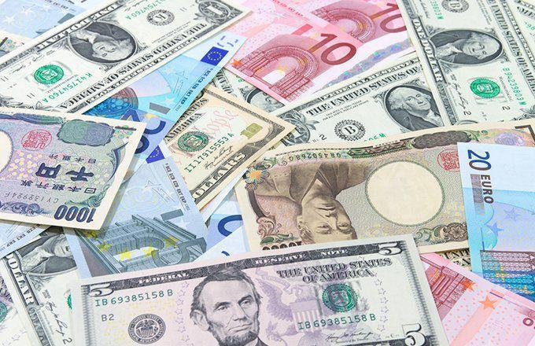

## Table of Contents

## What is the Eswatini Lilangeni?

The Eswatini Lilangeni is the currency used in the country of Eswatini, which is in Africa. It is also called the Lilangeni, and its symbol is L or E. The Lilangeni is divided into 100 smaller units called cents. People in Eswatini use this money to buy things they need every day, like food and clothes.

The Lilangeni was first used in 1974, when Eswatini decided to have its own money instead of using the South African Rand. Even though the Lilangeni is the official money of Eswatini, the South African Rand is still accepted in the country because the two countries are close neighbors and have strong ties. This makes it easier for people to trade and travel between Eswatini and South Africa.

## When was the Eswatini Lilangeni introduced?

The Eswatini Lilangeni was introduced in 1974. Before that, people in Eswatini used the South African Rand. The Lilangeni was created because Eswatini wanted to have its own money.

Even though the Lilangeni is the main money used in Eswatini, the South African Rand is still accepted there. This is because Eswatini and South Africa are close neighbors and have good relations. Using both currencies makes it easier for people to do business and travel between the two countries.

## What is the historical context behind the introduction of the Lilangeni?

The Eswatini Lilangeni was introduced in 1974. Before that, Eswatini used the South African Rand as its currency. Eswatini decided to have its own money because it wanted to be more independent. Having their own currency helped Eswatini show that it was its own country and not just part of South Africa.

When Eswatini introduced the Lilangeni, it was a big step towards being more self-sufficient. But Eswatini and South Africa are close neighbors and have strong ties, so they decided to keep using the South African Rand too. This made it easier for people to trade and travel between the two countries. Even today, both the Lilangeni and the Rand are used in Eswatini.

## How is the Eswatini Lilangeni abbreviated and symbolized?

The Eswatini Lilangeni is abbreviated as "SZL". This stands for Swaziland Lilangeni, the old name of the country before it was changed to Eswatini.

The symbol for the Lilangeni is "L" or sometimes "E". People in Eswatini use this symbol when they write down prices or amounts of money. For example, if something costs 10 Lilangeni, you might see it written as L10 or E10.

## What are the denominations of the Lilangeni in both coins and banknotes?

The Eswatini Lilangeni comes in different amounts, called denominations, for both coins and banknotes. For coins, you can find 10, 20, and 50 cents, and also 1 and 2 Lilangeni. These coins help people pay for smaller things, like a piece of candy or a bus ride.

For banknotes, the Lilangeni has 10, 20, 50, 100, and 200 Lilangeni notes. These notes are used for bigger purchases, like buying groceries or paying bills. Having different denominations makes it easier for people to use the right amount of money for what they need to buy.

## How has the Eswatini Lilangeni been affected by inflation over the years?

The Eswatini Lilangeni has been affected by inflation over the years, which means the value of the money changes and prices go up. When inflation happens, the same amount of Lilangeni can buy less than it used to. For example, if a loaf of bread cost 10 Lilangeni ten years ago, it might cost more today because of inflation. Eswatini's inflation rate has gone up and down, but it has generally been moderate. This means that prices have increased, but not too quickly.

The government and the Central Bank of Eswatini work to keep inflation under control. They do this by setting interest rates and managing the money supply. Even though the Lilangeni is affected by inflation, it is also linked to the South African Rand. Because the two currencies are tied together, what happens to the Rand can affect the Lilangeni too. This connection helps keep the Lilangeni stable, but it also means that if the Rand goes through a lot of inflation, the Lilangeni can be affected as well.

## What is the exchange rate history of the Lilangeni against major currencies like the USD and EUR?

The Eswatini Lilangeni (SZL) has been closely tied to the South African Rand (ZAR) since its introduction in 1974, and this relationship affects its exchange rate with major currencies like the US Dollar (USD) and the Euro (EUR). Historically, the Lilangeni has moved in line with the Rand, which means when the Rand gets stronger or weaker against the USD or EUR, the Lilangeni usually does the same. For example, in the early 2000s, the Lilangeni was around 7 to 8 against the USD. Over the years, it has weakened, and by 2023, it was around 18 to 19 Lilangeni for one USD. This weakening happened because of economic changes in South Africa and around the world.

Against the Euro, the Lilangeni has also seen similar trends. In the early 2000s, it was around 8 to 9 Lilangeni for one EUR. By 2023, the exchange rate had moved to around 20 to 21 Lilangeni per EUR. The fluctuations in the exchange rate are influenced by many things, like the economic health of South Africa, global market conditions, and changes in the value of the Euro itself. Because the Lilangeni is pegged to the Rand, its value against the USD and EUR largely depends on what happens to the Rand.

## How does the Lilangeni's peg to the South African Rand influence Eswatini's economy?

The Lilangeni being pegged to the South African Rand means that Eswatini's money stays stable compared to the Rand. This is good for Eswatini because it makes trading with South Africa easier. Since South Africa is a big neighbor and a major trading partner, having the same value as the Rand helps businesses in Eswatini sell things to South Africa and buy things from there without worrying about the money changing too much. This stability can make the economy in Eswatini stronger because it's easier to plan and do business.

But, being tied to the Rand also has some downsides for Eswatini. If the South African economy has problems, like inflation or a weak Rand, it can affect Eswatini too. For example, if the Rand loses value against other currencies like the USD or EUR, the Lilangeni will lose value too. This can make things that Eswatini buys from other countries more expensive. So, Eswatini has less control over its own money because it depends on what happens to the Rand. This can make it harder for Eswatini to manage its own economy and deal with its own problems.

## What role does the Central Bank of Eswatini play in managing the Lilangeni?

The Central Bank of Eswatini is in charge of looking after the Lilangeni. They make sure that the money stays stable and works well for the people of Eswatini. The bank does this by controlling how much money is in the country and setting interest rates. When they change interest rates, it can affect how much people spend and save, which helps keep prices from going up too fast. The Central Bank also keeps an eye on the South African Rand because the Lilangeni is tied to it. This means they have to work closely with South Africa to make sure both currencies stay strong.

Even though the Lilangeni is pegged to the Rand, the Central Bank still has some power over it. They can issue new banknotes and coins when they need to. They also watch over banks and other financial places in Eswatini to make sure they are safe and fair. By doing all these things, the Central Bank helps keep the economy of Eswatini running smoothly and makes sure the Lilangeni is a good money for everyone to use.

## How has the Eswatini Lilangeni impacted trade and economic relations with neighboring countries?

The Eswatini Lilangeni has made trade with neighboring countries, especially South Africa, much easier. Because the Lilangeni is tied to the South African Rand, people and businesses in Eswatini don't have to worry about their money changing value when they buy or sell things with South Africa. This makes it simpler for Eswatini to trade with its biggest neighbor. They can sell their goods like sugar and wood to South Africa without the fear of losing money because of changing currency rates. This has helped Eswatini's economy grow because they can rely on steady trade with South Africa.

However, being tied to the Rand also means that what happens in South Africa can affect Eswatini. If the Rand gets weaker against other world currencies, the Lilangeni gets weaker too. This can make things that Eswatini buys from other countries more expensive. For example, if Eswatini needs to import medicines or machinery, and the Rand falls, these things can cost more Lilangeni. This can make life harder for people in Eswatini because their money doesn't go as far. So, while the Lilangeni helps with trade with South Africa, it can also bring challenges when dealing with other countries.

## What are the economic challenges faced by Eswatini due to its currency?

The Eswatini Lilangeni being tied to the South African Rand brings some challenges to Eswatini's economy. Since the Lilangeni moves with the Rand, if the Rand weakens against other world currencies, the Lilangeni does too. This means that things Eswatini buys from other countries, like medicines or machinery, can become more expensive. This makes it harder for people in Eswatini because their money doesn't go as far. They have to pay more Lilangeni for the same things they used to buy for less.

Another challenge is that Eswatini has less control over its own money because it depends on what happens to the Rand. If South Africa has economic problems, like high inflation or a weak economy, it can affect Eswatini too. This can make it tough for Eswatini to manage its own economy and deal with its own problems. Even though the peg to the Rand makes trade with South Africa easier, it also means Eswatini is at the mercy of South Africa's economic health.

## What future economic policies might affect the stability and value of the Lilangeni?

Future economic policies could change how stable and valuable the Eswatini Lilangeni is. If Eswatini decides to change how closely the Lilangeni is tied to the South African Rand, it could affect trade and prices. For example, if they make the Lilangeni less connected to the Rand, they might have more control over their own money. But this could also make trade with South Africa harder and cause more ups and downs in the value of the Lilangeni. On the other hand, if they keep the Lilangeni tied to the Rand, they might need to work harder with South Africa to manage inflation and keep the economy strong.

The Central Bank of Eswatini could also change its rules about interest rates and money supply. If they raise interest rates, it might slow down spending and help control inflation, making the Lilangeni more stable. But if they lower interest rates to help the economy grow, it could lead to more spending and higher prices, which might weaken the Lilangeni. The government could also make new laws to help businesses and attract more foreign money. These policies could make the economy stronger and the Lilangeni more valuable, but they need to be careful because changes can also bring new risks.

## References & Further Reading

[1]: Ardnt, C. (2000). ["Technical Cooperation to Meet Financial Stability Needs in Eswatini."](https://papers.ssrn.com/sol3/papers.cfm?abstract_id=2530856) International Monetary Fund Working Papers.

[2]: "Swaziland: [A Historical Overview.](https://www.britannica.com/topic/history-of-Eswatini)" Times Publications.

[3]: Frankel, J. (1999). ["No Single Currency Regime is Right for All Countries or at All Times."](https://www.nber.org/papers/w7338) National Bureau of Economic Research.

[4]: Lopez de Prado, M. (2018). ["Advances in Financial Machine Learning."](https://www.amazon.com/Advances-Financial-Machine-Learning-Marcos/dp/1119482089) Wiley Trading.

[5]: Aronson, D. R. (2007). ["Evidence-Based Technical Analysis: Applying the Scientific Method and Statistical Inference to Trading Signals."](https://onlinelibrary.wiley.com/doi/book/10.1002/9781118268315) Wiley.

[6]: Lee, C. M. C., & Ready, M. J. (1991). ["Inferring Trade Direction from Intraday Data."](https://onlinelibrary.wiley.com/doi/abs/10.1111/j.1540-6261.1991.tb02683.x) Journal of Finance, 46(2), 733-746.

[7]: "Economic and Political Developments in Contemporary Africa." Africa World Press, Inc.

[8]: Chan, E. (2008). ["Quantitative Trading: How to Build Your Own Algorithmic Trading Business."](https://github.com/ftvision/quant_trading_echan_book) Wiley Trading.

[9]: "The Economic Impact of Drought in Eswatini: 2015/16 and Lessons Learned" (2020). Government of the Kingdom of Eswatini. 

[10]: Jansen, S. (2022). ["Machine Learning for Algorithmic Trading."](https://github.com/stefan-jansen/machine-learning-for-trading) Packt Publishing.