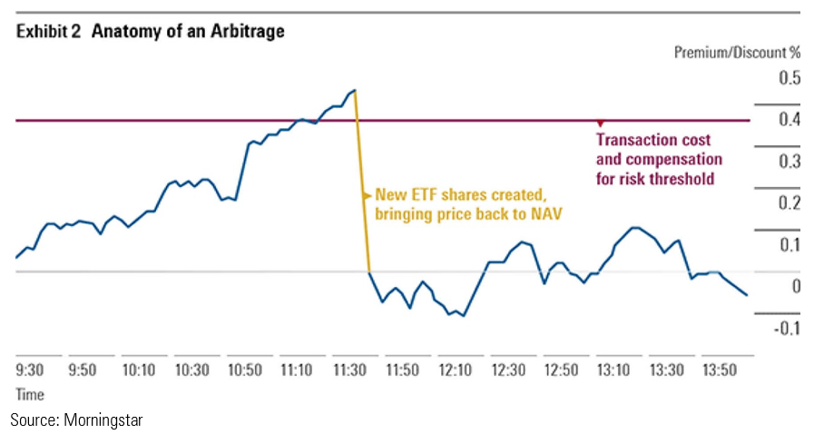

## Table of Contents

## What are ETFs and how do they work?

ETFs, or Exchange-Traded Funds, are a type of investment that lets you buy a collection of different stocks, bonds, or other assets all at once. They are like a basket that holds many different things inside it. When you buy an ETF, you are buying a small piece of that whole basket. ETFs are traded on stock exchanges, just like individual stocks, so you can buy and sell them throughout the day at the current market price.

ETFs work by tracking an index, like the S&P 500, which is a group of stocks that represent a part of the market. The goal of an ETF is to match the performance of the index it tracks. For example, if the S&P 500 goes up by 2%, an ETF that tracks the S&P 500 should also go up by about 2%. This makes ETFs a popular choice for investors who want to diversify their investments without having to pick individual stocks themselves.

## What does it mean for an ETF to trade at a discount or premium?

When an ETF trades at a discount, it means that the price you pay to buy the ETF is less than the total value of all the things inside it. Imagine the ETF as a basket of goodies. If the basket is worth $100 but you can buy it for $98, it's trading at a discount. This can happen for many reasons, like if people want to sell the ETF more than others want to buy it.

On the other hand, when an [ETF](/wiki/etf-trading-strategies) trades at a premium, it means you're paying more for the ETF than the total value of its contents. Using the same basket example, if the goodies inside are worth $100 but you have to pay $102 to get the basket, it's trading at a premium. This can happen when more people want to buy the ETF than there are people willing to sell it. Both discounts and premiums can change throughout the day as people buy and sell the ETF.

## How can an investor identify if an ETF is trading at a discount or premium?

To find out if an ETF is trading at a discount or premium, an investor needs to compare the ETF's market price with its Net Asset Value (NAV). The NAV is like the total value of all the goodies inside the ETF's basket. You can find the NAV on the ETF's website or through financial websites that track ETF data. If the market price of the ETF is lower than the NAV, it's trading at a discount. If the market price is higher than the NAV, it's trading at a premium.

It's important to check this regularly because the difference between the market price and the NAV can change throughout the day. Some financial websites and trading platforms show the difference in real-time, making it easier for investors to see if an ETF is trading at a discount or premium. By keeping an eye on these values, investors can make smarter choices about when to buy or sell their ETFs.

## What causes an ETF to trade at a discount?

An ETF can trade at a discount when its market price is lower than its Net Asset Value (NAV). This happens because of how supply and demand work in the market. If more people want to sell the ETF than buy it, the price goes down, causing a discount. This can happen for many reasons, like if people think the things inside the ETF are not worth as much anymore, or if there's bad news about the market the ETF is tracking.

Another reason for a discount can be because of how ETFs are created and redeemed. Special people called authorized participants help keep the ETF's price close to its NAV. But sometimes, if it's hard for them to do their job, like if the market is very busy or if the things inside the ETF are hard to buy and sell, the ETF might stay at a discount longer. So, when you see an ETF trading at a discount, it's because of these kinds of things happening in the market.

## What causes an ETF to trade at a premium?

An ETF trades at a premium when its market price is higher than its Net Asset Value (NAV). This happens when more people want to buy the ETF than there are people willing to sell it. It's like when everyone wants a certain toy, and the price goes up because there aren't enough toys to go around. People might think the things inside the ETF will become more valuable soon, or there might be good news about the market the ETF is tracking, which makes everyone want to buy it.

Another reason for an ETF to trade at a premium is because of the way ETFs are created and redeemed. Special people called authorized participants usually help keep the ETF's price close to its NAV. But sometimes, if it's hard for them to do their job, like if the market is very busy or if the things inside the ETF are hard to buy and sell, the ETF might stay at a premium longer. So, when you see an ETF trading at a premium, it's because of these kinds of things happening in the market.

## How often do ETF discounts and premiums occur?

ETF discounts and premiums happen quite often, but how often depends on things like the type of ETF and how busy the market is. Some ETFs, like those that track big, well-known indexes, usually stay close to their NAV because lots of people are buying and selling them all the time. But other ETFs, like those that invest in less common or harder-to-sell things, might trade at discounts or premiums more often because it's harder to keep their price in line with their NAV.

Most of the time, any discounts or premiums don't last long. Special people called authorized participants help keep the ETF's price close to its NAV by creating new shares or taking old ones away. But sometimes, if the market is very busy or if it's hard to buy and sell the things inside the ETF, discounts or premiums can stick around a bit longer. So, while discounts and premiums are common, they usually don't stay for too long unless something unusual is going on.

## What are the potential risks of buying an ETF at a premium?

Buying an ETF at a premium means you're paying more for it than what the things inside it are actually worth. This can be risky because if the price of the ETF goes back down to its real value, you could lose money. Imagine buying a toy for more than it's worth because everyone wants it. When the hype goes away, the toy's price drops, and you're left with something that's not worth what you paid.

Another risk is that if the market changes or something bad happens to the things the ETF invests in, the premium might disappear quickly. This can happen if there's bad news or if people start selling the ETF. If you bought it at a high price, you might have to sell it at a lower price later, which means you lose money. So, it's important to think carefully before buying an ETF at a premium and to keep an eye on what's happening in the market.

## What are the potential benefits of buying an ETF at a discount?

Buying an ETF at a discount can be a good thing because you're getting it for less than what the things inside it are worth. It's like finding a toy on sale that's normally more expensive. If you believe the ETF's price will go back up to its real value, you could make money when you sell it later. This can be a smart move if you think the market will get better or if the ETF is just temporarily undervalued.

Another benefit is that buying at a discount can help you get more for your money. Imagine you have $100 to spend. If you can buy an ETF worth $105 for just $100, you're getting extra value. This can be especially good if you're planning to hold onto the ETF for a long time, as the price might eventually catch up to its true value, giving you a nice return on your investment.

## How do arbitrage mechanisms help in minimizing ETF discounts and premiums?

Arbitrage mechanisms help keep ETF prices close to their Net Asset Value (NAV) by using special people called authorized participants. These authorized participants can create new ETF shares or take away old ones. If an ETF is trading at a discount, meaning its price is lower than its NAV, authorized participants can buy the ETF and then exchange it for the things inside it, which are worth more. They can then sell those things at their higher value, making a profit. This buying of the ETF pushes its price up, bringing it closer to the NAV.

On the other hand, if an ETF is trading at a premium, meaning its price is higher than its NAV, authorized participants can do the opposite. They can buy the things inside the ETF, which are cheaper than the ETF itself, and then exchange them for new ETF shares. They can sell these new ETF shares at the higher market price, making a profit. This action of selling the ETF shares helps bring the price down, closer to the NAV. By doing these things, authorized participants help make sure that ETF prices stay as close as possible to what they're really worth.

## Can the size and liquidity of an ETF affect its likelihood of trading at a discount or premium?

Yes, the size and [liquidity](/wiki/liquidity-risk-premium) of an ETF can affect how often it trades at a discount or premium. A bigger and more liquid ETF usually has more people buying and selling it all the time. This makes it easier for the ETF's price to stay close to its real value, or NAV. When lots of people are trading the ETF, authorized participants can quickly step in to create or take away shares, which helps keep the price in line with the NAV.

On the other hand, smaller and less liquid ETFs might trade at discounts or premiums more often. If not many people are buying and selling these ETFs, it can be harder for authorized participants to do their job. This means the ETF's price might not match its NAV as well, leading to bigger and longer-lasting discounts or premiums. So, when thinking about buying an ETF, it's good to look at how big and how easy it is to trade, as it can affect whether you're getting a good deal or not.

## How do different types of ETFs (e.g., equity, fixed income, commodity) experience discounts and premiums differently?

Different types of ETFs can experience discounts and premiums in different ways because of what they invest in and how easy it is to buy and sell those things. Equity ETFs, which invest in stocks, usually have a lot of people buying and selling them. This makes them pretty liquid, which means their prices usually stay close to their NAV. But if something big happens in the stock market, like a crash, equity ETFs might trade at bigger discounts or premiums for a short time.

Fixed income ETFs, which invest in bonds, can be a bit different. Bonds can be harder to buy and sell quickly, so these ETFs might have less liquidity. This can make it more common for fixed income ETFs to trade at discounts or premiums, especially if the bond market is not doing well. Commodity ETFs, which invest in things like gold or oil, can also see bigger discounts or premiums. Commodities can be very volatile, and if it's hard to trade them, the ETF's price might not match its NAV as well. So, the type of ETF can really affect how often and how big its discounts and premiums are.

## What advanced strategies can investors use to take advantage of ETF discounts and premiums?

Investors can use a strategy called [arbitrage](/wiki/arbitrage) to make money from ETF discounts and premiums. If they find an ETF trading at a discount, they can buy it and then exchange it for the things inside it, which are worth more. They can then sell those things at their higher value and make a profit. This works because the price of the ETF goes up when more people buy it, bringing it closer to its real value. On the other hand, if an ETF is trading at a premium, investors can buy the things inside the ETF, which are cheaper, and then exchange them for new ETF shares. They can sell these new shares at the higher market price and make money. This helps bring the ETF's price down to its real value.

Another strategy is called pairs trading. This involves finding two ETFs that should have similar prices but are currently trading at different levels, one at a discount and the other at a premium. Investors can buy the ETF at a discount and sell short the one at a premium. If the prices of the two ETFs move back towards each other, as they usually do, the investor can make money from the difference. This strategy works well when the ETFs are very similar, like two that track the same market but from different providers. By using these strategies, investors can try to make money from the temporary differences between an ETF's price and its real value.

## References & Further Reading

[1]: Madhavan, A. (2012). ["Exchange-Traded Funds, Market Structure, and the Flash Crash."](https://rpc.cfainstitute.org/en/research/financial-analysts-journal/2012/exchange-traded-funds-market-structure-and-the-flash-crash) Financial Analysts Journal.

[2]: Hasbrouck, J. (2003). ["Intraday Price Formation in U.S. Equity Index Markets."](https://onlinelibrary.wiley.com/doi/10.1046/j.1540-6261.2003.00609.x) The Review of Financial Studies.

[3]: Gastineau, G. L. (2004). ["The Exchange-Traded Funds Manual."](https://onlinelibrary.wiley.com/doi/book/10.1002/9781118266946) Wiley.

[4]: Harris, L. (2002). ["Trading and Exchanges: Market Microstructure for Practitioners."](https://academic.oup.com/book/52292) Oxford University Press.

[5]: Poterba, J. M., & Shoven, J. B. (2002). ["Exchange-Traded Funds: A New Investment Option for Taxable Investors."](https://economics.mit.edu/sites/default/files/publications/Exchange-Traded%20Funds%20A%20New%20Investment%20Option.pdf) National Bureau of Economic Research (NBER).