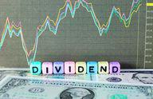

Dividends represent periodic distributions of a portion of a company's earnings to shareholders, often viewed as a sign of corporate financial health and a source of passive income for investors. These payments can be in the form of cash or reinvested to purchase more shares, contributing to the compounding growth of one's investment over time. The importance of dividends lies in their ability to enhance overall returns, reduce portfolio volatility, and provide a steady income stream, especially appealing in low-interest-rate environments.

Exchange-Traded Funds (ETFs) are financial instruments that offer investors a way to pool their resources to purchase a diverse basket of assets, providing an efficient and cost-effective means of diversification across various sectors, indices, or investment strategies. ETFs are traded on stock exchanges and combine the features of mutual funds with the flexibility of stock trading. They have gained popularity due to their lower expense ratios, tax efficiency, and the ability for investors to trade their holdings in real-time, unlike traditional mutual funds which are priced only at the end of the trading day. Dividend-focused ETFs, in particular, allow investors to gain exposure to a wide array of dividend-paying stocks, enhancing diversification while simplifying the dividend collection process.



Algorithmic trading, the use of algorithms to automate trading decisions and execution, has become an integral part of modern financial markets. It enhances market efficiency, allows for high-speed and high-frequency trading, and enables data-driven decision-making. The increasing relevance of algorithmic trading can be attributed to its ability to process vast amounts of data rapidly, identify trading opportunities based on set criteria, and execute trades at optimal times. Algorithmic trading offers the potential to optimize investment strategies by minimizing human error and emotion-driven decisions.

Combining dividend investment strategies with ETFs and algorithmic trading can create a synergistic effect that optimizes returns. Investing in dividend ETFs through algorithmic strategies allows for systematic reinvestment plans, real-time adjustments to market conditions, and efficient scanning of the market for high yield opportunities. By leveraging algorithm-based systems, investors can enhance portfolio returns via refined trading strategies, risk management, and cost reduction.

The primary aim of this article is to explore the interconnected roles of dividends, ETFs, and algorithmic trading in modern investment strategies. It seeks to provide a comprehensive understanding of how these elements can be integrated to maximize returns, manage risk, and ultimately achieve financial objectives. The article will delve into the various aspects of dividends, ETFs, and algorithmic trading, offering insights into their application and implications for both individual and institutional investors.

## Table of Contents

## Understanding Dividend Investments

Dividends are distributions made by a corporation to its shareholders, usually in the form of cash or additional shares. Cash dividends provide shareholders with a direct cash income, typically disbursed quarterly. Reinvested dividends, on the other hand, are used to purchase more shares of the issuing stock, allowing investors to compound their investment over time. This reinvestment can boost total returns by taking advantage of the compounding effect, where dividends generate additional dividends.

Dividend investing is an attractive strategy due to its potential for providing passive income and facilitating compounding growth. Passive income from dividends can offer a steady income stream, particularly appealing to retirees or those seeking to supplement their income. Compounding growth occurs as dividends are reinvested, enhancing the value of an investment over time. This effect can be described mathematically as: 

$$
A = P \left(1 + \frac{r}{n}\right)^{nt}
$$

where:
- $A$ is the amount of money accumulated after n years, including interest.
- $P$ is the principal amount (initial investment).
- $r$ is the annual dividend yield or interest rate.
- $n$ is the number of times dividends are compounded per year.
- $t$ is the number of years the money is invested for.

Selecting dividend-paying stocks requires careful consideration of various factors. Investors often consider the dividend yield, which represents the annual dividend payment divided by the stock price, serving as an indicator of the return on investment from dividends. However, a higher yield might indicate higher risk, potentially stemming from an unsustainably high payout ratio or a struggling business. Thus, assessing the payout ratio, which is the proportion of earnings paid out as dividends, is crucial. A sustainable payout ratio suggests the company has room to maintain or grow dividends over time. Additionally, evaluating a company's historical dividend growth helps in understanding its commitment to returning value to shareholders.

The impact of dividends on long-term portfolio growth is profound. Regular dividend payments can contribute significantly to an investor's total return. Studies have shown that reinvested dividends account for a large portion of total stock market returns over the long term. By continuously reinvesting dividends, investors can harness the compounding effect, leading to substantial growth in the value of their portfolios, even during periods of market [volatility](/wiki/volatility-trading-strategies) or stagnation. This long-term growth potential underscores the value of incorporating dividend-paying stocks into an investment strategy focused on wealth accumulation.

## The Role of ETFs in Dividend Investment

Exchange-Traded Funds (ETFs) are investment funds traded on stock exchanges, similar to stocks. They hold assets such as stocks, commodities, or bonds and generally operate with an [arbitrage](/wiki/arbitrage) mechanism designed to keep trading close to its net asset value, though deviations can occasionally occur. The structure of ETFs allows investors to gain exposure to a diversified portfolio of assets through a single purchase, without the need to buy each constituent individually.

Dividend-focused ETFs are a subset of ETFs that concentrate on stocks offering dividend payouts. These ETFs are designed to provide investors with a steady stream of income, along with potential capital appreciation. The main advantages of using dividend-focused ETFs include diversification and cost-effectiveness. By investing in a single [ETF](/wiki/etf-trading-strategies), investors can gain access to a wide array of dividend-paying stocks, thereby mitigating the risks associated with holding individual stocks. Additionally, the expense ratios of ETFs are generally lower than mutual funds, making them a cost-effective option for investors seeking dividend income.

Among the popular dividend ETFs are the SPDR S&P Dividend ETF (SDY) and the Vanguard Dividend Appreciation ETF (VIG). SDY tracks the S&P High Yield Dividend Aristocrats Index, which includes companies that have consistently increased dividends for at least 20 consecutive years. This ETF is suitable for investors seeking high yield and a history of dividend payments. On the other hand, VIG focuses on the NASDAQ U.S. Dividend Achievers Select Index, targeting companies with a longer streak of annual dividend increases, albeit with potentially lower initial yield compared to SDY. This ETF appeals to investors looking for growth in dividend payouts over time.

When comparing the performance of dividend ETFs to individual dividend-paying stocks, several factors come into play. ETFs offer the advantage of automatic diversification, which can reduce idiosyncratic risk associated with individual stocks. However, individual dividend stocks can offer higher yields and greater growth potential in some cases, albeit with increased risk. The choice between these investment forms depends on an investor's risk tolerance, income needs, and investment goals.

In conclusion, dividend-focused ETFs serve as an effective tool for investors seeking diversified and cost-efficient access to dividend-paying stocks. Through careful selection, investors can achieve a balance between income generation and capital growth, while minimizing risks associated with individual stock investments.

 to Algorithmic Trading

Algorithmic trading, sometimes known as algo trading, is the use of computer programs and software to execute financial transactions at a speed and frequency that is impossible for human traders. At its core, [algorithmic trading](/wiki/algorithmic-trading) involves automating trading orders by pre-defined criteria combining mathematical models and historical data analysis. This computer-based approach has gained prevalence in modern markets due to its ability to convert trading strategies into executable code that reacts to market data in real time.

The chief advantage of algorithmic trading lies in its speed and efficiency. Algorithms can rapidly scan multiple markets for opportunities and execute orders while minimizing the impact of human emotions on trading decisions. They enable traders to implement data-driven decision-making processes which are pivotal in processing large volumes of information to predict market trends accurately. For example, high-frequency trading ([HFT](/wiki/high-frequency-trading-strategies)), a subset of algorithmic trading, capitalizes on these advantages by executing thousands or millions of orders within fractions of a second, thus exploiting small price fluctuations.

In the context of dividend investment strategies, algorithmic trading's ability to process vast quantities of data can help identify lucrative opportunities for dividend reinvestment. Algorithms can be programmed to analyze changes in stock prices, dividend announcements, and economic indicators, thereby optimizing both the timing and selection of dividend-paying stocks. Moreover, algorithmic strategies can aid investors in maintaining an optimal asset allocation within a portfolio, dynamically adjusting holdings in line with predefined risk and return profiles.

Common algorithms and strategies employed in ETF trading include trend-following systems, which focus on capturing gains by predicting the direction of market movements, and the mean reversion strategy, based on the assumption that asset prices will eventually revert to their historical average. Arbitrage strategies also play a significant role, seeking to exploit price inefficiencies between correlated ETFs. 

Python has become increasingly popular for algorithmic trading due to its rich ecosystem of libraries, such as Pandas for data manipulation, NumPy for numerical operations, and [machine learning](/wiki/machine-learning) frameworks like TensorFlow and scikit-learn for predictive modeling. A simple example of a mean reversion strategy in Python might involve calculating the moving average of an ETF's price and executing trades based on the deviation from this average:

```python
import numpy as np
import pandas as pd

# Sample data
prices = pd.Series([100, 102, 100, 98, 97, 105, 107, 110])

# Calculate moving average
window = 3
rolling_mean = prices.rolling(window).mean()

# Identify buy and sell signals
buy_signals = (prices < rolling_mean * 0.95)
sell_signals = (prices > rolling_mean * 1.05)

# Print signals
print("Buy signals:", buy_signals)
print("Sell signals:", sell_signals)
```

In summary, algorithmic trading fundamentally enhances the execution of dividend strategies and ETF trades by ensuring rapid and pattern-based decisions. As technology and data processing continually evolve, the intersection of algorithms and investment strategies promises ongoing advances in market efficiency and portfolio management.

## Integrating Algorithmic Trading with Dividend ETFs

Algorithmic trading has transformed how investors approach dividend reinvestment plans (DRIPs) and dividend-focused ETFs. Automating the reinvestment of dividends using algorithms allows for precise timing and enhanced efficiency in executing trades. By utilizing algorithms, investors can capitalize on market conditions immediately after dividends are paid, optimizing reinvestment for potential gains.

To identify high-performing dividend ETFs, algorithms leverage vast datasets and advanced statistical methods. Machine learning models, for example, can predict ETF performance by analyzing historical price movements, dividend yield trends, and macroeconomic indicators. Python libraries like pandas and scikit-learn are instrumental in processing and modeling these datasets. Here's a basic framework in Python for evaluating dividend ETFs:

```python
import pandas as pd
from sklearn.model_selection import train_test_split
from sklearn.ensemble import RandomForestRegressor

# Load dataset consisting of historical ETF data
data = pd.read_csv('etf_data.csv')

# Features and target variable
features = data.drop(columns='performance')
target = data['performance']

# Split data into train and test sets
X_train, X_test, y_train, y_test = train_test_split(features, target, test_size=0.2, random_state=42)

# Initialize and train the algorithm
model = RandomForestRegressor(n_estimators=100, random_state=42)
model.fit(X_train, y_train)

# Predict and assess performance
predictions = model.predict(X_test)
```

Risk management is a cornerstone of algorithmic trading when interacting with dividend ETFs. Algorithms actively monitor portfolio volatility and adjust positions to mitigate unexpected price swings. Techniques such as stop-loss orders, diversification across multiple ETFs, and hedging strategies are typically automated. Algorithms constantly evaluate beta values, standard deviation, and other statistical measures to keep risk within acceptable thresholds.

Case studies of algorithmic strategies applied to dividend ETFs highlight significant returns. One such strategy involves [momentum](/wiki/momentum)-based algorithms that track ETFs displaying upward price trends and strong dividend yields. By entering positions in these ETFs, investors can leverage both capital appreciation and dividend income, resulting in a compounded benefit.

Another example involves mean reversion strategies, which predict that ETF prices will revert to a historical average. Algorithms implement trades when ETF prices deviate significantly from these averages, capturing potential corrective movements that enhance returns.

The integration of algorithms into dividend ETF investing offers a sophisticated approach to maximizing returns while mitigating risks. By harnessing technology and quantitative strategies, investors are better equipped to navigate complex financial markets.

## Tax Implications and Strategic Considerations

Dividends and capital gains generated from Exchange-Traded Funds (ETFs) [carry](/wiki/carry-trading) specific tax implications for investors. Understanding these implications is crucial for achieving tax efficiency and maximizing returns.

### Overview of Tax Implications

Dividends issued by an ETF can be classified as either qualified or non-qualified, which affects their tax treatment. Qualified dividends benefit from a lower tax rate, similar to long-term capital gains, usually ranging from 0% to 20% depending on the investor's income bracket. Non-qualified dividends, however, are taxed at ordinary income tax rates, which can be significantly higher. Furthermore, ETFs may also distribute capital gains when the fund manager sells underlying securities within the ETF portfolio. These capital gains are typically taxed at long-term capital gains rates if the ETF has held the assets for over a year. However, short-term capital gains are taxed as ordinary income.

### Strategies to Minimize Tax Liabilities

One effective strategy to reduce tax liabilities associated with dividend ETF investments is tax-loss harvesting. This involves selling securities at a loss to offset taxable gains from other investments, thus lowering the overall taxable income. Another strategy is to take advantage of the timing of purchases. By acquiring dividend-paying ETFs after the ex-dividend date, investors can avoid receiving dividends that could negatively impact their tax situation in the short term.

Investors might also consider using low-turnover ETFs, as these tend to distribute fewer capital gains compared to high-turnover funds. Additionally, selecting ETFs structured as exchange-traded notes (ETNs) can defer taxes on distributions, as they often do not distribute dividends or capital gains until redemption or sale, hence delaying tax liabilities.

### The Role of Tax-Advantaged Accounts

Tax-advantaged accounts, such as Individual Retirement Accounts (IRAs) or 401(k) plans, play a significant role in managing dividend income. Since these accounts defer taxes on dividends and capital gains until withdrawal, they provide an environment for dividends to compound without the immediate tax burden, enhancing growth. Using tax-advantaged accounts strategically by prioritizing higher-dividend ETFs or those with substantial capital gain distributions can optimize after-tax returns.

### Long-term Strategic Planning

For long-term wealth accumulation and income generation through dividend ETFs, investors should consider a holistic approach. This involves integrating tax-efficient investments, utilizing tax-advantaged accounts, and maintaining a diversified portfolio to mitigate risk. A balanced portfolio, which might include both growth and income-generating assets, can ensure stable income streams while potentially offering capital appreciation. 

In conclusion, a comprehensive understanding of tax implications and strategic planning can significantly enhance the effectiveness of dividend ETF investments. By leveraging tax-efficient strategies and accounts, investors can achieve better after-tax returns and facilitate the long-term growth of their portfolios.

## Criteria for Selecting Dividend ETFs and Algorithms

When selecting dividend ETFs, particular attention must be given to factors such as yield, expense ratios, and the composition of fund holdings. 

**Yield**

Yield is a critical measure, representing the income return on investment. It is typically expressed as an annual percentage and calculated by dividing the annual dividends paid by the price of the ETF. Higher yields can indicate better income returns but may also come with increased risk. Investors should assess whether the yield is sustainable by examining the underlying companies’ dividend-paying histories within the ETF.

**Expense Ratios**

The expense ratio signifies the fee charged by the ETF provider to manage the fund. It directly impacts an investor's net return. Lower expense ratios are generally preferable as they reduce the cost burden on earnings. Management fees, administrative costs, and other operating expenses combine to form the expense ratio — ensuring these remain minimal can significantly enhance net returns over the long term.

**Fund Holdings**

Analyzing the fund holdings within dividend ETFs is vital to understanding risk exposure and potential growth. Investors should look for diversification across industries and geographies to minimize risk. Reviewing the top holdings can provide insights into whether the ETF aligns with one’s investment philosophy and focus on quality dividend-paying stocks.

**Evaluating Algorithmic Trading Platforms**

The selection of an algorithmic trading platform should be centered around personal investment goals and technical competency. Key considerations include the platform's capabilities in terms of data processing speed, the sophistication of available algorithms, and user-friendliness. Platforms should offer [backtesting](/wiki/backtesting) capabilities to evaluate potential strategies using historical data. 

**Aligning ETFs and Algorithms with Risk Tolerance and Financial Objectives**

Aligning the selection of ETFs and algorithmic systems with individual risk tolerance and financial objectives is essential for coherent strategy implementation. This involves assessing maximum acceptable drawdown, expected portfolio volatility, and the timeline for potential capital appreciation. Personal investment goals must also be defined, such as income focus, growth prospects, or capital preservation. 

**Tools and Resources for Researching and Selecting**

Investors can leverage a variety of tools and resources to aid in ETF and algorithm selection. Platforms such as Morningstar, Bloomberg, and ETF.com provide extensive data on ETF performance, holdings, and rankings. For algorithmic systems, platforms like QuantConnect or MetaTrader offer tools for testing and deploying strategies. Additionally, financial news portals and analyst reports can provide valuable insights into current market trends and emerging technologies in algorithmic trading. 

Harnessing these resources efficiently can empower investors to make informed, data-driven decisions when integrating dividend ETFs and algorithmic systems into their investment portfolios.

## Challenges in Dividend ETF and Algorithmic Trading

Dividend-focused Exchange-Traded Funds (ETFs) and algorithmic trading strategies both present unique advantages and challenges for investors. Understanding these challenges is crucial for optimizing investment outcomes.

### Potential Risks and Limitations Associated with Dividend ETFs

Dividend ETFs, while attractive for providing regular income, carry specific risks. One of the primary risks is [interest rate](/wiki/interest-rate-trading-strategies) sensitivity. Since dividends are a form of fixed income, rising interest rates can make dividend-paying equities less attractive compared to other fixed-income securities like bonds. This correlation can lead to a decrease in the price of dividend ETFs.

Furthermore, dividend ETFs are subject to equity market risks which include price volatility, economic downturns, and changes in corporate profitability. Companies that pay consistent dividends might reduce or suspend them during financial distress, affecting the ETF's yield and overall attractiveness.

Another limitation is sector concentration risk. Many dividend ETFs have a significant allocation toward sectors known for high dividends, such as utilities or financials. This concentration can lead to diminished diversification benefits and increased vulnerability to sector-specific downturns.

### Challenges in the Implementation of Algorithmic Trading Strategies

Algorithmic trading, although beneficial for executing trades at unprecedented speeds, comes with specific implementation challenges. One significant challenge is the need for high-quality data. Algorithms rely heavily on historical and real-time data to identify trading opportunities. Inaccurate or outdated data can result in suboptimal trading decisions and financial losses.

Technical issues also pose a challenge. Algorithms require robust software and hardware infrastructure to function correctly. Any system failures, such as server downtime or connectivity issues, can interrupt trading and lead to missed opportunities or unanticipated losses.

Additionally, the development of effective trading algorithms necessitates substantial expertise in both finance and quantitative methods. Designing algorithms that can adapt to changing market conditions and incorporate diverse trading strategies requires sophisticated programming skills and financial knowledge.

### Market Volatility and its Effects on Dividend Yield and ETF Performance 

Market volatility can significantly influence dividend yields and the performance of ETFs. During periods of high volatility, the stock prices of individual companies and ETFs can fluctuate widely, impacting their market value. This volatility can diminish investor confidence and lead to increased buying or selling pressure, which may further exacerbate price swings.

Dividend yields can also be affected by market volatility. As ETF prices drop during volatile periods, their dividend yield may appear more attractive; however, if the underlying companies reduce or suspend dividend payments, the yields can decrease sharply, impacting income-focused investors.

### Mitigating Risks through Diversification and Adaptive Algorithms

To counter these risks, diversification remains a cornerstone strategy. Investors can spread their investments across various dividend ETFs with different sector focuses, geographical allocations, and asset classes to mitigate the impacts of adverse market movements or sector downturns.

Algorithmic trading can enhance diversification through intelligent asset allocation strategies. Adaptive algorithms can dynamically adjust portfolios based on market signals and predicted trends. For example, a mean-variance optimization model in Python might look like this:

```python
import numpy as np
import cvxpy as cp

expected_returns = np.array([...])  # Expected returns for each asset
cov_matrix = np.array([...])  # Covariance matrix of asset returns

weights = cp.Variable(len(expected_returns))
objective = cp.Maximize(weights.T @ expected_returns - cp.quad_form(weights, cov_matrix))
constraints = [cp.sum(weights) == 1, weights >= 0]

problem = cp.Problem(objective, constraints)
problem.solve()

optimal_weights = weights.value
```

This code snippet demonstrates how to calculate an optimal asset allocation that attempts to balance expected returns against risk, represented by covariance. Adaptive algorithms continuously refine such allocations, allowing investors to proactively manage portfolios in response to market conditions.

In essence, while dividend ETFs and algorithmic trading strategies offer compelling benefits, they also require careful consideration of inherent risks and meticulous implementation to ensure investment success in dynamic market environments.

## Future Trends in Dividend ETF Algo Trading

The exchange-traded fund (ETF) market is experiencing rapid transformation, driven by technological advancements and changes in investor expectations. One notable trend is the increased focus on dividend-focused ETFs, which continue to attract investors due to their potential for steady income and growth. These ETFs are diversifying their portfolios and employing sophisticated strategies to enhance returns, catering to dividend investors seeking both stability and performance.

Algorithmic trading is undergoing significant evolution, primarily due to advancements in machine learning and [artificial intelligence](/wiki/ai-artificial-intelligence). These technologies enable more sophisticated and precise trading strategies that capitalize on market inefficiencies with minimal human intervention. Algorithms are becoming increasingly adept at processing vast datasets to identify high-performing dividend stocks and ETFs. These systems can optimize trade execution speed, accuracy, and cost, offering substantial advantages over traditional trading methods.

Looking forward, dividend investing is expected to undergo further transformation through the integration of smart algorithms. These algorithms can facilitate dynamic portfolio adjustments based on real-time data, reinforcing the ability to capture dividends and appreciate in value effectively. The utilization of algorithmic strategies tailored for dividend ETFs may include predictive models that forecast future dividend payouts and market conditions, thereby enhancing investment decisions.

Regulatory environments are also anticipated to evolve, potentially affecting ETFs and algorithmic trading. With the increasing adoption of algorithmic trading strategies, regulators may implement more robust frameworks to ensure transparency, fairness, and market stability. Regulations could address issues such as data privacy, algorithmic biases, and the need for systematic risk management. These changes might influence how algorithms are developed and employed, with an emphasis on compliance and ethical considerations.

In conclusion, the ETF market and algorithmic trading are on the cusp of significant changes. Investors who leverage these technologies and stay informed of regulatory shifts are likely to find opportunity in the growing landscape of dividend ETF algo trading. Continuous advancements and adaptive strategies will be critical for optimizing returns and maintaining a competitive edge.

## Conclusion

In summary, dividends, ETFs, and algorithmic trading serve interconnected roles in modern investing, each contributing unique advantages to optimize portfolio performance. Dividends offer a reliable source of passive income and compounding growth potential, enhancing long-term portfolio value. ETFs, particularly dividend-focused ones, provide an effective means for diversification and cost-efficiency, simplifying the process of investing in a basket of dividend-paying stocks. Algorithmic trading introduces speed, efficiency, and data-driven precision, enabling investors to execute sophisticated strategies that optimize returns and manage risks effectively.

Investors are encouraged to leverage these strategies by integrating dividend payouts with diversified ETF investments and applying algorithmic trading techniques to achieve superior outcomes. Automation and data analytics offered by algorithmic trading can significantly enhance the decision-making process, helping investors capitalize on market opportunities while mitigating potential risks.

Balancing technology and traditional investment approaches ensures a comprehensive strategy that maximizes returns and cushions against market volatility. While technology offers powerful tools and efficiencies, the foundational principles of sound investing—such as thorough research, diversification, and risk management—remain crucial. 

Engaging with financial advisors is essential for investors seeking to navigate the complexities of dividend investing combined with ETFs and algorithmic trading. Advisors can provide valuable insights and help tailor strategies that align with individual financial goals and risk tolerances. Additionally, utilizing advanced trading platforms and tools can empower investors to harness the full potential of modern investment techniques. By embracing both technological advancements and solid investment fundamentals, investors can effectively position themselves for future financial success.

## References & Further Reading

[1]: ["Advances in Financial Machine Learning"](https://www.amazon.com/Advances-Financial-Machine-Learning-Marcos/dp/1119482089) by Marcos Lopez de Prado

[2]: Bergstra, J., Bardenet, R., Bengio, Y., & Kégl, B. (2011). ["Algorithms for Hyper-Parameter Optimization."](https://dl.acm.org/doi/10.5555/2986459.2986743) Advances in Neural Information Processing Systems 24.

[3]: ["The Intelligent Investor: The Definitive Book on Value Investing"](https://www.amazon.com/Intelligent-Investor-Definitive-Investing-Essentials/dp/0060555661) by Benjamin Graham

[4]: ["Evidence-Based Technical Analysis: Applying the Scientific Method and Statistical Inference to Trading Signals"](https://www.amazon.com/Evidence-Based-Technical-Analysis-Scientific-Statistical/dp/0470008741) by David Aronson

[5]: ["Quantitative Trading: How to Build Your Own Algorithmic Trading Business"](https://www.amazon.com/Quantitative-Trading-Build-Algorithmic-Business/dp/1119800064) by Ernest P. Chan

[6]: ["Machine Learning for Algorithmic Trading"](https://github.com/stefan-jansen/machine-learning-for-trading) by Stefan Jansen