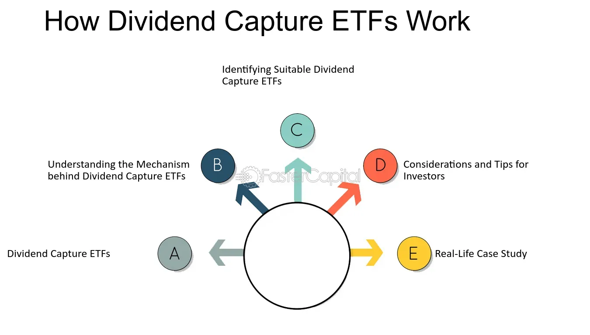

## Table of Contents

## What is an ETF?

An ETF, or Exchange-Traded Fund, is a type of investment that works a lot like a mutual fund but is traded on a stock exchange, just like a stock. It's a basket of different investments, like stocks, bonds, or commodities, that you can buy and sell throughout the day. This makes it easy for you to invest in a whole bunch of different things all at once, without having to buy each one separately.

ETFs are popular because they offer a lot of benefits. They usually have lower fees than mutual funds, which means you get to keep more of your money. They're also very flexible because you can buy and sell them whenever the market is open. Plus, they're really easy to understand and use, even if you're new to investing. So, whether you want to invest in a specific industry, like technology, or in a broad market, like the S&P 500, there's probably an ETF that fits what you're looking for.

## What are dividends?

Dividends are payments that companies give to their shareholders, usually from the profits they make. When a company does well and makes money, it can choose to share some of that money with the people who own its stock. This sharing happens regularly, often every three months, but it can be more or less often depending on the company. The amount you get depends on how many shares of the company's stock you own. If you own more shares, you get more money.

Getting dividends is like getting a little bonus for owning a piece of the company. You can either spend this money or reinvest it by buying more shares of the company's stock. Not all companies pay dividends, though. Some, especially newer or smaller companies, might decide to use all their profits to grow the business instead of sharing it with shareholders. But for people who like a steady income from their investments, dividends can be a nice way to earn some extra cash.

## How do ETFs generate dividends?

ETFs generate dividends by holding stocks or other assets that pay dividends themselves. When the companies inside the [ETF](/wiki/etf-trading-strategies) pay out dividends, the ETF collects all those payments. Then, the ETF usually passes those dividends along to its own shareholders. This means if you own shares of an ETF, you might get a dividend payment from it, depending on what the ETF owns and how it's managed.

Not all ETFs pay dividends, though. Some ETFs focus on growth and might not include many dividend-paying stocks. Others might reinvest the dividends they receive to buy more assets instead of paying them out to shareholders. So, if you're looking for an ETF that pays dividends, you'll want to check what it holds and how it handles the dividends it receives from those holdings.

## What is the difference between a dividend ETF and a non-dividend ETF?

A dividend ETF is an exchange-traded fund that focuses on investing in companies that pay regular dividends. These ETFs collect the dividends from the stocks they own and then pass those dividends on to their shareholders. This means if you own shares in a dividend ETF, you can expect to receive regular payments, which can be a nice source of income. Dividend ETFs are popular among investors who want a steady income from their investments, like retirees or those looking for passive income.

On the other hand, a non-dividend ETF does not focus on dividend-paying stocks. These ETFs might invest in companies that are growing quickly but don't pay dividends, or they might reinvest any dividends they receive back into the fund to buy more assets. This approach can be good for investors who are more interested in the potential for their investment to grow over time rather than getting regular income. So, the main difference is that dividend ETFs give you regular payments, while non-dividend ETFs focus more on increasing the value of your investment.

## How often are dividends paid out by ETFs?

Dividends from ETFs are usually paid out every three months, which is called quarterly. But this can change depending on the ETF. Some ETFs might pay dividends every month, while others might pay them every six months or even once a year. It all depends on the companies the ETF owns and how they choose to pay out their dividends.

If you're thinking about investing in an ETF for the dividends, it's a good idea to check how often it pays them out. This way, you can plan your income better. Remember, not all ETFs pay dividends, so make sure to pick one that fits what you're looking for, whether it's regular income or growing your investment over time.

## What factors influence the dividend yield of an ETF?

The dividend yield of an ETF is influenced by the dividends paid by the companies it holds. If an ETF owns stocks from companies that pay high dividends, the ETF's dividend yield will be higher. On the other hand, if the ETF holds stocks from companies that pay low or no dividends, the ETF's yield will be lower. The overall performance of the companies in the ETF also matters. If the companies are doing well and making more profits, they might pay higher dividends, which would increase the ETF's yield.

Another [factor](/wiki/factor-investing) is the ETF's expense ratio. This is the fee the ETF charges for managing the fund. A higher expense ratio can lower the dividend yield because it reduces the amount of money available to be paid out as dividends. Also, how the ETF is managed can affect its yield. Some ETFs might choose to reinvest dividends instead of paying them out, which would lower the yield. So, when you're looking at an ETF's dividend yield, it's important to consider all these things to understand what you might get from your investment.

## How are ETF dividends taxed?

When you get dividends from an ETF, you usually have to pay taxes on them. The tax rate depends on whether the dividends are considered "qualified" or "non-qualified." Qualified dividends are taxed at a lower rate, similar to long-term capital gains, which can be 0%, 15%, or 20% depending on your income. Non-qualified dividends, on the other hand, are taxed at your regular income tax rate, which can be higher.

To be considered qualified, the dividends must come from a U.S. company or a qualified foreign company, and you must have held the ETF for more than 60 days during the 121-day period that begins 60 days before the ex-dividend date. If these conditions aren't met, the dividends will be non-qualified. It's also important to remember that you might have to pay state taxes on your ETF dividends, depending on where you live. Always check with a tax professional to understand how ETF dividends will affect your taxes.

## What is the process of reinvesting ETF dividends?

Reinvesting ETF dividends means using the money you get from dividends to buy more shares of the ETF instead of taking the cash. Many ETFs offer a dividend reinvestment plan (DRIP) that makes this easy. When you sign up for a DRIP, the dividends you earn are automatically used to buy more shares of the ETF. This can help your investment grow over time because you're buying more shares without spending extra money.

The process is pretty simple. Once you own shares in an ETF that offers a DRIP, you just need to tell your broker that you want to reinvest your dividends. Then, whenever the ETF pays out dividends, your broker will use that money to buy more shares for you. This can happen every time you get a dividend, which could be monthly, quarterly, or at some other interval, depending on the ETF. Over time, reinvesting dividends can lead to owning more shares, which means you could earn even more dividends in the future.

## How can investors use ETF dividends in their investment strategy?

Investors can use ETF dividends as a key part of their investment strategy to generate a steady income. If you're someone who wants regular money from your investments, like a retiree, you might pick ETFs that pay high dividends. These ETFs invest in companies that share their profits often. By getting these dividends, you can have money coming in without selling your investments. This can be a good way to live off your investments without touching the main amount you've put in.

Another way to use ETF dividends is to grow your investment over time. Instead of taking the dividend money as cash, you can choose to reinvest it. Many ETFs let you automatically buy more shares with your dividends through a dividend reinvestment plan (DRIP). This means your investment can grow bigger because you're buying more shares without spending extra money. Over many years, this can really add up and help your investment get bigger and bigger.

## What are the implications of dividend reinvestment on compound growth?

When you reinvest dividends, you're using the money you get from dividends to buy more shares of the ETF. This can make your investment grow faster because of something called compound growth. Compound growth means that the money you earn from your investment starts [earning](/wiki/earning-announcement) money too. So, if you reinvest your dividends, you're not just growing your investment with the money you put in at the start. You're also growing it with the dividends you earn along the way. Over time, this can make your investment much bigger than if you just took the dividends as cash.

For example, let's say you own shares in an ETF and it pays you dividends every three months. If you choose to reinvest those dividends, you'll buy more shares each time. The more shares you have, the more dividends you'll get in the future. This cycle keeps going, and the effect gets stronger the longer you keep reinvesting. It's like a snowball rolling down a hill, getting bigger and bigger. This is why reinvesting dividends can be a powerful way to grow your investment over the long term.

## How do ETFs manage their dividend distribution policies?

ETFs manage their dividend distribution policies based on the stocks or other assets they hold. If an ETF owns shares in companies that pay dividends, it collects those dividends. Then, the ETF decides what to do with this money. Some ETFs pay out the dividends they collect to their own shareholders. This means if you own shares in the ETF, you'll get a dividend payment from it. Other ETFs might choose to reinvest those dividends back into the fund to buy more assets. This can help the ETF grow over time, but it means you won't get the dividends as cash.

The frequency of dividend distributions can also vary. Most ETFs pay out dividends every three months, which is called quarterly. But some ETFs might pay dividends every month, while others might do it every six months or even once a year. It all depends on the companies the ETF owns and how they choose to pay out their dividends. If you're thinking about investing in an ETF for the dividends, it's a good idea to check how often it pays them out so you can plan your income better. Remember, not all ETFs pay dividends, so make sure to pick one that fits what you're looking for, whether it's regular income or growing your investment over time.

## What are the advanced strategies for optimizing ETF dividend income?

One advanced strategy for optimizing ETF dividend income is to focus on ETFs that track high-dividend indexes. These ETFs invest in companies known for paying high dividends regularly. By choosing these ETFs, you can get more income from your investments. Another part of this strategy is to look at the ETF's expense ratio. A lower expense ratio means more of the dividends the ETF collects can be paid out to you. So, [picking](/wiki/asset-class-picking) ETFs with low fees can help you keep more of the dividend income.

Another strategy is to use a dividend reinvestment plan (DRIP) to grow your investment over time. When you reinvest dividends, you buy more shares of the ETF without spending extra money. This can lead to compound growth, where your investment grows bigger and bigger because the dividends you earn start earning more dividends. Over many years, this can really add up and help your investment get much larger. It's like planting a seed and watching it grow into a big tree. By using these strategies, you can make the most out of your ETF dividend income.

## What is Understanding Dividend Investments?

Dividends are distributions made by a corporation to its shareholders, usually in the form of cash or additional shares. Cash dividends provide shareholders with a direct cash income, typically disbursed quarterly. Reinvested dividends, on the other hand, are used to purchase more shares of the issuing stock, allowing investors to compound their investment over time. This reinvestment can boost total returns by taking advantage of the compounding effect, where dividends generate additional dividends.

Dividend investing is an attractive strategy due to its potential for providing passive income and facilitating compounding growth. Passive income from dividends can offer a steady income stream, particularly appealing to retirees or those seeking to supplement their income. Compounding growth occurs as dividends are reinvested, enhancing the value of an investment over time. This effect can be described mathematically as: 

$$
A = P \left(1 + \frac{r}{n}\right)^{nt}
$$

where:
- $A$ is the amount of money accumulated after n years, including interest.
- $P$ is the principal amount (initial investment).
- $r$ is the annual dividend yield or interest rate.
- $n$ is the number of times dividends are compounded per year.
- $t$ is the number of years the money is invested for.

Selecting dividend-paying stocks requires careful consideration of various factors. Investors often consider the dividend yield, which represents the annual dividend payment divided by the stock price, serving as an indicator of the return on investment from dividends. However, a higher yield might indicate higher risk, potentially stemming from an unsustainably high payout ratio or a struggling business. Thus, assessing the payout ratio, which is the proportion of earnings paid out as dividends, is crucial. A sustainable payout ratio suggests the company has room to maintain or grow dividends over time. Additionally, evaluating a company's historical dividend growth helps in understanding its commitment to returning value to shareholders.

The impact of dividends on long-term portfolio growth is profound. Regular dividend payments can contribute significantly to an investor's total return. Studies have shown that reinvested dividends account for a large portion of total stock market returns over the long term. By continuously reinvesting dividends, investors can harness the compounding effect, leading to substantial growth in the value of their portfolios, even during periods of market [volatility](/wiki/volatility-trading-strategies) or stagnation. This long-term growth potential underscores the value of incorporating dividend-paying stocks into an investment strategy focused on wealth accumulation.

## References & Further Reading

[1]: ["Advances in Financial Machine Learning"](https://www.amazon.com/Advances-Financial-Machine-Learning-Marcos/dp/1119482089) by Marcos Lopez de Prado

[2]: Bergstra, J., Bardenet, R., Bengio, Y., & Kégl, B. (2011). ["Algorithms for Hyper-Parameter Optimization."](https://dl.acm.org/doi/10.5555/2986459.2986743) Advances in Neural Information Processing Systems 24.

[3]: ["The Intelligent Investor: The Definitive Book on Value Investing"](https://www.amazon.com/Intelligent-Investor-Definitive-Investing-Essentials/dp/0060555661) by Benjamin Graham

[4]: ["Evidence-Based Technical Analysis: Applying the Scientific Method and Statistical Inference to Trading Signals"](https://www.amazon.com/Evidence-Based-Technical-Analysis-Scientific-Statistical/dp/0470008741) by David Aronson

[5]: ["Quantitative Trading: How to Build Your Own Algorithmic Trading Business"](https://www.amazon.com/Quantitative-Trading-Build-Algorithmic-Business/dp/1119800064) by Ernest P. Chan

[6]: ["Machine Learning for Algorithmic Trading"](https://github.com/stefan-jansen/machine-learning-for-trading) by Stefan Jansen