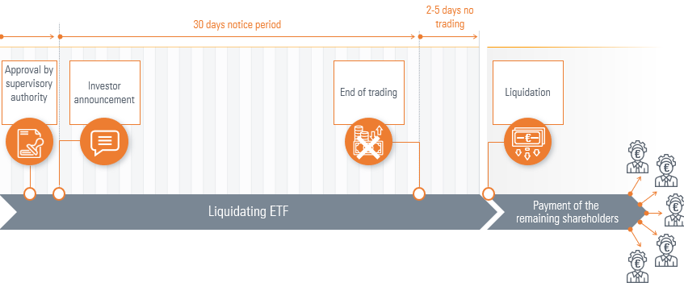

## Table of Contents

## What is an ETF?

An ETF, or Exchange-Traded Fund, is a type of investment that holds a collection of assets like stocks, bonds, or commodities. You can buy and sell ETFs on a stock exchange, just like you would with regular stocks. This makes it easy for people to invest in a variety of assets without having to buy each one separately.

ETFs are popular because they offer a way to diversify your investments. Instead of putting all your money into one stock, you can spread it across many different ones with just one ETF. They also tend to have lower fees than other types of funds, which can save you money over time. This makes ETFs a good choice for both new and experienced investors looking to grow their money.

## Why would an ETF be liquidated?

An ETF might be liquidated if it's not doing well. If not enough people are buying the ETF, the company that runs it might decide to close it down. This can happen if the ETF is not making money or if it's too hard to keep it going. When an ETF is liquidated, it means the company sells all the assets inside the ETF and gives the money back to the investors.

Sometimes, big changes in the market or new rules can also lead to an [ETF](/wiki/etf-trading-strategies) being liquidated. For example, if a new law makes it harder for the ETF to operate, the company might choose to close it. Or if the market changes a lot and the ETF's strategy doesn't work anymore, it might be better to liquidate it. When this happens, investors get their share of the money from the sold assets, but they need to find a new place to invest their money.

## What are the initial steps in the ETF liquidation process?

When an ETF is going to be liquidated, the first thing that happens is that the company running the ETF tells everyone. They let the investors know that the ETF will be closing down. This is important so that people can start planning what to do with their money. The company also tells everyone when the last day to buy or sell the ETF will be. This is called the delisting date.

After that, the company starts selling all the things inside the ETF, like stocks or bonds. They turn these assets into cash. Once everything is sold, they figure out how much money each investor should get. They do this by dividing the total money by the number of shares people own. Then, they give this money back to the investors. This whole process can take some time, but it's done to make sure everyone gets their fair share.

## How is the decision to liquidate an ETF made?

The decision to liquidate an ETF is made by the company that runs it. They look at how well the ETF is doing. If not many people are buying the ETF and it's not making money, the company might decide it's better to close it down. They also think about if it's too hard or too expensive to keep the ETF going. Sometimes, changes in the market or new laws can make it tough for the ETF to keep working well, so the company might choose to liquidate it.

When the company decides to liquidate the ETF, they tell everyone who owns shares in it. They explain why they're closing the ETF and when it will happen. This gives investors time to figure out what to do with their money next. The company then starts selling all the things inside the ETF to turn them into cash. Once everything is sold, they divide the money among the investors based on how many shares each person owns.

## What are the roles of the ETF issuer and the board of directors during liquidation?

The ETF issuer is the company that runs the ETF. When they decide to liquidate the ETF, they are in charge of the whole process. They start by telling all the investors that the ETF will be closing down. They also set a date for when the ETF will stop trading on the stock exchange. After that, the issuer sells all the assets inside the ETF, like stocks or bonds, and turns them into cash. Once everything is sold, they figure out how much money each investor should get and give it back to them.

The board of directors also has a big role in the liquidation process. They are the ones who help make the decision to close the ETF. They look at how the ETF is doing and decide if it's better to liquidate it. If they agree, they work with the ETF issuer to make sure everything goes smoothly. They make sure the investors are told about the liquidation and that the process follows all the rules. The board oversees the whole thing to make sure it's fair and done right.

## How are shareholders notified about the liquidation of an ETF?

When an ETF is going to be liquidated, the company that runs the ETF, called the issuer, tells all the shareholders about it. They usually send a letter or an email to everyone who owns shares in the ETF. This message explains that the ETF will be closing down and gives a date for when it will stop trading on the stock exchange. This way, shareholders know when they need to sell their shares if they want to.

The board of directors also helps make sure that shareholders are well-informed. They work with the issuer to make sure the message about the liquidation is clear and reaches everyone. The board makes sure that all the steps in the process are done correctly and that shareholders get all the important information they need. This includes knowing when the ETF will be delisted and how they will get their money back after the assets are sold.

## What happens to the assets of an ETF during liquidation?

When an ETF is being liquidated, the company that runs the ETF starts selling all the things inside it. These things can be stocks, bonds, or other types of investments. The company turns these assets into cash. This is done to make sure there's money to give back to the people who own shares in the ETF.

Once all the assets are sold, the company figures out how much money each shareholder should get. They do this by dividing the total amount of cash by the number of shares people own. Then, they give this money back to the shareholders. This way, everyone gets their fair share of what's left from the ETF.

## How is the final net asset value (NAV) of an ETF determined during liquidation?

When an ETF is being liquidated, the final net asset value (NAV) is figured out by selling all the things inside the ETF, like stocks and bonds. Once everything is sold, the company adds up all the money they got from selling these assets. This total amount of money is what they use to find the final NAV.

To get the final NAV per share, the company takes the total money from the sold assets and divides it by the number of shares that people own in the ETF. This way, they can tell how much money each share is worth at the end. Then, they give this money back to the shareholders based on how many shares each person has.

## What are the tax implications for shareholders when an ETF is liquidated?

When an ETF is liquidated, shareholders might have to pay taxes on the money they get back. This depends on how much they originally paid for their shares and how much they get when the ETF is closed. If the money they get back is more than what they paid, they might have to pay capital gains tax on the difference. This is like when you sell a stock for more than you bought it for. If they get less money back than they paid, they might be able to use that loss to lower their taxes on other investments.

The tax rules can be different depending on where you live and how long you owned the ETF. If you held the ETF for more than a year, you might pay a lower long-term capital gains tax rate. But if you held it for less than a year, you might pay a higher short-term capital gains tax rate, which is the same as your regular income tax rate. It's a good idea to talk to a tax professional to understand exactly how the liquidation of an ETF will affect your taxes.

## How long does the ETF liquidation process typically take?

The ETF liquidation process usually takes a few weeks to a few months. It depends on how quickly the company can sell all the things inside the ETF, like stocks or bonds. Once they start selling, they need to wait until everything is sold before they can figure out how much money each shareholder gets. This can take some time because they want to get the best price for the assets.

After all the assets are sold, the company needs to do some math to find out how much money each person should get. They divide the total money by the number of shares people own. Then, they give this money back to the shareholders. The whole process can take longer if there are a lot of assets to sell or if the market is not doing well. But usually, it's done within a few months.

## What are the potential impacts of ETF liquidation on the market?

When an ETF gets liquidated, it can affect the market in a few ways. If the ETF holds a lot of a certain stock or bond, selling all those assets at once can make the price of that stock or bond go down. This is because there are suddenly more shares for sale than people want to buy. If a lot of people are selling at the same time, it can make the market more unstable. This might worry other investors and make them want to sell their investments too, which can cause even more changes in the market.

On the other hand, the impact might not be very big if the ETF is small or if it holds a lot of different things. When an ETF is small, selling its assets might not change the market much because it's just a tiny part of the whole market. Also, if the ETF has a lot of different kinds of investments, selling them won't affect any one stock or bond too much. So, the effect on the market can be different depending on how big the ETF is and what it holds.

## What measures can be taken by investors to mitigate risks associated with ETF liquidation?

Investors can take a few steps to lower the risks that come with an ETF being liquidated. One good idea is to keep an eye on how well the ETF is doing. If it's not doing well or if not many people are buying it, it might be a good time to sell your shares before the ETF gets closed down. Another thing to do is to spread out your money across different kinds of investments. This way, if one ETF gets liquidated, you still have other investments that can help balance things out.

It's also smart to check the size and the kinds of things inside the ETF. Smaller ETFs or those with fewer assets might be more likely to be closed down. So, [picking](/wiki/asset-class-picking) ETFs that are bigger and hold a lot of different investments can make them less likely to be liquidated. And if you do find out that an ETF you own is going to be liquidated, it's a good idea to talk to a financial advisor. They can help you figure out the best way to move your money into other investments to keep growing your savings.

## References & Further Reading

[1]: Goodman, L., & Scott, A. (2023). ["The ETF Handbook: Comprehensive Guide to Exchange-Traded Funds."](https://www.morningstar.com/funds/what-is-an-etf-morningstars-etf-guide) John Wiley & Sons.

[2]: Lopez de Prado, M. (2018). ["Advances in Financial Machine Learning."](https://www.amazon.com/Advances-Financial-Machine-Learning-Marcos/dp/1119482089) Wiley.

[3]: Kissell, R. (2013). ["The Science of Algorithmic Trading and Portfolio Management."](https://www.sciencedirect.com/book/9780124016897/the-science-of-algorithmic-trading-and-portfolio-management) Academic Press.

[4]: Chan, E. P. (2017). ["Algorithmic Trading: Winning Strategies and Their Rationale."](https://github.com/ftvision/quant_trading_echan_book) Wiley Trading.

[5]: Poterba, J. M., & Shoven, J. B. (2002). ["Exchange-Traded Funds: A New Investment Option for Taxable Investors."](https://economics.mit.edu/sites/default/files/publications/Exchange-Traded%20Funds%20A%20New%20Investment%20Option.pdf) The Journal of Portfolio Management.

[6]: ["ETF Liquidity and Pricing: Insights from Market Participants"](https://www.fidelity.com/learning-center/investment-products/etf/etf-liquidity) – CFA Institute Research Foundation.