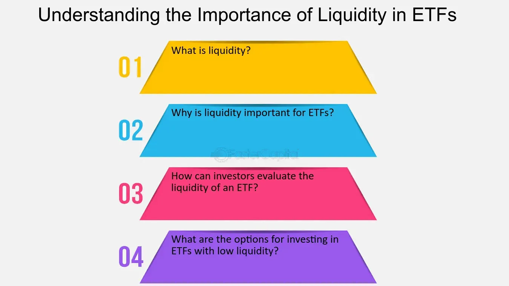

## Table of Contents

## What is an ETF?

An ETF, or Exchange-Traded Fund, is a type of investment that works like a basket. It holds a collection of different things like stocks, bonds, or commodities. You can buy and sell shares of an ETF on a stock exchange, just like you would with regular stocks. This makes it easy for people to invest in a variety of assets without having to buy each one separately.

ETFs are popular because they offer a way to diversify your investments. Instead of putting all your money into one stock, you can spread it across many different stocks or other assets. This can help reduce risk. Plus, ETFs often have lower fees than other types of funds, which means you get to keep more of your money. They are a good choice for both new and experienced investors looking to grow their savings.

## What does liquidity mean in the context of ETFs?

Liquidity in the context of ETFs means how easily you can buy or sell shares of the ETF without affecting its price too much. If an ETF has high liquidity, it means there are a lot of buyers and sellers, so you can quickly trade your shares at a price close to the current market value. This is important because it helps you get in and out of your investment without losing much money due to price changes.

On the other hand, if an [ETF](/wiki/etf-trading-strategies) has low [liquidity](/wiki/liquidity-risk-premium), it might be harder to buy or sell shares. There might not be many people trading, so when you want to sell, you might have to accept a lower price, or when you want to buy, you might have to pay more. This can make it riskier to invest in less liquid ETFs because the price can be more unpredictable.

## Why is liquidity important for ETF investors?

Liquidity is important for ETF investors because it makes it easier to buy and sell shares. When an ETF has high liquidity, there are lots of people trading it. This means you can quickly get in and out of your investment without having to wait. It's like having a busy marketplace where you can always find someone to trade with. This is helpful if you need to sell your shares quickly or if you want to buy more without causing big changes in the price.

If an ETF doesn't have much liquidity, it can be harder to trade. You might have to wait longer to find someone to buy from or sell to. This can also mean that the price might change a lot when you trade, which isn't good. For example, if you want to sell your shares but not many people are buying, you might have to sell them for less than you wanted. So, liquidity helps keep things smooth and predictable for investors, making it easier to manage their investments.

## How is ETF liquidity measured?

ETF liquidity is measured by looking at how many shares are traded each day. This is called the average daily trading [volume](/wiki/volume-trading-strategy). If an ETF has a high average daily trading volume, it means a lot of people are buying and selling it, so it's easier to trade your shares without affecting the price much.

Another way to measure liquidity is by looking at the bid-ask spread. This is the difference between the highest price someone is willing to pay for the ETF (the bid) and the lowest price someone is willing to sell it for (the ask). A smaller bid-ask spread means the ETF is more liquid because you can buy and sell at prices that are close to each other.

Sometimes, people also look at the underlying assets of the ETF to understand its liquidity. If the ETF holds a lot of liquid stocks or other assets, it can be easier to trade. This is because the ETF's shares can be created or redeemed more easily, which helps keep the market for the ETF active and liquid.

## What factors affect the liquidity of an ETF?

Several things can affect how easy it is to buy and sell shares of an ETF. One big [factor](/wiki/factor-investing) is how much people are trading the ETF every day. If lots of people are buying and selling, the ETF is more liquid because it's easier to find someone to trade with. Another factor is the difference between the price someone wants to buy the ETF for and the price someone wants to sell it for. If this difference, called the bid-ask spread, is small, it means the ETF is more liquid because you can trade without losing much money on the price difference.

The assets that the ETF holds can also affect its liquidity. If the ETF has a lot of stocks or other things that are easy to buy and sell, the ETF itself will be more liquid. This is because the people who manage the ETF can create or get rid of shares more easily, which helps keep the market for the ETF active. Also, if the ETF is popular and well-known, more people might want to trade it, making it more liquid. So, the type of assets, how easy they are to trade, and how popular the ETF is all play a role in its liquidity.

## How does trading volume impact ETF liquidity?

Trading volume is a big part of how easy it is to buy and sell shares of an ETF. When lots of people are trading an ETF every day, it means the ETF has high liquidity. This is good because it's easier to find someone to trade with. If you want to sell your shares, you can do it quickly without having to wait. If you want to buy more shares, you can do that easily too. High trading volume makes the ETF's market busy and active, which helps keep the prices stable.

On the other hand, if not many people are trading the ETF, it has low liquidity. This can make it harder to buy or sell your shares. You might have to wait longer to find someone to trade with, and when you do find someone, the price might not be what you expected. Low trading volume can make the price go up and down a lot, which can be risky. So, trading volume is really important for how liquid an ETF is, and it affects how easy it is for investors to manage their investments.

## What is the bid-ask spread and its relation to ETF liquidity?

The bid-ask spread is the difference between the highest price someone is willing to pay for an ETF (the bid) and the lowest price someone is willing to sell it for (the ask). It's like the gap between what buyers are offering and what sellers want. If this gap is small, it means the ETF is more liquid. A smaller bid-ask spread shows that there are a lot of people trading the ETF, making it easier to buy and sell without losing much money on the price difference.

When the bid-ask spread is large, it can mean the ETF is less liquid. This happens when fewer people are trading the ETF, so it's harder to find someone to buy from or sell to. A bigger spread can make it more expensive to trade because you might have to pay more to buy or get less when you sell. So, the bid-ask spread is an important sign of how easy it is to trade an ETF, and it helps investors understand the ETF's liquidity.

## How can investors assess the liquidity of an ETF before investing?

Investors can check the liquidity of an ETF by looking at how many shares are traded each day. This is called the average daily trading volume. If a lot of people are buying and selling the ETF every day, it means the ETF is liquid. You can find this information on financial websites or through your broker. A high trading volume makes it easier to buy and sell your shares without waiting too long or affecting the price too much.

Another way to assess liquidity is by looking at the bid-ask spread. This is the difference between the price someone is willing to pay for the ETF and the price someone is willing to sell it for. A small bid-ask spread means the ETF is more liquid because you can trade without losing much money on the price difference. You can see the bid-ask spread on trading platforms or financial news sites. It's a good idea to compare these numbers for different ETFs to see which ones are easier to trade.

Lastly, consider the assets inside the ETF. If the ETF holds a lot of stocks or other things that are easy to buy and sell, it can be more liquid. This is because the people who manage the ETF can create or get rid of shares more easily, which helps keep the market for the ETF active. You can find out what an ETF holds by looking at its fact sheet or prospectus. By checking these three things—trading volume, bid-ask spread, and the liquidity of the underlying assets—investors can get a good idea of how liquid an ETF is before they decide to invest.

## What are the risks of investing in ETFs with low liquidity?

Investing in ETFs with low liquidity can be risky. When an ETF doesn't have many people trading it, it can be hard to sell your shares quickly. You might have to wait a long time to find someone who wants to buy them. This can be a problem if you need your money fast. Also, when you do find someone to trade with, you might have to sell your shares for less than you wanted. This means you could lose money just because the ETF isn't very popular.

Another risk is that the price of the ETF can change a lot. When not many people are buying and selling, even a small trade can make the price go up or down a lot. This can make it hard to predict what your investment will be worth. If you need to sell and the price suddenly drops, you could lose more money than you expected. So, it's important to think about how easy it is to trade an ETF before you invest in one with low liquidity.

## How do market makers influence ETF liquidity?

Market makers are important for ETF liquidity. They are like middlemen who help make trading easier. When you want to buy or sell an ETF, market makers are there to take the other side of the trade. They buy from you if you want to sell and sell to you if you want to buy. This helps keep the market active, even when not many people are trading. By doing this, market makers make it easier for you to trade your shares without waiting too long.

Market makers also help keep the price of the ETF stable. They do this by setting the bid and ask prices. The bid is what they are willing to pay for the ETF, and the ask is what they are willing to sell it for. By keeping the difference between these prices small, market makers make the ETF more liquid. This means you can trade without losing much money on the price difference. So, market makers play a big role in making sure ETFs are easy to buy and sell.

## What strategies can be used to manage liquidity risk in ETF portfolios?

To manage liquidity risk in ETF portfolios, one strategy is to focus on ETFs with high trading volumes. These ETFs are easier to buy and sell because a lot of people are trading them every day. By choosing ETFs that are popular and have a lot of activity, you can avoid the problem of waiting a long time to trade or having to accept a bad price. Another way is to keep an eye on the bid-ask spread. If the difference between what someone is willing to pay and what someone is willing to sell for is small, it's easier to trade without losing much money. So, [picking](/wiki/asset-class-picking) ETFs with a small bid-ask spread can help manage liquidity risk.

Another strategy is to diversify your ETF portfolio. Instead of putting all your money into one ETF, you can spread it across different ETFs. This way, if one ETF is hard to trade, you can still sell other ETFs that are more liquid. It's also a good idea to check the assets inside the ETFs. If an ETF holds a lot of stocks or other things that are easy to buy and sell, it will be easier to trade the ETF itself. By choosing ETFs with liquid underlying assets, you can reduce the risk of not being able to trade when you need to.

## How does ETF liquidity impact the overall market efficiency?

ETF liquidity plays a big role in making the overall market work better. When ETFs are easy to buy and sell, it helps keep the market active and lively. More people trading means prices stay fair and close to what they should be. This is good because it makes the market more predictable and easier for everyone to use. If lots of people are trading an ETF, it means there are always buyers and sellers ready to trade, which helps keep the market running smoothly.

On the other hand, if ETFs are hard to trade because they're not very liquid, it can make the market less efficient. When it's hard to buy or sell an ETF, prices can jump around a lot, and it can be tough to know what things are really worth. This can make the market feel unpredictable and risky. So, having ETFs that are easy to trade helps the whole market work better by keeping prices stable and making it easier for everyone to invest and trade.

## References & Further Reading

[1]: Gastineau, G. L. (2002). ["The Exchange-Traded Funds Manual"](https://archive.org/details/exchangetradedfu0000gast). Wiley.

[2]: Hasbrouck, J. (2003). ["Intraday Price Formation in U.S. Equity Index Markets"](https://onlinelibrary.wiley.com/doi/10.1046/j.1540-6261.2003.00609.x). The Journal of Finance, 58(4), 1551-1583.

[3]: Arnuk, S. L., & Saluzzi, J. (2012). ["Broken Markets: How High Frequency Trading and Predatory Practices on Wall Street are Destroying Investor Confidence and Your Portfolio"](https://ptgmedia.pearsoncmg.com/images/9780132875240/samplepages/0132875241.pdf). FT Press.

[4]: Fabozzi, F. J., & Jones, F. J. (2011). ["Investments: An Introduction"](https://onlinelibrary.wiley.com/doi/book/10.1002/9781118267028). Pearson.

[5]: Ferri, R. A. (2009). ["The ETF Book: All You Need to Know About Exchange-Traded Funds"](https://www.amazon.com/ETF-Book-About-Exchange-Traded-Funds/dp/0470537469). Wiley.