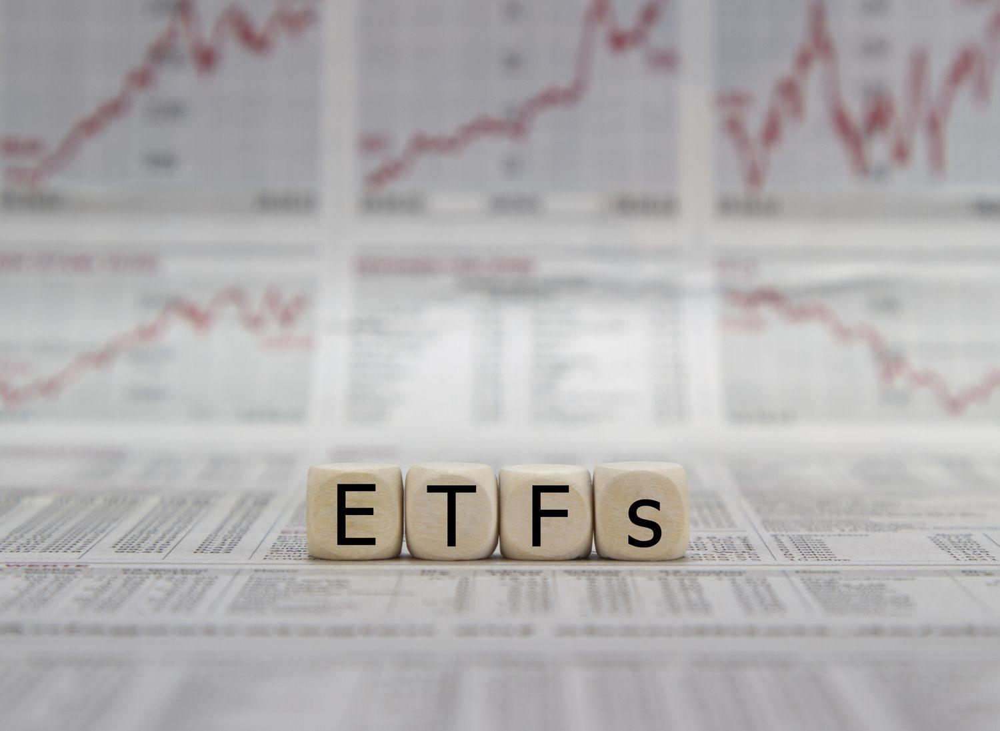

Exchange-traded funds (ETFs) have become an integral part of investment portfolios due to their flexibility, cost-effectiveness, and efficiency. These investment vehicles allow investors to gain exposure to a wide array of asset classes through a single transaction. ETFs typically replicate the performance of a specific index by holding the underlying assets, offering a straightforward way to diversify investments. The global ETF market has grown substantially, with assets under management surpassing $10 trillion in recent years, reflecting their steady adoption by both institutional and retail investors.

Within the diverse ETF landscape, the ETF of ETFs model has gained attention as an innovative strategy. This approach involves investing in a fund that, instead of holding individual securities, comprises other ETFs. The model offers investors the benefit of broad diversification across multiple asset classes and investment strategies, all within one consolidated investment product. This can be particularly advantageous for those seeking to manage risk and achieve a well-rounded portfolio without the need to purchase several individual ETFs.



This article will explore the strategy of investing in ETFs of ETFs, examining its operational framework, its limitations, and the role of algorithmic trading in optimizing this investment approach. Understanding the mechanics and potential benefits of ETFs of ETFs is invaluable for both novice and experienced investors aiming to enhance their investment strategies with diversified exposure. By dissecting key aspects such as cost structure and diversification benefits, this exploration seeks to arm investors with the knowledge needed to make informed decisions in this evolving field.

## Table of Contents

## What Is an ETF of ETFs?

An ETF of ETFs is a distinctive form of pooled investment vehicle that allocates capital into a selection of existing exchange-traded funds (ETFs) instead of directly investing in individual stocks, bonds, or other financial instruments. This innovative investment strategy allows investors to gain broad exposure to a variety of asset classes and market strategies through a singular investment product. By investing in a diverse array of ETFs, an ETF of ETFs facilitates access to a well-rounded portfolio, which can include equities, bonds, commodities, and other investment categories, thereby providing a level of diversification that is typically challenging to achieve through a single traditional ETF.

The strategy embodies the cost-effectiveness and transparency inherent in traditional ETFs while simultaneously offering the sophisticated portfolio construction usually seen in actively managed mutual funds. Traditional ETFs are well-regarded for their low fees due to their passive management style, typically designed to track specific indexes. ETFs of ETFs build on this foundation by strategically selecting a diverse mix of ETFs, each chosen to fulfill specific roles in the overall asset allocation, ultimately curating a blend that may pursue objectives like capital preservation, growth, or income generation.

For investors, this hybrid approach offers the best of both worlds: the cost savings and liquidity found in standard ETFs combined with the expertise and meticulous asset pickings akin to actively managed funds. This allows for complex investment strategies to be executed with relative simplicity and transparency, as the underlying fund selections and allocations are openly disclosed and can be easily tracked. Furthermore, the management of an ETF of ETFs typically involves adjustments over time to maintain targeted exposure or to respond to changing market conditions, providing an element of ongoing strategic oversight often absent in purely passive investment tools.

## How ETFs of ETFs Work

An [ETF](/wiki/etf-trading-strategies) of ETFs aims to provide investors with broad diversification through a strategic selection of various ETFs. The construction of these funds involves a meticulous selection process wherein different ETFs are chosen based on criteria such as risk profiles, asset classes, or market sectors. This amalgamation enables investors to gain exposure to multiple sectors and asset categories via a singular investment vehicle, enhancing diversification while keeping costs manageable.

The selection process within an ETF of ETFs typically considers factors like [volatility](/wiki/volatility-trading-strategies), historical performance, and correlation among available ETFs. By using these parameters, fund managers construct a portfolio that targets specified risk and return objectives. These diversified selections make it possible for the overall fund to balance risk more effectively across various market dynamics, compared to individual ETFs.

One of the essential goals of an ETF of ETFs is to outperform conventional benchmarks. This is achieved by optimizing the allocation of assets to ensure a high Sharpe ratio, which represents the excess return per unit of risk. This mathematical optimization is handled through advanced portfolio construction techniques that strive to allocate weights to each underlying ETF in a way that maximizes expected returns for a given level of market risk.

To illustrate, consider a hypothetical ETF of ETFs with a portfolio split into equities, bonds, and commodities. By selecting ETFs that specialize in U.S. equities, international bonds, and raw materials, the fund manager can tune exposure to reflect current economic forecasts and trends. Suppose $w_i$ and $r_i$ represent the weight and expected return of the $i$th ETF, respectively. The expected return $R$ of the ETF of ETFs can be expressed as:

$$
R = \sum_{i=1}^{n} w_i \times r_i
$$

Moreover, the variance $\sigma^2$, indicating the risk, can be expressed as:

$$
\sigma^2 = \sum_{i=1}^{n} w_i^2 \times \sigma_i^2 + \sum_{i \neq j} w_i \times w_j \times \sigma_{i,j}
$$

where $\sigma_i$ is the standard deviation of the $i$th ETF, and $\sigma_{i,j}$ is the covariance between the returns of the $i$th and $j$th ETFs.

By leveraging optimization frameworks, such as mean-variance optimization, fund managers can efficiently allocate resources, ensuring that an ETF of ETFs meets predefined investment goals. This method, combining diversification with strategic allocation, makes it possible to offer a product that seeks to deliver an optimized balance of risk and return for investors.

## Benefits of ETFs of ETFs

Exchange-traded funds of ETFs provide several significant benefits for investors, primarily focusing on diversification, cost reduction, simplified portfolio management, and [liquidity](/wiki/liquidity-risk-premium). These advantages make ETFs of ETFs an appealing option for investors aiming to achieve broad market exposure through a single investment product.

Firstly, the diversification offered by ETFs of ETFs is instantaneous, as these funds are a collection of various ETFs encompassing different asset classes and market sectors. This structure spreads risk across a broader range of underlying assets, enhancing the resilience of an investment portfolio against market volatility. Diversification can potentially lead to a more stable return profile, as the performance of individual assets is offset by their collective exposure.

In terms of cost efficiency, ETFs of ETFs typically present a reduction in transaction and management fees when compared to the necessity of buying multiple individual ETFs. By consolidating investments into a single product, investors reduce the cumulative effect of transaction costs and management fees associated with maintaining multiple positions. While it’s essential to be aware of the expense ratios of these funds, the potential savings can be significant.

This investment approach also simplifies portfolio management. Managing a portfolio composed of many individual funds or securities can be complex and time-consuming, requiring regular balancing and reallocation based on market conditions. In contrast, an ETF of ETFs offers a strategic asset allocation managed within the fund itself, allowing investors to achieve their desired asset mix with minimal intervention.

Additionally, ETFs of ETFs provide the benefit of liquidity. These funds can be traded on major stock exchanges in a manner akin to individual stocks, offering investors flexibility and ease of access. The liquidity of ETFs of ETFs typically ensures that investors can enter or [exit](/wiki/exit-strategy) positions with relative ease, subject to market conditions, thereby facilitating dynamic portfolio adjustments when necessary.

In summary, the benefits of investing in ETFs of ETFs are primarily characterized by the advantages of diversification, cost reduction, streamlined management, and trading flexibility. These qualities collectively enhance the appeal of ETFs of ETFs for investors seeking a comprehensive investment solution without the complexity of managing multiple assets independently.

## Limitations of ETFs of ETFs

While ETFs of ETFs offer notable strategic advantages, they also present several limitations that potential investors should consider. One of the primary drawbacks is the higher expense ratios that can result from the layering of funds. Essentially, investors are paying for the management of each underlying ETF, as well as the overarching ETF of ETFs. These cumulative costs can erode the overall returns, reducing the cost-effectiveness that ETFs are typically known for.

Additionally, the complexity of the portfolio can be problematic. Due to the multiple layers of investments within an ETF of ETFs, investors may find it challenging to fully understand what they are actually invested in. This complexity can obscure the underlying assets and the strategy being employed, which may lead to a lack of transparency about where client money is being directed. This is a stark contrast to the straightforward nature of traditional ETFs, where holdings are more easily comprehensible.

There's also a notable risk associated with potential concentration in specific sectors or markets. If the fund manager does not effectively balance the portfolio, there can be unintended overlaps in asset allocations, particularly if multiple underlying ETFs hold similar securities. This concentration risk can lead to vulnerabilities in the portfolio, such as underperformance during sector-specific downturns.

Thus, while ETFs of ETFs provide diversification and potentially simplified investment strategies, these limitations underscore the need for careful consideration and thorough research by investors. Understanding the intricate layers of fees, maintaining awareness of the actual holdings, and assessing concentration risks are crucial steps in evaluating the suitability of an ETF of ETFs as an investment option.

## Algorithmic Trading in ETF of ETFs Strategy

Algorithmic trading has become a pivotal component in the management and execution of ETFs of ETFs, offering precision and efficiency that traditional trading methods struggle to match. The use of algorithms facilitates specific execution objectives, ensuring trades are conducted at optimal prices and within desired time frames, thereby minimizing the market impact and enhancing the overall operational efficiency of ETF portfolios.

Among the commonly employed strategies in [algorithmic trading](/wiki/algorithmic-trading) are the Volume-Weighted Average Price (VWAP), Time-Weighted Average Price (TWAP), and Percent of Volume (POV) algorithms. Each of these strategies serves distinct purposes in refining trade executions:

1. **Volume-Weighted Average Price (VWAP):** This strategy aims to execute orders in line with the average price of the ETF within a given time frame, weighted by volume. VWAP algorithms are beneficial when minimizing market impact, as they distribute trades across the trading day based on market activity. The formula for VWAP is given by:
$$
   VWAP = \frac{\sum (Price_i \times Volume_i)}{\sum Volume_i}

$$

   where $Price_i$ and $Volume_i$ represent the price and volume of each trade, respectively.

2. **Time-Weighted Average Price (TWAP):** TWAP focuses on executing an order over a set period, distributing trades evenly throughout the time interval, regardless of volume. This algorithm is particularly useful when a steady execution pace is required, ensuring minimal disruption to market prices. The TWAP strategy can be programmed as a simple algorithm in Python:

   ```python
   def calculate_twap(prices, time_period):
       time_intervals = len(prices) // time_period
       average_price = sum(prices[i: i + time_period]) / time_period for i in range(0, len(prices), time_period)
       return average_price
   ```

3. **Percent of Volume (POV):** This strategy dynamically adjusts execution rates based on real-time market volumes, aligning the trading volume to a predefined percentage of the overall market volume. The POV algorithm is particularly effective in volatile markets where continual adjustments are necessary to maintain the desired market presence.

Algorithmic trading thus optimizes the ETF of ETFs strategy by automating the execution process, reducing errors, and enhancing trading efficiency. These algorithms are integrated into advanced trading platforms, allowing fund managers to navigate complex market conditions and achieve execution goals with precise control and minimal market disruption. The sophistication of algorithmic trading ensures that ETF of ETFs can be managed with a level of sophistication that mirrors the intricate nature of the underlying investment models.

## Investing in an ETF of ETFs

Investing in ETFs of ETFs requires an account with a brokerage firm. This account acts similarly to those used for trading individual stocks or traditional ETFs. Investors can buy and sell ETFs of ETFs on major stock exchanges during regular trading hours, which allows for real-time pricing and liquidity. 

Before investing, it's essential to evaluate one's financial objectives, risk tolerance, and investment horizon. Risk tolerance is a critical [factor](/wiki/factor-investing), as it influences the level and types of exposure within the ETFs of ETFs. Investors with a low risk tolerance may prefer funds that offer a conservative mix of asset classes, while those with a higher risk tolerance may seek funds with more aggressive allocations to equities or emerging markets.

Another consideration is the investment horizon. Long-term investors might focus on funds that provide strategic asset allocations intended to maximize returns over extended periods, potentially capitalizing on market upswings and minimizing the impact of downturns. Conversely, those with short-term objectives may prioritize funds with a focus on liquidity and capital preservation.

Two prominent examples of ETFs of ETFs are the SPDR SSGA Multi-Asset Real Return ETF and the iShares Core Moderate Allocation ETF. The SPDR SSGA Multi-Asset Real Return ETF aims to provide a hedge against inflation by investing in a diverse range of asset classes, including global equities, real estate, and commodities, through underlying ETFs. Meanwhile, the iShares Core Moderate Allocation ETF focuses on achieving a balance between growth and income, comprising a mix of equity and fixed-income ETFs designed for moderate risk investors.

Potential investors should conduct thorough research or consult financial advisors to ensure that their chosen ETF of ETFs aligns with their specific investment goals and risk preferences.

## Conclusion

ETFs of ETFs provide an all-encompassing investment vehicle ideal for investors aiming for diversified exposure across various asset classes with the convenience of managing a single product. This investment strategy capitalizes on the intrinsic benefits of ETFs, such as cost-effectiveness, tax efficiency, and transparency, while enhancing portfolio diversification. However, potential investors must be vigilant about the added costs associated with the multi-layered structure of these funds. These additional expenses, often reflected in higher expense ratios, arise from fees at both the ETF and fund management levels.

A critical element for investors is to thoroughly comprehend the fund's focus and its underlying investments. This includes evaluating the ETF's strategic objectives, asset class exposures, and the sectors it targets. A detailed assessment helps in avoiding over-concentration in specific sectors or asset classes, a risk that can impact return stability.

Staying informed about market trends and understanding the mechanics of ETFs of ETFs is essential for maximizing returns. The investment landscape is continually evolving, necessitating a keen awareness of economic indicators, market shifts, and regulatory changes that could affect ETF performance.

Ultimately, while ETFs of ETFs offer a streamlined approach to achieving a diversified investment portfolio, successful investing demands ongoing diligence, informed decision-making, and a clear understanding of one's financial goals and risk tolerance.

## References & Further Reading

[1]: Agapova, A. (2011). ["Conventional Mutual Index Funds versus Exchange-Traded Funds."](https://www.sciencedirect.com/science/article/pii/S138641811000042X) Journal of Financial Markets, 14(2), 323-343.

[2]: Gastineau, G. (2002). ["Exchange-Traded Funds: An Innovation in Financial Markets."](https://onlinelibrary.wiley.com/doi/book/10.1002/9781118266946) The Research Foundation of AIMR.

[3]: Poterba, J., & Shoven, J. (2002). ["Exchange Traded Funds: A New Investment Option for Taxable Investors."](https://economics.mit.edu/sites/default/files/publications/Exchange-Traded%20Funds%20A%20New%20Investment%20Option.pdf) The American Economic Review, Papers and Proceedings of the One Hundred Fourteenth Annual Meeting of the American Economic Association.

[4]: Hill, J. M., & Nadig, D. (2008). ["ETFs for the Long Run: What They Are, How They Work, and Simple Strategies For Successful Long-Term Investing."](https://www.ovid.com/journals/ptad/fulltext/10.1027/2698-1866/a000016~lost-in-translation-or-just-too-pragmatic-validation-of-the) Wiley.

[5]: Madhavan, A. (2016). ["Exchange-Traded Funds and the New Dynamics of Investing."](https://academic.oup.com/book/3366) Oxford University Press.

[6]: Johnson, B., & Thomas, C. (2012). ["The Index Paradox: Pursuing Outperformance while Preserving Benefits."](https://psycnet.apa.org/record/2012-28070-003) The Journal of Index Investing, 2(2), 35-47.

[7]: Tucker, M. (2013). ["The World of ETF Investing: A Guide for Financial Advisors."](https://www.nerdwallet.com/article/investing/how-to-invest-in-etf-exchange-traded-fund) McGraw-Hill.