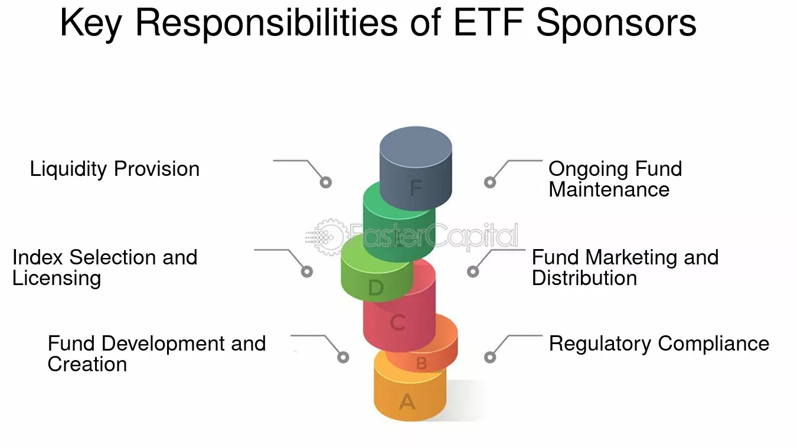

## Table of Contents

## What is an ETF sponsor?

An ETF sponsor is the company that creates and manages an exchange-traded fund (ETF). They are responsible for deciding what the ETF will invest in, like stocks, bonds, or other assets. The sponsor also handles the day-to-day operations of the ETF, making sure it follows the rules and meets its goals. They work with other companies, like custodians and authorized participants, to make sure the ETF runs smoothly.

The sponsor's role is important because they design the ETF's strategy and make sure it stays on track. They also promote the ETF to attract investors. If you buy shares of an ETF, you're investing in a product created by the sponsor. Different sponsors might focus on different types of ETFs, so it's good to know who the sponsor is when you're choosing an ETF to invest in.

## What are the primary roles of an ETF sponsor?

An ETF sponsor is the company that starts and runs an exchange-traded fund. They decide what the ETF will invest in, like stocks, bonds, or other things. They also take care of the ETF every day, making sure it follows the rules and does what it's supposed to do. The sponsor works with other companies, like those who keep the ETF's assets safe and those who help create and sell the ETF shares, to make everything work well.

The sponsor's job is important because they create the [ETF](/wiki/etf-trading-strategies)'s plan and make sure it sticks to it. They also tell people about the ETF to get them to invest in it. When you buy ETF shares, you're putting your money into something the sponsor made. Different sponsors might focus on different kinds of ETFs, so knowing who the sponsor is can help you pick the right ETF for your investment goals.

## How does an ETF sponsor differ from an ETF issuer?

An ETF sponsor and an ETF issuer are often used to mean the same thing, but they can have slightly different roles. The ETF sponsor is the company that comes up with the idea for the ETF and manages it. They decide what the ETF will invest in, like stocks or bonds, and they make sure the ETF follows the rules and meets its goals. The sponsor also works with other companies to keep the ETF running smoothly.

The ETF issuer, on the other hand, is the company that actually creates the ETF and sells its shares to the public. Sometimes, the sponsor and the issuer are the same company, but they can also be different. The issuer handles the legal side of things, like registering the ETF with the government, and they make sure the ETF shares can be bought and sold on the stock market. So, while the sponsor focuses more on managing the ETF, the issuer focuses on getting it out to investors.

## What are the key responsibilities of an ETF sponsor in the creation and redemption process?

An ETF sponsor plays a crucial role in the creation and redemption process of an ETF. When investors want to buy a lot of shares of an ETF, the sponsor works with authorized participants (APs) to create new shares. The APs give the sponsor a basket of securities that matches the ETF's holdings. In return, the sponsor gives the APs new ETF shares, which the APs can then sell to investors. This process helps keep the ETF's price in line with the value of its underlying assets.

On the other hand, when investors want to sell a lot of their ETF shares, the sponsor helps with the redemption process. The APs give the sponsor a large number of ETF shares, and the sponsor gives back a basket of securities that matches the ETF's holdings. This way, the ETF shares are taken out of circulation. By managing both creation and redemption, the ETF sponsor ensures that the ETF can handle big changes in demand and keeps its price stable.

## How does an ETF sponsor manage the fund's assets?

An ETF sponsor manages the fund's assets by making sure they match the ETF's goals. They decide which stocks, bonds, or other things the ETF should invest in. The sponsor also keeps an eye on these investments to make sure they are doing well and still fit with what the ETF is supposed to do. If something changes, like a stock not doing well, the sponsor might sell it and buy something else that better fits the ETF's plan.

The sponsor also works with other companies to help manage the ETF's assets. They team up with custodians who keep the ETF's assets safe and with authorized participants who help create and redeem ETF shares. This teamwork helps the sponsor make sure the ETF's assets are handled correctly and that the ETF can handle big changes in demand from investors. By managing the assets well, the sponsor helps keep the ETF's price stable and in line with what it's supposed to be worth.

## What regulatory requirements must an ETF sponsor comply with?

An ETF sponsor must follow a lot of rules from the government to make sure the ETF is safe and fair for investors. They have to register the ETF with the Securities and Exchange Commission (SEC) in the United States, which means they have to fill out a lot of paperwork and explain what the ETF will do. They also have to follow rules about how they tell people about the ETF, like making sure all the information they share is clear and not misleading. This is called disclosure, and it's really important so that investors can make good choices.

Besides the SEC, ETF sponsors have to follow rules from other groups, like stock exchanges where the ETF's shares are traded. These rules can be about how the ETF is set up, how it's run every day, and how it reports its performance. The sponsor also needs to make sure the ETF follows tax laws, which can be tricky because ETFs can be treated differently from other kinds of investments. By following all these rules, the ETF sponsor helps keep the ETF honest and working well for investors.

## How does an ETF sponsor handle marketing and distribution of the ETF?

An ETF sponsor works hard to let people know about their ETF and get them to invest in it. They use different ways to market the ETF, like putting ads on websites, sending emails, and even talking about it on TV or in magazines. The sponsor makes sure the information they share is easy to understand and tells the truth about what the ETF does and how it might help investors. They also go to meetings and events where they can talk to people who might want to buy the ETF, like financial advisors and big investors.

Once people are interested, the ETF sponsor helps them buy the ETF. They work with big companies, called authorized participants, who can create new ETF shares when a lot of people want to buy them. The sponsor also makes sure the ETF is listed on stock exchanges, so anyone can buy and sell the shares easily. By doing a good job with marketing and distribution, the sponsor helps more people find out about the ETF and decide if it's right for them.

## What role does an ETF sponsor play in setting the fund's investment strategy?

An ETF sponsor is the one who decides what the ETF will invest in. They come up with the plan for the ETF, like whether it should buy stocks, bonds, or other things. They think about what kind of investors the ETF is for and what those investors want. For example, if the ETF is meant for people who want to invest in technology companies, the sponsor will pick stocks from tech firms. The sponsor's job is to make sure the ETF's investments match its goals and keep an eye on them to make sure they're doing well.

Once the ETF is up and running, the sponsor keeps checking the investments to make sure they still fit the plan. If something changes, like a company not doing well anymore, the sponsor might sell those stocks and buy others that are a better fit. This helps keep the ETF on track and working the way it should. By setting and sticking to the investment strategy, the sponsor helps the ETF do what it's supposed to do for the people who invest in it.

## How do ETF sponsors manage tracking errors and ensure the ETF closely follows its benchmark?

An ETF sponsor works hard to make sure the ETF follows its benchmark as closely as possible. They do this by carefully choosing the right stocks, bonds, or other things to put in the ETF, so it matches what the benchmark has. If the benchmark changes, the sponsor will also change the ETF's investments to keep up. They might use special computer programs to help them make these choices quickly and accurately. The sponsor also watches the ETF all the time to see if it's still matching the benchmark well. If they see a problem, they fix it right away to keep the ETF on track.

Sometimes, even with all this work, the ETF might not match the benchmark perfectly. This is called a tracking error. It can happen for a few reasons, like the costs of running the ETF or if the ETF can't buy all the exact same things as the benchmark. The sponsor tries to keep these tracking errors small by being smart about how they manage the ETF's money. They might use different ways to buy and sell investments to save on costs, and they always try to keep the ETF as close to the benchmark as they can. By doing all these things, the sponsor helps make sure the ETF does what it's supposed to do for the people who invest in it.

## What are the financial implications for an ETF sponsor, including fees and costs?

An ETF sponsor makes money by charging fees to the people who invest in the ETF. One of the main fees is called the expense ratio, which is a small percentage of the ETF's total value that investors pay every year. This fee helps the sponsor pay for things like managing the ETF's investments, marketing the ETF, and following all the rules. The sponsor might also charge other fees, like for buying or selling the ETF shares, but these are usually smaller. The size of these fees can affect how much money investors make from the ETF, so it's important for the sponsor to keep them fair and competitive.

Running an ETF also costs the sponsor money. They have to pay for things like trading the ETF's investments, which can cost a lot if the ETF is big or if the market is moving a lot. The sponsor also has to spend money on keeping the ETF's records, following the rules, and telling investors about the ETF. If the ETF doesn't have enough investors, these costs can be a big problem for the sponsor. But if the ETF grows and more people invest in it, the costs can be spread out more, making it easier for the sponsor to make money. So, the sponsor needs to balance the fees they charge with the costs of running the ETF to keep everything working well.

## How do ETF sponsors adapt to changes in market conditions and regulatory environments?

ETF sponsors have to be ready to change how they do things when the market or the rules change. If the market goes up or down a lot, the sponsor might need to buy or sell different investments to keep the ETF doing well. They use special computer programs and smart people to watch the market all the time and make quick choices. If the rules change, like new laws from the government, the sponsor has to make sure the ETF follows them. This might mean changing how they tell people about the ETF or how they manage its money. By staying on top of these changes, the sponsor helps keep the ETF safe and working well for investors.

Sometimes, big changes in the market or the rules can be hard for ETF sponsors. If the market is really different from before, the sponsor might need to think of new ways to invest the ETF's money. They might also need to explain these changes to investors so they understand what's happening. When new rules come out, the sponsor might have to spend more money to follow them, like hiring more people or using new computer systems. But by being ready to change and adapt, the sponsor can keep the ETF strong and keep helping people reach their investment goals.

## What advanced strategies do expert ETF sponsors use to enhance fund performance and manage risk?

Expert ETF sponsors use smart ways to make the ETF do better and keep it safe. They might use something called "sampling" where they pick just some of the stocks or bonds from the benchmark instead of all of them. This can save money and make it easier to match the benchmark. They also use special computer programs to watch the market all the time and make quick choices about buying or selling investments. This helps them keep the ETF's price close to what it should be and manage risks better.

Another way they help the ETF is by using "derivatives" like options and futures. These are like bets on what the market will do next, and they can help the ETF make more money or protect it from big drops in the market. The sponsors also look at how different investments move together, called "correlation," to spread out the ETF's money and lower the risk. By using these smart strategies, expert ETF sponsors can make the ETF perform better and keep it safer for investors.

## References & Further Reading

[1]: Gastineau, G. L. (2002). ["The Exchange-Traded Funds Manual."](https://archive.org/details/exchangetradedfu0000gast) Wiley Finance.

[2]: Hill, J. M., Nadig, D., & Hougan, M. B. (2015). ["A Comprehensive Guide to Exchange-Traded Funds (ETFs): A Comprehensive Guide to Tax Efficient Market Access."](https://papers.ssrn.com/sol3/papers.cfm?abstract_id=2616223) CFA Institute Research Foundation.

[3]: Hasbrouck, J. (2007). ["Empirical Market Microstructure: The Institutions, Economics, and Econometrics of Securities Trading."](https://academic.oup.com/book/52241) Oxford University Press.

[4]: ["ETF Liquidity: A Database Construction and Application to Caribbean Markets"](https://www.investopedia.com/articles/exchangetradedfunds/08/etf-liquidity.asp) MDPI Mathematics journal article by authors Laforet, N., Smith, G., and DeLisle, R. (2020).

[5]: Aldridge, I. (2010). ["High-Frequency Trading: A Practical Guide to Algorithmic Strategies and Trading Systems."](https://www.ahmetbeyefendi.com/wp-content/uploads/2020/07/High-Frequency-Trading-Irene-Aldridge.pdf) Wiley Trading.