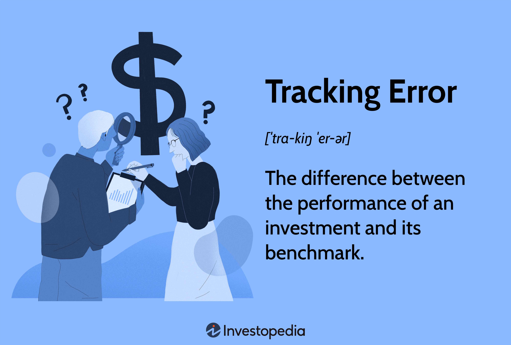

## Table of Contents

## What is an ETF and how does it work?

An ETF, or Exchange-Traded Fund, is a type of investment that you can buy and sell on a stock exchange, just like individual stocks. It's a basket of securities, like stocks, bonds, or commodities, that's designed to track the performance of a specific index, sector, or asset class. For example, an ETF might track the S&P 500, which means it tries to mimic the performance of the 500 largest companies in the U.S.

When you invest in an ETF, you're essentially buying a small piece of all the assets it holds. This allows you to diversify your investments easily without having to buy each security individually. ETFs are popular because they offer a convenient and cost-effective way to gain exposure to a wide range of assets. They usually have lower fees than mutual funds, and you can trade them throughout the day at market prices, unlike mutual funds which are priced once at the end of the trading day.

## What is tracking error in the context of ETFs?

Tracking error is a way to measure how well an ETF is doing its job of copying the performance of the index it's supposed to follow. Imagine you're trying to walk exactly in someone else's footsteps. If you step a little to the left or right, that's like the ETF not matching the index perfectly. This difference between the ETF's performance and the index's performance is called tracking error.

There are a few reasons why an ETF might have a tracking error. Sometimes, it's because of the costs involved in running the ETF, like management fees or transaction costs. Other times, it might be because the ETF can't buy every single thing in the index, so it has to choose similar things instead. While a small tracking error is normal, a big one might mean the ETF isn't doing a good job at following its index.

## How is tracking error calculated?

Tracking error is calculated by figuring out the difference between the returns of the ETF and the returns of the index it's supposed to follow. You do this over a certain period of time, like a year. First, you find the daily or monthly returns for both the ETF and the index. Then, you subtract the index's return from the ETF's return for each of those days or months. This gives you a series of differences.

Next, you take all those differences and calculate the standard deviation of them. Standard deviation is a way to measure how spread out the numbers are. A higher standard deviation means the ETF's performance is more different from the index's performance, which means a bigger tracking error. A lower standard deviation means the ETF is doing a better job at matching the index. So, the tracking error is basically the standard deviation of the differences between the ETF's returns and the index's returns.

## What are the common causes of tracking error in ETFs?

Tracking error in ETFs can happen for a few reasons. One big reason is the costs of running the ETF. These costs include things like management fees, which are what the ETF company charges to manage the fund, and transaction costs, which are what it costs to buy and sell the things inside the ETF. These costs can make the ETF's performance a little different from the index it's trying to copy.

Another reason for tracking error is that sometimes the ETF can't buy every single thing in the index. This can happen because the index might have too many things in it, or some of those things might be hard to buy. So, the ETF has to choose things that are similar but not exactly the same. This can lead to small differences in how the ETF and the index perform.

Also, timing can play a role. The ETF might not be able to buy or sell things at the exact same time as the index. This can cause small differences in returns, especially during times when the market is moving a lot. All these things together can add up to create tracking error, which is why it's normal for ETFs to have some level of tracking error, even if they're trying their best to match the index.

## How can tracking error impact an investor's returns?

Tracking error can affect how much money an investor makes or loses. If an ETF has a big tracking error, it means the ETF isn't doing a good job of copying the index it's supposed to follow. This can lead to the ETF's returns being different from what the investor expected. For example, if the index goes up but the ETF doesn't go up as much, the investor might miss out on some gains. On the other hand, if the index goes down and the ETF goes down even more, the investor could lose more money than they thought they would.

Even a small tracking error can add up over time. If an investor holds an ETF for many years, those small differences can make a big difference in the long run. This is why it's important for investors to look at the tracking error when they're choosing an ETF. By [picking](/wiki/asset-class-picking) an ETF with a smaller tracking error, investors can feel more confident that their investment will perform more like the index they're trying to follow.

## What is returns protection in relation to ETFs?

Returns protection in ETFs means having some kind of safety net to help keep your investment from losing too much value. Some ETFs are designed to protect your returns, especially during times when the market is going down. These ETFs might use different strategies, like buying insurance-like products called options or investing in less risky assets, to try and limit how much money you could lose.

These ETFs can be a good choice for investors who want to be in the market but are worried about big drops in value. However, it's important to know that returns protection usually comes with a cost. The strategies used to protect your returns might make the ETF a bit more expensive or could limit how much money you can make when the market is doing well. So, it's a trade-off between having some protection and possibly not making as much money as you could with a regular ETF.

## What are the different methods used for returns protection in ETFs?

One common method for returns protection in ETFs is using options. Options are like insurance for investments. An ETF might buy put options, which give them the right to sell an asset at a certain price. If the market goes down, the ETF can use these options to limit how much money it loses. But, buying options costs money, so the ETF might not make as much money when the market goes up.

Another method is investing in less risky assets. Some ETFs might put some of their money into bonds or other safer investments instead of just stocks. This can help cushion the ETF if the stock market falls. However, because these safer investments usually don't grow as fast as stocks, the ETF's overall returns might be lower when the market is doing well.

There are also ETFs that use a mix of these methods. They might use options and also invest in a variety of assets to spread out the risk. This can give investors a bit of protection but still let them take part in the market's growth. The key thing to remember is that while these strategies can help protect returns, they can also limit how much money the ETF can make.

## How do ETFs with returns protection differ from standard ETFs?

ETFs with returns protection and standard ETFs are different because they have different goals. Standard ETFs try to copy the performance of an index, like the S&P 500, as closely as they can. They don't do anything special to protect your money if the market goes down. They just go up and down with the market. On the other hand, ETFs with returns protection are made to help keep your investment safe when the market falls. They use special strategies, like buying options or investing in safer assets, to try and limit how much money you could lose.

The trade-off with ETFs that have returns protection is that they might not make as much money when the market is doing well. The strategies they use to protect your returns can be expensive, and they might also mean the ETF can't grow as fast as a standard ETF. So, if you choose an ETF with returns protection, you're choosing to have some safety in exchange for possibly not making as much money when the market is going up.

## What are the advantages and disadvantages of using ETFs with returns protection?

ETFs with returns protection can be a good choice for people who want to invest in the market but are worried about losing too much money. These ETFs use special strategies to help protect your investment if the market goes down. This can give you peace of mind, knowing that you have some safety in place. They are especially useful for people who are close to retiring or those who can't handle big drops in their investment value. By using options or investing in safer assets, these ETFs can help cushion the blow if the market takes a turn for the worse.

However, there are also some downsides to using ETFs with returns protection. The main one is that these ETFs might not make as much money when the market is doing well. The strategies they use to protect your returns can be expensive, and they might also mean the ETF can't grow as fast as a regular ETF. So, if you choose an ETF with returns protection, you're choosing to have some safety in exchange for possibly not making as much money when the market is going up. It's important to think about your own goals and how much risk you're willing to take before deciding if an ETF with returns protection is right for you.

## How can investors assess the effectiveness of an ETF's tracking error management?

Investors can assess the effectiveness of an ETF's tracking error management by looking at how well the ETF matches the performance of the index it's supposed to follow. They can do this by checking the ETF's tracking error, which is the difference between the ETF's returns and the index's returns. A smaller tracking error means the ETF is doing a better job at copying the index. Investors can find this information in the ETF's fact sheet or on financial websites that track ETF performance.

It's also helpful for investors to look at the ETF's expense ratio and other costs. These costs can affect the tracking error because they take away from the ETF's returns. If an ETF has high fees, it might have a bigger tracking error because it's harder for the ETF to match the index's performance after those costs. By comparing different ETFs that track the same index, investors can see which ones manage their tracking error better and make a more informed decision about where to invest their money.

## What advanced strategies can be used to minimize tracking error in ETFs?

To minimize tracking error in ETFs, one advanced strategy is called full replication. This means the ETF tries to buy all the same things that are in the index it's trying to follow. By having all the same things, the ETF can match the index's performance more closely. But, this can be hard if the index has a lot of different things in it or if some of those things are hard to buy. So, another strategy is called sampling or optimization. With this, the ETF picks a smaller group of things that are similar to what's in the index. This can help keep costs down and still do a good job of copying the index.

Another strategy is to use securities lending. This is when the ETF lends out some of the things it owns to other investors for a fee. This can help cover some of the costs of running the ETF, which can make the tracking error smaller. Also, some ETFs use cash management techniques. They might keep some money in cash or short-term investments to handle things like buying and selling costs. By managing these costs better, the ETF can do a better job of matching the index's performance. These strategies can help make the ETF's performance closer to the index, but they need careful management to work well.

## How do regulatory frameworks influence tracking error and returns protection in ETFs?

Regulatory frameworks play a big role in how ETFs manage tracking error and returns protection. These rules are made by government agencies to make sure that ETFs are safe and fair for investors. For example, rules might say how much an ETF can charge in fees or what kinds of things it can invest in. If the fees are too high, it can make the tracking error bigger because the ETF has less money to work with. Also, rules might limit what strategies an ETF can use to protect returns, like using options or investing in certain assets. This means that ETFs have to find ways to manage tracking error and protect returns within the rules set by regulators.

These regulations can also affect how ETFs report their performance and risks to investors. For instance, ETFs might have to tell investors about their tracking error and how they're trying to manage it. This helps investors make better choices about which ETFs to buy. On the other hand, if the rules are too strict, it might be harder for ETFs to use advanced strategies to minimize tracking error or protect returns. So, while regulations are important for keeping the market safe, they can also make it trickier for ETFs to do their job well.

## What is Understanding Tracking Errors?

Tracking error represents the divergence between an index fund's or an Exchange-Traded Fund's (ETF) performance and its benchmark index. This metric is crucial for investors as it measures how closely a portfolio aligns with its intended benchmark, potentially reflecting the effectiveness of the fund management.

### Calculation of Tracking Errors
Tracking error is typically calculated as the standard deviation of the difference between the fund's returns and the benchmark's returns over a set period. Mathematically, it can be expressed as:

$$
\text{Tracking Error} = \sqrt{\frac{\sum_{i=1}^n (R_{p,i} - R_{b,i})^2}{n}}
$$

where $R_{p,i}$ represents the portfolio's return at time $i$ and $R_{b,i}$ is the benchmark's return at that same time. This calculation provides insight into the volatility of excess returns and helps assess the consistency of fund performance relative to the benchmark.

### Importance of Tracking Errors for Investors
Tracking errors hold significant implications for investors, offering insights into how much risk they are exposed to beyond what the benchmark index suggests. A low tracking error suggests that the fund has closely followed the benchmark's performance, offering the anticipated diversification and risk profile. In contrast, a high tracking error may indicate greater deviation, implying that the fund may not be delivering the expected performance, thus affecting the overall risk-return profile of an investor’s portfolio.

### Common Causes of Tracking Errors
Several factors can lead to tracking errors in ETFs and index funds:

1. **Management Fees**: These are usually fixed costs that eat into the fund's returns, reducing them below the benchmark’s performance, especially if the benchmark does not account for such expenses.

2. **Sampling Errors**: Instead of holding all the securities in the benchmark index, a fund might sample a representative portfolio. This can lead to differences in returns due to the imperfect matching of the components.

3. **Transaction Costs and Market Impact**: Buying and selling securities, especially during changes in the index or rebalancing, incur transaction costs. Moreover, significant trades can impact market prices, further deviating returns from the benchmark.

4. **Cash Drag**: ETFs and index funds might hold some cash to manage redemptions or other liquidity needs, which can lead to tracking error if the benchmark is fully invested in securities.

### Impact of High Tracking Errors on Portfolio Returns
High tracking errors can significantly affect an investor's portfolio returns, potentially leading to outcomes that diverge from the expected risk-return profile modeled after the benchmark index. This divergence can manifest as underperformance, reducing the effectiveness of the diversification strategy. Consequently, high tracking errors might result in missed market opportunities and increased exposure to unintended risks, impacting the portfolio's long-term objectives.

Investors need to monitor tracking errors closely as they can offer insights into the fund manager’s ability to closely track the benchmark, informing investment decisions regarding fund selection and portfolio adjustments.

## What is the role of ETFs in investment portfolios?

Exchange-Traded Funds (ETFs) have emerged as a significant player in modern investment strategies due to their inherent advantages, making them an attractive choice for both individual and institutional investors. Introduced in the early 1990s, ETFs have rapidly gained traction and are now a major component of investment portfolios worldwide.

### Rise of ETFs as a Popular Investment Vehicle

The popularity of ETFs can be attributed to their unique structure and the advantages they offer over traditional mutual funds and individual stocks. ETFs are essentially investment funds that are traded on stock exchanges, much like stocks. They usually aim to replicate the performance of a specific index, commodity, or basket of assets. As of 2021, the global [ETF](/wiki/etf-trading-strategies) market had surpassed $9 trillion in assets under management, illustrating the phenomenal growth and widespread adoption of ETFs in investment portfolios [1].

### Benefits of ETFs

1. **Diversification**: ETFs provide investors with exposure to a broad range of assets, sectors, or geographical regions within a single transaction. This diversification helps mitigate risk by reducing the impact of any single security's performance on the overall portfolio.

2. **Liquidity**: Unlike mutual funds, which are traded once a day after market closing, ETFs are traded throughout regular trading hours on the exchange. This feature provides investors with more flexibility and immediacy in executing trades, thereby enhancing liquidity.

3. **Cost-Effectiveness**: Generally, ETFs have lower expense ratios compared to mutual funds due to their passive management style. This cost efficiency is particularly appealing for investors seeking to maximize returns while minimizing costs related to fund management.

### Impact of Tracking Errors on ETF Selection

Tracking error is the divergence between the returns of an ETF and its underlying benchmark index. It is a critical [factor](/wiki/factor-investing) for investors to consider when selecting ETFs, as lower tracking errors indicate closer alignment with the desired benchmark performance. Tracking errors can arise from factors such as management fees, sampling discrepancies (when the ETF doesn't perfectly replicate the index due to partial sampling), and trading costs.

The formula for tracking error is typically expressed as:

$$
TE = \sqrt{\frac{1}{n-1} \sum_{i=1}^{n} (R_{p,i} - R_{b,i})^2}
$$

where $R_{p,i}$ is the return of the ETF portfolio at time $i$, $R_{b,i}$ is the return of the benchmark index at time $i$, and $n$ is the number of observations.

A higher tracking error can diminish an investor's confidence in the ETF's ability to mimic its benchmark—a key consideration when performance predictability is essential to achieving investment goals.

### Passive vs. Active ETF Management

ETFs can be managed passively or actively. 

- **Passive Management**: The majority of ETFs are passively managed, aiming to closely replicate the performance of a specific index. Passive ETFs are associated with lower tracking errors due to their strategy of replicating benchmark indices rather than outperforming them.

- **Active Management**: On the other hand, actively managed ETFs pursue higher returns than their benchmarks by making strategic investment decisions. While they offer the potential for greater returns, they can also introduce higher tracking errors, making them less predictable than their passive counterparts.

Investors keen on minimizing tracking errors often favor passively managed ETFs. However, those willing to tolerate higher potential discrepancies for the chance of outperforming the market might opt for actively managed ETFs. The choice between the two depends largely on the investor's risk tolerance, investment strategy, and confidence in the fund manager's ability to deliver superior returns.

In summary, while the benefits of ETFs are numerous, the selection process must consider the potential influence of tracking errors and the management style of the funds to achieve optimal portfolio performance.

[1] BlackRock. (2021). ETF Landscape. Global Handbook.

## How can tracking errors be mitigated in algorithmic ETF trading?

To minimize tracking errors in ETF investments, several strategies can be employed, particularly with the intersection of advanced [algorithmic trading](/wiki/algorithmic-trading) techniques. These strategies aim at reducing the divergence between the ETF's performance and its benchmark index, thereby enhancing investor value.

### Strategies for Minimizing Tracking Errors

1. **Optimization of Tracking Portfolios**: One fundamental approach is optimizing the tracking portfolio to closely mimic the benchmark. This involves using sophisticated algorithms that can effectively handle large datasets of asset prices and efficiently allocate weights to different assets in an ETF to match the benchmark's behavior. For example, the tracking portfolio could be modeled and optimized using a least squares approach, minimizing the sum of squared deviations between portfolio returns and benchmark returns:
$$
   \min_{w} \sum_{t=1}^{T} (r_{p,t} - r_{b,t})^2

$$

   where $r_{p,t}$ is the return of the portfolio at time $t$ and $r_{b,t}$ is the return of the benchmark at time $t$.

2. **Use of Advanced Data Analytics and Machine Learning**: Advancements in data analytics and machine learning can significantly improve the management of ETFs by predicting asset movement and volatility. Models like Random Forests or Gradient Boosting can be trained on historical financial data to predict future price movements and thus adjust the ETF's holdings accordingly to maintain minimal tracking error.

   ```python
   from sklearn.ensemble import RandomForestRegressor

   # Sample code for using machine learning in tracking error reduction
   model = RandomForestRegressor()
   model.fit(X_train, y_train)
   predictions = model.predict(X_test)
   ```

   In this code snippet, `X_train` and `y_train` represent historical data features and target returns, respectively. The model can be leveraged to predict and adjust ETF compositions in real-time, reducing tracking error.

3. **Algorithmic Rebalancing Techniques**: Continuous rebalancing of an ETF to align with the index can greatly mitigate tracking errors. Algorithms can analyze market conditions and execute trades quickly and efficiently to rebalance the portfolio, ensuring it remains close to the benchmark. High-frequency trading algorithms are particularly effective here, as they can make tiny adjustments thousands of times per second, capitalizing on market fluctuations to maintain optimal ETF alignment.

4. **Transaction Cost Analysis (TCA)**: Incorporating TCA into algorithmic trading systems helps in reducing costs associated with trading ETFs, which can contribute to tracking errors. By strategically timing trades and selecting the best trading venues, algorithms can execute trades at more favorable prices, thereby minimizing costs and reducing the tracking error.

### Case Studies and Examples

- **BlackRock's iShares ETFs**: BlackRock has employed advanced algorithms and machine learning models to enhance the tracking efficiency of their iShares ETFs, often achieving tracking error rates significantly lower than industry averages. They utilize large-scale data processing and predictive analytics to make informed trading and rebalancing decisions.

- **Vanguard's ETF Management**: Vanguard, another major player in the ETF market, has invested in algorithmic systems that focus on cost-effective trading and strategic asset allocation. Their advanced trading platforms analyze minute market changes and execute adjustments in real-time, achieving robust index tracking performance.

By leveraging these strategies and employing cutting-edge technologies, the accuracy and efficiency of ETF management can be significantly improved, resulting in lower tracking errors and better returns for investors.

## References & Further Reading

[1]: Bergstra, J., Bardenet, R., Bengio, Y., & Kégl, B. (2011). ["Algorithms for Hyper-Parameter Optimization."](https://papers.nips.cc/paper/4443-algorithms-for-hyper-parameter-optimization) Advances in Neural Information Processing Systems 24.

[2]: ["Advances in Financial Machine Learning"](https://www.amazon.com/Advances-Financial-Machine-Learning-Marcos/dp/1119482089) by Marcos Lopez de Prado

[3]: ["Evidence-Based Technical Analysis: Applying the Scientific Method and Statistical Inference to Trading Signals"](https://www.amazon.com/Evidence-Based-Technical-Analysis-Scientific-Statistical/dp/0470008741) by David Aronson

[4]: ["Machine Learning for Algorithmic Trading"](https://github.com/stefan-jansen/machine-learning-for-trading) by Stefan Jansen

[5]: ["Quantitative Trading: How to Build Your Own Algorithmic Trading Business"](https://www.amazon.com/Quantitative-Trading-Build-Algorithmic-Business/dp/1119800064) by Ernest P. Chan